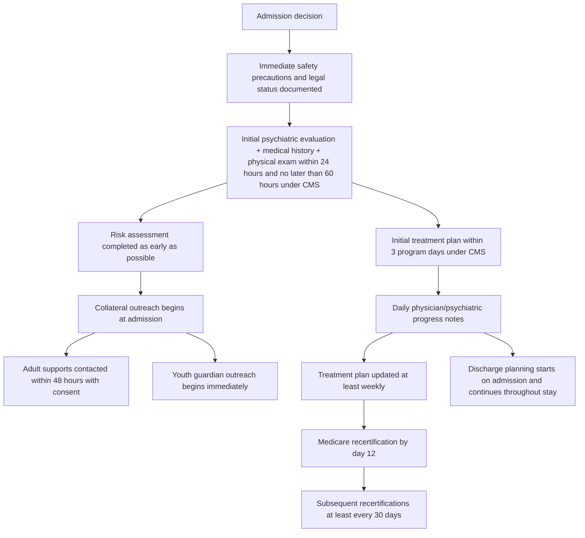

# Comprehensive Initial Psychiatric Inpatient Admission Assessments

## Executive summary

This report synthesizes U.S.-prioritized, primarily official guidance on what a **comprehensive initial psychiatric inpatient admission assessment** should contain for **adults, geriatric patients, adolescents, and children**, and how to document it so that it supports **medical necessity** for inpatient psychiatric hospitalization. The strongest cross-cutting sources are CMS coverage and documentation rules for inpatient psychiatric hospitalization, the American Psychiatric Association’s adult psychiatric evaluation guideline, AACAP’s child/adolescent assessment and suicidal behavior parameters, and publicly available payer or Medicaid criteria that operationalize level-of-care decisions. These sources converge on a few nonnegotiable elements: a face-to-face psychiatric evaluation within the first day or two of admission; a documented acute psychiatric condition causing imminent danger, severe functional failure, or diagnostic/treatment complexity that cannot be safely managed at a lower level of care; a full mental status examination; suicide and violence risk assessment; medical history, physical exam, and medication review; collateral information; and an individualized treatment plan tied to daily active treatment. citeturn22view1turn19view0turn2view0turn27view0turn19view1

For **adults**, the emphasis is on documenting the acute syndrome, risk to self or others, current and prior psychiatric history, comorbid substance use, psychosocial stressors, and why outpatient, ED, crisis, PHP, or residential approaches are unsafe, unavailable, or already failed. CMS explicitly requires documentation of the precipitating acute illness, current medical history and medications, psychiatric and substance history, family/vocational/social history, mental status examination, physical examination, diagnosis, and a formulation stating why the patient is expected to improve with inpatient treatment. CMS also requires active treatment and physician certification/recertification. citeturn22view1turn19view0turn23search5turn23search10

For **geriatric patients**, the adult core remains, but a safe assessment also requires deliberate attention to **delirium, dementia, fluctuating decisional capacity, sensory impairment, polypharmacy, and baseline functional status**. Capacity is decision-specific and fluctuating; Mini-Cog or MMSE may support cognitive screening but do not themselves determine decisional capacity. Older adults may retain decision-making ability despite cognitive impairment, and delirium can cause time-of-day variability, so the admission note should document how capacity was assessed, at what time, for which decision, and who the surrogate is if capacity is lacking. citeturn35view0turn35view1turn33search3turn33search6turn33search0turn33search1

For **adolescents and children**, the evaluation must be explicitly **developmental**, **multi-informant**, and **family/systems-based**. AACAP states that accurate assessment usually requires information from the child, parents/caregivers, and school, with review of prior medical, psychiatric, psychological, and educational records. Consent and confidentiality must be documented carefully because state law varies, but the usual U.S. rule is parent/guardian consent for non-emergent treatment, with limited state-law exceptions for adolescent consent and emergency evaluation. Youth assessments must also address developmental history, family functioning, school performance, peer relationships, trauma exposure, and caregiver/environmental capacity to maintain safety after discharge. citeturn8view4turn8view3turn7view2turn8view1

Across age groups, the best documentation is not a box-checking exercise. It is a **clinical narrative that ties findings to medical necessity**. The strongest notes do four things clearly: they identify the acute syndrome and immediate risk; show the functional consequences; explain why 24-hour inpatient structure, nursing, and physician-led active treatment are required; and state what improvement or diagnostic clarification is expected from inpatient care. Notes that list diagnoses without linking them to current risk, impaired ADLs, failed lower levels of care, or a need for daily active treatment are much more vulnerable to denial. citeturn19view0turn22view1turn22view4turn19view1turn21view0

A major evidence limitation is that some child/adolescent AACAP assessment parameters are older and now labeled by AACAP as historical, even though they still capture enduring principles like developmental formulation, multi-informant assessment, and the need for collateral information. Publicly available adult and geriatric inpatient-specific assessment standards are also much less granular than pediatric system standards. As a result, some best-practice recommendations in this report are synthesized across CMS, APA, geriatric decision-capacity resources, and public payer criteria rather than drawn from a single unified national inpatient assessment standard. citeturn5search4turn6view0turn22view1turn35view0

## Governing framework and what medical necessity requires

In the U.S., the most durable public foundation is CMS. Medicare inpatient psychiatric hospitalization requires that the patient be under the care of a knowledgeable physician, require **active treatment** of a psychiatric disorder, and need **intensive, comprehensive, multimodal treatment with 24-hour medical supervision and coordination** because of a mental disorder. CMS states that the need for 24-hour supervision may arise from patient safety needs, psychiatric diagnostic evaluation, severe psychotropic adverse-effect risk in the setting of comorbidity, or evaluation of an apparent acute psychiatric disorder for which a medical cause has not yet been ruled out. CMS also says there must be evidence of **failure at, inability to benefit from, or unacceptable risk in** less intensive settings. citeturn19view0

CMS examples of severity that support admission include recent suicidal ideation or gesture, self-mutilation, serious threat to others, command hallucinations to harm self or others, disordered or bizarre behavior or psychomotor change that prevents functioning at a lower level, and cognitive impairment from an acute psychiatric disorder that endangers the patient or others. Just naming one of these is not enough. The chart has to show how that presentation creates a **need for 24-hour professional observation and daily active treatment**. citeturn19view0

CMS documentation rules are also highly specific. The **initial psychiatric evaluation with medical history and physical examination** should be completed within **24 hours of admission, but no later than 60 hours**, and should include the chief complaint, the acute illness/exacerbation requiring admission, current medical history and medications, past psychiatric and medical history, substance abuse history, family/vocational/social history, mental status examination, physical exam, formulation, and diagnosis. The physician must personally document the mental status exam, physical exam, diagnosis, and certification. The individualized treatment plan should be developed **within the first 3 program days**, updated **at least weekly**, and linked to measurable, functional, time-framed outcomes. Physician recertification is required by the **12th hospital day** and then at least every **30 days**. citeturn22view1turn22view4turn23search5turn23search10

Public payer criteria align closely with CMS, even when phrased differently. UnitedHealthcare’s acute inpatient criteria require an urgent need for hospital-based 24-hour assessment and treatment because symptoms place life or health in jeopardy, risk is imminent, functioning has deteriorated to the point that safe self-care is not possible, psychosocial stressors would undermine lower-level treatment, or co-occurring medical/substance conditions require 24-hour management. UHC also operationalizes early care-management timeframes: prescribing-provider evaluation and an initial treatment/discharge plan within **24 hours**, family/support or outpatient-provider outreach within **48 hours**, and parent/guardian inclusion for youth when clinically essential. citeturn19view1

Public Medicaid criteria for youth are often even more explicit because of EPSDT and certification-of-need requirements. A North Carolina Medicaid policy, for example, requires a DSM diagnosis plus danger to self, danger to others, acute psychosis, serious medical/medication needs requiring acute care, or need for hospital-based complex diagnostic evaluation, with symptoms not due solely to intellectual disability and physician certification of need. Continued stay after an initial **72 hours** requires evidence that symptoms are outside baseline, remain of inpatient intensity, and are likely to respond to acute treatment. citeturn21view0

The practical implication is simple: the admission assessment must show both **severity of illness** and **intensity of service**. The best note answers this question directly: *Why can this patient not be safely and effectively assessed and treated at a lower level of care today?* CMS, insurer, and Medicaid standards all revolve around that logic. citeturn19view0turn19view1turn21view0

## Universal assessment domains that should appear in every initial admission note

A defensible inpatient admission assessment has a stable core structure across ages. APA’s adult guideline, CMS inpatient psychiatric documentation rules, and CMS’s psychiatric unit worksheet all point to the same major domains: identifying/legal data, presenting problem, psychiatric and medical history, review of systems, medications, substance use, family/social history, collateral information, physical exam, mental status examination, risk assessment, formulation, and plan. CMS additionally requires the note to state the patient’s **legal status** and clearly document the **reasons for admission**, including who reported them. citeturn2view0turn22view1turn27view0

### Legal status, consent, confidentiality, and collateral authority

The chart should record whether the patient is **voluntary, involuntary, or court-committed**, because CMS requires legal status in the identification data. For Medicare-covered inpatient psychiatric hospitalization, the patient or legal guardian must provide written informed consent according to state law, unless the admission is involuntary or court ordered; even then, coverage still depends on medical necessity. For minors, AACAP states that a custodial parent’s or legal guardian’s consent is usually clinically and legally necessary, except in emergency or other state-law exceptions for adolescent self-consent. citeturn27view0turn19view0turn8view3

Collateral information is not optional when reliability is limited. APA states that in severe psychosis or dementia, direct questioning may not yield usable history or current mental-status information, and family, friends, prior records, and treating clinicians may provide critical corroboration. AACAP similarly states that accurate assessment of youth requires multiple informants and settings. Payer criteria reinforce this by setting early expectations for outreach to family/supports and outpatient clinicians. citeturn29view0turn8view4turn19view1

### Medical history, review of systems, physical exam, vital signs, and targeted medical workup

CMS requires a medical history and physical exam in the initial evaluation, and the CMS psychiatric unit worksheet specifies that intercurrent medical disease and, when indicated, a neurological examination should be documented. APA’s adult guideline emphasizes current medical history, a broad review of systems, medications, and physical examination elements such as general appearance, height/weight/BMI, vital signs, skin findings suggestive of trauma or drug use, gait, involuntary movements, cranial-nerve/sensory findings, speech, and cardiopulmonary status. APA also stresses documenting the **rationale** for any clinical tests ordered as part of the initial evaluation. citeturn22view1turn27view0turn3view1turn28view3turn28view4turn28view0

A strong inpatient note therefore documents not only findings, but why the medical workup is being done now. Examples include ruling out delirium, intoxication, withdrawal, infection, endocrine disease, medication toxicity, head injury, seizure disorder, pregnancy-related considerations, eating-disorder instability, or cardiac risk from proposed psychotropics. CMS and APA do not mandate a single universal laboratory panel for every admission; they require a medically reasoned evaluation tied to presentation, safety, and treatment planning. That does **not** mean “no labs.” It means the workup should be presentation-based and clinically justified. citeturn19view0turn22view1turn28view0turn28view4

### Psychiatric history, mental status, and formulation

CMS requires the note to describe the acute illness or exacerbation requiring admission, plus past psychiatric history. APA’s adult guideline adds structured assessment of psychiatric symptoms, trauma history, treatment history, substance use, risk for suicide, risk for aggressive behavior, social/cultural context, and quantitative assessment when useful. CMS Form CMS-437 requires psychiatric history, family/educational/vocational/social history, onset and circumstances leading to admission, attitudes and behaviors, intellectual functioning, memory, orientation, and an inventory of the patient’s assets/strengths. citeturn22view1turn2view0turn27view0

CMS’s description of the mental status examination is concise but clinically useful: appearance, behavior, emotional response, verbalization, thought content, and cognition. APA expands the mental status domains to include orientation, affect, motor activity, thought content and process, perception, long- and short-term memory, estimate of intelligence, insight, judgment, capacity for ADLs, and capacity for self-harm or harm to others. For children, AACAP adds developmentally specific observations such as ease of separation from parents, preferred mode of communication, play, language, attention, memory, judgment, and insight. citeturn22view1turn27view0turn7view1

### Suicide, homicide, aggression, elopement, and other acute risks

Risk assessment has to be specific. APA recommends assessing current suicidal ideation, plan, and intent; prior ideation, attempts, and nonsuicidal self-injury; access to means including firearms; substance use; anxiety, hopelessness, impulsivity, psychosocial stressors, reasons for living, and treatment alliance. APA separately recommends evaluating current or prior aggressive or homicidal ideas and behaviors, substance use, impulsivity, access to firearms, trauma/violence exposure, and relevant psychosocial stressors. citeturn4view0turn4view2turn4view4turn29view0

For youth, AACAP’s suicidal behavior parameter states that clinicians should be prepared to hospitalize suicide attempters who express a persistent wish to die or have a clearly abnormal mental state, and inpatient care should continue until the mental state or level of suicidality stabilizes. It also states that children and adolescents should not be discharged from emergency evaluation without third-party verification from a caretaker and discussion of lethal-means restriction. Public child/adolescent inpatient standards recommend early structured risk assessment that includes suicidality, homicidality, aggression/destruction, bullying, elopement, sexual acting out, and self-injury, with a safety plan documented on admission and revised for discharge. citeturn9view1turn10view0turn10view2turn34view0

### Substance use screening and withdrawal or intoxication assessment

Substance use assessment is a standard part of the initial evaluation in all age groups. APA recommends asking about tobacco, alcohol, prescribed medications with misuse potential, over-the-counter misuse, and illicit substances, and identifies validated approaches such as ASSIST, AUDIT/AUDIT-C, DAST, DSM cross-cutting measures, and withdrawal scales such as CIWA-Ar and COWS when intoxication or withdrawal is suspected. WHO publishes the ASSIST package and the AUDIT manual. NIAAA recommends the AUDIT-C as a brief validated alcohol screen. citeturn3view2turn25search0turn25search4turn25search2

For adolescents, AACAP recommends routine screening questions about alcohol and other substances in older children and adolescents, followed by a more formal evaluation if concerns are identified. The AACAP substance-use parameter specifically lists CRAFFT, DUSI-A, POSIT, and PESQ as screening options and recommends that toxicology, usually urine, be a routine part of formal evaluation and ongoing assessment when substance use is under evaluation, while noting that confidentiality expectations should be explained in advance. citeturn11view0turn11view1turn11view2

### Standardized measures and quantitative assessment

APA’s adult guideline includes **quantitative assessment** as a core domain and explicitly supports using validated measures for symptoms, functioning, quality of life, or adverse effects when useful in diagnostic clarification and treatment planning. At the same time, APA cautions that no suicide rating scale can accurately predict which individual patient will die by suicide, so standardized scales should support—not replace—clinical synthesis. AACAP’s suicidal-behavior parameter makes a similar point for youth: scales can assist, but positive screens always require clinical assessment. citeturn3view3turn29view0turn10view0

## Age-stratified differences in the admission assessment

### Adults

The adult initial assessment should foreground the **acute change from baseline**, the **need for 24-hour structure**, and the **expected benefit of daily active treatment**. CMS requires documentation of the acute illness or exacerbation requiring admission, evidence that a less intensive level is unsafe or ineffective, and a formulation stating the reasonable expectation of meaningful improvement with inpatient care. APA’s adult guideline adds comprehensive review of psychiatric symptoms, trauma history, substance use, suicide risk, aggression risk, cultural factors, medical health, and quantitative assessment. citeturn22view1turn19view0turn2view0

For adults, the legal section should specify voluntary versus involuntary status, consent basis, and any confidentiality limits. The medical section should include medication reconciliation across prescribed, OTC, vitamins, and supplements, because APA highlights the diagnostic and safety implications of medication interactions, missed doses, and side effects. The psychosocial section should include current financial, housing, legal, occupational, interpersonal, and social-support stressors because these factors are explicitly listed in APA’s suicide and aggression-risk guidance. citeturn27view0turn28view2turn30view0turn30view4

The main documentation pitfall in adults is a note that proves the patient is ill but does **not** prove the patient needs **inpatient psychiatric hospitalization**. A denial-resistant note links symptoms to inability to maintain safety, inability to perform ADLs, severe psychosis or agitation, impaired judgment, rapidly changing behavior, failed crisis/outpatient alternatives, or complex co-occurring medical/substance conditions requiring inpatient monitoring. citeturn19view0turn19view1turn21view0

### Geriatric patients

In geriatric patients, the adult template has to be widened. Basic psychiatric history alone is not enough. The note should document **baseline cognition**, **baseline ADLs/IADLs**, **recent change from baseline**, **hearing/vision limitations**, **fluctuation over time of day**, **possible delirium**, **fall risk**, and **polypharmacy/anticholinergic or sedative burden**. Cognitive impairment screening tools like Mini-Cog can be useful for rapid detection of possible cognitive impairment, and HIGN and related geriatric resources recommend obtaining baseline mental and functional status and screening for delirium when older adults have acute confusion. Functional measures such as Katz ADL and Lawton IADL are useful because they translate psychiatric and neurocognitive symptoms into concrete impairment relevant to inpatient need and discharge planning. citeturn33search3turn33search6turn33search0turn33search1

Consent and legal analysis are especially important in this group. Health in Aging states that all adults have the legal right to informed consent and refusal, but ability may fluctuate, as in delirium. HIGN emphasizes that decision-making capacity is decision-specific, can fluctuate with time of day or clinical state, and is assessed through understanding, expressing a choice, appreciation, and reasoning. HIGN also states there is **no gold-standard instrument for capacity** and that MMSE or Mini-Cog are **not tests of capacity**. This means the chart should describe the **process** of capacity assessment rather than merely write “patient lacks capacity.” citeturn35view1turn35view0

The main geriatric pitfall is treating confusion as “primary psychiatric” without documenting medical screening for delirium and without establishing baseline function. Another is documenting a low cognitive screening score as if it settles incapacity. In older adults, the note should name the likely syndrome—delirium, neurocognitive disorder, depression with cognitive symptoms, psychosis, mania, grief, or mixed presentation—and show how the workup and observation plan address that differential. citeturn35view0turn35view1turn19view0

### Adolescents

The adolescent evaluation is developmentally informed but usually closer to adult structure than a young-child assessment. AACAP requires screening the adolescent in the context of family, school, peers, and community. The interview should cover suicidal and self-injurious thoughts and behavior, substance use, trauma exposure, school functioning, peer relationships, family conflict, sexual/reproductive issues when relevant, legal involvement, and online/social-media stressors if clinically indicated. Confidentiality should be explained clearly at the start, including what will and will not be shared and the duty to disclose threats to self or others. AACAP’s substance-use parameter stresses that truthful disclosure is more likely when confidentiality limits are explained precisely. citeturn6view0turn8view1turn11view2

AACAP’s suicidal-behavior guidance is highly practical for admission decisions. Hospitalization is supported when behavior is unpredictable and high risk in the short term, when the patient cannot form an alliance with the clinician, is not truthful or cannot regulate emotion and behavior, has psychotic thinking, intoxication, or multiple serious prior attempts, or lacks sufficient environmental support to stabilize outside the hospital. Before any discharge decision, a caretaker should verify the account and participate in lethal-means counseling and support planning. citeturn10view0turn10view2

Public youth inpatient standards also give useful operational timeframes: face-to-face nursing assessment within **12 hours**, psychiatrist evaluation within **24 hours**, H&P within **24 hours**, psychosocial assessment within **48 hours**, daily psychiatric reassessment with a complete MSE, and an initial treatment plan within **72 hours** with updates every **7 days**. Although these are not a national CMS standard, they are strong examples of operational best practice and align well with payer expectations for timely reassessment and documentation. citeturn34view0

### Children

For younger children, a valid psychiatric admission assessment is not simply an adult interview simplified. AACAP emphasizes a **developmental history in the context of family**, assessment of the child’s major realms of functioning, and developmentally appropriate inquiry into symptoms such as depression, anxiety, hallucinations, compulsions, antisocial behavior, and trauma exposure. The child interview also incorporates direct observation of play, separation from caregivers, communication style, language, motor behavior, attention, memory, and social reciprocity. citeturn7view0turn7view1turn8view1

Collateral is even more central in children than in adolescents. AACAP states that for most children the essential informants are parents/caregivers, the child, and the school, with review of prior medical, psychiatric, psychological, and educational records. When school behavior or progress is part of the presenting problem, school records and direct information from teachers or counselors are highly desirable. In children in child welfare or juvenile justice settings, agency records and caretaker reports are essential. citeturn8view4turn7view3

Documentation for children should make the developmental impact explicit. Public child inpatient criteria and standards frequently use phrases like **cannot maintain age-appropriate roles**, **severely disruptive or bizarre behavior**, **self-endangering behavior**, or **absence of supervision/structure needed to prevent self-harm**. That is the right logic. For a child, “functional impairment” is not employment loss. It is loss of safe participation in home, school, play, learning, sleep, eating, attachment, or age-expected self-care. citeturn21view0turn34view0

## Comparison tables and workflow

### Comparison of required or strongly recommended assessment components

| Domain | Adults | Geriatric patients | Adolescents | Children | Key sources |
|---|---|---|---|---|---|
| Legal status and consent | Document voluntary/involuntary/court status; written consent by patient or legal guardian per state law | Same as adults, plus explicit capacity/surrogate analysis when cognition is impaired or fluctuating | Parent/guardian consent usually required; confidentiality limits explained; state-law exceptions exist | Parent/guardian consent usually required; verify custody/guardianship when relevant | citeturn27view0turn19view0turn8view3turn35view0turn35view1 |
| Medical history and ROS | Required; include medications, prior medical illness, ROS, physical exam | Same, with lower threshold for delirium, medication toxicity, sensory impairment, falls, baseline cognition/function | Required; include health history, substance screening, nutrition when indicated | Required; include developmental, pediatric, neurologic, and nutrition concerns when indicated | citeturn22view1turn28view3turn28view4turn34view0turn7view4 |
| Psychiatric history | Past psychiatric diagnoses, treatments, hospitalizations, trauma, course, prior response | Same, plus neurocognitive history and recent change from baseline | Same, plus family conflict, school decline, trauma, peer/legal issues | Same, but obtained developmentally and from caregivers/school | citeturn2view0turn22view1turn6view0turn8view4 |
| Mental status exam | Core MSE including thought process/content, cognition, ADL capacity, insight/judgment | Core MSE plus attention, fluctuation, delirium signs, hearing/vision barriers | Core MSE plus developmental appropriateness and reliability | Developmental MSE including play, separation, language, motor behavior, cognition | citeturn22view1turn7view1turn35view0 |
| Suicide/homicide/aggression risk | Mandatory, detailed, and documented in words, not just checkboxes | Mandatory, with special attention to cognition, delirium, access to means, caregiver support | Mandatory; caretaker verification and lethal-means counseling before discharge | Mandatory; include self-injury, aggression, elopement, bullying, sexual acting out as relevant | citeturn4view0turn4view2turn29view0turn10view0turn10view2turn34view0 |
| Substance use screening | Ask about alcohol, tobacco, prescribed/OTC misuse, illicit drugs; assess withdrawal if relevant | Same, plus medication misuse/polypharmacy interactions | Routine screening; formal evaluation and tox testing when indicated; explain confidentiality | Screen when developmentally relevant and clinically indicated | citeturn3view2turn28view2turn25search0turn25search2turn11view0turn11view1turn11view2 |
| Cognitive/neurocognitive testing | Orientation, memory, estimate of intelligence, cognition; targeted tools as needed | Rapid cognitive and delirium screening strongly useful; function and baseline matter | Developmentally adapted cognition/attention assessment as indicated | Developmental and cognitive testing as indicated; consider formal psych/neuropsych testing | citeturn27view0turn33search3turn33search6turn6view0turn7view1turn7view4 |
| Developmental assessment | Usually not central beyond developmental history if relevant | Usually not central except decline from prior developmental/adult baseline | Important | Essential | citeturn6view0turn7view0turn8view1 |
| Functional status | ADLs, work, relationships, housing, self-care | ADLs and IADLs central to severity and discharge planning | School/educational functioning and age-appropriate self-care central | Home, school, learning, play, attachment, age-appropriate roles central | citeturn22view1turn33search0turn33search1turn7view3turn21view0 |
| Social determinants and systems | Housing, finances, legal, relationships, social support | Same, plus caregiver capacity and living environment | Same, plus school, juvenile justice, family supports | Same, plus school, child welfare, caregiver/home viability | citeturn30view0turn30view4turn8view4turn34view0 |
| Collateral information | Often decisive when reliability is limited | Often essential in psychosis, dementia, delirium | Essential; family and outpatient providers should be contacted early | Essential; parents/caregivers, school, prior providers, agencies | citeturn29view0turn19view1turn8view4turn34view0 |
| Standardized tools | Use to support, not replace, clinical judgment | Mini-Cog, CAM, GDS, ADL/IADL tools commonly useful | ASQ/C-SSRS for suicide, CRAFFT for substance use; other structured tools as indicated | Developmentally appropriate structured trauma/diagnostic tools as indicated | citeturn3view3turn29view0turn33search3turn33search6turn16search7turn24search0turn24search1turn11view0turn34view0 |

### Reassessment and documentation timeline

The timeline below reflects the highest-confidence public standards across CMS, UHC, and public youth inpatient performance standards. CMS governs Medicare documentation; payer and pediatric performance standards add useful operational detail. citeturn22view1turn22view4turn19view1turn34view0

### Standardized tools that are commonly useful at admission

| Clinical target | Adults | Geriatric patients | Adolescents | Children | Caveat |
|---|---|---|---|---|---|
| Suicide screening / structured inquiry | C-SSRS; SAFE-T framework | C-SSRS; SAFE-T framework | ASQ; C-SSRS; SAFE-T framework | ASQ for youth 10–21; pediatric C-SSRS variants | Screening tools help structure inquiry but do not replace clinical risk formulation or predict individual suicide death | citeturn24search1turn24search6turn24search10turn24search15turn24search0turn24search4turn10view0turn29view0 |
| Alcohol screening | AUDIT / AUDIT-C | AUDIT / AUDIT-C | Consider AUDIT when clinically useful | Limited use in young children; case-based | Use with clinical interview and withdrawal/intoxication assessment when relevant | citeturn25search4turn25search2turn25search17 |
| Drug/substance screening | ASSIST; DAST | ASSIST; targeted toxicology and medication review | CRAFFT; toxicology when indicated | Case-based | Toxicology may support assessment but negative urine tests do not exclude use | citeturn25search0turn3view2turn11view0turn11view1 |
| Cognitive screening | Orientation/memory testing as needed | Mini-Cog; CAM for delirium; ADL/IADL tools for functional impact | Developmentally adapted attention/memory exam as indicated | Developmental/cognitive screening; formal testing if indicated | Mini-Cog/MMSE are not capacity tests | citeturn33search3turn33search6turn33search0turn33search1turn35view0 |
| Depression / symptom severity | Quantitative measures may be used when useful | GDS often useful | Symptom scales selected by syndrome and age | Developmentally appropriate diagnostic/trauma tools | No single public national inpatient-required scale across all syndromes | citeturn3view3turn16search7turn34view0 |

## Documentation language, best-practice templates, and common pitfalls

### Documentation language that supports medical necessity

The strongest admission note language ties findings to **severity**, **functional consequence**, **24-hour need**, **failed or unsafe lower levels of care**, and **active treatment expectation**. These examples are synthesized from CMS, APA, and public payer criteria. citeturn19view0turn22view1turn19view1turn21view0

For an **adult**, language like this is useful:

> “Patient presents with acute exacerbation of bipolar disorder with psychotic features, including command auditory hallucinations to self-harm, disorganized behavior, insomnia, poor oral intake, and inability to maintain ADLs. Current presentation poses imminent risk of self-harm and cannot be safely managed in ED observation, outpatient, PHP, or family-supervised setting. Patient requires 24-hour inpatient psychiatric care for continuous safety monitoring, diagnostic clarification, medication initiation/titration with monitoring for adverse effects, and daily physician-led active treatment.”

That wording tracks CMS language about acute illness, self-harm capacity, ADLs, diagnostic evaluation, severe medication-risk monitoring, and need for 24-hour comprehensive multimodal treatment. citeturn19view0turn22view1

For a **geriatric patient**, stronger wording adds delirium/cognition/function:

> “Older adult with abrupt change from baseline cognition and behavior, marked paranoia, reversed sleep-wake cycle, refusal of food/medications, and inability to safely manage toileting, medication administration, and mobility. Capacity for informed consent is impaired for this admission decision based on inability to demonstrate understanding, appreciation, and reasoning; daughter identified as surrogate. Inpatient psychiatric hospitalization is required for continuous observation, medical evaluation of delirium versus primary psychiatric decompensation, medication reconciliation/polypharmacy review, and daily reassessment of mental status, function, and capacity.”

That language tracks geriatric guidance that capacity is decision-specific, fluctuating, and distinct from cognitive screening, and that functional decline and medical-psychiatric differential diagnosis matter. citeturn35view0turn35view1turn33search6turn33search0

For an **adolescent**, the note should specify both the youth’s symptoms and the environment’s inability to maintain safety:

> “Adolescent with persistent suicidal ideation, recent attempt by overdose, guardedness about current intent, cannabis/alcohol use, escalating family conflict, and no reliable home supervision able to maintain safety or ensure adherence. Current mental state is unstable and unpredictable. Patient requires inpatient psychiatric hospitalization for 24-hour safety monitoring, further suicide-risk assessment, family-based treatment planning, substance-use evaluation, and medication/psychotherapeutic intervention in a structured setting.”

That language matches AACAP’s admission logic: persistent wish to die or abnormal mental state, inability to form alliance or ensure truthful report, intoxication/substance use, and insufficient environmental support. citeturn9view1turn10view0turn10view2

For a **child**, the strongest notes translate symptoms into age-appropriate impairment:

> “Child presents with severe aggression, elopement risk, self-biting, school refusal, sleep disruption, and inability to maintain age-appropriate functioning at home or school. Caregivers are unable to safely manage behaviors despite outpatient treatment and crisis interventions. Inpatient psychiatric hospitalization is the least restrictive safe setting to provide continuous observation, multidisciplinary diagnostic assessment, behavioral stabilization, caregiver engagement, and initiation of a structured treatment plan.”

That language reflects public youth criteria emphasizing danger, severe disruptive behavior, inability to maintain age-appropriate roles, and the need for hospital-based diagnostic and treatment structure. citeturn21view0turn34view0

### Sample age-stratified admission checklist template

This checklist is a practical synthesis of CMS, APA, AACAP, and public youth inpatient standards. It is intended for adaptation into an H&P or psychiatric admission template. citeturn22view1turn27view0turn6view0turn34view0

| Section | Adult | Geriatric | Adolescent | Child |
|---|---|---|---|---|
| Identifiers and legal status | ☐ Voluntary/involuntary/court order ☐ Consent documented | ☐ Same ☐ Capacity assessed ☐ Surrogate identified | ☐ Parent/guardian consent or legal exception documented ☐ Confidentiality limits explained | ☐ Guardian/custody verified ☐ Consent documented |
| Presenting problem | ☐ Acute syndrome ☐ Onset/course ☐ Why now | ☐ Same ☐ Change from cognitive/functional baseline | ☐ Same ☐ Family/school precipitant | ☐ Same ☐ Caregiver and school descriptions |
| Medical review | ☐ PMH/ROS ☐ PE/vitals ☐ Neuro findings if indicated | ☐ Same ☐ Delirium screen ☐ Sensory/fall risk | ☐ H&P/vitals ☐ Nutrition/eating concerns | ☐ H&P/vitals ☐ Development/pediatric issues |
| Medications | ☐ All Rx/OTC/herbals ☐ Adherence ☐ Side effects | ☐ Same ☐ Polypharmacy review | ☐ Same ☐ Guardian input | ☐ Same ☐ Guardian input |
| Psychiatric history | ☐ Prior diagnoses/treatments/hospitalizations/trauma | ☐ Same ☐ Neurocognitive history | ☐ Same ☐ Family conflict/legal/peer issues | ☐ Same ☐ Developmental/family context |
| Substance use | ☐ Alcohol/tobacco/drugs ☐ Withdrawal risk | ☐ Same ☐ Prescription misuse risk | ☐ Screen all older youth ☐ CRAFFT or equivalent if indicated ☐ Tox if indicated | ☐ Case-based |
| Mental status exam | ☐ Full MSE | ☐ Full MSE + attention/fluctuation | ☐ Full MSE + developmental reliability | ☐ Developmental MSE including play/communication |
| Risk assessment | ☐ Suicide ☐ Homicide/aggression ☐ Means access | ☐ Same ☐ Self-neglect/elder-abuse concern ☐ Wandering/falls | ☐ Suicide/self-harm ☐ Aggression ☐ Elopement ☐ Means restriction | ☐ Self-harm ☐ Aggression ☐ Elopement ☐ Bullying/sexual acting out |
| Function | ☐ ADLs/work/housing/relationships | ☐ ADLs/IADLs/baseline decline | ☐ School attendance/performance/self-care | ☐ Age-appropriate home/school/play/self-care |
| Social determinants | ☐ Housing/finances/legal/supports | ☐ Same ☐ Caregiver capacity/living setting | ☐ Family supports/school/justice systems | ☐ Family supports/school/child welfare |
| Collateral | ☐ Records/family/outpatient contacted | ☐ Same, often essential | ☐ Guardian and outpatient/school outreach | ☐ Parent/caregiver/school/agency outreach |
| Medical necessity statement | ☐ Risk/function/24-hour need/lower-level failure | ☐ Same + cognition/function/capacity/delirium differential | ☐ Same + environmental inability to maintain safety | ☐ Same + age-appropriate functional failure |
| Plan | ☐ Observation level ☐ Meds ☐ labs/ECG if indicated ☐ active treatment goals | ☐ Same + reassess cognition/capacity/function | ☐ Same + family meeting/discharge planning | ☐ Same + caregiver/school coordination |

### Useful public templates and tools

Several public tools are worth bookmarking for implementation. CMS Form **CMS-437 Psychiatric Unit Criteria Worksheet** is the clearest public regulatory checklist for required record components in hospital psychiatric units. CMS’s **Inpatient Psychiatric Admission ADR Checklist** is useful for denials-prevention because it highlights the documentation Medicare reviewers expect. For suicide screening and structured inquiry, the **NIMH ASQ Toolkit**, **Columbia-Suicide Severity Rating Scale**, and **SAMHSA SAFE-T** are practical and publicly available. For cognition and function in older adults, the **Mini-Cog**, **CAM**, **Katz ADL**, and **Lawton IADL** are widely used public tools. For substance assessment, WHO’s **ASSIST** and **AUDIT** and NIAAA’s **AUDIT-C** resources are practical options; AACAP’s adolescent substance-use parameter also lists **CRAFFT** as a useful youth screen. citeturn27view0turn23search3turn24search4turn24search1turn24search6turn33search3turn33search6turn33search0turn33search1turn25search0turn25search4turn25search2turn11view0

### Common pitfalls

The most common adult pitfall is documenting only the diagnosis and symptoms, without documenting why **24-hour inpatient psychiatric services** are required rather than crisis, outpatient, residential, or medical admission. The second is documenting only “SI/HI denied” or “contracts for safety,” without a real risk formulation. APA and AACAP both caution that structured scales alone are insufficient, and AACAP specifically warns against relying on no-suicide contracts when mental state is disturbed. citeturn19view0turn29view0turn9view3

In geriatric cases, the biggest pitfall is missing medical contributors—especially delirium, medication toxicity, dehydration, infection, or sensory impairment—and then writing a purely psychiatric note. Another is equating a cognitive screen with incapacity. Capacity has to be assessed for the specific decision and documented with the patient’s reasoning, understanding, and appreciation. citeturn35view0turn35view1

In youth, common pitfalls are failing to obtain collateral from caregivers or schools, failing to document family/environmental capacity to maintain safety, and failing to interpret symptoms developmentally. A child’s aggression, regression, or bizarre play has to be described in context, not merely labeled. Youth notes are also weakened when they omit trauma history, school functioning, or caregiver participation in the plan. citeturn8view4turn8view1turn34view0

## Open questions and evidence limits

The public evidence base is uneven. CMS is highly specific about required documentation, timing, and medical necessity, but not about every age-specific assessment nuance. Publicly available geriatric inpatient psychiatric admission standards are relatively sparse compared with pediatric system standards, so geriatric best practice must be synthesized from CMS, geriatric capacity guidance, cognitive/delirium tools, and broader older-adult assessment principles. citeturn22view1turn35view0turn33search6

AACAP’s general psychiatric assessment parameter for youth remains clinically useful, but AACAP itself now labels many older practice parameters as historical and outdated after five years. That means the developmental and multi-informant principles remain strong, but some instrument examples and wording are dated. Public child/adolescent performance standards from local systems are useful operational templates, but they are not national mandates. citeturn5search4turn6view0turn34view0

There is also no single universally endorsed public battery of “routine admission labs” or standardized rating scales for all psychiatric admissions. The highest-confidence recommendation is to use **targeted medical workup plus selective standardized measures**, and then document why each test or tool is relevant to the current presentation, diagnosis, safety question, or treatment plan. citeturn28view0turn22view1turn3view3