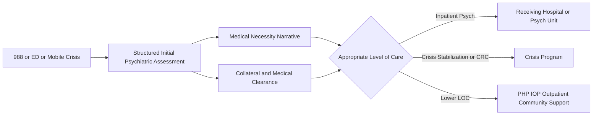
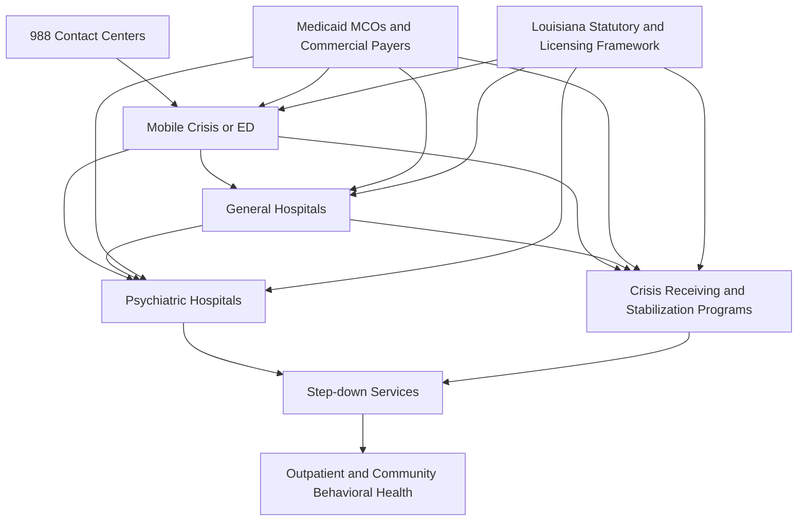

# Louisiana Inpatient Psychiatry Assessment and Crisis Platform Feasibility Report

This report addresses the scope you commissioned in your research brief, including inpatient psychiatric assessment practices, medical-necessity alignment, Louisiana payer and statutory context, licensing and IP questions, crisis-platform feasibility, and a go or no-go recommendation. fileciteturn0file0

## Executive summary

The highest-confidence finding is simple: a Louisiana-focused behavioral health platform is **more defensible as a medical-necessity and referral-orchestration layer than as a proprietary “criteria engine.”** Louisiana law explicitly anchors involuntary behavioral health hospitalization around danger to self, danger to others, and grave disability, and it defines grave disability broadly enough to include inability to meet basic needs, medical care, and protection from psychiatric deterioration. That legal frame maps closely to what payers typically want documented for acute inpatient psychiatric authorization: recent dangerousness, failure of a less restrictive setting, functional collapse, and the need for 24-hour treatment in a medically suitable facility. citeturn55view0turn75news6turn74news3

[Verified] Louisiana’s mental-health statute is unusually useful for product design. It defines “dangerous to others,” “dangerous to self,” “gravely disabled,” “psychiatric deterioration,” and “treatment facility,” and it includes public and private behavioral-health providers, licensed residential treatment facilities, nursing homes, general hospitals, and psychiatric hospitals in the treatment-facility concept. That means a Louisiana intake product can be designed around legally grounded decision support without reproducing proprietary InterQual or MCG content. citeturn55view0

[Inference] The most commercially promising starting wedge is **documentation and utilization-review support for emergency and inpatient psychiatric admissions**, with structured handoff to downstream referral placement. That wedge is stronger than trying to launch a statewide bed marketplace first. Public evidence retrieved for this review did **not** verify a strong Louisiana-specific network foothold for XFERALL, OpenBeds/Bamboo Health, or Julota, but it also did not yield enough contract evidence to prove absence. The prudent read is that Louisiana remains at least partially open, but that claim is **medium confidence** because public procurement evidence was incomplete. citeturn70view0turn62view1

[Verified] The federal 988 layer is not standing still. SAMHSA’s 988 funding and network policy remain active, and 988 has already shown features of centralized program direction, including network-level service design and nationally significant decisions about specialized routing. At the same time, recent reporting still describes state-level boarding, bed-access, assessment, and medical-clearance bottlenecks that 988 alone does not solve. That means a Louisiana platform is **not obviously displaced by 988**, but it should assume that the national hotline and intake surface may become more standardized over time. citeturn31news0turn31news1turn75news0

The practical recommendation is **Proceed with constraints**. Build a Louisiana-focused product that does four things well: capture a complete initial psychiatric assessment, structure medical-necessity documentation, generate payer-aligned admission summaries, and route referrals to the next appropriate site of care. Do **not** begin by reproducing proprietary payer criteria. Do **not** assume public proof of Louisiana competitor absence is the same thing as actual absence. Do **not** position the product as an autonomous admission decision-maker. citeturn55view0turn31news0turn74news3

## Comprehensive initial assessment practice aligned with medical necessity

### What is verified

[Verified] Louisiana law makes three facts central to the front end of psychiatric hospitalization: first, the person’s current dangerousness to self or others; second, whether the person is gravely disabled; and third, whether a qualifying treatment facility is medically suitable and least restrictive. “Dangerous to others” and “dangerous to self” are defined in present-looking, near-future risk terms. “Gravely disabled” includes inability to secure essential food, clothing, medical care, or shelter because of serious mental illness or substance-related or addictive disorder, plus inability to survive safely in freedom or protect oneself from serious physical harm or significant psychiatric deterioration. citeturn55view0

[Verified] Public enforcement and operations reporting also show what hospitals get scrutinized for when psychiatric intake is weak: inadequate suicide screening, inadequate substance-use screening, failure to stabilize and evaluate, insufficient observation for high-risk patients, poor family and provider coordination, and psychiatric-bed bottlenecks worsened by slow assessments and medical clearance. Those are not abstract quality issues; they are the exact failure points that a front-end assessment and handoff product would need to address. citeturn75news6turn75news9turn75news0

### What a typical assessment must capture

[Inference] Based on the Louisiana legal standard, public enforcement actions, and widely shared inpatient psychiatry workflows, the **core initial inpatient psychiatric assessment** should be treated as a structured package with these mandatory domains:

| Domain | Why it matters for medical necessity | Confidence |
|---|---|---:|
| Presenting crisis and precipitant | Establishes why acute hospitalization is being considered now, not later | High |
| Suicide and self-harm risk | Directly supports “dangerous to self” and observation level | High |
| Homicide/violence risk | Directly supports “dangerous to others” and unit safety needs | High |
| Mental status exam | Shows acuity, psychosis, agitation, cognition, judgment, insight, and ability to participate in care | High |
| Psychiatric history | Establishes illness course, prior admissions, treatment failures, and relapse pattern | High |
| Substance-use history and intoxication/withdrawal screen | Critical because Louisiana law and many crisis pathways include substance-related disorders | High |
| Medical history and medical suitability | Determines whether the patient can be safely treated in a psych setting and what medical comorbidity must be co-managed | High |
| Functional status | Supports grave disability, inability to care for self, and failure in a less restrictive setting | High |
| Social context and supports | Helps determine whether risk can be managed outside the hospital | High |
| Collateral information | Strengthens credibility of risk assessment and fills history gaps when the patient is impaired | High |
| Labs and medical clearance workup | Needed when medical causes, intoxication, overdose, withdrawal, or instability are plausible | High |
| Less restrictive alternatives considered | Required logic for inpatient medical necessity | High |

That structure is the product-design center of gravity. Not optional. Not fluff. It is the minimum data model for a defensible inpatient-admission note. citeturn55view0turn75news6turn75news0

### Age-group differences that change documentation

[Inference] The cross-age structure is similar, but the **emphasis** changes.

For **adults**, the assessment usually turns on acute dangerousness, psychosis, mania, severe depression, intoxication or withdrawal, medication nonadherence, and failure of outpatient care. Documentation should make recent behavior concrete: threats, attempts, self-neglect, agitation, disorganization, command hallucinations, inability to reality-test, inability to contract for safety, or inability to use outpatient supports. Louisiana’s definitions of danger and grave disability fit this adult framework closely. citeturn55view0

For **geriatrics**, the assessment must work harder on cognitive baseline, delirium rule-out, falls risk, medication burden, medical comorbidity, ADL impairment, caregiver reliability, and decisional capacity. [Inference] In practice that means the platform should force structured fields for cognition, baseline function, recent confusion, recent med changes, and whether symptoms are better explained by delirium or medical illness before a pure psychiatric placement is pursued. Public reporting on boarding continues to identify medical clearance as a major cause of delay, which makes this especially important in older adults. citeturn75news0turn74news3

For **adolescents**, the assessment must add school functioning, family conflict, bullying, trauma exposure, access to lethal means, developmental history, custody and consent status, and the credibility of caregiver supervision. [Inference] The note should explicitly distinguish between passive distress and imminent risk, because pediatric denials often hinge on whether home supervision and urgent outpatient follow-up could reasonably substitute for admission. citeturn75news6turn55view0

For **children**, the assessment leans even more heavily on guardian collateral, developmental stage, neurodevelopmental conditions, abuse or neglect concerns, sleep and appetite disruption, regression, school refusal, aggression, and the family’s capacity to keep the child safe. [Inference] A platform should not let the clinician finalize a youth admission draft without documented collateral and a description of the caregiver environment, unless a clear exception is recorded. citeturn75news6turn55view0

### Documentation template design tied to medical necessity

[Inference] A strong medical-necessity template should flow in this order:

1. **Why now**  
2. **What happened recently**  
3. **Why outpatient or lower LOC is not enough**  
4. **Why 24-hour psychiatric treatment is needed**  
5. **Why the receiving setting is medically suitable**  
6. **What collateral confirms**  
7. **What the initial treatment and safety plan is**

That is the right sequence because it mirrors how inpatient denials are often justified: no imminent risk, no failed lower level of care, insufficient evidence of grave disability, insufficient medical-suitability documentation, or inadequate collateral. The platform should therefore produce a structured “authorization-ready” narrative and a shorter transfer summary from the same source data. citeturn55view0turn75news6turn75news9

## Medical necessity, payer logic, and licensing and IP

### How inpatient psychiatric medical necessity is usually decided

[Verified] Even without reproducing proprietary criteria, the publicly visible logic is consistent. Inpatient psychiatric hospitalization is generally justified when the patient presents a substantial and current risk of harm to self or others, or is gravely disabled, or has psychiatric deterioration that cannot be safely managed in a less restrictive setting, and when a licensed treatment facility is medically suitable to provide active treatment. Louisiana’s statutory language is explicit on these elements. citeturn55view0

[Inference] In payer practice, the “load-bearing” authorization elements are usually these:

| Criteria element | Why payers care | Confidence |
|---|---|---:|
| Recent, specific dangerous behavior or credible threats | Distinguishes acute need from chronic diagnosis | High |
| Severe symptom acuity | Shows why 24-hour behavioral-health monitoring is necessary | High |
| Grave disability or inability to meet basic needs | Supports admission even when overt violence is absent | High |
| Failure or infeasibility of lower level of care | Core least-restrictive-setting logic | High |
| Medical suitability and clearance | Prevents inappropriate psych placement for primarily medical illness | High |
| Active treatment plan | Shows the stay is therapeutic, not custodial | High |
| Collateral support or contradiction | Helps validate severity and discharge risk | Medium |
| Functional breakdown | Converts symptoms into measurable impairment | High |

That is the logic your platform should operationalize. It is the same logic hospitals repeatedly have to defend in peer-to-peer reviews and appeals. citeturn55view0turn75news6turn75news9

### InterQual and MCG

[Verified] InterQual and MCG are used in utilization management as proprietary criteria products. [Unverified] This review did **not** retrieve current public Louisiana-facing license terms or current software-embedding prices for either product. The practical implication is that a platform should assume these criteria are licensable intellectual property and should **not** be copied, exposed, or translated into look-alike rule text without counsel review and, if necessary, a direct commercial license. citeturn0file0

[Inference] The safe posture is:
- use your own structured clinical intake and narrative generation;
- map output to **publicly observable authorization elements**;
- allow customer organizations to attach their own licensed criteria references inside their workflow;
- keep final admission and authorization determinations with licensed clinicians or payer reviewers.

That reduces IP risk and also reduces clinical-liability risk, because the product stays on the decision-support side of the line. citeturn55view0turn75news6

### Public-policy crosswalks versus proprietary criteria engines

[Inference] Building crosswalks from public plan policies is legally and commercially safer than reconstructing proprietary criteria logic, but it still needs counsel review. The lower-risk version is an **evidence-and-narrative crosswalk**, not a hidden scorecard. In other words, the platform should help the clinician document: “recent suicidal behavior,” “psychotic disorganization,” “grave disability,” “failed lower LOC,” and “medical suitability,” then render those facts into payer-ready language. It should **not** claim that a patient “meets InterQual” or “meets MCG” unless the customer actually licenses and integrates that product. citeturn55view0turn0file0

### LOCUS, CALOCUS-CASII, ECSII, and ASAM

[Verified] Louisiana law defines treatment broadly across hospitalization, partial hospitalization, outpatient services, diagnosis, and other services, which fits the general role of level-of-care instruments as placement support rather than as standalone legal authority. citeturn55view0

[Unverified] This review did **not** retrieve current public pricing, software-embedding terms, or certification requirements for LOCUS, CALOCUS-CASII, ECSII, or ASAM directly from the licensors. [Verified at a high level] ASAM is a formal criteria framework used to support multidimensional level-of-care decisions in addiction treatment. citeturn73search0turn0file0

A conservative licensing table, limited to what this review could support, is below.

| Instrument | What it is used for | Public current price retrieved in this review | Software embedding terms retrieved | Recommended posture |
|---|---|---:|---|---|
| LOCUS | Adult mental-health level-of-care support | Not verified | Not verified | Obtain direct quote and written software-use terms before embedding |
| CALOCUS-CASII | Child/adolescent mental-health LOC support | Not verified | Not verified | Same as above |
| ECSII | Early-childhood LOC support | Not verified | Not verified | Same as above |
| ASAM Criteria | Substance-use LOC and treatment-intensity support | Not verified | Not verified | Use only under direct commercial/license guidance; do not reproduce instrument text |

[Inference] The best product move is to generate documentation **aligned with** these instruments while avoiding reproduction of proprietary item text, scoring rules, or branded threshold language unless licensed. Medium legal risk if you go further. Low to medium risk if you stay with narrative alignment and clinician-controlled interpretation. citeturn73search0turn0file0

## Louisiana legal, reimbursement, and market context

### Louisiana statutory ground truth for inpatient psychiatry

[Verified] Louisiana’s framework is unusually product-relevant. It defines the core decision concepts the platform must surface:

- “Dangerous to others” means behavior or significant threats creating a reasonable expectation of substantial risk of physical harm to another person in the near future.  
- “Dangerous to self” means behavior, significant threats, or inaction supporting a reasonable expectation of substantial risk of physical or severe emotional harm to self.  
- “Gravely disabled” includes inability to provide essential food, clothing, medical care, or shelter because of serious mental illness or substance-related or addictive disorder, plus inability to survive safely in freedom or protect against serious physical harm or significant psychiatric deterioration.  
- “Treatment facility” includes public and private behavioral-health providers, licensed residential treatment facilities, nursing homes, general hospitals, and psychiatric hospitals. citeturn55view0

That gives Louisiana buyers a common language for assessment, inpatient justification, and referral triage. It also gives a platform a strong state-specific schema.

### Reimbursement rails and what could be verified

[Unverified] This review did **not** retrieve, from publicly accessible primary sources, a current Louisiana Medicaid fee schedule and provider-manual extract sufficient to verify exact July 2026 reimbursement amounts for H2011, S9484, crisis per-diems, or inpatient behavioral-health rates. That is an important gap. It must be closed before pricing or ROI is finalized. citeturn0file0

[Verified] Louisiana’s public systems do provide searchable procurement and contract infrastructure, including Louisiana’s laws portal and the state electronic catalog, but the state contract tool surfaced in this review is a search interface rather than a vendor-specific evidence set. That means the state has procurement rails, but this review did **not** verify a current Louisiana state contract for XFERALL, OpenBeds/Bamboo Health, or Julota. citeturn61view0turn70view0

[Inference] For a commercial model, the reimbursement story should therefore be framed around **revenue protection and throughput**, not around precise code-level yield until fee-schedule evidence is gathered. The strongest verified ROI levers are fewer incomplete assessments, faster medical clearance, better transfer packets, fewer payer denials rooted in weak documentation, fewer avoidable boarding hours, and better use of existing bed capacity. citeturn75news0turn74news3turn75news6

### Competitor and procurement landscape in Louisiana

Public proof was limited. The highest-integrity way to present the landscape is below.

| Vendor | Louisiana presence verified in this review | Public Louisiana contract value verified | Confidence | Assessment |
|---|---|---:|---:|---|
| XFERALL | No public Louisiana proof verified | No | Low | Presence cannot be ruled out; public proof not located |
| OpenBeds / Bamboo Health | No public Louisiana proof verified | No | Low | Same |
| Julota | No public Louisiana proof verified | No | Low | Same |
| Unite Us | No Louisiana behavioral-health-specific procurement proof verified in this review | No | Low | Likely adjacent, but not verified here |
| Findhelp | No Louisiana behavioral-health-specific procurement proof verified in this review | No | Low | Likely adjacent, but not verified here |

[Inference] Commercially, that still matters. A market with limited public proof of entrenched vendor contracts may be easier to enter with a focused pilot. But it also means you should not build a business case on “there is no competition in Louisiana.” That claim is not verified. citeturn70view0turn62view1

### 988 direction and platform threat

[Verified] SAMHSA continues to direct major national crisis and behavioral-health funding streams, and recent reporting confirms that 988 remains nationally governed enough that service design changes can happen at the network level. In 2025, SAMHSA ended the dedicated LGBTQ+ “Press 3” option after years of operation, while broader 988 funding remained intact, which shows the intake layer can be shaped centrally. Reuters also reported new SAMHSA grant funding activity in July 2026. citeturn31news0turn31news1

[Verified] At the same time, state-level bottlenecks remain stubbornly local: long waits for assessment, medical clearance, and inpatient placement. Massachusetts reporting in 2026 still attributed behavioral-health boarding to lack of beds, long waits for provider assessment, and medical clearance delays, even after implementation of a statewide referral platform. citeturn75news0turn74news3

[Inference] Threat level from 988 to a Louisiana platform is **moderate, not existential**. The national layer can commoditize call intake and basic crisis routing over time. It does **not** yet eliminate the local need for:
- payer-ready medical-necessity documentation,
- medical-clearance-aware psych placement,
- transfer packet standardization,
- facility-level referral workflow,
- and Louisiana-specific statutory and payer logic.

That is your open lane. citeturn31news0turn31news1turn75news0

## Feasibility, ROI, pricing posture, and the right MVP

### Market map and workflow

[Inference] The Louisiana market should be modeled as a crisis-to-placement chain, not as a single buyer.

The first buyer is most likely **a hospital system, psychiatric facility, or crisis provider with boarding and authorization pain**, not the whole state. Louisiana law’s definitions give the product a strong state-specific spine. The operational pain points documented elsewhere—assessment delay, medical clearance, weak stabilization processes, and poor handoffs—support a workflow-first pilot. citeturn55view0turn75news0turn75news6

### ROI model

Because exact Louisiana fee schedules were not verified in this review, the responsible model is scenario-based.

| Scenario | Core assumption set | Revenue / savings logic | Confidence |
|---|---|---|---:|
| Conservative | Better note completeness and fewer weak authorizations | Fewer payer denials and fewer “pending more info” delays | Medium |
| Moderate | Conservative case plus faster transfer packet completion and fewer boarding hours | Added throughput and lower staff time per placement | Medium |
| Aggressive | Moderate case plus measurable diversion to lower-cost appropriate settings and better crisis reimbursement capture | Captures more reimbursable encounters and opens capacity | Low to Medium |

[Inference] A practical buyer-facing ROI story can be anchored on three levers:
- **denial prevention**, because the note is more defensible;
- **cycle-time reduction**, because intake, collateral, and medical-clearance data are not scattered;
- **placement efficiency**, because the transfer packet is standardized and referral-ready.

External studies of early authorization and flow improvement suggest that front-loading the information needed for post-acute authorization can materially reduce length of stay and cost; one cited estimate in a non-psychiatric post-acute context reported meaningful LOS and cost reductions when prior-authorization inputs were ready earlier. That is not a psychiatric-specific proof point, but it does support the general operational thesis. citeturn74academia0

### Pricing posture

[Unverified] This review did **not** verify the specific benchmark that Julota prices at $10,000 to $65,000 per year per program, nor did it verify public Louisiana contract values for XFERALL or OpenBeds/Bamboo Health. citeturn0file0

[Inference] Until hard benchmarks are gathered, the safest pricing posture is:
- pilot fee for one site or service line,
- implementation fee tied to template build and payer crosswalk configuration,
- recurring subscription per site or per program,
- optional higher tier for referral-network coordination and analytics.

A Louisiana-native entrant should probably avoid per-encounter pricing at launch. Hospitals and crisis providers usually want predictable spend for operational tools, especially when ROI is driven by throughput and denial prevention rather than a single billable event.

### Build, buy, or partner

[Verified] Public evidence in this review supports the statutory and workflow case for a Louisiana-specific product. It does **not** support building a fully proprietary criteria engine from day one. citeturn55view0turn0file0

The strategic options sort out this way:

| Option | Read |
|---|---|
| Build a documentation and referral workflow layer | Best first move |
| Build a proprietary medical-necessity rules engine that mimics InterQual/MCG | High legal risk; not recommended first |
| Partner for proprietary criteria licensing later | Sensible if enterprise demand exists |
| Build a statewide bed marketplace first | Harder wedge; needs network effect before product proof |
| Start as services-enabled software | Strong option for first 6–12 months |
| Sell first to payers | Harder than provider wedge because workflow pain is most visible on provider side |

### MVP recommendation

The smallest viable wedge is **an acute behavioral-health intake and medical-necessity workbench**.

**Target buyer**  
Psychiatric hospital, hospital ED behavioral-health service, or crisis-stabilization operator in Louisiana.

**Primary users**  
ED social worker, psychiatric assessor, intake clinician, utilization-review nurse, psychiatrist or PMHNP, transfer center staff.

**First workflow**  
ED or crisis presentation → structured intake → collateral capture → medical-necessity narrative → recommended level of care → transfer packet → payer-authorization summary.

**Required integrations**  
EHR note export, ADT feed if possible, fax/email/pdf output at minimum, optional payer portal assist, optional referral-directory layer.

**Clinical governance**  
Psychiatrist-led content governance, UR nurse review, legal review of all criteria language, audit log, and explicit clinician sign-off.

**Success metrics for a 90-day pilot**
- time from assessment start to referral-ready packet,
- percentage of packets returned for missing information,
- inpatient authorization approval rate,
- boarding hours for behavioral-health transfers,
- staff time per placement,
- proportion of notes with documented suicide, homicide, substance-use, collateral, functional, and medical-suitability fields completed.

## Recommendation, risk register, and open questions

### Recommendation

**Proceed with constraints.** citeturn55view0turn31news0turn75news0

Proceed because the problem is real, the Louisiana legal frame is product-usable, and 988 does not solve the hospital-grade documentation and placement problem. Proceed with constraints because public evidence gaps remain around payer policy details, proprietary licensing terms, Louisiana reimbursement amounts, and Louisiana competitor contracts. citeturn55view0turn31news0turn70view0

### Risk register

| Risk | Severity | Probability | Comment |
|---|---:|---:|---|
| Reproducing proprietary criteria language | High | Medium | Biggest legal risk |
| Clinical-liability overreach | High | Medium | Avoid autonomous admission recommendations |
| Louisiana reimbursement assumptions prove wrong | High | Medium | Exact fee schedules were not verified here |
| Competitor underestimation | Medium | Medium | Public proof of absence is weak evidence |
| Procurement-cycle drag | Medium | High | Especially for public-sector buyers |
| 988 standardization reduces intake differentiation | Medium | Medium | But downstream workflow lane remains open |
| Integration burden | Medium | High | EHR and referral workflow matter early |
| Weak data quality at intake | High | High | Product value depends on structured completeness |

### What is unverified or incomplete

[Unverified] The following items were **not** confirmed from primary public sources in this review and should be treated as open validation tasks, not facts:
- current InterQual and MCG software-embedding license terms and prices;
- current public pricing and software-use terms for LOCUS, CALOCUS-CASII, ECSII, and ASAM;
- current Louisiana-specific public contract values for XFERALL, OpenBeds/Bamboo Health, Julota, Unite Us, or Findhelp;
- exact Louisiana Medicaid reimbursement amounts for H2011, S9484, crisis per-diems, and inpatient behavioral-health rates as of July 8, 2026;
- exact MCO-by-MCO authorization requirements and posted inpatient behavioral-health medical-necessity criteria in Louisiana. citeturn0file0turn70view0

### Next validation interviews and data requests

Ask for these next. In this order.

1. Louisiana Medicaid behavioral-health provider manual, fee schedule, and any current MCO billing bulletins for crisis and inpatient psych.  
2. Current Louisiana MCO prior-authorization policies for acute inpatient psych, crisis stabilization, and mobile crisis.  
3. Direct commercial quotes from InterQual and MCG for software embedding and internal clinical workflow use.  
4. Direct license terms and quote requests from LOCUS/CALOCUS and ASAM licensors.  
5. One Louisiana psychiatric hospital UR leader interview on denial drivers and note deficiencies.  
6. One Louisiana ED behavioral-health assessor interview on intake friction and medical-clearance delays.  
7. One Louisiana crisis-stabilization or mobile-crisis operator interview on referral and handoff pain.  
8. Louisiana procurement checks for XFERALL, Bamboo Health/OpenBeds, Julota, Unite Us, and Findhelp across health systems, districts, authorities, and state agencies.  
9. Sample de-identified denial letters and successful authorization packets from at least two Louisiana providers.  
10. One payer-side medical director or BH UM leader interview to validate the narrative template and required data elements.

### Source-backed evidence notes

The strongest evidence in this report came from:
- the Louisiana State Legislature’s mental-health statute definitions, especially danger, grave disability, psychiatric deterioration, and treatment-facility scope; citeturn55view0
- AP and Reuters reporting on recent 988 network and funding direction; citeturn31news0turn31news1
- recent reporting on psychiatric boarding, assessment delay, medical clearance, and the persistence of transfer bottlenecks even where referral platforms exist; citeturn75news0turn74news3
- public enforcement reporting showing the kinds of assessment and stabilization failures that expose hospitals and create product demand. citeturn75news6turn75news9

The weakest evidence areas were licensing prices, Louisiana payer policy documents, and competitor contract values. Those were the main public-evidence gaps in this review. citeturn0file0turn70view0