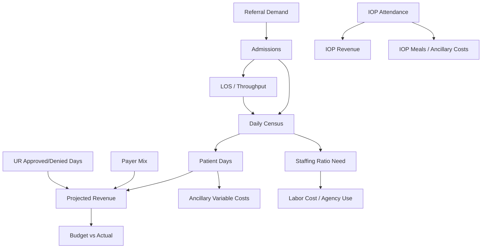

# Reporting Metrics Ops and Budget Workbook — Reverse Engineering Analysis

## Executive read

The workbook is not just a budget spreadsheet. It is a manually operated hospital intelligence system.

It tracks:

- inpatient census,
- admissions and discharges,
- projected inpatient revenue,
- payer mix,
- utilization review risk factors,
- denied/approved days,
- IOP attendance and group volume,
- staffing-to-census ratios,
- agency/PTO/training/1:1 labor burden,
- ancillary invoices,
- budget-to-actual performance.

[Inference] The workbook is trying to answer one operating question:

> How does patient demand turn into census, staffing burden, authorization risk, patient days, revenue, margin pressure, and budget variance?

## Structural audit

Observed workbook structure:

- **Sheets:** 44
- **Formula cells found:** 3933
- **Formula/cached error cells found:** 278
- **Error mix:** #DIV/0!: 255, #REF!: 23
- **Major issue:** business metrics and patient-level rows are mixed in the same workbook.

## Sheet inventory

| Sheet | Category | Range | Formula Count | Error Count | PHI Risk |
| --- | --- | --- | --- | --- | --- |
| Ancil Invoices | Ancillary invoice cost rollup | A1:N94 | 86 | 0 | No |
| Aug Revenue | Monthly IP revenue / UR / payer mix | A1:AI69 | 83 | 12 | Yes |
| Budget vs Actual | Budget vs actual rollup | A1:H48 | 37 | 0 | No |
| Staffing January | Monthly staffing, census ratios, agency/PTO/1:1 cost | A1:AH85 | 75 | 0 | No |
| Staffing February | Monthly staffing, census ratios, agency/PTO/1:1 cost | A1:AH84 | 73 | 0 | No |
| Staffing March | Monthly staffing, census ratios, agency/PTO/1:1 cost | A1:AH84 | 75 | 0 | No |
| Staffing April | Monthly staffing, census ratios, agency/PTO/1:1 cost | A1:AH85 | 80 | 3 | No |
| Staffing May | Monthly staffing, census ratios, agency/PTO/1:1 cost | A1:AH81 | 75 | 0 | No |
| Staffing June | Monthly staffing, census ratios, agency/PTO/1:1 cost | A1:AG84 | 79 | 6 | No |
| Staffing July | Monthly staffing, census ratios, agency/PTO/1:1 cost | A1:AH84 | 80 | 6 | No |
| Staffing August | Monthly staffing, census ratios, agency/PTO/1:1 cost | A1:AH80 | 75 | 2 | No |
| Staffing September | Monthly staffing, census ratios, agency/PTO/1:1 cost | A1:AH83 | 73 | 15 | No |
| Staffing October | Monthly staffing, census ratios, agency/PTO/1:1 cost | A1:AH83 | 74 | 18 | No |
| Staffing November | Monthly staffing, census ratios, agency/PTO/1:1 cost | A1:AH83 | 73 | 18 | No |
| Staffing December | Monthly staffing, census ratios, agency/PTO/1:1 cost | A1:AH83 | 74 | 18 | No |
| 2012 YTD Summary | YTD executive KPI rollup | A1:O55 | 392 | 35 | No |
| Admissions | Admissions origin detail | A1:N216 | 36 | 0 | Yes |
| Daily Census IP 2012 | IP daily census/admit/discharge rollup | A1:AK53 | 108 | 7 | No |
| Jan Revenue | Monthly IP revenue / UR / payer mix | A1:AG69 | 78 | 10 | Yes |
| Feb Revenue | Monthly IP revenue / UR / payer mix | A1:AG69 | 77 | 10 | Yes |
| Mar Revenue | Monthly IP revenue / UR / payer mix | A1:AG68 | 78 | 10 | Yes |
| Apr Revenue | Monthly IP revenue / UR / payer mix | A1:AG69 | 81 | 13 | Yes |
| May Revenue | Monthly IP revenue / UR / payer mix | A1:AG70 | 82 | 11 | Yes |
| June Revenue | Monthly IP revenue / UR / payer mix | A1:AI70 | 84 | 12 | Yes |
| July Revenue | Monthly IP revenue / UR / payer mix | A1:AI69 | 85 | 12 | Yes |
| Sep Revenue | Monthly IP revenue / UR / payer mix | A1:AG73 | 81 | 13 | Yes |
| Oct Revenue | Monthly IP revenue / UR / payer mix | A1:AG73 | 81 | 13 | Yes |
| Nov Revenue | Monthly IP revenue / UR / payer mix | A1:AG73 | 81 | 13 | Yes |
| Dec Revenue | Monthly IP revenue / UR / payer mix | A1:AG73 | 81 | 13 | Yes |
| Daily Census IOP 2012 | IOP daily census/attendance rollup | A1:AH50 | 37 | 8 | No |
| Jan IOP 2012 Attend | Monthly IOP attendance detail | A1:AJ92 | 98 | 0 | Yes |
| Feb IOP 2012 Attend | Monthly IOP attendance detail | A1:AI92 | 131 | 0 | Yes |
| Mar IOP Attend | Monthly IOP attendance detail | A1:AK92 | 102 | 0 | Yes |
| Apr IOP Attend | Monthly IOP attendance detail | A1:AJ108 | 116 | 0 | Yes |
| May IOP Attend | Monthly IOP attendance detail | A1:AJ126 | 137 | 0 | Yes |
| June IOP Attend | Monthly IOP attendance detail | A1:AI148 | 155 | 0 | Yes |
| July IOP Attend | Monthly IOP attendance detail | A1:AJ82 | 89 | 0 | Yes |
| August IOP Attend | Monthly IOP attendance detail | A1:AJ90 | 97 | 0 | Yes |
| Sept IOP Attend | Monthly IOP attendance detail | A1:AI92 | 98 | 0 | Yes |
| Oct IOP Attend | Monthly IOP attendance detail | A1:AJ90 | 97 | 0 | Yes |
| Nov IOP Attend | Monthly IOP attendance detail | A1:AJ112 | 120 | 0 | Yes |
| Dec IOP Attend | Monthly IOP attendance detail | A1:AJ112 | 119 | 0 | Yes |
| Sheet1 | Blank/unused sheet |  | 0 | 0 | No |
| Sheet2 | Blank/unused sheet |  | 0 | 0 | No |

## Formula behavior summary

The formulas mostly use:

- `SUM` for rollups,
- `COUNTIF` / `SUMIFS` for payer, physician, status, and UR categories,
- `IF` for month-boundary and stay-day calculations,
- `AVERAGE` / `AVERAGEIFS` for LOS and averages.

Formula-function counts:

| Function | Formula Count |
| --- | --- |
| SUM | 2121 |
| COUNTIF | 231 |
| SUMIFS | 165 |
| IF | 75 |
| SUMIF | 45 |
| AVERAGE | 24 |
| COUNT | 24 |
| AVERAGEIFS | 21 |
| AVERAGEIF | 1 |

## Top formula dependencies

| From Sheet | References Sheet | Formula References |
| --- | --- | --- |
| 2012 YTD Summary | Daily Census IP 2012 | 67 |
| Ancil Invoices | 2012 YTD Summary | 48 |
| Staffing August | Daily Census IP 2012 | 37 |
| Staffing December | Daily Census IP 2012 | 37 |
| Staffing January | Daily Census IP 2012 | 37 |
| Staffing July | Daily Census IP 2012 | 37 |
| Staffing March | Daily Census IP 2012 | 37 |
| Staffing May | Daily Census IP 2012 | 37 |
| Staffing October | Daily Census IP 2012 | 37 |
| 2012 YTD Summary | Daily Census IOP 2012 | 36 |
| Staffing April | Daily Census IP 2012 | 36 |
| Staffing June | Daily Census IP 2012 | 36 |
| Staffing November | Daily Census IP 2012 | 36 |
| Staffing September | Daily Census IP 2012 | 36 |
| Staffing February | Daily Census IP 2012 | 35 |
| 2012 YTD Summary | Admissions | 24 |
| Budget vs Actual | 2012 YTD Summary | 24 |
| 2012 YTD Summary | Staffing April | 14 |
| 2012 YTD Summary | Staffing August | 14 |
| 2012 YTD Summary | Staffing December | 14 |
| 2012 YTD Summary | Staffing February | 14 |
| 2012 YTD Summary | Staffing January | 14 |
| 2012 YTD Summary | Staffing July | 14 |
| 2012 YTD Summary | Staffing June | 14 |
| 2012 YTD Summary | Staffing March | 14 |
| 2012 YTD Summary | Staffing May | 14 |
| 2012 YTD Summary | Staffing November | 14 |
| 2012 YTD Summary | Staffing October | 14 |
| 2012 YTD Summary | Staffing September | 14 |
| Admissions | 2012 YTD Summary | 12 |
| 2012 YTD Summary | May Revenue   | 5 |
| 2012 YTD Summary | Apr Revenue  | 4 |
| 2012 YTD Summary | Aug Revenue | 4 |
| 2012 YTD Summary | Feb Revenue  | 4 |
| 2012 YTD Summary | Jan Revenue   | 4 |
| 2012 YTD Summary | July Revenue   | 4 |
| 2012 YTD Summary | June Revenue | 4 |
| 2012 YTD Summary | Mar Revenue   | 4 |
| 2012 YTD Summary | Apr IOP Attend | 3 |
| 2012 YTD Summary | August IOP Attend | 3 |

## What the workbook does well

1. It connects **volume** to **revenue**.
2. It connects **census** to **staffing requirements**.
3. It connects **payer mix** to **projected net revenue**.
4. It captures **UR friction** through denied days, risk flags, payer categories, and physician summaries.
5. It uses **IOP attendance** as its own revenue and demand signal.
6. It uses **budget variance** as the executive summary layer.
7. It has enough embedded logic to infer the operating model behind the hospital.

## What makes it fragile

### 1. Monthly-tab duplication

There are separate monthly revenue tabs, staffing tabs, and IOP attendance tabs. This makes every month a copy-paste risk.

Sustainable replacement:

> One fact table per event type, filtered by date.

### 2. PHI mixed with aggregate finance

The workbook has patient-level rows in revenue, admissions, and IOP attendance tabs.

Sustainable replacement:

> PHI clinical store + de-identified analytics mart.

### 3. Formula fragility

Observed cached formula errors include `#DIV/0!` and `#REF!`.

Sustainable replacement:

> SQL/dbt/TypeScript measure layer with tested null-safe formulas.

### 4. Hard-coded payer logic

Rates, payers, UR codes, and revenue adjustments are embedded directly inside monthly sheets.

Sustainable replacement:

> Versioned payer contracts, rate rules, authorization records, and denial categories.

### 5. No true bed board event history

The workbook implies census and bed utilization, but it does not preserve bed-status events.

Sustainable replacement:

> Bed inventory + bed status event stream + census snapshots.

## Core business logic inferred

[Inference] The operating dependencies appear to be:

## Current workbook domains

### Inpatient operations

Tracks admissions, discharges, census, patient days, ALOS, occupancy signal, revenue days, payer mix, and projected revenue.

### IOP operations

Tracks enrolled patients, attendance days, absent days, admits pending, groups, and IOP income.

### Utilization review

Tracks approved days, denied days, payer-level counts, physician-level summary, UR risk codes, and readmission/transfer/denial flags.

### Staffing

Tracks role budgets, rolling average hours, over/under budget, agency hours, PTO, training/nonproductive time, 1:1 observation cost, and census-to-staffing ratios.

### Finance

Tracks budget vs actual, ancillary invoices, fixed lease expense, patient-day driven ancillary costs, and projected net revenue.

## Recommended rebuild thesis

Do not recreate the workbook as another workbook.

Recreate it as:

1. an operational data model,
2. a metric calculation layer,
3. a dashboard system,
4. an export layer for Excel/PDF,
5. a PHI-safe analytics mart.

The workbook should become an output, not the system of record.
