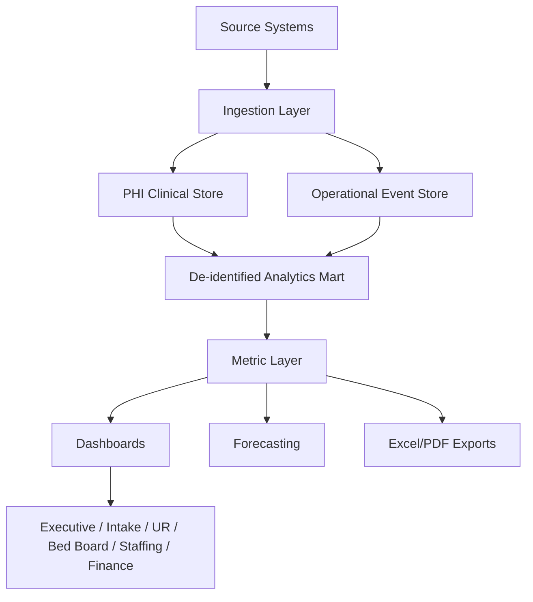
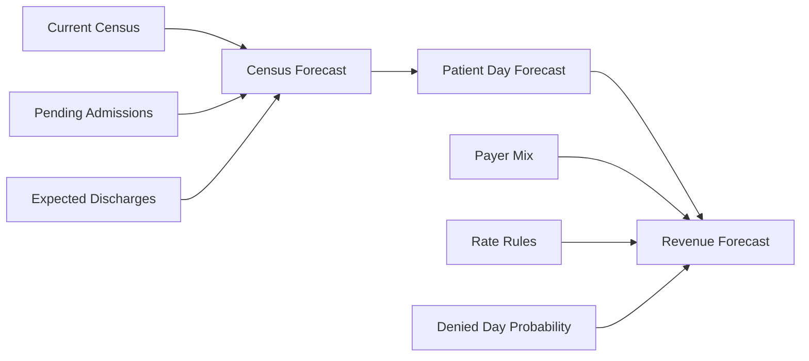

# Sustainable Model Architecture — Hospital Intelligence Dashboard

## Product name

Suggested working name:

**Clarity Ops Intelligence**

This can become the operational dashboard layer inside Clarity MH.

## System purpose

Build a sustainable dashboard platform for inpatient, IOP, centralized intake, utilization review, staffing, bed board, and revenue forecasting.

The system should replace the workbook's monthly-tab logic with a durable event model.

## Design principle

> Capture events once. Calculate metrics consistently. Display them by role.

## Architecture layers



## Source systems to support

- Manual intake form
- EHR export
- ADT feed
- Bed board updates
- IOP attendance
- Staffing schedule/payroll
- UR authorization tracking
- Payer contracts/rate tables
- Budget plan
- Referral source CRM

## Core modules

### 1. Executive command dashboard

Shows:

- admissions,
- discharges,
- ADC,
- occupancy,
- ALOS,
- patient days,
- net projected revenue,
- budget variance,
- IOP volume,
- denied days,
- staffing variance,
- agency cost,
- referral-to-admission conversion.

### 2. Inpatient census and bed board

Shows:

- licensed beds,
- available beds,
- occupied beds,
- blocked beds,
- pending admissions,
- pending discharges,
- gender/age/unit constraints,
- acuity flags,
- isolation/ADA needs,
- projected open beds.

### 3. Centralized intake dashboard

Shows:

- referral source,
- current referral status,
- time from referral to screening,
- clinical clearance status,
- benefit verification status,
- packet completeness,
- bed match,
- transport status,
- lost referral reason.

### 4. UR dashboard

Shows:

- authorized days,
- denied days,
- auth expiration,
- days-at-risk,
- payer mix,
- physician summary,
- denial category,
- concurrent review due dates,
- process-related denials.

### 5. Revenue dashboard

Shows:

- projected revenue,
- net revenue,
- patient days,
- revenue per patient day,
- payer mix,
- indigent care,
- denied-day adjustment,
- interrupted stay adjustment,
- budget variance.

### 6. IOP dashboard

Shows:

- enrolled census,
- attended days,
- absent days,
- average daily attendance,
- group count,
- admits pending,
- IOP income,
- no-show rate,
- attendance by payer/source.

### 7. Staffing dashboard

Shows:

- census-driven role budget,
- actual hours,
- rolling average hours,
- over/under budget,
- agency cost,
- PTO,
- training/nonproductive time,
- 1:1 observation burden,
- labor per patient day.

### 8. Market demand dashboard

Shows:

- referral volume by source,
- conversion rate,
- lost referral reason,
- no-bed turnaways,
- payer demand,
- geography/source market,
- unmet demand by level of care.

## Data model pattern

Replace horizontal monthly sheets with vertical fact tables.

Current pattern:

```text
Jan Revenue
Feb Revenue
Mar Revenue
...
```

Target pattern:

```text
episode_day
date | episode_id | program_id | payer_id | patient_day | revenue_day | auth_status | rate_rule_id
```

Current pattern:

```text
Staffing January
Staffing February
...
```

Target pattern:

```text
staffing_actual
date | role_id | unit_id | regular_hours | agency_hours | pto_hours | training_hours | one_to_one_hours
```

## PHI boundary

Use two layers:

### Clinical PHI database

Contains names, MRNs, DOBs, notes, legal documents, source documents.

### Analytics mart

Uses patient surrogate IDs and aggregated facts.

No dashboard user should need raw patient names to view revenue, census, staffing, or market demand.

## Metric calculation strategy

Use a measure layer.

Options:

- SQL views,
- dbt models,
- TypeScript metric service,
- materialized daily snapshots.

Recommended:

1. calculate event-level facts in SQL,
2. materialize daily snapshots,
3. expose metrics through API endpoints,
4. export Excel from the same metric endpoints.

## Forecasting strategy

Forecast census and revenue from:

- current census,
- pending admissions,
- expected discharges,
- historical LOS by payer/program/age group,
- referral volume,
- referral conversion rate,
- payer rates,
- authorization risk,
- bed constraints.



## Anti-patterns to avoid

- monthly tables,
- patient names in finance dashboards,
- spreadsheet-only formulas,
- duplicated logic by sheet,
- hard-coded payer rates,
- manual bed availability,
- non-versioned rate tables,
- no formula tests,
- no audit trail.
