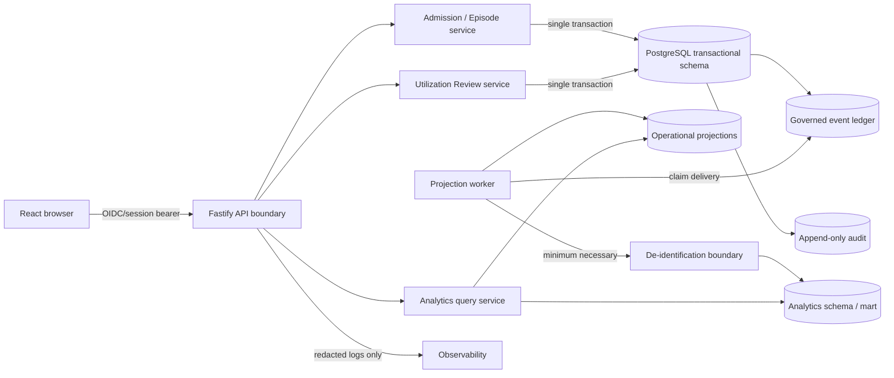

# Executive Recommendation

**Artifact status:** All proposed diagrams, schemas, commands, examples, and code-like contracts in this file are **Proposed and unverified** unless a statement is explicitly classified otherwise.


## Recommended decision

**Proposed:** Build Hospital Operations and Outcomes Intelligence as a separable module behind Clarity's authenticated server boundary, with three physically distinguishable runtime responsibilities:

1. **Transactional command runtime** — admission/episode and utilization-review services own PHI-bearing operational state.
2. **Governed event and projection runtime** — an internal worker consumes atomically appended events, derives episode-day authorization state, maintains the UR queue, and records correction/recomputation evidence.
3. **De-identified analytics runtime** — a restricted worker creates organization-scoped facts and versioned metric snapshots in a separate analytics schema; browser clients query it only through the public API.

For the first controlled pilot, deploy those responsibilities as separate Node processes/packages using one approved PostgreSQL cluster, separate database roles, and separate schemas. Preserve an explicit split trigger so analytics can later move to a separate database or platform without changing operational command contracts.

**Needs decision:** Accept or amend ADR-0012 before adding the new route surface. The recommendation is to preserve the existing `packages/api-service` workspace, port the bounded `node:http` spike to Fastify without changing proven command behavior, and then add episode/UR routes.

## Why this architecture

### Confirmed constraints

- The current product is primarily referral-through-admission and must not become one overloaded dashboard.
- The current analytics seam is local and non-durable.
- The existing backend pattern uses TypeScript, domain contracts, controlled command services, Prisma adapters, explicit actor identity, tenant predicates, optimistic concurrency, idempotency, and append-only audit events.
- The reporting SQL is a reporting blueprint, not the canonical transactional system.
- Production hosting, managed identity, production RLS, live integrations, observability, and measured outcomes are not established.
- The reporting source analysis requires a PHI operational store plus de-identified analytics mart.

### Inferred implications

- Extending the current pre-admission `Authorization` preparation entity into concurrent inpatient UR would blur two different lifecycles and risk breaking existing behavior.
- A direct browser-to-analytics write path would bypass the controlled-command and verified-principal pattern.
- A single generic dashboard would mix operational PHI work, aggregate executive intelligence, and future regulator reporting in one unsafe surface.
- An analytics-only star schema cannot support immutable corrections, operational assignments, human attestation, and state-machine behavior by itself.

### Proposed resolution

- Introduce an `Admission and Episode` bounded context and a distinct `Authorization and Utilization Review` bounded context.
- Link the accepted case to the episode through an explicit `CaseEpisodeLink`/source reference; do not move or duplicate the case record.
- Keep pre-admission authorization readiness case-owned and create a separate episode-owned authorization lifecycle linked to the source record when applicable.
- Append a governed event in the same database transaction as every successful operational command.
- Derive work queues, episode-day status, and metrics from events and operational state; never accept client-written queue rows or metric values.
- Keep role-scoped operational queries and aggregate metric queries in different API namespaces and response shapes.
- Disable cross-organization benchmarks and agency exports until governance decisions are approved.

## Target topology



The arrows from the browser end at the API. There is no browser connection to PostgreSQL, event ingestion, worker controls, or analytics tables.

## First production-shaped vertical capability

The smallest useful end-to-end capability is:

```text
accepted case
→ authorized admission handoff command
→ episode + source link + ADMISSION_RECORDED
→ one active episode day
→ episode authorization opened
→ concurrent review recorded
→ day-level decision allocation
→ documentation gap recorded/resolved
→ server-derived coverage/risk state
→ server-owned UR queue projection
→ PHI-minimized authorization-risk metric snapshot
→ role-scoped work queue and dashboard
→ visible event lineage, correction state, and freshness
```

It intentionally excludes EHR, payer portal, payroll, staffing, regulator, predictive scoring, and autonomous decisioning.

## Alternatives considered

| Alternative | Advantages | Rejection or deferral reason |
|---|---|---|
| Put all analytics code inside the browser/localStorage prototype | Fast demo | Violates verified-principal, audit, tenant, durability, and controlled-command boundaries |
| Add analytics tables directly to the case service and Command Center | Fewer packages | Overloads the intake domain and mixes case PHI, episode operations, and aggregates |
| Create an independent external analytics microservice immediately | Strong physical separation | Premature operational burden; identity, hosting, networking, retry, and deployment boundaries are unresolved |
| Use the reporting star schema as the system of record | Familiar reporting model | Cannot safely own command state, corrections, human review, concurrency, or operational work assignment |
| Extend the existing pre-admission Authorization entity to all inpatient UR | Reuses model name | Conflates readiness/preparation with recurring post-admission reviews and day allocations |
| Query metrics live from transactional tables only | Minimal infrastructure | Makes definitions inconsistent, expensive to reproduce, and difficult to version/recompute |
| Adopt Kafka or another event broker for the first slice | Strong event tooling | Not justified by current scale or hosting evidence; a transactional event ledger/outbox preserves an upgrade path |
| Use database-per-tenant immediately | Strong isolation | Operationally heavy before pilot scope and provider are known; retain as a reversal trigger |

## Contradictions and required reconciliation

| Source tension | Consequence | Recommended reconciliation |
|---|---|---|
| Implemented API spike is `node:http`; ADR-0012 proposes Fastify | New routes could deepen a temporary adapter | Owner accepts Fastify migration or explicitly accepts `node:http` for the pilot before expansion |
| Current roadmap names a read-only Product Studio projection as next; this handoff asks for UR/episode work | Priority conflict | Tyler explicitly approves the roadmap change and feature-flagged analytics slice |
| Reporting SQL has no `organization_id` on every tenant-owned row | Cross-tenant leakage risk | Add organization scope to all operational and mart facts; derive it from the verified principal/source event |
| Reporting SQL includes a PHI `patient_identity` table alongside reporting tables | Violates stated PHI/mart split | Keep identity in the transactional PHI zone; mart receives tokens and minimized dimensions only |
| Reporting SQL stores `approved_days`/`denied_days` totals on one authorization row | Loses day-level lineage and partial decisions | Store review and date-range/day decisions; derive totals from episode-day facts |
| Reporting SQL `metric_snapshot` has only name/value/time | Cannot prove definition, source, quality, or suppression | Add metric key/version, numerator/denominator, scope, watermarks, quality, suppression, and recompute lineage |
| Reporting SQL `audit_log` is generic and sparse | Insufficient for correction and provenance | Reuse/extend current append-only audit plus governed event envelope; do not create a competing audit system |
| Reporting blueprint defaults every facility to `America/Chicago` | Not company-agnostic | Require an approved IANA timezone per facility; do not silently default in production |
| Frontend role selection exists; production authorization does not | UI role checks can be mistaken for security | Derive roles/scopes only from authenticated server principal and test every route |
| Workbook formulas are source-derived, not validated policy | Metric errors could be canonized | Registry definitions remain draft until operator and metric-owner approval |

## Decisions required before implementation

1. **ADR-0012:** Fastify migration versus explicit acceptance of the current adapter.
2. **Roadmap priority:** analytics/UR slice before the Product Studio server projection.
3. **Pilot tenancy:** shared database/schema with organization RLS defense-in-depth versus stronger isolation.
4. **Facility/program/unit source of truth:** existing models, new canonical models, or external master data.
5. **Case-to-episode identity link:** exact existing person/case fields and whether one accepted case may create more than one episode.
6. **Authorization lifecycle:** approval of a separate episode-owned model linked to pre-admission authorization readiness.
7. **Metric stewardship:** owner and approved denominator for every displayed measure.
8. **De-identification policy:** token scope, date handling, small-cell threshold, retention, and key management.
9. **Role mapping:** map proposed capabilities to exact existing `UserRole` values and scope grants.
10. **Production gate:** identity provider, hosting, RLS, backup/restore, observability, and privacy/security review.

## Decision standard

No unresolved product, security, or tenancy decision should be hidden in code. Codex should stop when an exact model, role, authorization rule, or deployment boundary cannot be verified from the live repository.
