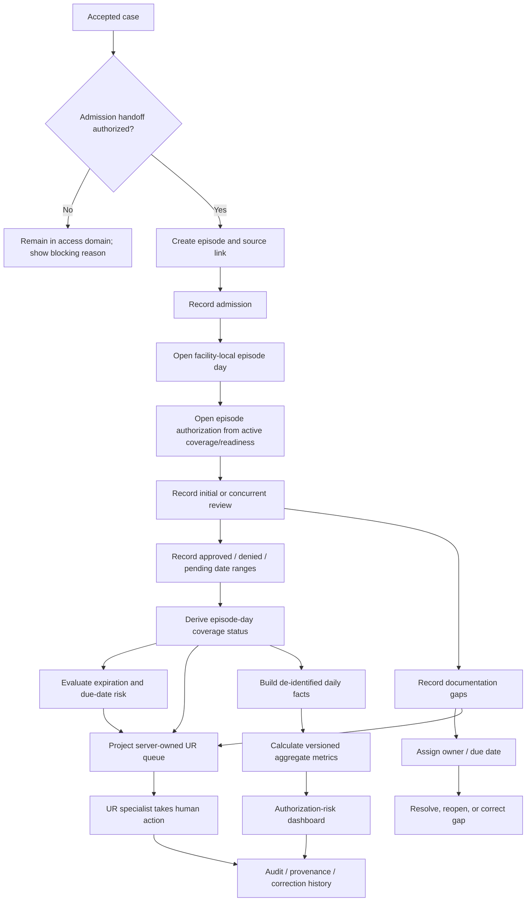
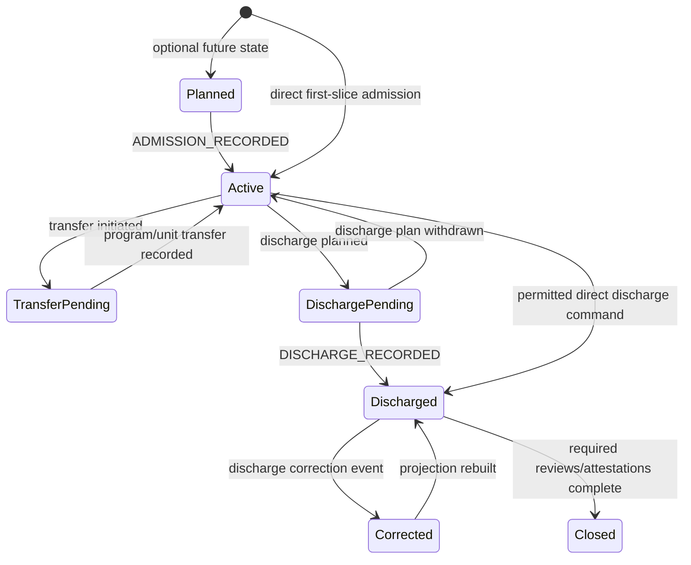
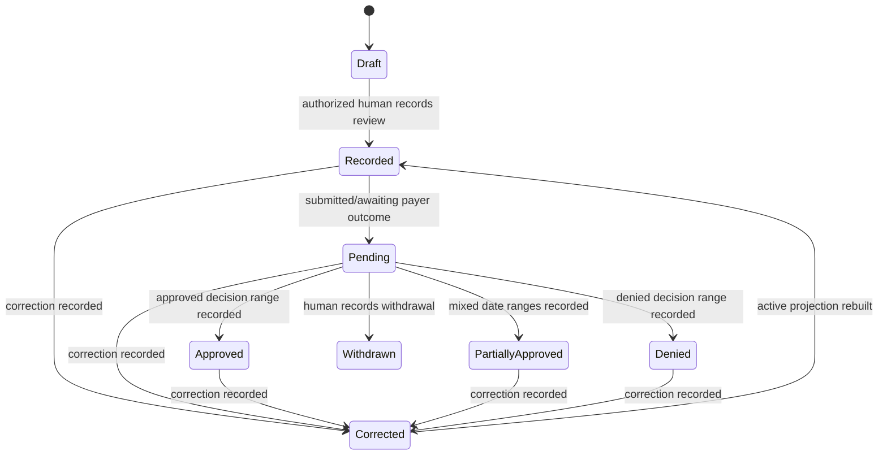

# Product and Workflow Design

**Artifact status:** All proposed diagrams, schemas, commands, examples, and code-like contracts in this file are **Proposed and unverified** unless a statement is explicitly classified otherwise.


## Product boundary

### Confirmed: Access and Admission Orchestration

This domain remains responsible for referral, intake, source evidence, clinical/legal/financial readiness, packet generation, request broadcast, facility response, acceptance, transport, custody, and admission handoff readiness.

### Proposed: Hospital Operations and Outcomes Intelligence

This is a separate top-level module responsible for:

- admission-to-episode handoff;
- episode lifecycle and service-day facts;
- concurrent authorization and utilization review;
- approved/denied/pending/expired day accounting;
- documentation-gap workflow;
- census, staffing, finance, quality, outcomes, and executive intelligence in later stages;
- governed aggregate exports after authorization.

It shares IDs and events with the access domain, but it does not reuse the intake Command Center as a catch-all dashboard.

## Product principles

1. **One operational action, one governed record.** Stakeholders produce data while doing the work; they do not re-enter it solely for reporting.
2. **Case and episode are linked, not merged.** The case explains how access occurred; the episode explains what happened after admission.
3. **Operational work and aggregate intelligence are separate surfaces.** The UR queue may expose minimum-necessary patient context to authorized operators; the authorization-risk dashboard is aggregate and PHI-minimized.
4. **Metrics never decide care.** Metrics identify work, uncertainty, due dates, and operating patterns.
5. **Every visible number carries provenance.** Definition version, source watermark, completeness, correction state, and suppression status are query metadata.
6. **No source is silently trusted.** Manual, native, EHR, payer, payroll, and batch events retain source and review state.
7. **No data is silently rewritten.** Corrections append a replacement event and trigger controlled recomputation.
8. **No cross-organization comparison is implicit.** It requires an approved grant and a separate governed projection.

## End-to-end workflow



## Admission-to-episode handoff

### Entry criteria

**Proposed:**

- the case belongs to the authenticated organization;
- the actor has the `episode.admissionHandoff.create` capability for the receiving facility;
- an accepted facility response or equivalent approved admission authority is present;
- required facility, program, timezone, and admission time are known;
- the case is not already linked to an active episode unless an owner-approved transfer/readmission rule applies;
- the command includes an idempotency key and the current expected case version;
- no clinical or legal decision is made by the command.

### Command result

The command atomically creates:

- an `Episode`;
- a `CaseEpisodeLink`;
- an `AdmissionRecord`;
- the first `EpisodeDay` projection when admission time maps to a service date;
- an append-only audit event;
- an `ADMISSION_RECORDED` governed event;
- an event-delivery row for projections.

The command does not copy packet documents, legal forms, clinical notes, or member identifiers into analytics. It references approved source object IDs and hashes.

### Failure behavior

- stale case version → `409 CONCURRENCY_CONFLICT`;
- same idempotency key and same request hash → replay original success;
- same idempotency key with different request hash → `409 IDEMPOTENCY_KEY_REUSED`;
- case outside organization → non-revealing `404`;
- actor lacks admission capability → `403`;
- no accepted admission authority → `422 ADMISSION_HANDOFF_NOT_READY`;
- invalid facility/program relationship or missing timezone → `422 SCOPE_CONFIGURATION_INVALID`.

## Episode lifecycle



**First-slice states:** `ACTIVE`, `DISCHARGED`, `CLOSED`, with correction history. `PLANNED`, transfer, and discharge-planning workflows are later.

## Episode-day model

An episode day is a server-owned facility-local service-date projection. It is not directly edited by the browser.

### Coverage and risk are separate

```text
coverageStatus:
  NOT_REQUIRED | APPROVED | DENIED | PENDING | EXPIRED | UNREQUESTED | UNKNOWN

riskState:
  NONE | REVIEW_DUE_SOON | REVIEW_OVERDUE | AUTH_EXPIRES_SOON |
  AUTH_EXPIRED | DOCUMENTATION_GAP | SOURCE_DISAGREEMENT | DATA_INCOMPLETE
```

A day may be `APPROVED` and still have `AUTH_EXPIRES_SOON`. This prevents the "at-risk" count from replacing or double-counting the mutually exclusive coverage outcome.

### Proposed precedence for coverage status

For one episode and service date, after excluding superseded events:

1. explicit denied decision covering the date;
2. explicit approved decision covering the date;
3. pending review/request covering the date;
4. approved window ended before the date → `EXPIRED`;
5. authorization required but no request covers the date → `UNREQUESTED`;
6. authorization not required → `NOT_REQUIRED`;
7. conflicting or incomplete source facts → `UNKNOWN`.

**Needs decision:** Whether a payer's partial approval can overlap a denial on the same date and which business rule resolves that conflict. The first implementation should quarantine overlap as `SOURCE_DISAGREEMENT` rather than guess.

## Authorization review workflow



The system may derive due dates and warnings from recorded data. It may not submit to a payer, decide approval, or choose clinical disposition.

## Documentation-gap workflow

### Normal contribution path

- UR specialist records a controlled gap category during a review.
- Clinician/HIM/nursing role sees the gap in its existing episode/documentation work context.
- An authorized human resolves, disputes, reopens, or corrects the gap.
- The UR queue updates from the source state.
- The analytics mart receives category, age, status, and timing — not free-text details or note content.

### Proposed statuses

`OPEN`, `ACKNOWLEDGED`, `IN_PROGRESS`, `RESOLVED`, `DISPUTED`, `REOPENED`, `CANCELLED`, `SUPERSEDED`.

### Proposed categories

- `MISSING_PROGRESS_NOTE`
- `MISSING_PHYSICIAN_ORDER`
- `MISSING_TREATMENT_PLAN`
- `MISSING_RISK_UPDATE`
- `MISSING_DISCHARGE_PLAN`
- `MISSING_SIGNATURE_OR_ATTESTATION`
- `INCONSISTENT_LEVEL_OF_CARE_SUPPORT`
- `PAYER_REQUESTED_CLARIFICATION`
- `OTHER_CONTROLLED`

`OTHER_CONTROLLED` should require an approved short operational summary. Unrestricted free text should be disabled until the PHI/content policy is approved.

## Stakeholder contribution through normal work

| Stakeholder | Normal action | Canonical write | Downstream use |
|---|---|---|---|
| Admissions/intake | Complete authorized handoff | Episode/admission command | episode start, admission metric |
| UR specialist | Record review, due date, requested dates, payer outcome | Authorization review/day decision | day status, queue, UR metrics |
| Clinician/HIM/nursing | Resolve or dispute documentation gap | Documentation-gap command | queue clearing, gap metrics |
| Program/facility leader | Configure scope and assign UR owner | Scope/assignment command | workload ownership |
| Compliance/auditor | Review provenance and record correction approval where required | Correction/attestation command | active event chain, recomputation |
| Executive | Select approved scope/date/metric version | Query only | aggregate decisions, no operational mutation |
| Analytics steward | Approve metric definition version | Registry governance command, later slice | metric eligibility |
| Integration operator | Resolve quarantined mapping or source issue | Data-quality review command, later slice | event eligibility |

## Role-specific decisions supported

| Workspace | Supports | Must not support |
|---|---|---|
| Admission Handoff | Whether required administrative handoff facts are complete and which authorized human records admission | Deciding clinical acceptance or legal eligibility |
| UR Work Queue | Which review/gap needs human attention next, based on due dates and recorded facts | Automatic authorization submission or clinical priority scoring |
| Episode UR Detail | Recording payer communication/outcome and viewing source lineage | Replacing payer verification or choosing treatment |
| Documentation Gaps | Assigning, resolving, disputing, and correcting missing documentation workflow | Generating or signing clinical content autonomously |
| Authorization Risk | Understanding aggregate days and workload by approved dimensions | Displaying patient names or predicting denials |
| Audit and Corrections | Understanding who recorded/corrected what and rebuilding projections | Deleting historical events |
| Executive Intelligence, later | Reviewing approved trends and data-quality caveats | Unreviewed benchmark claims or patient-level drill-through |
| Regulatory Reporting, later | Preparing/attesting approved minimum-necessary submission | Direct agency access or automatic submission without authorization |

## First-slice non-goals

- EHR/ADT ingestion required for operation;
- payer-portal automation;
- automatic prior/concurrent authorization submission;
- predictive denial scoring;
- clinical criteria replication;
- discharge decision support;
- staffing/payroll;
- revenue projections;
- cross-facility benchmark marketplace;
- governing-agency export;
- automated narratives;
- replacement of the existing intake Command Center;
- production claims or measured outcomes.

## Success evidence for the slice

The slice is complete only when a reviewer can demonstrate, using synthetic data:

1. an accepted case becomes one episode through an authorized, idempotent command;
2. a second organization cannot read, mutate, enumerate, or aggregate the episode;
3. a concurrent review and documentation gap update episode-day state and queue projection;
4. a correction preserves the original event and supersedes its effect;
5. an out-of-order event triggers deterministic recomputation;
6. the work queue shows minimum-necessary operational context;
7. the aggregate dashboard contains no patient name, MRN, DOB, member ID, note text, or unrestricted free text;
8. every displayed metric has definition version, freshness, completeness, and correction metadata;
9. empty data displays `No measurements found`;
10. all behavior remains human-reviewed and no regulated decision is automated.
