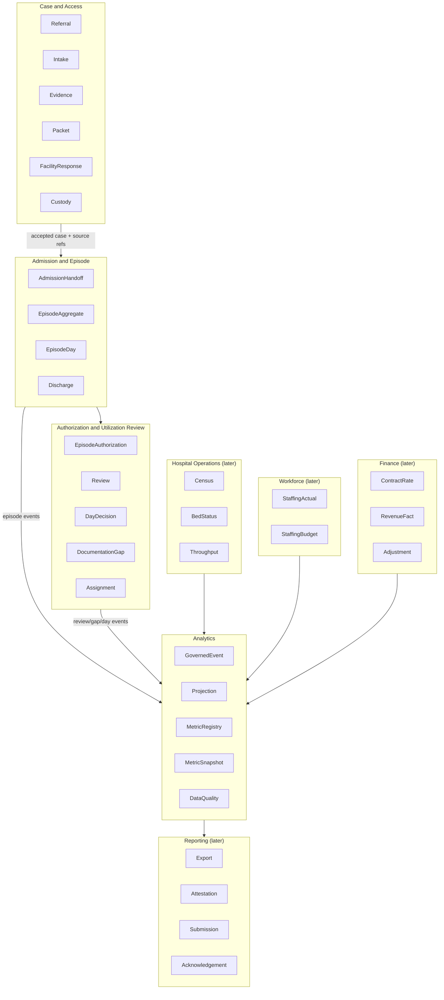
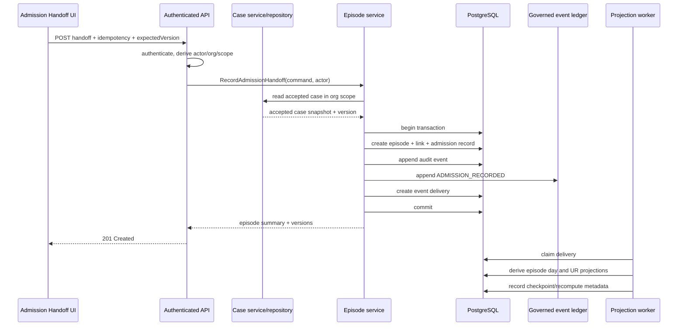
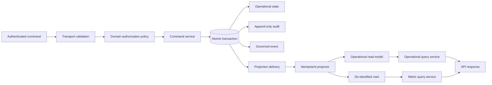
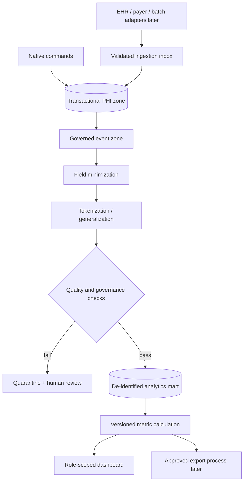
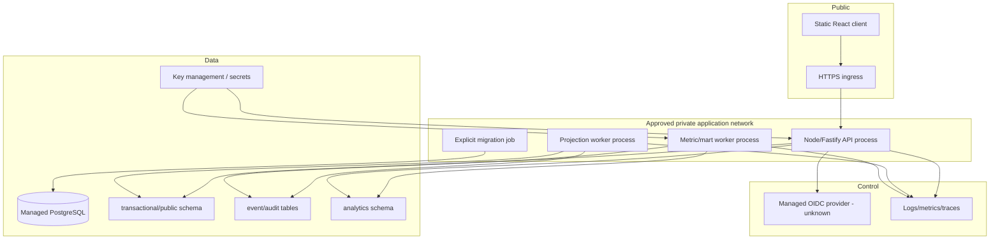
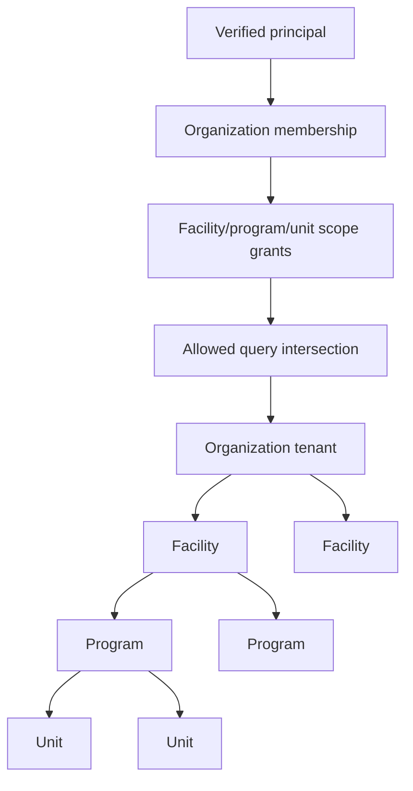
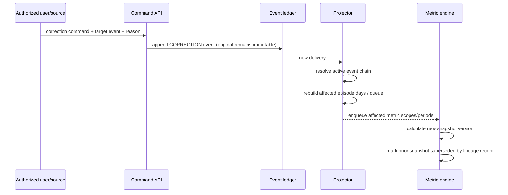

# System Architecture

## Architecture recommendation

**Proposed and unverified:** Evolve Clarity as a modular monolith with separate deployable processes, not as a browser-only feature and not as a premature distributed microservice estate.

- `packages/api-service`: sole public HTTP adapter after ADR-0012 reconciliation.
- `packages/episode-service`: episode and admission commands.
- `packages/utilization-review-service`: post-admission authorization, review, documentation-gap, and assignment commands.
- `packages/analytics-service`: event validation, projection logic, mart writes, metric calculation, and queries.
- `packages/reporting-service`: reserved for later approved exports/submissions; not required for first slice.
- `packages/domain-contracts/src/{episode,utilization-review,analytics}`: Zod/type/state/event contracts.
- `app/src/...`: role-scoped Operations and Outcomes workspaces.
- canonical Prisma schema: operational state, governed events, audit links, deliveries/checkpoints.
- separate SQL-managed `analytics` schema: de-identified facts and metric snapshots.

The exact package names and paths must be checked against live repository conventions.

## Bounded contexts

### Ownership rule

- A bounded context owns its command state.
- Cross-context consumers receive immutable event contracts or read approved projections.
- The analytics context never becomes the authoritative writer of episode, authorization, documentation, staffing, or finance source state.
- Reporting never writes operational state.

## Referral-to-episode transition

If existing case and episode writes cannot share a transaction through current gateways, that is a **Needs decision** boundary. Do not emulate atomicity with best-effort browser calls.

## Command, event, and query flow

### Command rules

- actor, organization, roles, and scope come only from the verified principal;
- unknown request fields are rejected;
- every mutating command has idempotency and correlation IDs;
- state-changing commands use expected version/optimistic concurrency;
- command success, audit event, governed event, and delivery are atomic;
- clients never provide event classification, metric eligibility, audit actor, or tenant ID.

### Event rules

- event payloads are immutable;
- a correction is a new event that references the event it supersedes;
- external events are quarantined until mapping, tenant, schema, provenance, and quality checks pass;
- delivery/checkpoint rows may be updated; event and audit payloads may not;
- projectors are replayable and idempotent.

### Query rules

- operational queries enforce organization and facility/program/unit scopes;
- aggregate queries return definition, freshness, completeness, quality, and suppression metadata;
- executive/aggregate endpoints do not return direct patient identifiers;
- no query result implies clinical, legal, placement, discharge, or payer approval.

## PHI-to-analytics flow

Operational users may receive PHI from operational endpoints when their role and scope require it. Aggregate dashboards are not a route around operational access controls.

## Initial deployment topology

### Database roles

**Proposed:**

- `clarity_api_tx`: read/write allowed operational tables through approved service paths; read governed event metadata needed for provenance; no analytics DDL.
- `clarity_projection_worker`: read events, write operational projections/checkpoints; cannot alter source operational aggregates.
- `clarity_analytics_worker`: read minimum event fields, write analytics schema; no patient identity-table access unless a controlled tokenization function requires it.
- `clarity_analytics_reader`: read approved mart views only.
- `clarity_migrator`: migration-time DDL; not used by app runtime.
- `clarity_auditor`: read-only approved audit/provenance views.

Role names are proposals; provider and migration tooling are unknown.

## Tenancy topology

- Organization is the top-level tenant.
- Facility/program/unit scopes are narrower authorization dimensions, not alternate tenant IDs.
- Cross-organization analytics uses neither ordinary membership nor `SYSTEM_ADMIN` bypass. It requires an explicit aggregate grant and separate governed query path.
- Every tenant-owned operational and mart row includes `organizationId`.
- Facility/program/unit identifiers are validated as descendants of the organization in the same transaction.

## Runtime placement relative to ADR-0012

### Recommended

- **Public boundary:** one API adapter, consistent with ADR-0012.
- **Internal commands:** direct package/service calls inside the API process.
- **Asynchronous analytics:** separate worker process(es), no public route.
- **Queries:** API delegates to operational or analytics query services.
- **External ingestion later:** private authenticated adapter endpoints or batch jobs that normalize into the same event contract.

### Why not put the analytics worker in the API request lifecycle

- large replays and recomputation would increase command latency;
- correction and late-arrival handling needs checkpointed retries;
- mart credentials should not be present in the public API process if avoidable;
- workers need independent scaling and rollback;
- a failed metric calculation must not roll back a valid clinical/operational command.

### Why not make analytics a separate public microservice yet

- current identity/hosting/provider choices are open;
- service-to-service auth, networking, duplicate error policy, and deployment ownership would add unproven complexity;
- package and process separation preserves the future split.

## Event processing semantics

### Native writes

Use **atomic append plus idempotent projection**:

1. validate command;
2. write operational state;
3. append audit;
4. append governed event;
5. create delivery row;
6. commit;
7. worker claims delivery with lease;
8. projection transaction checks `(projectionName, eventId)` uniqueness;
9. write projection and processed-event record;
10. advance checkpoint.

### External writes

Use **ingestion receipt plus normalization**:

1. authenticate source;
2. record immutable raw receipt metadata and hash in restricted storage;
3. validate source schema;
4. map source values to canonical values;
5. resolve tenant/facility/program/unit;
6. run data-quality and duplicate checks;
7. create governed canonical event or quarantine record;
8. acknowledge source according to adapter contract.

Raw external payload retention is a **Needs decision** and should default to minimum necessary.

## Correction, supersession, and recomputation

Late events use the same recomputation path. Historical source data is not silently overwritten.

## Architecture decision records to add

| Proposed ADR | Decision |
|---|---|
| ADR-0013 | Admission/Episode and UR bounded contexts; case-to-episode link |
| ADR-0014 | Governed event ledger, event delivery, and projector semantics |
| ADR-0015 | PHI operational zone and de-identified analytics schema |
| ADR-0016 | Tenancy hierarchy, scoped grants, and cross-org default deny |
| ADR-0017 | Metric registry, definition approval, snapshots, and recomputation |
| ADR-0018 | Server-owned UR queue and aggregate dashboard separation |
| ADR-0019 | Adapter normalization and source-quality quarantine |
| ADR-0020 | Correction/supersession policy and immutable history |

Numbering must be checked against the live `docs/architecture/` directory.

## Reversal triggers

Split analytics to a separate database/service when any of these become true:

- provider/regional residency requires physical separation;
- analytics queries materially affect transactional performance;
- event volume or retention requires independent storage/partitioning;
- separate operational teams own analytics;
- cross-organization benchmark authority demands stronger cryptographic or administrative separation;
- an approved streaming platform becomes required for multiple source systems;
- database-per-tenant is mandated.

Until then, keep interfaces split even if infrastructure is shared.
