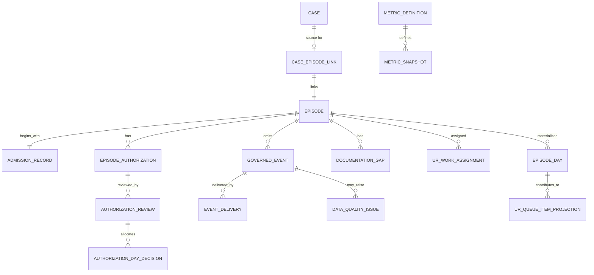
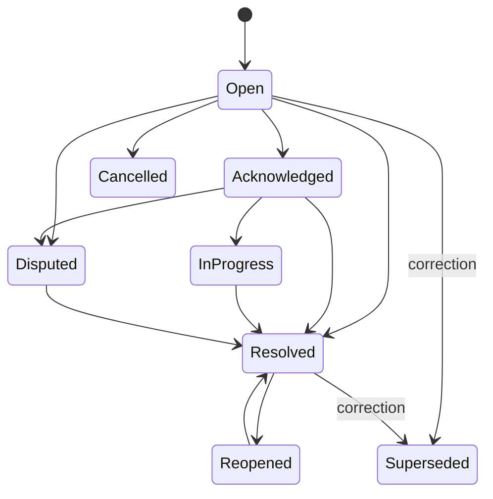
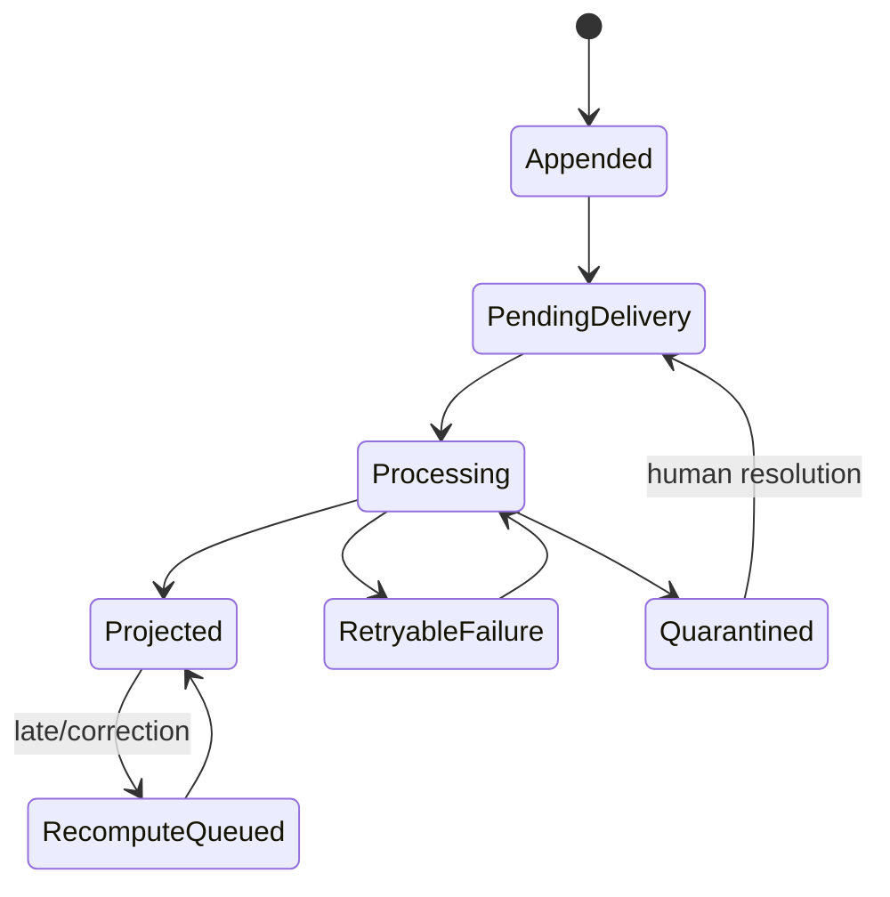

# Domain and Event Model

## Domain ownership summary

| Aggregate/entity | Owner | Contains PHI? | First slice | Notes |
|---|---|---:|---:|---|
| Case | Case and Access | Yes | existing | Historical referral-through-admission aggregate |
| CaseEpisodeLink | Admission and Episode | Identifier link | yes | Links, never merges, the two aggregates |
| Episode | Admission and Episode | Yes/minimum identifier | yes | Facility/program/unit and lifecycle |
| AdmissionRecord | Admission and Episode | Yes/minimum operational | yes | Authorized recorded fact, not acceptance decision |
| EpisodeDay | Admission and Episode projection | Pseudonymous operational | yes | Server-derived facility-local service date |
| EpisodeAuthorization | Authorization and UR | Yes | yes | Post-admission lifecycle linked to source coverage/readiness |
| AuthorizationReview | Authorization and UR | Yes | yes | Human-recorded review/request/outcome |
| AuthorizationDayDecision | Authorization and UR | Yes/minimum | yes | Date ranges and outcome, source of day derivation |
| DocumentationGap | Authorization and UR | Potential PHI | yes | Controlled category plus minimal detail |
| UrWorkAssignment | Authorization and UR | No/identifier | yes | Human assignment, controlled command |
| UrQueueItemProjection | UR projection | Minimum operational PHI | yes | Server-owned; never direct client mutation |
| GovernedEvent | Analytics/event spine | Classification varies | yes | Immutable integration contract |
| EventDelivery/Checkpoint | Analytics | No | yes | Mutable processing metadata, separate from event |
| DataQualityIssue | Analytics/governance | May reference restricted source | yes/minimal | Quarantine and review |
| MetricDefinition | Analytics governance | No | yes | Versioned, owner-approved definition |
| MetricSnapshot | Analytics mart | De-identified/aggregate | yes | Definition, freshness, quality, suppression |
| ExportRun | Reporting | Aggregate, jurisdiction-specific | later | Attested export/submission history |

## Case versus episode ownership

### Case-owned

- referral source and source case facts;
- intake/evidence/clinical/legal/benefits readiness;
- facility request and response;
- acceptance authority record;
- packet version and custody/transport history;
- admission handoff readiness and completion marker.

### Episode-owned

- admission time and receiving facility/program/unit;
- active/discharged/closed lifecycle;
- service dates and program/unit movement;
- concurrent authorization and payer communication after admission;
- documentation gaps tied to the stay;
- discharge and continuity events;
- operational episode-level provenance.

### Link semantics

**Proposed:**

```text
CaseEpisodeLink
- organizationId
- caseId
- episodeId
- relationship: ADMISSION_SOURCE | TRANSFER_SOURCE | READMISSION_SOURCE
- linkedAt
- linkedByActorId
- sourceAcceptanceId
- sourcePacketVersionId?
- sourceCustodyEventId?
```

Recommended first-slice invariant: one accepted case creates at most one active `ADMISSION_SOURCE` episode. A later transfer/readmission model may create additional links only after owner approval.

## Entity relationship diagram



## Proposed TypeScript contracts

> **Code status:** Proposed and unverified. Exact imports, brands, IDs, Zod version, and package exports must be reconciled with the live repository.

```ts
export type EpisodeStatus = "ACTIVE" | "DISCHARGED" | "CLOSED";

export type EpisodeDayCoverageStatus =
  | "NOT_REQUIRED"
  | "APPROVED"
  | "DENIED"
  | "PENDING"
  | "EXPIRED"
  | "UNREQUESTED"
  | "UNKNOWN";

export type EpisodeDayRiskCode =
  | "REVIEW_DUE_SOON"
  | "REVIEW_OVERDUE"
  | "AUTH_EXPIRES_SOON"
  | "AUTH_EXPIRED"
  | "DOCUMENTATION_GAP"
  | "SOURCE_DISAGREEMENT"
  | "DATA_INCOMPLETE";

export interface Episode {
  id: string;
  organizationId: string;
  sourceCaseId: string;
  facilityId: string;
  programId: string;
  unitId: string | null;
  facilityTimezone: string;
  admittedAt: string;
  status: EpisodeStatus;
  version: number;
  createdAt: string;
  updatedAt: string;
}

export interface EpisodeDayProjection {
  id: string;
  organizationId: string;
  episodeId: string;
  serviceDate: string;
  patientDay: boolean;
  coverageStatus: EpisodeDayCoverageStatus;
  riskCodes: EpisodeDayRiskCode[];
  sourceWatermark: string;
  derivationVersion: string;
  qualityState: DataQualityState;
  calculatedAt: string;
}
```

```ts
export type AuthorizationRequirement =
  | "REQUIRED"
  | "NOT_REQUIRED"
  | "UNKNOWN";

export type AuthorizationReviewType =
  | "INITIAL"
  | "CONCURRENT"
  | "RETROSPECTIVE"
  | "PEER_TO_PEER"
  | "APPEAL";

export type AuthorizationDecisionStatus =
  | "PENDING"
  | "APPROVED"
  | "DENIED"
  | "WITHDRAWN"
  | "UNKNOWN";

export interface EpisodeAuthorization {
  id: string;
  organizationId: string;
  episodeId: string;
  sourceCoverageId: string | null;
  sourcePreAdmissionAuthorizationId: string | null;
  levelOfCare: string;
  requirement: AuthorizationRequirement;
  status: "OPEN" | "CLOSED" | "SUPERSEDED";
  version: number;
}

export interface AuthorizationReview {
  id: string;
  organizationId: string;
  episodeAuthorizationId: string;
  reviewType: AuthorizationReviewType;
  requestedStartDate: string;
  requestedEndDate: string;
  dueAt: string | null;
  decisionStatus: AuthorizationDecisionStatus;
  payerReferenceToken: string | null;
  recordedByActorId: string;
  recordedAt: string;
  version: number;
}

export interface AuthorizationDayDecision {
  id: string;
  organizationId: string;
  authorizationReviewId: string;
  startDate: string;
  endDate: string;
  outcome: "APPROVED" | "DENIED" | "PENDING";
  denialReasonCode: string | null;
  sourceEventId: string;
  supersededByEventId: string | null;
}
```

```ts
export type DocumentationGapStatus =
  | "OPEN"
  | "ACKNOWLEDGED"
  | "IN_PROGRESS"
  | "RESOLVED"
  | "DISPUTED"
  | "REOPENED"
  | "CANCELLED"
  | "SUPERSEDED";

export interface DocumentationGap {
  id: string;
  organizationId: string;
  episodeId: string;
  sourceAuthorizationReviewId: string | null;
  categoryCode: string;
  operationalSummary: string | null;
  status: DocumentationGapStatus;
  dueAt: string | null;
  assignedRole: string | null;
  assignedUserId: string | null;
  recordedByActorId: string;
  resolvedByActorId: string | null;
  version: number;
}
```

## Event envelope model

The canonical JSON Schema is in `contracts/analytics-event-envelope.schema.json`.

### Required envelope properties

- unique event ID;
- schema name/version;
- event type/version;
- aggregate type/ID/version;
- organization and optional facility/program/unit scope;
- case and/or episode reference;
- effective time and recorded time;
- actor or source-system identity;
- source system, adapter, and external source ID;
- correlation and causation IDs;
- PHI classification;
- data-quality state;
- review/attestation state;
- correction/supersession relationship;
- metric-eligibility state;
- payload hash;
- event-specific payload.

## Example event ownership

| Event | Owner | Aggregate | Metric source | Notes |
|---|---|---|---:|---|
| `CASE_ADMISSION_HANDOFF_COMPLETED.v1` | Case/Access | Case | no | Case marks handoff complete |
| `EPISODE_CREATED.v1` | Admission/Episode | Episode | no | Lifecycle event |
| `ADMISSION_RECORDED.v1` | Admission/Episode | Episode | yes | Admission count/source |
| `EPISODE_DAY_OPENED.v1` | Admission/Episode | EpisodeDay | yes | Patient-day basis |
| `EPISODE_DAY_CORRECTED.v1` | Admission/Episode | EpisodeDay | yes | Supersedes source day fact |
| `EPISODE_AUTHORIZATION_OPENED.v1` | UR | EpisodeAuthorization | no | Links coverage/readiness |
| `AUTHORIZATION_REVIEW_RECORDED.v1` | UR | AuthorizationReview | yes | Due/review burden |
| `AUTHORIZATION_DAY_DECISION_RECORDED.v1` | UR | AuthorizationReview | yes | Approved/denied/pending basis |
| `DOCUMENTATION_GAP_RECORDED.v1` | UR | DocumentationGap | yes | Controlled category only in mart |
| `DOCUMENTATION_GAP_RESOLVED.v1` | UR | DocumentationGap | yes | Resolution timing |
| `UR_ASSIGNMENT_CHANGED.v1` | UR | Episode | no | Operational assignment |
| `EPISODE_DAY_AUTHORIZATION_STATE_DERIVED.v1` | Analytics projector | EpisodeDay | yes | Rebuildable derived event/projection evidence |
| `METRIC_SNAPSHOT_CALCULATED.v1` | Analytics | MetricSnapshot | no | Calculation lineage |
| `DATA_QUALITY_ISSUE_RAISED.v1` | Analytics | DataQualityIssue | no | Quarantine/review |

See `contracts/event-catalog.md` for detailed payloads and lifecycle.

## Data quality states

```ts
export type DataQualityState =
  | "VALID"
  | "VALID_WITH_WARNINGS"
  | "PENDING_REVIEW"
  | "QUARANTINED"
  | "REJECTED"
  | "CORRECTED"
  | "SUPERSEDED";
```

### Quality issue codes

- `TENANT_SCOPE_UNRESOLVED`
- `FACILITY_MAPPING_UNRESOLVED`
- `PROGRAM_MAPPING_UNRESOLVED`
- `UNIT_MAPPING_UNRESOLVED`
- `MISSING_EFFECTIVE_TIME`
- `INVALID_DATE_RANGE`
- `OVERLAPPING_AUTH_DECISIONS`
- `SOURCE_DISAGREEMENT`
- `LATE_EVENT`
- `DUPLICATE_SOURCE_EVENT`
- `UNAPPROVED_METRIC_DEFINITION`
- `DEIDENTIFICATION_POLICY_BLOCKED`
- `SMALL_CELL_POLICY_BLOCKED`
- `UNKNOWN_ENUM_MAPPING`
- `MISSING_ATTESTATION`

## Metric eligibility states

- `ELIGIBLE`
- `ELIGIBLE_WITH_WARNING`
- `PENDING_REVIEW`
- `EXCLUDED_CORRECTED`
- `EXCLUDED_SUPERSEDED`
- `EXCLUDED_QUALITY`
- `EXCLUDED_POLICY`

Metric eligibility is assigned by server policy, never by the browser or external source.

## Correction and supersession

### Rules

1. The original governed event is never updated or deleted.
2. A correction command identifies the exact event being corrected and includes a reason code and authorized actor.
3. The correction emits a new event with:
   - `correction.kind = "CORRECTION"`;
   - `correction.supersedesEventId = originalEventId`;
   - corrected effective time and payload;
   - new payload hash.
4. Projectors resolve the active chain deterministically.
5. If two corrections claim to supersede the same active event, one succeeds under optimistic concurrency; the other receives a conflict.
6. Reversal uses `kind = "REVERSAL"` and an event-specific zeroing/cancellation payload; it does not delete history.
7. Prior metric snapshots remain queryable for audit but are marked superseded through lineage metadata, not destructive update.

### Active event resolution

For an event family:

1. select original;
2. follow valid supersession links;
3. reject loops and multiple active branches;
4. use the latest accepted branch by recorded order and expected active-event version;
5. quarantine ambiguous branches;
6. calculate projections only from one active branch.

## Late-arriving events

`effectiveAt < recordedAt` is normal for some workflows. It is not automatically invalid.

- If within the approved late-arrival window, accept with `VALID_WITH_WARNINGS` and enqueue affected period recomputation.
- If outside the window, mark `PENDING_REVIEW` until an authorized data steward accepts it.
- Record `receivedAt`, `effectiveAt`, and `recordedAt` separately.
- Never alter historical `calculatedAt`; create a new recomputation run and snapshot.

The allowed window is a **Needs decision** and may differ by source/event type.

## Episode-day derivation

### Inputs

- admission effective time;
- discharge effective time;
- facility timezone;
- program/unit transfer facts;
- authorization requirement;
- active authorization decision ranges;
- pending review request ranges;
- open documentation gaps;
- review due dates;
- active correction chain;
- quality issues.

### Output

One row per episode/service date with:

- patient-day flag;
- coverage status;
- risk codes;
- source event IDs or lineage hash;
- derivation version;
- quality state;
- calculated time and source watermark.

### No direct edits

A user correcting a service date, review, or decision submits a domain correction command. The projector rebuilds the row. Direct `UPDATE episode_day SET auth_status = ...` is prohibited.

## Server-owned UR queue projection

A queue item is derived when any of these are true:

- review due within configured threshold;
- review overdue;
- authorization expires within threshold;
- service date is expired or unrequested;
- a decision is pending;
- an open documentation gap is due/overdue;
- source disagreement or data-quality review is required.

The queue sort key is deterministic:

```text
severity band
→ overdue first
→ dueAt ascending
→ oldest recorded issue
→ episodeId
```

No opaque risk score is required. The response exposes reason codes and source facts.

## Lifecycle diagrams

### Documentation gap



### Event processing



Event immutability does not require delivery immutability. The delivery state is operational processing metadata.
