# Data Collection and Adapter Design

## Collection strategy

**Confirmed:** Stakeholders should generate data through normal work rather than a duplicate reporting workflow.

**Proposed:** Every source path terminates in one canonical normalization contract. Source-specific field names, codes, timestamps, identifiers, and assumptions remain in adapter mappings and provenance; they do not leak into operational domain enums or metric definitions.

## Source acquisition matrix

| Source path | Initial slice | Authority for | Write path | Human review | Notes |
|---|---:|---|---|---:|---|
| Native Clarity commands | yes | admission handoff, reviews, gaps, assignments | authenticated command service | command-dependent | Highest-trust workflow source, but still audited |
| Human-attested manual entry | yes | facts unavailable from integrations | same command service, `sourceType=HUMAN_ATTESTATION` | required | Must name actor, method, effective time, and uncertainty |
| EHR/FHIR adapter | later | ADT/encounter, clinical documentation metadata, discharge | private adapter/inbox | mapping/exception review | No first-slice dependency |
| HL7 interface adapter | later | admission/discharge/transfer and selected results | private adapter/inbox | mapping/exception review | Exact message/version is a deployment decision |
| Payer/authorization adapter | later | requests, outcomes, reference IDs, approved ranges | private adapter/inbox | required for ambiguous outcomes | No automated decisioning |
| Staffing/payroll adapter | later | actual hours/cost categories | private batch/stream adapter | reconciliation | Separate Workforce context |
| Controlled CSV/SFTP import | later | approved historical or low-frequency data | staged import job | preflight + attestation | Never direct insert |
| Agency submission/acknowledgement | later | versioned export transmission and acknowledgement | Reporting service | pre-submit attestation | Disabled until jurisdiction approval |

## Canonical adapter interface

> **Code status:** Proposed and unverified.

```ts
export type SourceKind =
  | "NATIVE_CLARITY"
  | "HUMAN_ATTESTATION"
  | "FHIR"
  | "HL7"
  | "PAYER"
  | "STAFFING_PAYROLL"
  | "BATCH_FILE"
  | "AGENCY";

export interface SourceReceipt {
  receiptId: string;
  sourceKind: SourceKind;
  sourceSystem: string;
  sourceTenantKey: string | null;
  sourceEventId: string;
  sourceEventVersion: string | null;
  receivedAt: string;
  payloadHash: string;
  contentLocation: string | null;
  transportMetadata: Record<string, string>;
}

export interface AdapterContext {
  adapterName: string;
  adapterVersion: string;
  authenticatedSourceId: string;
  receivedAt: string;
  correlationId: string;
}

export interface MappingResult<TCanonicalPayload> {
  status: "MAPPED" | "QUARANTINED" | "REJECTED";
  canonicalEvent?: ProposedCanonicalEvent<TCanonicalPayload>;
  issues: DataQualityIssueInput[];
  sourceFieldLineage: SourceFieldLineage[];
}

export interface SourceAdapter<TRaw, TCanonicalPayload> {
  validateTransport(raw: unknown, context: AdapterContext): TRaw;
  resolveTenant(raw: TRaw, context: AdapterContext): Promise<TenantResolution>;
  normalize(
    raw: TRaw,
    tenant: TenantResolution,
    context: AdapterContext,
  ): Promise<MappingResult<TCanonicalPayload>>;
}
```

The adapter does not write the episode, queue, or mart directly. It creates an ingestion receipt and, after validation, submits a canonical command/event to an authorized internal service.

## Ingestion stages

```mermaid
flowchart LR
    SRC[Source] --> AUTH[Authenticate source]
    AUTH --> REC[Record receipt/hash]
    REC --> VAL[Validate source schema]
    VAL --> MAP[Map source codes/IDs]
    MAP --> TEN[Resolve org/facility/program/unit]
    TEN --> DQ[Quality and duplicate checks]
    DQ -- pass --> CAN[Canonical command/event]
    DQ -- review --> Q[Quarantine]
    Q --> HR[Human mapping/review]
    HR --> CAN
    CAN --> EVT[Governed event ledger]
```



### Stage requirements

1. **Authenticate source**
   - source credentials are not accepted in payload fields;
   - use an approved secret, certificate, private network, or OIDC workload identity;
   - identify source organization and allowed event types.

2. **Record receipt**
   - generate receipt ID;
   - record payload hash, source event ID, version, transport, and receive time;
   - raw payload storage is restricted and retention-controlled;
   - do not log raw payload.

3. **Validate source schema**
   - reject malformed or oversized payloads;
   - record a non-PHI error code;
   - preserve source acknowledgement requirements.

4. **Map**
   - use a versioned mapping set;
   - retain source value, canonical value, mapping rule ID, and reviewer where applicable;
   - unknown source values are quarantined, not guessed.

5. **Resolve tenant/scope**
   - map source tenant/facility/program/unit identifiers through an approved registry;
   - an adapter cannot supply an arbitrary Clarity organization ID without a configured mapping.

6. **Data quality**
   - check required fields, date ranges, sequence, duplicates, contradictions, and correction references;
   - assign metric eligibility separately from ingestion acceptance.

7. **Canonical append**
   - call a service command for operational source-of-truth facts;
   - append a governed event and delivery atomically;
   - return an acknowledgement with canonical event ID and status.

## Native workflow events

Native Clarity events are produced by command services and have the strongest atomicity:

```text
validated command
→ authorized domain mutation
→ audit event
→ governed event
→ delivery row
→ commit
```

They still retain:

- actor ID and role/capability at action time;
- source command type;
- correlation/causation IDs;
- expected and resulting aggregate version;
- effective and recorded time;
- classification and metric eligibility;
- payload hash.

The frontend prototype's existing `clarity.reporting-metrics-rebuilder.v0` export is a **prototype seam only**. It may inform mapping names, but it must not be promoted as the canonical durable contract without versioned server validation.

## Human-attested entry

Human entry is an adapter path, not a lower-standard exception.

### Required fields

- actor from verified principal;
- organization and scope from principal;
- source method: phone, portal viewed by human, fax, secure message, document review, other controlled;
- effective time;
- recorded time;
- source reference token or approved document ID;
- attestation statement;
- uncertainty/missing fields;
- reason for late entry when applicable.

### Prohibited behavior

- entering another organization's tenant ID;
- marking the source as payer-confirmed without approved evidence;
- pasting unrestricted clinical note text into an analytics field;
- manually setting metric eligibility;
- manually writing approved/denied day totals without date ranges or source review;
- changing queue priority directly.

## EHR/FHIR adapter boundary

**Later and unverified.** Select the exact interoperability version, resource/message profile, consent/privacy model, and vendor endpoints during implementation.

Potential canonical mappings:

| Source concept | Canonical target | Rule |
|---|---|---|
| encounter/admission | admission or episode lifecycle command | do not create duplicate episode if native handoff already exists |
| transfer/location | program/unit transfer event | map through facility master data |
| discharge | discharge record event | human review if source conflicts with active operational state |
| clinical-document metadata | documentation presence/attestation fact | do not ingest note text into the analytics mart |
| coverage/payer | coverage reference mapping | member identifiers stay in PHI zone |
| observation/result metadata | approved operational fact, later | clinical content and interpretation require separate review |

### Identity reconciliation

Never match solely on name/date of birth. Use an approved master-patient or encounter mapping process, confidence thresholds, and human exception review. The exact identity strategy is **Unknown**.

## HL7 adapter boundary

**Later and unverified.**

- preserve source message control ID and version;
- distinguish message receive time from clinical effective time;
- handle duplicates and out-of-order transfer/discharge messages;
- map facility/location codes through a versioned registry;
- never treat transport acknowledgement as clinical validation;
- quarantine an impossible sequence rather than silently fixing it;
- maintain correction/cancel semantics as new canonical events.

## Payer and authorization adapter boundary

**Later and unverified.**

The adapter may record payer-originated facts but may not:

- decide medical necessity;
- auto-submit without an approved human workflow;
- infer current-patient coverage from historical payer memory;
- copy proprietary criteria;
- translate a portal status into approved days without a versioned mapping;
- resolve ambiguous partial approvals automatically.

Canonical payer facts should include:

- review/request reference token;
- requested date range;
- decision date range(s);
- outcome code;
- denial category;
- effective and received times;
- source system and representative/reference metadata;
- confidence and review state.

## Staffing and payroll boundary

Staffing/payroll belongs to a later Workforce context.

- ingest role/category hours, not employee clinical details;
- separate regular, overtime, agency, PRN, PTO, training, and observation burden;
- version rate/budget assumptions;
- reconcile payroll period and facility-local dates;
- aggregate before executive presentation where possible;
- do not let staffing data change episode clinical state.

## Controlled CSV/SFTP import

### Required import lifecycle

1. upload to restricted staging;
2. malware/format checks according to approved infrastructure;
3. parse without writing canonical tables;
4. validate headers and mapping profile version;
5. present row counts, rejects, and PHI classification;
6. require authorized attestation;
7. commit accepted rows through canonical service/event paths;
8. produce immutable import receipt and reconciliation report;
9. delete or retain raw file according to approved policy.

### Idempotency key

```text
sourceSystem + fileHash + mappingProfileVersion + rowStableKey
```

A repeat import reports prior results; it does not silently duplicate facts.

## Agency submission and acknowledgement boundary

Disabled in the first slice.

A future adapter must support:

- jurisdiction/report type/version;
- reporting period;
- metric-definition versions;
- field-level minimum-necessary policy;
- suppression and cohort policy;
- reviewer and attester;
- generated artifact hash;
- submission channel;
- acknowledgement/rejection;
- correction and resubmission chain;
- immutable export run and audit.

No agency receives direct access to operational PHI tables or the ordinary analytics mart.

## Adapter registry

**Proposed fields:**

- adapter ID/name/version;
- source kind/system;
- organization/facility authorization;
- allowed canonical event types;
- mapping profile ID/version;
- status: `DRAFT`, `TEST`, `ACTIVE`, `SUSPENDED`, `RETIRED`;
- owner;
- credential reference;
- expected cadence;
- late-arrival window;
- raw payload retention policy;
- PHI classification;
- alert thresholds;
- last successful receipt;
- last reconciliation;
- change history.

## Quality and reconciliation

Every adapter exposes:

- source receipts received;
- accepted, rejected, quarantined, duplicate counts;
- maximum event-time lag;
- unresolved tenant/facility mappings;
- source disagreement count;
- last successful watermark;
- expected versus observed coverage;
- reconciliation status.

Those values are operational metadata, not patient outcomes.

## First-slice adapter decision

Use only:

1. native admission/episode commands;
2. human-attested authorization review/day decision commands;
3. human-attested documentation-gap commands;
4. synthetic fixture loader through test-only paths.

Do not build an EHR, payer, payroll, SFTP, or regulator adapter merely to demonstrate the initial UI.
