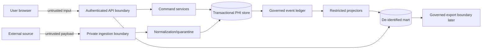

# Security, Tenancy, and Governance

## Security posture

**Confirmed:** The supplied repository is not a production clinical system and production security controls are not established.

**Proposed:** The first slice must be designed as though real PHI could eventually be processed, while continuing to use synthetic data until formal security/privacy approval. Security must be enforced at the authenticated server and database layers, not inferred from frontend navigation.

## Trust boundaries



No user or source is trusted merely because it can reach a route.

## Tenant hierarchy

### Proposed canonical hierarchy

```text
Organization (tenant)
  └─ Facility
      └─ Program
          └─ Unit
```

Every tenant-owned row includes `organizationId`, even if facility/program/unit can imply it. Redundant organization scope supports defensive predicates, RLS, indexing, and audit.

### Principal scope

A verified principal contains or resolves to:

```ts
interface VerifiedPrincipal {
  userId: string;
  organizationId: string;
  roles: string[];
  capabilities: string[];
  facilityIds: string[];
  programIds: string[];
  unitIds: string[];
  sessionId: string;
}
```

> Proposed and unverified. Existing authentication contracts may use a different shape. The client may not populate any of these fields.

### Scope intersection

For every request:

1. derive organization from principal;
2. parse requested facility/program/unit filters;
3. validate requested IDs belong to the principal's organization;
4. intersect requested IDs with principal grants;
5. reject mutations outside the grant;
6. for queries, either return `403` for invalid scope selection or an empty safe result according to route policy;
7. record authorization decision metadata without request-body PHI.

## Capability model

Use fine-grained capabilities in domain policy and map them to existing roles during preflight.

| Capability | Purpose |
|---|---|
| `episode.admissionHandoff.create` | Create episode from accepted case |
| `episode.readOperational` | Read minimum-necessary episode details |
| `episode.discharge.record` | Later: record discharge fact |
| `ur.authorization.open` | Open episode authorization |
| `ur.review.record` | Record concurrent review/request/outcome |
| `ur.review.correct` | Correct a review or day decision |
| `ur.gap.record` | Record documentation gap |
| `ur.gap.manage` | record, assign, resolve, dispute, reopen, or correct a gap within scope |
| `ur.gap.respond` | respond to or attest an assigned gap without broader management rights |
| `ur.authorizationDay.read` | read derived episode-day authorization state within operational scope |
| `ur.assignment.manage` | assign queue ownership |
| `ur.queue.read` | read operational queue |
| `analytics.authorizationRisk.read` | read aggregate authorization-risk metrics |
| `audit.provenance.read` | read allowed event lineage |
| `audit.correction.approve` | approve correction where policy requires |
| `metric.definition.manage` | later: draft metric definitions |
| `metric.definition.approve` | later: approve definition |
| `export.prepare` | later: prepare export |
| `export.attest` | later: attest submission |
| `crossOrg.aggregate.read` | governed cross-org aggregate only |

Exact role mappings are in `contracts/authorization-matrix.csv` and remain proposals.

## Role principles

- `SYSTEM_ADMIN` is not a silent bypass for episode or case-domain permissions.
- Organization administration does not automatically grant clinical/UR operational access.
- Executive roles receive aggregate access, not automatic row-level PHI.
- Compliance/audit roles receive provenance needed for oversight, not unrestricted clinical notes.
- A clinician, nurse, HIM, or UR user sees only facilities/programs/units within assigned scope.
- Assignment does not replace authorization: an assigned user still needs the capability and scope.
- Break-glass access, if ever implemented, requires a separate approved policy, reason, time limit, and alert; it is not part of this slice.

## Database enforcement

### Application predicates

Every repository query and mutation must include organization scope and, where applicable, facility/program/unit scope. Identifier lookup followed by a separate authorization check is insufficient if it leaks existence.

### RLS defense in depth

**Needs decision:** exact PostgreSQL RLS implementation and hosting.

Proposed pattern:

```sql
-- Proposed and unverified
set local app.organization_id = '<verified-org-uuid>';

create policy episode_org_isolation on episode
using (organization_id = current_setting('app.organization_id', true)::uuid)
with check (organization_id = current_setting('app.organization_id', true)::uuid);
```

- set context inside each transaction;
- fail closed when context is absent;
- do not use caller-supplied headers to set context;
- test read, insert, update, delete, joins, foreign keys, and identifier enumeration;
- use service policy for fine facility/program/unit grants unless an approved RLS design safely represents them;
- add RLS before any production PHI pilot, even if application predicates already exist.

### Database roles

Separate command, projection, mart writer, mart reader, migrator, and audit roles as described in `03_SYSTEM_ARCHITECTURE.md`.

## Object existence and error policy

**Proposed:**

- cross-organization resource ID → `404 RESOURCE_NOT_FOUND`;
- in-organization resource but role lacks action → `403 PERMISSION_DENIED`;
- invalid requested scope filter → `403 SCOPE_NOT_ALLOWED`;
- unauthorized aggregate dimension → `403 DIMENSION_NOT_ALLOWED`.

This policy reduces identifier enumeration while preserving useful in-scope authorization feedback. It must be reconciled with current error taxonomy and approved by security.

## PHI classification

| Classification | Examples | Storage/query rule |
|---|---|---|
| `PHI_RESTRICTED` | names, MRN, DOB, member IDs, note text, legal documents | transactional PHI zone only; strict operational access |
| `PHI_OPERATIONAL` | episode ID, payer reference, service dates, gap details | operational store/work queue; minimum necessary |
| `PSEUDONYMIZED` | episode/person token with exact service date | restricted analytics mart; no ordinary identity access |
| `DEIDENTIFIED_AGGREGATE` | counts by approved scope/time/category | aggregate endpoints subject to policy |
| `PUBLIC_SYNTHETIC` | labeled fictitious fixtures | development/test only; never mixed with production |

Classification is assigned by server policy and event schema.

## PHI operational store versus mart

### Transactional PHI zone

May contain:

- case/episode links and direct operational identifiers;
- admission/discharge facts;
- source coverage and payer reference tokens;
- review and gap operational detail;
- user actor IDs;
- document/source references;
- correction reasons;
- exact event provenance.

### De-identified analytics mart

Must not contain:

- patient name;
- MRN;
- full date of birth;
- address;
- phone/email;
- member/group/policy number;
- legal document text;
- clinical note text;
- unrestricted documentation-gap narrative;
- raw source payload;
- session token;
- external credentials.

The mart may contain, under approved policy:

- organization/facility/program/unit surrogate keys;
- episode/person tokens;
- service date or generalized reporting period;
- payer category/surrogate;
- controlled authorization status;
- controlled denial/gap categories;
- due/decision timing;
- source-quality and completeness flags;
- metric lineage.

## Tokenization

**Needs decision:** approved de-identification standard and key management.

Proposed implementation properties:

- keyed HMAC, not a plain hash;
- tenant-scoped key or tenant context in the input;
- key stored in approved KMS/secret service, not database;
- token version recorded;
- deterministic within the approved analytic purpose;
- no token reversal endpoint for dashboard users;
- key rotation produces a controlled remapping process;
- cross-organization benchmark tokens must not permit linkage across organizations unless explicitly authorized.

## Free text

First-slice aggregate paths should contain no free text.

Operational documentation gaps should prefer:

- controlled category;
- source object ID;
- due date;
- assigned role/user;
- short, bounded operational summary only if approved;
- explicit PHI classification.

Logs, traces, analytics facts, and dashboard exports never include that summary.

## Audit and provenance

Each successful mutation records:

- actor/session/source identity;
- organization and scope;
- command type;
- aggregate type/ID;
- before/after state hashes where current patterns support them;
- correlation/idempotency IDs;
- effective/recorded time;
- rationale/reason code where required;
- source references, never copied source text;
- governed event ID.

Each denied attempt may record a redacted security event with route, capability, organization, and result, but not the requested patient's identity or body.

## Immutable history controls

Application code must not update/delete governed events or append-only audit rows. Before production:

- restrict DB role grants;
- add database triggers or equivalent immutability controls;
- create migration-only exception procedure;
- test that runtime roles cannot update/delete;
- back up and verify restore of audit/event tables;
- define retention and legal-hold policy.

Retention is **Unknown**; do not implement destructive cleanup without approval.

## Cross-organization aggregation

Default state: **disabled**.

Minimum governance boundary before enabling:

1. legal/data-use authority for every contributing organization;
2. documented purpose and approved dimensions;
3. separate `CrossOrganizationAggregateGrant`;
4. approved de-identification and date policy;
5. minimum cohort/small-cell policy;
6. suppression and complementary suppression;
7. no row-level episode/person token output;
8. no facility ranking unless explicitly authorized;
9. metric-definition version alignment;
10. source coverage and quality thresholds;
11. audit of query/export;
12. revocation process;
13. privacy/security review.

Ordinary `SYSTEM_ADMIN`, organization membership, or analytics access is not sufficient.

## Multi-facility within one organization

Allowed only when the principal has:

- organization aggregate capability; and
- explicit facility scope or an approved all-facility grant.

Responses state which facilities are included/excluded and source completeness. A facility selector cannot broaden scope beyond the principal.

## Executive dashboards

- aggregate only by default;
- no patient names or raw source details;
- drill-down to operational row is a separate permission and endpoint;
- display suppression, freshness, completeness, late/corrected status;
- `No measurements found` when no eligible facts exist;
- no benchmark or improvement labels without approved evidence.

## Governing-agency export boundary

No export is enabled until:

- report/jurisdiction/version is approved;
- field-level data dictionary is approved;
- minimum-necessary and de-identification policy is approved;
- metric definitions are approved;
- reviewer and attester roles are configured;
- submission channel is authorized;
- acknowledgement/correction/resubmission lifecycle is implemented;
- test fixtures and validation evidence exist.

An export is generated from versioned query/metric services, never by direct ad hoc SQL against PHI tables.

## Security logging and observability

Never log:

- bearer/session tokens;
- raw request bodies;
- patient names or identifiers;
- source document text;
- payer member IDs;
- gap narrative;
- raw external payloads.

Safe log fields include:

- request ID;
- route template;
- actor ID (subject to policy);
- organization ID;
- capability decision;
- aggregate type and opaque ID;
- status/error code;
- duration;
- event ID;
- projection name;
- watermark/lag;
- counts.

## Threats and controls

| Threat | Primary controls |
|---|---|
| Cross-tenant ID enumeration | organization predicates, RLS, non-revealing 404, tests |
| Client-forged role/tenant | verified session principal only; reject unknown body fields |
| Direct metric manipulation | server-owned projections; no browser mart writes |
| PHI leakage in dashboard | separate endpoints/stores, response schemas, privacy tests |
| PHI leakage in logs | body redaction, structured allowlist logging |
| Duplicate commands/events | idempotency and source-event uniqueness |
| Lost event after state commit | atomic governed-event append/delivery |
| Double projection | processed-event uniqueness and checkpoints |
| Silent historical rewrite | append-only events, supersession, immutable snapshots |
| Unreviewed external mapping | quarantine and human review |
| Unauthorized cross-org benchmark | separate grant and schema/query path, default disabled |
| Metric-definition drift | approved registry version on every snapshot |
| Worker credential overreach | separate DB roles and least privilege |
| Malicious/oversized import | private staging, validation, size limits, malware policy |
| Admin bypass | explicit capability policy; no implicit `SYSTEM_ADMIN` rights |

## Production security gate

Before any real PHI:

- ADR-0012/hosting accepted;
- managed identity configured;
- production secret/KMS management;
- TLS and private DB connectivity;
- organization predicates and RLS tests;
- database role grants;
- backup/restore evidence;
- audit/event immutability evidence;
- security headers/CORS/rate limits/body limits;
- vulnerability/dependency process;
- log/trace privacy review;
- incident response and session revocation;
- retention/deletion/legal-hold decisions;
- privacy/security sign-off.
