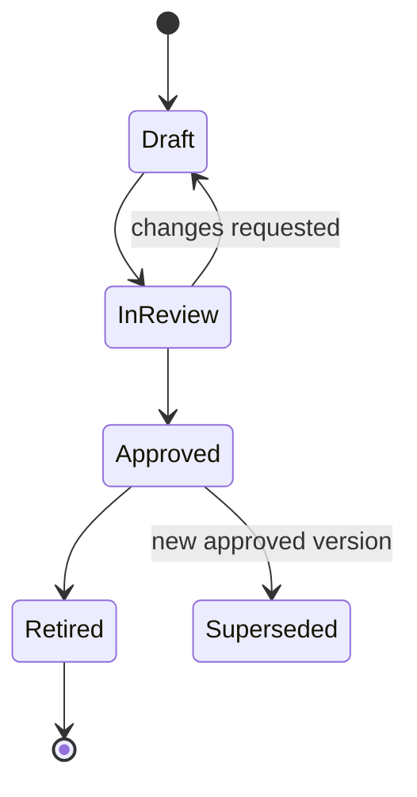

# Metric Definition Registry

## Purpose

A metric is not merely a SQL expression or dashboard label. It is a governed, versioned contract tying an approved business definition to source events, calculation code, quality rules, scope, and presentation.

The JSON Schema is in `contracts/metric-definition.schema.json`.

## Registry principles

1. Metric definitions are versioned and immutable after approval.
2. A new formula, denominator, exclusion, or threshold creates a new version.
3. The first slice uses code-owned calculators referenced by `calculationRef`; it does not execute arbitrary user-authored SQL.
4. Workbook-derived formulas remain `DRAFT` until operator and metric-owner validation.
5. Every snapshot records metric key/version, numerator/denominator where applicable, source watermark, calculation run, quality, suppression, and correction lineage.
6. A dashboard cannot silently substitute a newer definition into a historical snapshot.
7. No benchmark or improvement comparison is displayed without approved baseline/cohort definitions.

## Definition lifecycle



The first slice may store definitions as checked-in JSON/TypeScript with read-only database metadata. Approval commands can be added later.

## Proposed definition contract

> **Code status:** Proposed and unverified.

```ts
export interface MetricDefinition {
  metricKey: string;
  version: string;
  name: string;
  description: string;
  status: "DRAFT" | "IN_REVIEW" | "APPROVED" | "RETIRED";
  ownerRole: string;
  stewardUserId: string | null;
  reviewerUserId: string | null;
  effectiveStart: string | null;
  effectiveEnd: string | null;

  subjectArea: "UTILIZATION_REVIEW" | "OPERATIONS" | "QUALITY" | "FINANCE";
  valueType: "COUNT" | "RATE" | "DURATION" | "CURRENCY" | "PERCENT";
  unit: string;
  grain: Array<"DAY" | "WEEK" | "MONTH" | "FACILITY" | "PROGRAM" | "UNIT" | "PAYER">;

  numerator: MetricTerm;
  denominator: MetricTerm | null;
  inclusions: MetricFilter[];
  exclusions: MetricFilter[];
  sourceEventTypes: string[];
  sourceFactTables: string[];

  calculationRef: string;
  calculationVersion: string;
  requiredQualityStates: string[];
  lateArrivalPolicyRef: string;
  suppressionPolicyRef: string | null;
  minimumDenominator: number | null;

  display: {
    emptyState: "NO_MEASUREMENTS_FOUND";
    insufficientDenominatorLabel: string;
    caveat: string | null;
  };

  governance: {
    approvedAt: string | null;
    evidenceRefs: string[];
    changeSummary: string;
  };
}
```

## First-slice metric set

### 1. Approved patient days

| Field | Proposed definition |
|---|---|
| Key | `ur.approved_patient_days` |
| Version | `1.0.0-draft` until steward approval |
| Grain | service date × organization/facility/program/unit/payer |
| Numerator | count distinct eligible `episode_day_id` where `patient_day=true` and active `coverage_status=APPROVED` |
| Denominator | none |
| Exclusions | superseded/corrected-out events, non-patient days, unresolved conflicting decisions, policy-excluded facts |
| Source | admission/episode-day events + authorization day decisions |
| Caveat | At-risk flags can overlap these approved days |

### 2. Denied patient days

| Field | Proposed definition |
|---|---|
| Key | `ur.denied_patient_days` |
| Numerator | count distinct eligible patient episode days with active `coverage_status=DENIED` |
| Denominator | none |
| Required data | explicit denied date range/day decision |
| Exclusions | a denial count without date allocation; ambiguous overlap; superseded outcomes |
| Denial category | controlled dimension; no free text |

### 3. Pending patient days

| Field | Proposed definition |
|---|---|
| Key | `ur.pending_patient_days` |
| Numerator | count distinct eligible patient episode days covered by an active pending review/request range with no approved or denied active decision |
| Denominator | none |
| Caveat | Pending is not equivalent to denial |

### 4. Expired patient days

| Field | Proposed definition |
|---|---|
| Key | `ur.expired_patient_days` |
| Numerator | count distinct eligible patient episode days after the latest active approved-through date where authorization is required and no active pending/approved/denied decision covers the date |
| Denominator | none |
| Caveat | Exact rule must be validated against payer/workflow policy |

### 5. At-risk patient days

| Field | Proposed definition |
|---|---|
| Key | `ur.at_risk_patient_days` |
| Numerator | count distinct eligible patient episode days with one or more approved risk codes |
| Risk codes | review due/overdue, authorization expires soon/expired, documentation gap, source disagreement, data incomplete |
| Denominator | none |
| Overlap | explicitly overlaps approved/denied/pending/expired outcome counts |
| Threshold | versioned configuration referenced by definition |

### 6. Open documentation gaps

| Field | Proposed definition |
|---|---|
| Key | `ur.open_documentation_gap_count` |
| Grain | point-in-time snapshot × scope/category |
| Numerator | count active gaps in `OPEN`, `ACKNOWLEDGED`, `IN_PROGRESS`, `DISPUTED`, or `REOPENED` |
| Exclusions | resolved, cancelled, superseded |
| PHI | category only; no operational summary in mart |

### 7. Concurrent reviews due

| Field | Proposed definition |
|---|---|
| Key | `ur.concurrent_reviews_due_count` |
| Numerator | count open episode authorizations with next concurrent review due in the approved look-ahead window or overdue |
| Deduplication | one count per episode authorization, not one per queue reason |
| Threshold | definition/config version |
| Exclusions | closed/superseded authorization or accepted correction removing due date |

### 8. Denied decisioned-day rate

| Field | Proposed definition |
|---|---|
| Key | `ur.denied_decisioned_day_rate` |
| Status | `DRAFT — Needs decision` |
| Numerator | denied patient days |
| Denominator | approved + denied patient days |
| Reason for separate name | avoids claiming the source workbook's ambiguous requested/reviewed denominator |
| Minimum denominator | Needs decision |
| UI | do not display until definition is approved |

The source material calls for `denial rate = denied days / requested_or_reviewed_days`. That denominator is not precise enough for implementation. Tyler and the metric owner must approve one denominator or keep multiple distinctly named rates.

## Coverage-status derivation pseudocode

> **Code status:** Proposed and unverified.

```ts
function deriveCoverageStatus(input: ActiveAuthorizationFacts): CoverageStatus {
  if (input.hasConflictingDecisionOverlap) return "UNKNOWN";
  if (input.deniedRanges.cover(input.serviceDate)) return "DENIED";
  if (input.approvedRanges.cover(input.serviceDate)) return "APPROVED";
  if (input.pendingRanges.cover(input.serviceDate)) return "PENDING";
  if (input.requirement === "NOT_REQUIRED") return "NOT_REQUIRED";
  if (input.requirement === "REQUIRED" && input.latestApprovedEnd < input.serviceDate) {
    return "EXPIRED";
  }
  if (input.requirement === "REQUIRED") return "UNREQUESTED";
  return "UNKNOWN";
}
```

The exact precedence for overlapping partial decisions is a governance decision; conflicting overlap should be quarantined in V1.

## Metric calculation output

```ts
export interface MetricCalculation {
  metricKey: string;
  definitionVersion: string;
  organizationId: string;
  facilityId: string | null;
  programId: string | null;
  unitId: string | null;
  periodStart: string;
  periodEnd: string;
  grain: string;
  value: number | null;
  numeratorValue: number | null;
  denominatorValue: number | null;
  status:
    | "CALCULATED"
    | "NO_MEASUREMENTS_FOUND"
    | "INSUFFICIENT_DENOMINATOR"
    | "SUPPRESSED"
    | "PENDING_REVIEW";
  sourceWatermark: string | null;
  sourceFactCount: number;
  qualityState: string;
  suppressionPolicyVersion: string | null;
  recomputeRunId: string;
  calculatedAt: string;
}
```

## Snapshot immutability

A recalculation creates a new snapshot row/version. The prior snapshot is linked through a `metric_snapshot_lineage` or `supersedes_snapshot_id` relation and remains available for audit. Ordinary dashboard queries select the latest eligible active snapshot.

## Recalculation triggers

- governed correction or reversal;
- late event accepted;
- data-quality issue resolved;
- source mapping version change;
- metric-definition version approval;
- timezone/facility hierarchy correction;
- explicit authorized backfill;
- projector version change.

Every trigger creates a `MetricRecomputeRun` with scope, period, reason, definition versions, requester/source, counts, result, and errors.

## Freshness

Metric freshness is measured from:

- maximum eligible event `recordedAt`/sequence included;
- projector checkpoint;
- metric calculation time;
- expected source cadence.

A recent calculation over incomplete sources is not `COMPLETE`. Freshness and completeness remain separate fields.

## Suppression

Suppression is applied after calculation and before API response/export.

**Needs decision:** threshold and policy. Until approved:

- ordinary within-organization operational aggregate may be enabled only under approved internal policy;
- cross-organization and agency outputs remain disabled;
- the API returns `SUPPRESSED` rather than a hidden numeric value;
- totals and complementary categories must not reveal the value.

## Definition storage strategy

### First slice

- checked-in validated JSON/TypeScript definitions;
- database registry row or build manifest containing hash/version/status;
- calculator implementations in `packages/analytics-service`;
- tests tie expected fixtures to definition version.

### Later

- governed registry UI;
- approval workflow;
- impact analysis;
- export compatibility;
- optional declarative measure layer after security review.

Do not permit arbitrary SQL or formulas supplied through the browser.

## Example definition

```json
{
  "metricKey": "ur.approved_patient_days",
  "version": "1.0.0-draft",
  "name": "Approved patient days",
  "description": "Distinct eligible patient episode days with an active approved authorization outcome.",
  "status": "DRAFT",
  "ownerRole": "UR_METRIC_STEWARD",
  "stewardUserId": null,
  "reviewerUserId": null,
  "effectiveStart": null,
  "effectiveEnd": null,
  "subjectArea": "UTILIZATION_REVIEW",
  "valueType": "COUNT",
  "unit": "patient_day",
  "grain": ["DAY", "FACILITY", "PROGRAM", "UNIT", "PAYER"],
  "numerator": {
    "fact": "fact_episode_day_authorization",
    "operation": "COUNT_DISTINCT",
    "field": "episode_day_key",
    "filters": [
      {"field": "patient_day_flag", "operator": "EQ", "value": true},
      {"field": "coverage_status", "operator": "EQ", "value": "APPROVED"}
    ]
  },
  "denominator": null,
  "inclusions": [],
  "exclusions": [
    {"field": "metric_eligibility", "operator": "NEQ", "value": "ELIGIBLE"},
    {"field": "quality_state", "operator": "IN", "value": ["QUARANTINED", "REJECTED"]}
  ],
  "sourceEventTypes": [
    "ADMISSION_RECORDED.v1",
    "EPISODE_DAY_OPENED.v1",
    "AUTHORIZATION_DAY_DECISION_RECORDED.v1"
  ],
  "sourceFactTables": ["analytics.fact_episode_day_authorization"],
  "calculationRef": "urApprovedPatientDays",
  "calculationVersion": "1",
  "requiredQualityStates": ["VALID", "VALID_WITH_WARNINGS"],
  "lateArrivalPolicyRef": "ur.standard.v1",
  "suppressionPolicyRef": null,
  "minimumDenominator": null,
  "display": {
    "emptyState": "NO_MEASUREMENTS_FOUND",
    "insufficientDenominatorLabel": "Not applicable.",
    "caveat": "At-risk flags may overlap approved days."
  },
  "governance": {
    "approvedAt": null,
    "evidenceRefs": [],
    "changeSummary": "Initial proposed definition; operator validation required."
  }
}
```
