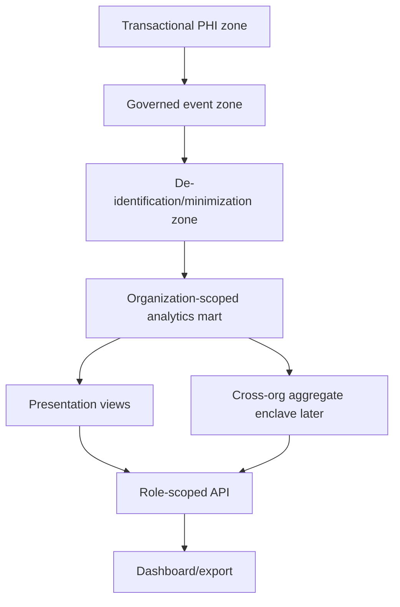
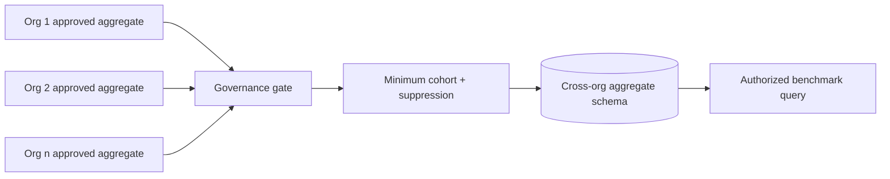

# Analytics Mart and De-identification

## Design goal

Create reusable, versioned utilization-review facts without copying operational identity or free-text PHI into aggregate dashboards. The mart is a derived product. It can be dropped and rebuilt from eligible governed events and canonical operational state.

The proposed SQL is in `schema/proposed-analytics-blueprint.sql`.

## Data zones



### Zone 1 — Transactional PHI

Authoritative operational state. Contains only data required for episode/UR work and source provenance.

### Zone 2 — Governed events

Immutable canonical envelopes. Some events are PHI-bearing; access is restricted. Event classification and field-level mapping determine what may pass downstream.

### Zone 3 — De-identification/minimization

A worker:

- selects allowlisted fields;
- maps canonical dimensions;
- tokenizes episode/person identifiers;
- removes or generalizes direct identifiers;
- applies date/geography policy;
- evaluates quality and metric eligibility;
- records transformation version and source lineage.

### Zone 4 — Organization-scoped mart

De-identified/pseudonymized facts protected by organization scope and analytics DB roles. Exact service date may be retained only under an approved internal analytics policy.

### Zone 5 — Presentation views

Approved metric/query views with suppression, freshness, quality, and definition metadata.

### Zone 6 — Cross-organization aggregate enclave

Disabled. When approved, it receives pre-aggregated facts only, no episode/person tokens.

## Operational-to-mart field policy

| Operational field | Mart treatment | Rationale |
|---|---|---|
| patient name | drop | direct identifier |
| MRN | drop | direct identifier |
| DOB | drop; later approved age band only | minimum necessary |
| address/contact | drop | not needed for UR slice |
| member/group/policy number | drop | not needed for metrics |
| case ID | do not expose; optional internal lineage token | access-domain identifier |
| episode ID | HMAC token/surrogate key | supports distinct-day/episode facts |
| person identity ID | optional HMAC token if approved | not needed for V1 metrics |
| organization/facility/program/unit | mapped surrogate + organization scope | grouping/authorization |
| payer ID/name | organization mapping or approved payer dimension | grouping; prevent source leakage |
| service date | exact internally or generalized per policy | day metrics require date |
| admission/discharge time | derive dates/durations, do not expose raw timestamp by default | minimization |
| review due/decision time | derive date/lag/bucket; exact operational time stays PHI zone | metric purpose |
| gap category | controlled code | aggregate allowed |
| gap summary/narrative | drop | potential PHI/free text |
| actor user ID/name | drop; role/category or source kind only | workforce identity not required |
| payer representative | drop | not required |
| source system | controlled code | quality/provenance |
| event ID | internal lineage key, not dashboard identifier | recomputation/audit |
| correction reason text | drop; reason code only | potential PHI |
| quality/review/eligibility | retain controlled states | trustworthy metrics |

## Tokenization contract

> **Proposed and unverified.**

```ts
interface TokenizationInput {
  organizationId: string;
  domain: "EPISODE" | "PERSON";
  sourceIdentifier: string;
  tokenVersion: string;
}

interface TokenizationOutput {
  token: string;
  tokenVersion: string;
}
```

Recommended construction properties:

```text
HMAC(approved-key-version,
     organizationId || "|" || domain || "|" || sourceIdentifier)
```

- use an approved cryptographic library and KMS-managed key;
- never use a plain unsalted hash;
- do not store the key with the database;
- record only token version in the mart;
- do not expose a reverse lookup to analytics users;
- use a separate purpose/key for cross-organization processing if ever approved.

Exact algorithm, key rotation, and de-identification standard require security/privacy approval.

## Mart grain

### `fact_episode_day_authorization`

One row per organization × episode token × service date × active projection version.

Fields:

- organization/facility/program/unit/date/payer keys;
- episode-day surrogate;
- patient-day flag;
- coverage status;
- risk flags as booleans or controlled bridge;
- approved-through date bucket;
- review due bucket;
- open gap count;
- source event watermark;
- quality state;
- metric eligibility;
- de-identification policy version;
- projection/derivation version;
- valid-from/valid-to or active flag for correction lineage.

### `fact_authorization_review`

One row per active review version.

- review type;
- requested date range length;
- decision status;
- approved/denied/pending day counts derived from ranges;
- due/recorded/decision lag buckets;
- denial category;
- source kind;
- quality/eligibility;
- correction lineage.

### `fact_documentation_gap`

One row per gap lifecycle or event.

- controlled category;
- status;
- open/resolved dates or age bucket;
- originating review;
- assigned role category;
- resolution code;
- no summary text;
- quality/eligibility.

### `metric_snapshot`

One row per metric definition version × scope × period × dimensional grain × calculation run.

## Dimensions

| Dimension | Scope |
|---|---|
| `dim_organization` | tenant surrogate; no cross-org query without grant |
| `dim_facility` | organization-owned; SCD/version fields |
| `dim_program` | organization/facility-owned |
| `dim_unit` | optional, organization/facility/program-owned |
| `dim_date` | calendar/fiscal attributes; facility timezone handled before load |
| `dim_payer` | organization mapping to controlled category; global mapping is a decision |
| `dim_level_of_care` | controlled contract values |
| `dim_gap_category` | controlled versioned category |
| `dim_denial_category` | controlled versioned category |
| `dim_source_system` | source/adapter quality analysis |
| `dim_metric_definition` | key/version/status/hash |

## Slowly changing dimensions

Facility/program/unit/payer mappings can change. Facts must retain the dimension version effective at the event/service date or the mapping/recompute version.

**Proposed:** Type-2-style effective ranges for organizational dimensions. A correction to a mapping triggers only the affected scope/period recomputation.

## Mart write contract

Only the analytics worker role may write mart tables.

```ts
interface MartProjectionInput {
  governedEventId: string;
  eventSequence: bigint;
  activeEventChainHash: string;
  organizationId: string;
  deidentificationPolicyVersion: string;
  mappingProfileVersions: string[];
  projectionVersion: string;
}
```

Before commit:

- event is active and eligible;
- organization/scope mapping exists;
- allowlist transformation succeeds;
- no prohibited fields are present;
- tokenization succeeds;
- quality state is permitted;
- processed-event uniqueness prevents duplicate facts.

## Prohibited mart payload check

Add a defensive allowlist and a CI/runtime test that rejects column/property names matching prohibited categories, including:

```text
name, first_name, last_name, mrn, dob, birth, address, phone, email,
member_id, policy_number, group_number, note_text, narrative,
document_text, legal_document, source_payload, token_hash
```

This heuristic is not the only privacy control, but it catches accidental schema drift.

## Metric views

The metric service should read approved views or repositories, not ad hoc dashboard SQL.

Examples:

- `analytics.v_ur_approved_patient_days`
- `analytics.v_ur_denied_patient_days`
- `analytics.v_ur_pending_patient_days`
- `analytics.v_ur_expired_patient_days`
- `analytics.v_ur_at_risk_patient_days`
- `analytics.v_ur_open_documentation_gaps`
- `analytics.v_ur_concurrent_reviews_due`

The exact implementation may be TypeScript calculators over fact repositories for V1. View names are proposals.

## Correction history in the mart

Do not overwrite the only copy of an old fact.

Two acceptable designs:

1. effective-dated fact versions with `is_current`; or
2. immutable fact rows plus an active-fact view resolved from lineage.

The proposed SQL uses immutable fact versions and lineage/current-selection views. Runtime roles cannot delete historical facts.

## Recompute model

### Recompute run

Fields:

- run ID;
- reason code;
- requested by actor/source/system;
- organization/scope;
- period;
- metric keys/versions;
- minimum and maximum event sequence;
- projection/calculator versions;
- started/completed;
- status;
- rows read/written/superseded;
- quality issues;
- error code;
- prior run/snapshot lineage.

### Scope selection

A correction to one review should recalculate:

- affected episode days;
- affected queue item;
- affected facility/program/unit/payer daily facts;
- metric periods containing those dates;
- no unrelated tenant or period.

### Exactly-once effect

Recompute may run more than once. Snapshot uniqueness includes run/definition/scope/period/dimensions, and the active snapshot pointer/view is advanced transactionally.

## Freshness and completeness

### Freshness

Derived from:

- latest governed event sequence available;
- latest projected sequence;
- latest mart sequence;
- latest metric snapshot sequence/time.

### Completeness

Derived from expected sources/coverage:

- native workflow coverage;
- expected external source cadence later;
- unresolved quarantine;
- missing facility/program mapping;
- eligible versus excluded fact count.

A query can be fresh and partial, or stale and complete.

## No-measurement semantics

A metric has `NO_MEASUREMENTS_FOUND` when:

- no eligible source facts exist for scope/period; or
- the metric definition is approved but no facts meet inclusion.

It is not converted to numeric zero.

`INSUFFICIENT_DENOMINATOR` applies to a rate with eligible facts but denominator below the approved threshold.

`SUPPRESSED` applies after calculation due to policy.

`PENDING_REVIEW` applies when unresolved quality/governance issues prevent publication.

## Small-cell and complementary suppression

**Needs decision.** The policy must define:

- threshold by data class/use;
- whether same-organization operational aggregates require suppression;
- complementary suppression;
- totals/subtotals behavior;
- time-series inference;
- export behavior;
- authorized override, if any;
- policy version.

The API must not reveal suppressed values through error messages, metadata counts, chart scales, totals, downloads, or drill-down.

## Cross-organization aggregate design

Default: no rows, no route, no permission.

When approved:



The cross-org schema receives:

- metric key/version;
- generalized period;
- approved cohort dimensions;
- aggregate numerator/denominator/value;
- contributing organization count;
- quality/completeness bands;
- suppression status.

It does not receive episode/person tokens or ordinary facility identifiers unless specifically authorized.

## Agency export design

A future export uses:

1. approved report definition;
2. approved metric/field definitions;
3. exact jurisdiction/version;
4. approved scope/period;
5. de-identification/minimum-necessary transform;
6. validation;
7. reviewer attestation;
8. generated artifact hash;
9. submission;
10. acknowledgement;
11. correction/resubmission lineage.

Exports read from the same governed metric/query layer as dashboards but may apply stricter field and suppression rules.

## Data retention

**Unknown and needs decision.**

Separate policies are required for:

- transactional PHI;
- governed events/audit;
- raw external receipts/payloads;
- quarantined data;
- pseudonymized mart facts;
- metric snapshots;
- exports/acknowledgements;
- synthetic fixtures.

No cleanup job should be added until retention, legal hold, deletion, and backup implications are approved.

## Why the supplied SQL blueprint is not used directly

The supplied blueprint is valuable for domains and grains but requires these corrections:

- add organization scope to tenant-owned rows;
- move patient identity out of analytics;
- replace authorization totals with review/day facts;
- add immutable event, quality, correction, and lineage;
- add metric definitions/versions/watermarks/suppression;
- add role/database boundaries;
- remove global timezone default;
- separate operational and mart responsibilities.
