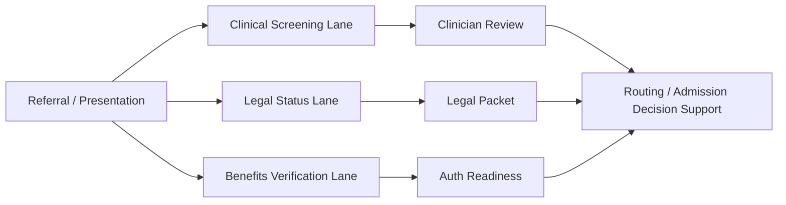

# EMTALA and Parallel Financial Lane

## Core rule

Clinical screening and stabilizing action must never be delayed because insurance is missing, unverified, out-of-network, or unfavorable.

## Product implication

The workflow must not be linear in a way that makes benefits verification a gate before clinical screening.

Instead:

## Hard UI guardrails

The system must not show:

- “Cannot screen until insurance is verified.”
- “Decline clinical review due to payer.”
- “No admission workup because benefits unknown.”

The system may show:

- “Benefits verification pending.”
- “Authorization required after clinical determination.”
- “Financial risk flag: does not block emergency screening.”

## Audit fields

For every case:

- clinical screening start time
- benefits verification start time
- clinical reviewer decision time
- authorization submission time
- payer response time
- reason for delay if any

## Escalation triggers

- No clinical screen started within configured SLA.
- Financial lane is marked as blocking clinical lane.
- Walk-in crisis not assigned to clinician.
- Referral declined with insurance-only reason before screening.

These should alert Intake Director and Compliance.
