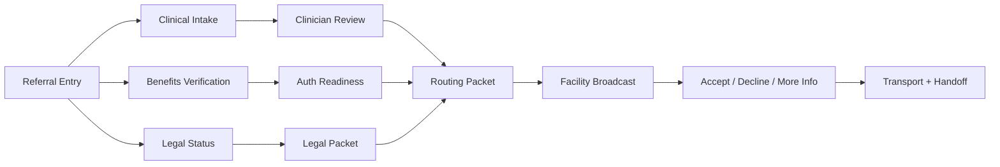

# Clinical Intake Workflow

## Product principle

Clinical screening and patient safety must move immediately. Insurance and benefits verification run in parallel and must never block emergency screening.

## Training and procedure protocol

Use `docs/workflows/assessment-training-protocol.md` as the staff-facing assessment procedure and training protocol. It provides pre-assessment, during-assessment, and post-assessment steps; script posture; EMR documentation expectations; EMTALA/Louisiana education topics; and competency-test coverage.

The protocol should inform guided-coach prompts, checklists, training mode, source-reference requirements, follow-up tasks, and case-presentation summaries.

## Workflow stages

### Stage 1 — Referral entry

Inputs:

- phone call
- walk-in
- ED referral
- police/officer referral
- mobile crisis referral
- behavioral hospital central intake inquiry
- therapist/PCP referral
- family/self referral

System actions:

- create IntakeCase
- capture referral source
- capture current patient location
- start SLA clocks
- assign owner
- open guided intake coach
- create audit event

### Stage 2 — Legal status determination

Options:

- voluntary
- voluntary but contested / uncertain
- OPC initiated
- PEC initiated
- CEC pending
- unknown

System actions:

- create legal-status checklist
- show deadline config
- flag missing legal documents
- prevent final packet lock when legal status is incomplete and required

### Stage 3 — Medical clearance / medical suitability

Capture:

- vitals
- labs if available
- active medical issues
- infection/isolation needs
- seizure risk
- fall risk
- oxygen/wound/catheter needs
- intoxication/withdrawal concerns
- medication list
- facility exclusion flags

System action:

- mark patient medically suitable, not suitable, or needs review
- create missing-data flags

### Stage 4 — Clinical screening / “laying eyes”

Capture:

- presenting crisis
- why now
- suicide/self-harm risk
- violence/homicide risk
- grave disability
- altered mental status
- psychosis/mania/severe depression
- orientation x4
- hallucinations: auditory, visual, olfactory, tactile if relevant
- paranoia/delusions
- sleep/eating pattern
- substance use
- functional decline
- willingness to accept help
- collateral reliability

System action:

- create structured Assessment
- create RiskFindings
- link SourceReferences
- update medical-necessity snapshot

### Stage 5 — Psychiatric/clinical review

Reviewer sees:

- assessment summary
- source references
- risk findings
- medical necessity snapshot
- legal status
- missing fields
- medical suitability
- lower LOC alternatives considered

Reviewer can:

- approve draft for routing
- request more info
- recommend alternative LOC
- sign/lock final clinical recommendation

### Stage 6 — Benefits verification lane

Runs in parallel.

Capture:

- payer
- plan type
- member ID
- authorization requirement
- deductible/copay/out-of-pocket if relevant
- out-of-network flags
- single case agreement need
- verification timestamp

Hard rule:

- Financial status must not block emergency medical screening or safety action.

### Stage 7 — Packet completion

Packet includes:

- referral source
- patient demographics / pseudonym
- legal status
- presenting crisis
- risk summary
- MSE summary
- medical suitability
- meds/substance use
- collateral
- medical necessity draft
- legal instrument if applicable
- custody hash
- audit summary

### Stage 8 — Matching and routing

System matches against:

- age group
- legal status accepted
- diagnosis/symptom fit
- acuity
- gender/roommate safety
- ADA/isolation needs
- payer
- medical exclusion criteria
- open program types

### Stage 9 — Transport coordination

Capture:

- transport mode
- escort requirement
- ETA
- medications during transport
- law enforcement hold info
- receiving contact

### Stage 10 — Admission and handoff

Capture:

- receiver identity
- receipt timestamp
- accepted packet version
- handoff summary
- initial safety precautions
- receiving nurse/therapist
- admission orders/MAR status if integrated later

## Parallel lanes

