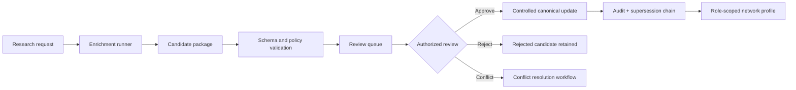
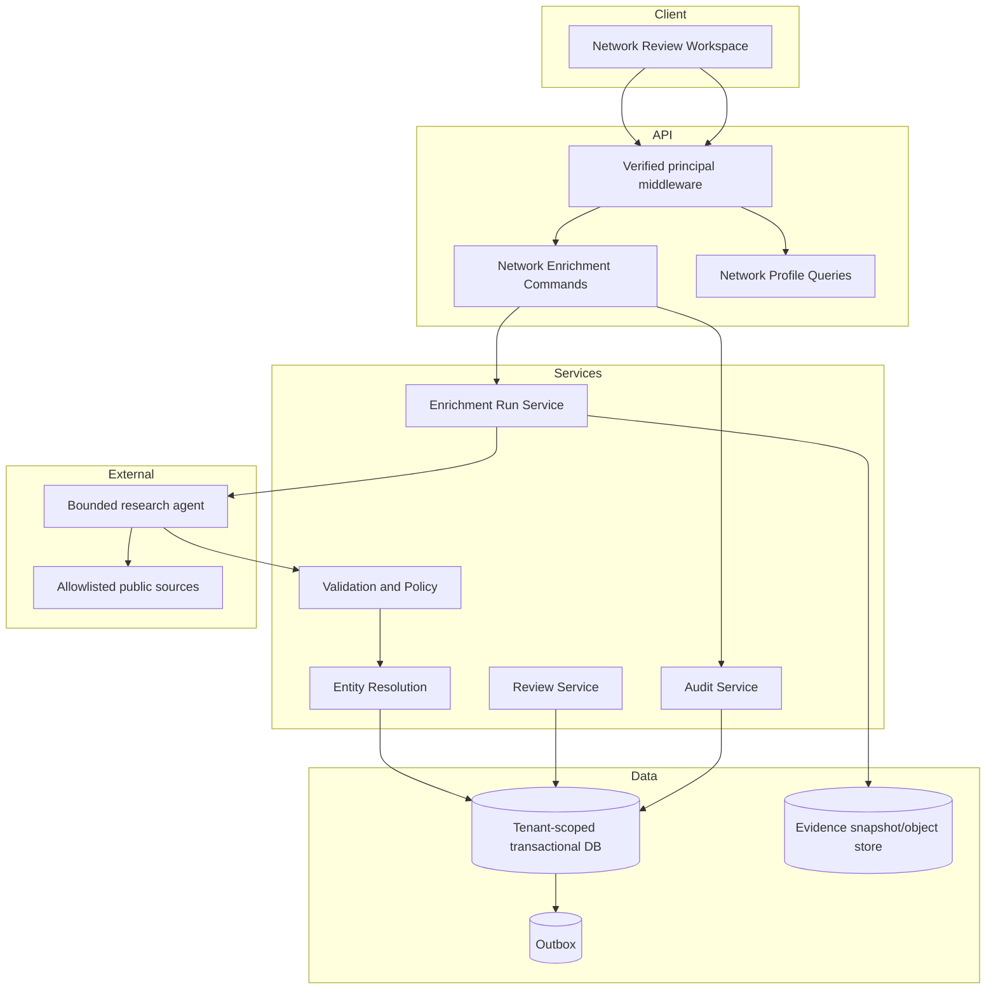

# Executive Architecture

## Recommended decision

Build Network Enrichment as a bounded, server-owned capability beside the existing evidence and controlled-command services.

## Why this architecture

A web page can be wrong, stale, scoped to the wrong campus, or written for marketing rather than operations. Accuracy therefore cannot be a single confidence score. It must be a governed chain:

`entity match → source authority → field scope → evidence → freshness → conflicts → reviewer authority → canonical command → audit`

## Production topology

## Bounded contexts

| Context | Responsibility | Must not do |
|---|---|---|
| Network Directory | Canonical organizations, locations, programs, contacts and relationships | Store unreviewed research as truth |
| Enrichment | Research runs, candidate fields, source evidence, conflicts, freshness | Approve its own findings |
| Review | Field-level approval, rejection, conflict resolution and supersession | Bypass role or tenant policy |
| Facility Configuration | Approved admission, lab, transport and documentation profiles | Treat public marketing text as enforceable policy |
| Routing | Use approved network data during case routing | Use stale or candidate-only criteria as final decision logic |
| Audit | Immutable command and review history | Store unrestricted page bodies, tokens or PHI |

## Deployment gates

Production use requires all of the following evidence:

- accepted API and hosting boundary;
- managed identity and verified-principal role derivation;
- tenant predicates plus tested RLS defense in depth;
- approved source allowlist and robots/terms review;
- security review of outbound browsing and stored evidence;
- human review permissions and denial tests;
- backup, restore, rollback and migration evidence;
- monitoring, rate limits, egress controls and incident runbooks;
- facility governance approval before operational criteria are activated.
