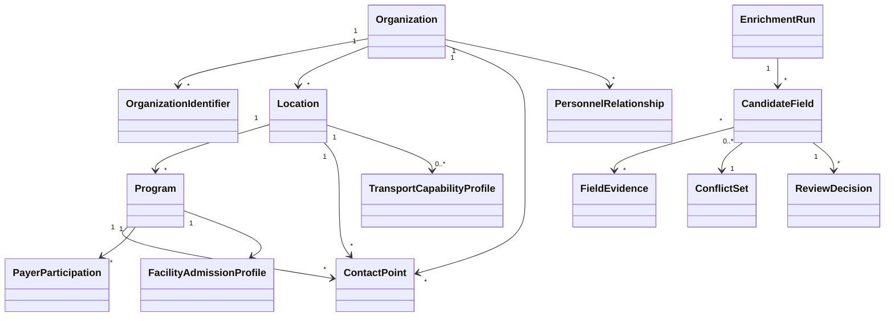

# Domain Model

## Aggregate boundaries

## Canonical objects

### Organization

Legal or operating entity. Holds names, organization type, ownership, status and parent relationships. It is not a physical campus.

### Location

A physical or virtual service location. Address, operating hours and contact details are scoped here.

### Program

A distinct level of care or service line at a location. Age ranges, payer participation and admission profiles should be program-scoped whenever possible.

### ContactPoint

Repeatable communication endpoint with department, channel, hours, scope and verification history. A single `phone` column is insufficient.

### FacilityAdmissionProfile

Versioned, reviewed configuration for acceptance authority, documents, labs, inclusion/exclusion criteria, legal status, guardian requirements and arrival instructions. Publicly discovered values remain candidates.

### TransportCapabilityProfile

Versioned, reviewed capability for ambulance, secure transport, law-enforcement handoff, wheelchair transport, custody requirements, service geography and hours.

## Enrichment objects

### EnrichmentRun

Immutable record of a research attempt: subject, requested scope, prompt/model/tool versions, source policy version, start/end time, status and correlation identifiers.

### CandidateField

One proposed change to one canonical field path. It contains current value, proposed value, normalized value, evidence, confidence, freshness, review route and operational-use state.

### FieldEvidence

Minimum-necessary source record. Includes source type, authority tier, URL, retrieval/effective dates, supported field paths, short excerpt or faithful summary, scope and hash.

### ConflictSet

Preserves competing values and their evidence. No automatic highest-score-wins resolution.

### ReviewDecision

Append-only decision: approve, reject, request clarification, resolve conflict, supersede or suspend. Includes actor, role, rationale, version and timestamp.

## Invariants

1. Every candidate value has at least one evidence record.
2. A human-confirmed value cannot be overwritten by an agent.
3. Sensitive facility criteria cannot become operational without an authorized review.
4. Conflicts remain visible until explicitly resolved.
5. Corrections preserve the old value and create a supersession chain.
6. Every tenant-owned record carries `organizationId` and every query predicates on it.
7. Unknown scalar values are `null`, never the string `Unknown`.
8. Payer participation is historical/publicly reported and not a payment guarantee.
