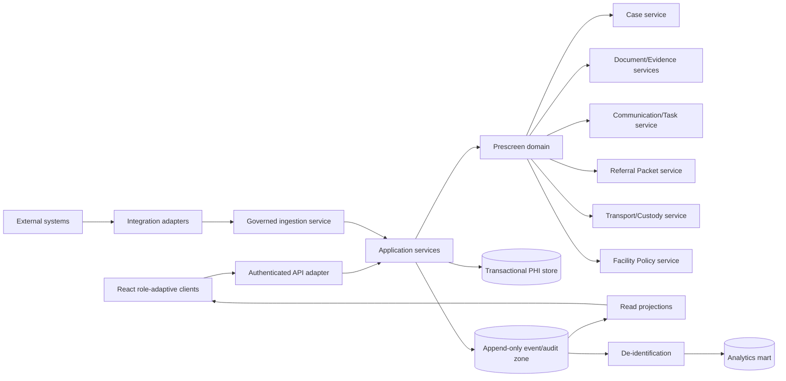

# System Architecture

## Recommended architecture

Preserve Clarity’s current TypeScript/React, domain-contract, service-package, Prisma, authenticated-principal, organization-scoped, idempotent-command, optimistic-concurrency, and append-only-audit patterns.

Add a **Prescreen bounded context** that connects to the existing Case, Document, Evidence, Legal, Benefits, Authorization, Packet, Routing, and Custody contexts through explicit contracts.

## Runtime responsibilities

### Browser/client

- render authorized projections;
- collect user input;
- hold only short-lived client state;
- submit commands with idempotency/correlation/version data;
- never decide authorization, rule eligibility, or transport qualification.

### API adapter

- authenticate session/token;
- derive actor and organization from verified principal;
- validate transport input;
- apply request size/rate/security controls;
- delegate to application service;
- map domain errors without adding business logic.

### Application services

- authorize capability and case relationship;
- load tenant-scoped state;
- evaluate approved rule profiles;
- execute domain command;
- commit state, idempotency, outbox, and audit atomically;
- return minimum-necessary response.

### Domain

- enforce state transitions and invariants;
- create immutable versions/supplements;
- calculate target-specific readiness;
- produce domain events;
- remain independent of Fastify, React, Prisma, FHIR, HL7, or hosting provider.

### Projection/query services

- create role-scoped case and queue projections;
- filter sensitive fields before data reaches the browser;
- include freshness, source, profile version, and correction indicators.

### Integration adapters

- translate external formats to canonical commands/events;
- preserve source identifiers and provenance;
- validate mappings and acknowledgements;
- never leak source-specific codes into the canonical domain without mapping.

## Persistence

Initial controlled pilot:

- one PostgreSQL database/shared schema;
- `organizationId` on every tenant-owned record;
- repository predicates plus planned RLS defense in depth;
- transactional outbox for durable integration/event publication;
- object storage for source documents;
- no raw documents in audit metadata.

## Scale path

The bounded contexts can remain packages in one deployable API initially. Separate runtime services only when workload, ownership, isolation, or deployment requirements justify the operational cost.
