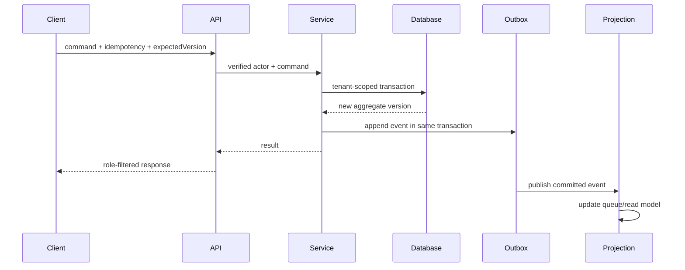

# Command, Event, and Query Flow

## Command pattern

```text
HTTP/integration request
  -> authenticate source
  -> derive organization/actor
  -> validate envelope
  -> authorize capability + case relationship
  -> load aggregate with organization predicate
  -> verify expected version/idempotency
  -> evaluate approved profiles
  -> execute deterministic transition
  -> transaction: state + audit + outbox + idempotency
  -> return role-filtered response
```

## Command envelope

- `commandId`
- `idempotencyKey`
- `correlationId`
- `causationId` when applicable
- `expectedVersion`
- client-recorded time when relevant
- command payload

Actor, role, and organization never come from client-controlled payload fields.

## Core commands

- `StartPrescreenEncounter`
- `SaveAssessmentDraft`
- `RecordSourceStatement`
- `RecordOrientationObservation`
- `RecordPatientWillingness`
- `AttestAssessmentVersion`
- `CreateAssessmentSupplement`
- `SubmitPrescreenToCentralIntake`
- `AcknowledgePrescreenSubmission`
- `RequestPrescreenInformation`
- `CompleteWorkflowTask`
- `CreateReferralPacketVersion`
- `RecordAuthorizedReview`
- `SubmitPacketToFacility`
- `RecordFacilityResponse`
- `CreateTransportPlan`
- `QualifyTransportProvider`
- `RecordCustodyEvent`
- `DraftFacilityProfile`
- `ApproveFacilityProfile`

## Event flow

Events use the schema in `contracts/prescreen-event-envelope.schema.json` and catalog in `contracts/event-catalog.md`.



## Query behavior

Queries require:

- verified principal;
- organization/facility/program/case relationship;
- purpose/capability;
- pagination and stable sort;
- field-level projection;
- freshness and last-event position;
- correction/supersession indicator;
- no existence leakage on denied access.

## Event correction

Events are append-only. A correction event references the prior event and creates a supersession chain. Projections recompute from the effective event set.
