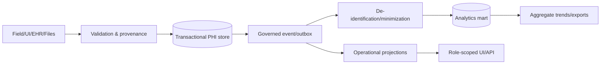

# Data Classification and Flow

## Data classes

| Class | Examples | Default handling |
|---|---|---|
| Restricted PHI | names, DOB, clinical narrative, instruments, documents, medications | transactional zone only; strict role/case scope |
| Sensitive operational | staff names, communications, tasks, transport details | tenant/case scope; minimized projections |
| Credential/compliance | licenses, contracts, insurance, provider restrictions | restricted administrative scope |
| De-identified operational | wait times, task counts, packet gaps | analytics mart with minimum cohort controls |
| Public/reference | generic templates, approved public guidance | controlled versioning |

## Flow

## Minimum necessary

- External assessor sees assigned prescreen and requests.
- Facility reviewer sees the packet and authorized review projection.
- Transporter sees transport authority, destination, necessary safety/medical details, and custody documents.
- Executive user sees aggregates, not patient names or narratives.

## De-identification

Needs an approved standard. At minimum:

- replace person identifiers with scoped tokens;
- remove narrative and document contents;
- generalize or suppress dates/locations where required;
- enforce small-cell suppression;
- separate re-identification keys;
- audit re-identification;
- version transformations.

## Late and corrected data

- preserve original event;
- append correction/supersession;
- recompute affected projections and metrics;
- display corrected-data indicator;
- avoid silent historical mutation.
