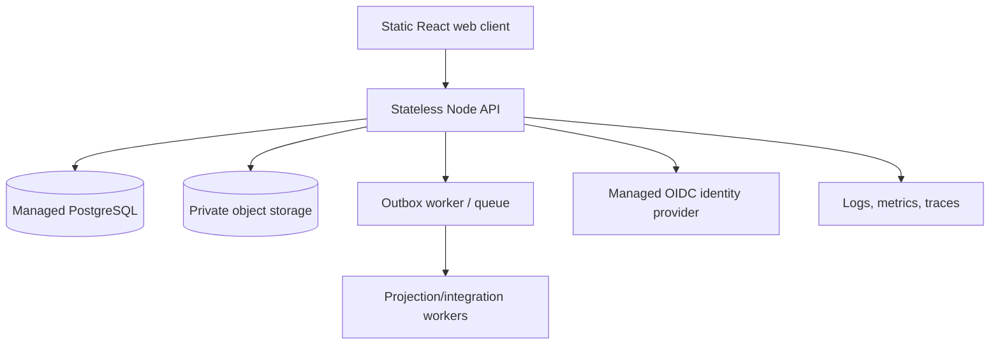

# Deployment and Runtime Options

## Recommended initial topology

## Provider neutrality

The topology may run on an approved cloud or private environment if it meets:

- data residency;
- network isolation;
- managed encryption;
- key/secret management;
- backup/restore;
- monitoring and alerting;
- availability and recovery objectives;
- signed agreements and operational ownership.

## Separation

- static client and API deploy separately;
- browser never connects to PostgreSQL;
- migrations run as explicit release jobs;
- workers consume an outbox/queue with idempotency;
- analytics storage is separate from transactional writes, even if initially in the same managed database cluster.

## Environments

- local development: synthetic data only;
- CI: ephemeral test database and object store stubs;
- integration: synthetic or approved de-identified data;
- staging: production-like controls, no uncontrolled PHI;
- production: only after all security, clinical, legal, privacy, and operational gates pass.

## Availability and offline

Field/offline support is an optional capability, not assumed. If approved:

- encrypted local storage;
- device/session binding;
- remote wipe/expiration;
- conflict resolution through expected versions;
- no attestation finalized without server acknowledgement unless an approved contingency procedure exists.

## Rollback

- application rollback independent of database rollback;
- backward-compatible schema for at least one application version;
- feature flag only for UI exposure, not as a substitute for server authorization;
- approved restore/replay plan for irreversible migrations;
- profile versions can be rolled back without rewriting historical evaluations.
