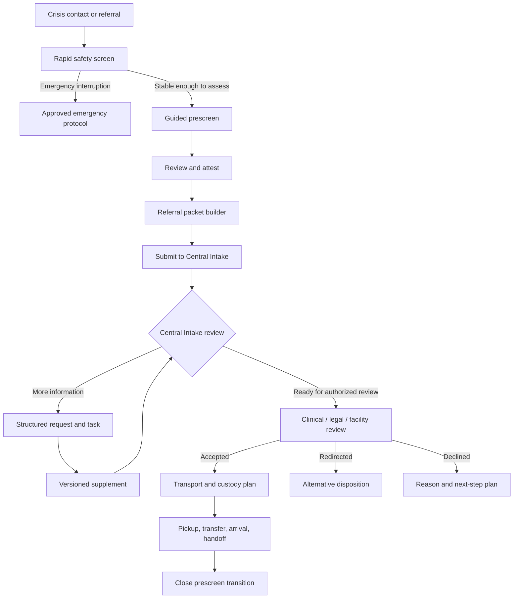

# End-to-End Workflow

## Overview

## Phase 1 — Rapid case start

Minimum fields:

- temporary or known person identity;
- encounter location;
- reporting organization and actor;
- referral source and callback;
- immediate concern;
- immediate medical/safety indicators;
- patient willingness state;
- known legal/custody state;
- whether an approved emergency protocol is active.

The system may save a minimal encounter before the full assessment. It must visually show that the record is incomplete.

## Phase 2 — Guided prescreen

The workflow captures:

- patient account;
- direct observations;
- collateral sources;
- presenting behaviors and timeline;
- danger-to-self, danger-to-others, and grave-disability facts;
- psychiatric, substance-use, medical, medication, and treatment context;
- orientation to person, place, time, and situation;
- willingness and objections;
- immediate supports and barriers;
- requested level of care or destination;
- unknown, not-assessed, and contradictory information.

Conditional questions open based on answers, but users can navigate directly to any authorized section.

## Phase 3 — Review and attestation

The assessor sees:

- generated summary;
- material source statements;
- unknowns;
- contradictions;
- high-risk answers;
- unanswered required questions;
- packet documents already attached;
- pathway and transport questions requiring another authority.

The assessor may edit the draft. Attestation locks the version. Later changes become a correction or supplement with reason and source.

## Phase 4 — Packet preparation

The packet workspace tracks:

- core generic requirements;
- facility/program requirements;
- conditional requirements;
- available/unavailable explanations;
- freshness and source;
- document version;
- reviewer acceptance for packet use.

Packet readiness means ready for the next human review. It does not equal admission acceptance.

## Phase 5 — Central Intake review

Central Intake:

1. acknowledges receipt;
2. verifies case and destination scope;
3. reviews source, missing items, and contradictions;
4. requests specific information through structured tasks;
5. routes medical, clinical, legal, benefits, and facility questions;
6. creates a review-ready packet version;
7. presents to the authorized practitioner or facility;
8. records the response and conditions.

## Phase 6 — Pathway determination

The product organizes but does not decide:

- possible formal voluntary;
- possible noncontested;
- possible emergency certificate;
- OPC examination path;
- continued emergency status;
- medical stabilization;
- community disposition;
- alternative level of care.

## Phase 7 — Transport and custody

Before dispatch, the server verifies:

- active instrument/status;
- destination confirmation;
- transport category allowed by the active profile;
- provider credential state and service area;
- medical and behavioral capability;
- required accompaniment and documents;
- sending and receiving approvals;
- custody transfer requirements.

## Phase 8 — Completion

Closeout records:

- outcome;
- destination or redirection;
- unresolved items transferred to another workflow;
- pickup/arrival/handoff;
- final packet version;
- final responsible organization;
- audit timeline.
