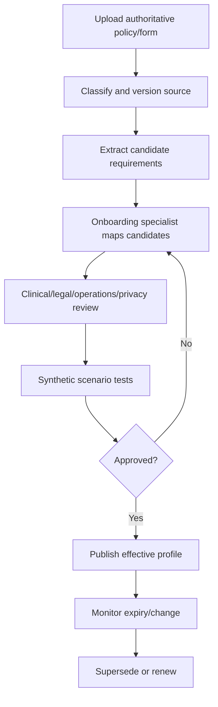

# Facility Configuration and Policy Ingestion

## Purpose

Clarity remains generic at the core. Each hospital or program supplies and approves its own operational profile.

## Configuration domains

- referral packet requirements;
- medical-clearance requirements;
- required labs and freshness;
- inclusionary/admitting criteria process;
- exclusionary criteria process;
- acceptance authority and delegation;
- noncontested-admission roles;
- minor and guardian rules;
- nursing-report requirements;
- consent/document signature rules;
- transport categories and exceptions;
- program, unit, age, and capability constraints;
- communication/escalation contacts;
- documentation and assessment requirements.

## Ingestion workflow

## Candidate extraction rules

AI or parsers may propose:

- requirement label;
- source quotation/location;
- requiredness;
- condition;
- freshness;
- blocking target;
- responsible role;
- exception process.

Candidate output remains `DRAFT_UNVERIFIED`. It cannot affect a live case until approved.

## Approval model

A profile may require separate approvals:

- clinical;
- legal;
- operational;
- privacy/security;
- transport;
- product configuration.

Activation requires all approval types named by the profile.

## Versioning

Every active rule stores:

- rule ID and version;
- facility/program/unit/jurisdiction scope;
- source document/version/page or section;
- effective and expiration dates;
- approvers;
- test evidence;
- superseded rule;
- rollback target.

Cases evaluate rules effective at the relevant event time. Corrections do not silently rewrite historical evaluations.

## Conflict handling

When sources disagree:

- show the conflict;
- block publication when material;
- identify the responsible approver;
- retain both sources;
- require a recorded resolution and effective date.
