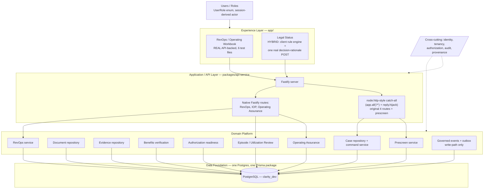

# Clarity — Current-State Architecture

> **PRESERVED 2026-09-18 (Housekeeping Phase 2B).** Extracted from the unmerged PR #73
> branch rather than merging that PR wholesale, because its only conflicting file
> (`IMPLEMENTATION_STATUS.md`) was rewritten by PR #101's truth repair. This document is a
> **2026-09-12 snapshot** taken against `main` at `15a094d`; treat its statuses, counts and
> file sizes as historical to that date, not as current capability. Corrections applied on
> extraction are marked inline as **[CORRECTED 2026-09-18]**. See
> [`../recovery/2026-09-18-housekeeping-phase-1-truth-reconciliation.md`](../recovery/2026-09-18-housekeeping-phase-1-truth-reconciliation.md).

Verified this session (root 755/755, app 132/132, lint/typecheck/`prisma validate`
clean). Shows only what is genuinely wired end-to-end today — a workspace box appears in
the Experience Layer only if it calls a real API; everything else is covered in
[CLARITY_EMERGING_STATE.md](CLARITY_EMERGING_STATE.md) instead. See
[CLARITY_ARCHITECTURE_LEDGER.md](CLARITY_ARCHITECTURE_LEDGER.md) for evidence per
component.

## What is deliberately absent from this diagram

- Every other Experience Layer surface (Case Queue, Command Center, Guided Intake,
  Evidence Review, Medical Necessity, Benefits Verification, Authorization Readiness,
  IOP Reconciliation, Packet Preview, Routing/Facility Response, Bedboard/Custody,
  Learning/Practice) — each reads/writes a local `localStorage` blob and is not connected
  to any API today. See DRIFT-11 in
  [ARCHITECTURE_DRIFT_REGISTER.md](ARCHITECTURE_DRIFT_REGISTER.md).
- Document repository, Evidence repository, Benefits, Authorization, Episode/UR, and
  Prescreen backend packages exist and pass their own integration tests, but are not
  reachable from any frontend surface today except through direct API calls a real user
  never makes — they appear in DOMAIN because they're real, tested, persisted capability,
  not because a user can exercise them through the product.
- Any event delivery outside the same process, any external system, any production
  infrastructure — none of it exists yet (see
  [PRODUCTION_READINESS_MATRIX.md](PRODUCTION_READINESS_MATRIX.md)).
