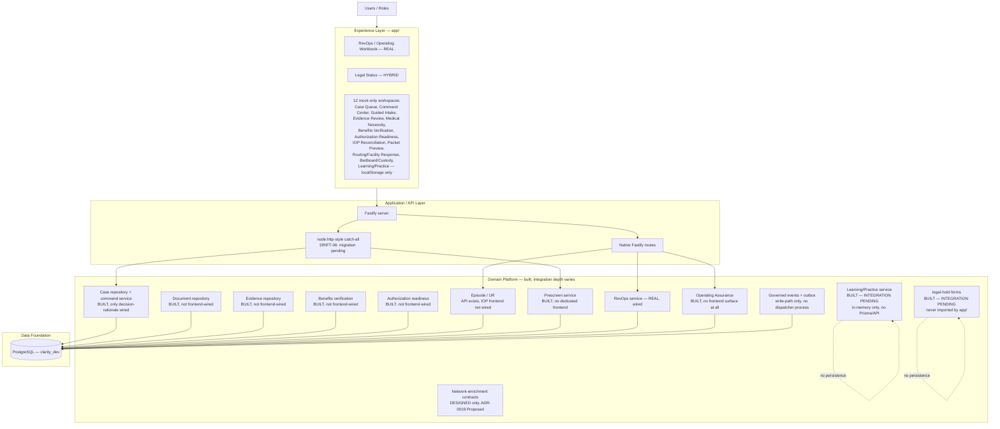

# Clarity — Emerging-State Architecture

Current state ([CLARITY_CURRENT_STATE.md](CLARITY_CURRENT_STATE.md)) plus every
component that is genuinely built and tested but not yet integrated into the live
product, plus partial/hybrid pieces. This is the "what already exists, waiting to be
connected" picture — not a proposal for new infrastructure.

## Integration-pending items, by evidence

| Component | Built? | Integration gap | Source |
| --- | --- | --- | --- |
| CLPR / Learning-Practice | Yes, 16/16 tests | No Prisma, no tenant context, no audit writer, no API; frontend uses a separate local mock, not this package | Ledger §10 |
| legal-hold-forms | Yes, tested | Never imported anywhere in `app/src` | Ledger §12 |
| 12 mock-only workspaces | Backend exists for most | No `domain/api.ts` import; single shared `localStorage` blob | DRIFT-11 |
| ADR-0012 routing | Partial | Catch-all routes need native Fastify registration | DRIFT-06 |
| Network-enrichment | Contracts only | No runtime slice built (PR #30 closed as superseded) | Ledger §13 |

## What this diagram does not add

No new infrastructure, no new services, no message broker, no external integration —
every box above already exists in the repository today. "Emerging" describes *reach*
(what could be connected with wiring work already scoped), not *new construction*.
