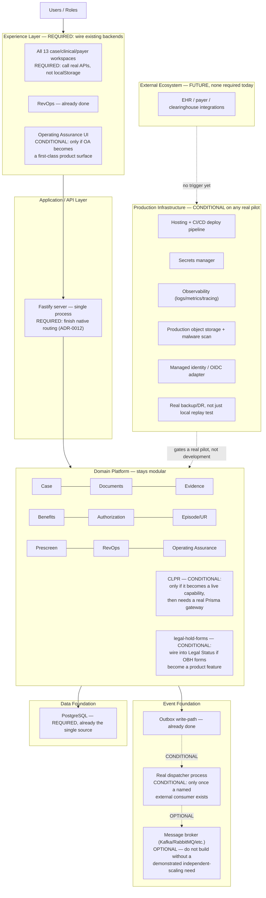

# Clarity — Target-State Architecture

> **PRESERVED 2026-09-18 (Housekeeping Phase 2B).** Extracted from the unmerged PR #73
> branch rather than merging that PR wholesale, because its only conflicting file
> (`IMPLEMENTATION_STATUS.md`) was rewritten by PR #101's truth repair. This document is a
> **2026-09-12 snapshot** taken against `main` at `15a094d`; treat its statuses, counts and
> file sizes as historical to that date, not as current capability. Corrections applied on
> extraction are marked inline as **[CORRECTED 2026-09-18]**. See
> [`../recovery/2026-09-18-housekeeping-phase-1-truth-reconciliation.md`](../recovery/2026-09-18-housekeeping-phase-1-truth-reconciliation.md).

Modular first, distributed only when justified. Every box below is labeled **REQUIRED**,
**CONDITIONAL**, or **OPTIONAL** — nothing speculative is marked REQUIRED. This is the
architecture necessary to support the product's own agreed build sequence (case
repository → command service → documents → evidence → benefits → authorization →
authentication → API → **UI** → controlled extraction → AI agents — the last three not
yet started), not a rewrite.

## Labeling detail

| Item | Label | Trigger |
| --- | --- | --- |
| Wire the 12 mock-only workspaces to real APIs | **REQUIRED** | This is the single biggest gap between "backend exists" and "product works" (DRIFT-11) — required for the product to be what its own status docs already imply it is. |
| Finish ADR-0012 native Fastify routing | **REQUIRED** | Already ruled by the owner; closes DRIFT-06. |
| Production object storage adapter + malware scanning | **CONDITIONAL** | Only required before any real (non-synthetic) document enters the system. |
| Managed identity/OIDC adapter | **CONDITIONAL** | Only required before production deployment with real users. |
| Real outbox dispatcher process | **CONDITIONAL** | Only required once a specific external consumer is named and authorized — no such consumer exists today (the "Bayside Hospital" name in the outbox decision doc is explicitly a placeholder, not a real integration). |
| Message broker (Kafka/RabbitMQ/Redis Streams/etc.) | **OPTIONAL, do not build** | No independent-scaling, workload-isolation, or reliability-isolation evidence exists anywhere in the repository. A single worker process is the correct next step if/when the CONDITIONAL dispatcher trigger fires — not a broker. |
| Hosting/CI-CD deploy pipeline, secrets manager, observability, real backup/DR | **CONDITIONAL** | All gate a real pilot; none gate continued development. See [PRODUCTION_READINESS_MATRIX.md](PRODUCTION_READINESS_MATRIX.md). |
| CLPR real persistence/API | **CONDITIONAL** | Only if CLPR graduates from training-simulation to a live product capability — an explicit product decision, not an engineering default. |
| legal-hold-forms wiring | **CONDITIONAL** | Only if OBH forms become a Legal Status product feature, not just a backend capability. |
| EHR/payer/clearinghouse/EDI integrations | **FUTURE** | No current evidence of need; not part of the agreed build sequence, which still has UI → controlled extraction → AI agents ahead of any external integration. |
| Microservice extraction of any domain | **not shown — none required** | See [SERVICE_EXTRACTION_MATRIX.md](SERVICE_EXTRACTION_MATRIX.md); every domain scores KEEP MODULAR today. |
