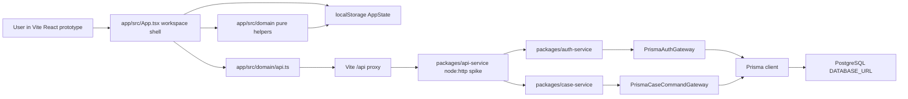
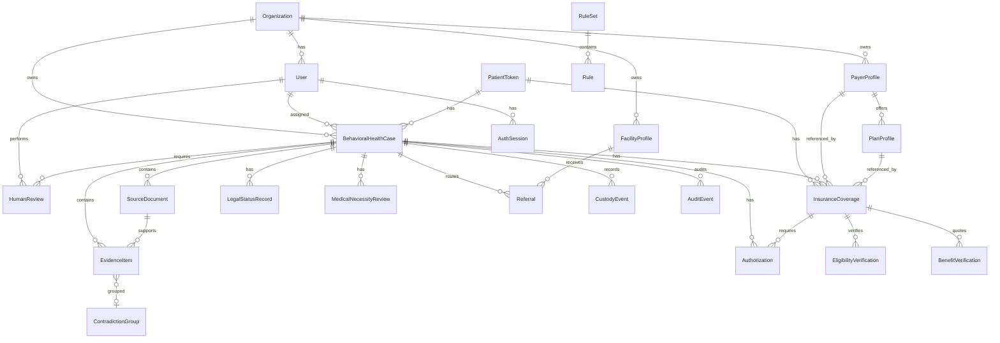
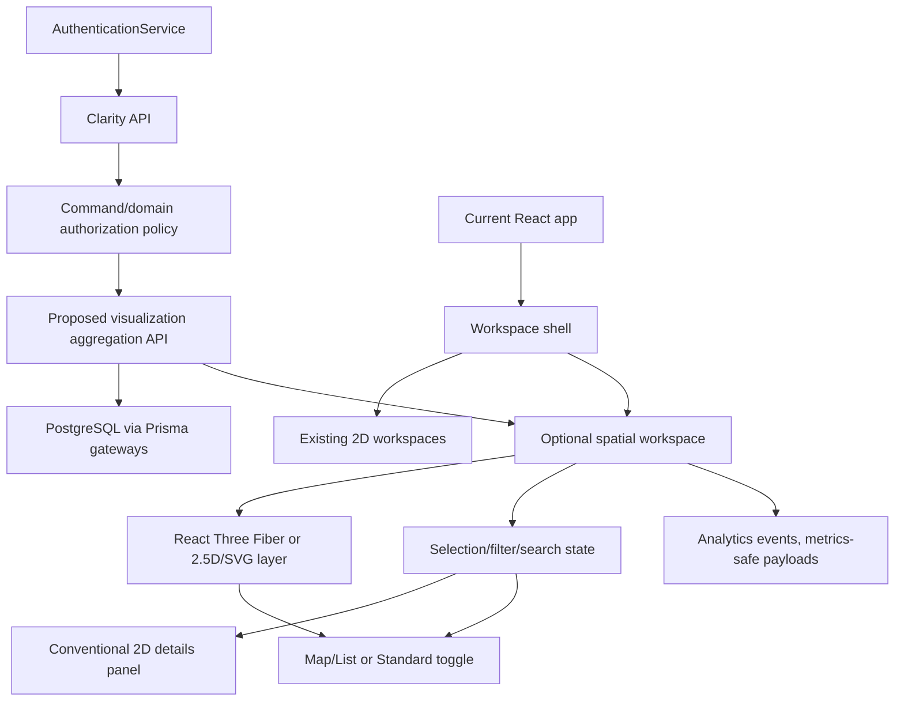

# Clarity Current State And Spatial Feasibility

Audit date: 2026-07-18  
Repository: `/Users/tylerhebert/Documents/clarity-platform`  
HEAD reviewed: `8af3e69d0f7d057d2ed903c78f3e7428b131e492`  
Remote: `https://github.com/henrytylerhebert-eng/clarity-platform.git`  

## Evidence Labels

- [Verified] Directly supported by code, docs, schema, tests, or observed local runtime behavior.
- [Inference] Reasonable interpretation from multiple evidence points, but not explicitly confirmed.
- [Unknown] Repository evidence is insufficient.
- [Conflict] Repository sources disagree or implementation and checks diverge.

## Executive Finding

[Verified] Clarity today is a synthetic, local behavioral-health crisis case-intelligence and access-orchestration prototype plus backend service foundations for a future tenant-scoped platform. The implemented product spine is case queue -> intake -> evidence -> medical/legal/benefits workstreams -> packet -> routing response -> custody ledger, with adjacent bedboard, training, mock-admit, and product-studio surfaces. Evidence: `README.md:3-13`, `README.md:40-56`, `README.md:133-142`, `docs/architecture/SYSTEM_ARCHITECTURE.md:43-49`, `app/src/App.tsx:65-83`, `app/src/App.tsx:695-728`.

[Verified] It is not a deployed clinical, legal, placement, payer, or PHI-ready system. Evidence: `README.md:5`, `README.md:58-66`, `README.md:126-131`, `docs/architecture/SYSTEM_ARCHITECTURE.md:45-49`, `app/src/workspaces/CaseQueue.tsx:9-12`.

[Inference] The core user value supported by the current implementation is helping qualified reviewers inspect one synthetic crisis case spine across fragmented clinical, legal, routing, custody, benefits, and placement work without retyping the case story. Evidence: `README.md:9-13`, `CommandCenter.tsx:8-72`, `PacketPreview.tsx:14-43`, `PacketPreview.tsx:48-100`, runtime observation that all 17 workspace buttons rendered at `http://127.0.0.1:5174/`.

Final recommendation: proceed with a smaller 2D or 2.5D visualization first, not a full Three.js environment. A hybrid "navigate relationships, work in conventional panels" prototype is plausible after API/relationship prerequisites are tightened. Evidence and rationale are in the spatial sections below.

## Repository Map

| Area | Classification | Current role | Evidence |
|---|---|---|---|
| `app/` | Source/presentation prototype | Vite + React + TypeScript single-page demo, localStorage-backed, plus one local API client | `README.md:72`, `app/package.json:1-30`, `app/src/App.tsx:85-151`, `app/src/domain/storage.ts:4-56` |
| `packages/domain-contracts/` | Source contracts | Shared roles, state machines, audit/readiness contracts | `README.md:73`, `packages/domain-contracts/package.json:1-10`, `caseStateMachine.ts:1-125`, `workstreams.ts:1-62` |
| `packages/*-service/` | Source service foundations | Case, document, evidence, benefits, authorization, auth, API, legal-hold form foundations | `README.md:74`, package descriptions in `packages/*/package.json`, `CaseCommandService.ts:58-76`, `api-service/src/server.ts:11-28` |
| `packages/case-repository/` | Source persistence adapter | Prisma-backed tenant-scoped gateways and audit/idempotency adapters | `packages/case-repository/package.json:1-11`, `prisma/schema.prisma:947-984` |
| `prisma/` | Source data model | Canonical PostgreSQL schema and migrations | `README.md:75`, `schema.prisma:1-8`, `schema.prisma:356-984` |
| `docs/` | Source/architecture docs | Canonical docs, ADRs, workflow, governance, product notes | `README.md:78-81`, `ARCHITECTURE.md:1-20` |
| `reference/` | Reference only | Immutable source packages and source documents, not canonical implementation | `README.md:83-84`, `AGENTS.md:13-18`, `README.md:126-131` |
| `data/synthetic-cases/` | Source fixtures | Validated synthetic fixtures | `README.md:76`, root tests `tests/data/synthetic-cases.test.ts` passed in verification |
| `data/mock-use-cohorts/` | Reference/training data | Mock-use cohort data separated from canonical seed data | `README.md:77`, `MockAdmitLab.tsx:59-67` |
| `reporting-metrics-rebuild-package/` | Reference/analysis | Reporting metrics analysis, not active product surface | `README.md:82`, `CommandCenter.tsx:66-71` |
| `graphify-out/` | Generated | Prior knowledge graph/cache output, not current app source of truth | file inventory found under `graphify-out/`; no app imports found during audit |
| `chatgpt-full-stack-analytics-handoff/` | Unknown/reference | Handoff material exists but is not part of runtime app path observed here | directory inventory; not linked from `App.tsx` |

[Conflict] Older architecture docs say "No backend, API, auth, or tenancy enforcement exists yet" while current implementation includes backend service foundations and an API spike. Evidence: `ARCHITECTURE.md:12-20` versus `docs/architecture/SYSTEM_ARCHITECTURE.md:45-49`, `packages/api-service/src/server.ts:11-28`, `packages/auth-service/src/authenticationService.ts:24-67`.

## What Clarity Is Today

One-sentence definition: [Verified] Clarity is a synthetic behavioral-health crisis case workflow prototype that organizes referral, intake, evidence, review, legal-status, benefits, packet, routing, custody, and placement information around one case spine.

One-paragraph definition: [Verified] Clarity is for crisis access, central intake, clinical reviewers, legal/compliance reviewers, benefits/UR staff, receiving facilities, charge nurses, and program leaders working around behavioral-health crisis referrals. It helps them inspect and update synthetic case data, source-linked risk findings, review-gated medical/legal drafts, packet readiness, simulated facility responses, custody events, benefits/authorization readiness, and milieu placement flags. It supports a reviewed handoff outcome, not autonomous clinical, legal, payer, placement, or admission decisions. Evidence: `README.md:27-39`, `README.md:40-66`, `roles.ts:40-136`, `App.tsx:695-728`.

Product narrative: [Verified] A user selects a demo role, chooses a case from the queue, captures or reviews intake facts, adds source-linked risk, inspects medical necessity and legal status drafts, generates a packet, simulates routing responses, verifies custody history, and may inspect related bedboard/training/product-studio views. Evidence: `App.tsx:577-654`, `App.tsx:695-728`, `GuidedIntake.tsx:63-248`, `PacketPreview.tsx:23-43`, `RoutingResponse.tsx:35-89`, `CustodyLedger.tsx:6-38`.

Core value proposition: [Inference] The implementation supports "capture the story once and make dependencies/review gates visible across handoff lanes." Evidence: `README.md:9-13`, `CommandCenter.tsx:8-72`, `CaseQueue.tsx:13-64`, `PacketPreview.tsx:48-100`.

## Current Architecture

[Verified] Frontend: Vite + React 19 + TypeScript with lucide icons and CSS, no URL router. `App.tsx` uses React state for selected workspace/role/case and renders workspaces conditionally. Evidence: `app/package.json:1-30`, `App.tsx:1-20`, `App.tsx:85-151`, `App.tsx:567-731`.

[Verified] Frontend state: the prototype persists `AppState` in `window.localStorage` under `clarity-intake-spine-v0.2`, falling back to in-memory storage when localStorage is unavailable. Evidence: `storage.ts:4-56`.

[Verified] API slice: the app has a `/api` Vite proxy to a local `packages/api-service` server on port 4315, and a client for login/logout/session plus `POST /api/cases/:caseKey/decision-rationale`. Evidence: `vite.config.ts:6-12`, `api.ts:1-12`, `api.ts:60-100`, `api-service/src/server.ts:11-28`, `api-service/src/server.ts:118-155`.

[Verified] Authentication slice: `AuthenticationService` verifies an assertion through an identity-provider port, issues opaque bearer tokens, stores only SHA-256 hashes, and derives command actors from authenticated principals. Evidence: `authenticationService.ts:24-67`, `api-service/src/server.ts:137-144`.

[Verified] Persistence: Prisma targets PostgreSQL via `DATABASE_URL`; schema includes organization, user, auth session, patient token, behavioral health case, documents, evidence, reviews, legal records, payer/plan/coverage/eligibility/benefits/authorization, facility/referral/custody/audit/idempotency models. Evidence: `schema.prisma:1-8`, `schema.prisma:356-984`.

[Verified] Services: case command service enforces Zod validation, role policy, rationale rules, tenant-scoped gateway transactions, state-machine validation, audit, and idempotency. Evidence: `caseCommandService.ts:58-76`, `caseCommandService.ts:80-287`.

[Verified] External integrations: no live EHR, CAD/RMS, payer, facility, bedboard, messaging, production identity, production storage, analytics vendor, queues, or realtime systems were found in the implemented app. Evidence: `README.md:58-66`, `README.md:139-141`, `docs/architecture/SYSTEM_ARCHITECTURE.md:49`.

[Verified] Visualization libraries: package manifests contain no Three.js, React Three Fiber, D3, Visx, Cytoscape, Mapbox, Leaflet, Recharts, chart, canvas, or WebGL runtime dependency. Evidence: dependency scan over `package.json`, `app/package.json`, and `packages/*/package.json`; manifests at `package.json:23-46`, `app/package.json:12-29`.

## Information Architecture And Screen Inventory

[Verified] There are no URL routes in the frontend. The product uses a stateful workspace switcher. Evidence: no `BrowserRouter`, `Routes`, or `Route` import in `app/src`; `workspaceItems` and conditional rendering in `App.tsx:65-83`, `App.tsx:695-728`.

| Workspace id | Screen | Purpose | Primary action | Data dependencies | Access model | Status | Evidence |
|---|---|---|---|---|---|---|---|
| `queue` | Case Queue | List synthetic cases with stage/risk/review/packet/routing/custody state | Select case | `AppState.cases`, assessments, risks, legal, packets, ledger | Demo role-visible | Functional but limited | `App.tsx:65-83`, `CaseQueue.tsx:6-67`; runtime rendered |
| `command` | Central Intake Command Center | Show operational lanes, clocks, escalation, feature map, roadmap board | Select/escalate by case | cases, encounters, assessments, clocks | Demo role-visible | Functional but limited | `CommandCenter.tsx:120-238`; runtime rendered |
| `new` | New Case | Create synthetic case and encounter | Create case | form state -> `AppState` | Demo role-visible | Functional prototype | `NewCase.tsx:4-112`, `App.tsx:157-214` |
| `overview` | Case Overview | Summarize selected case | Inspect | case bundle | Demo role-visible | Functional prototype | `App.tsx:699`; runtime rendered |
| `intake` | Guided Intake | Edit assessment and add source-linked risk | Update assessment, add risk | assessments, source refs, risk findings | Demo role-visible | Functional prototype | `GuidedIntake.tsx:13-248`, `App.tsx:216-260` |
| `evidence` | Evidence Review | Inspect evidence | Inspect | evidence/risk/source refs | Demo role-visible | Functional but limited | `App.tsx:701`; runtime rendered |
| `medical` | Medical Necessity | Review draft support/missing facts | Edit snapshot | medical necessity snapshot | Demo role-visible | Functional prototype | `App.tsx:702`, smoke test lines `clarity-v01.spec.ts:36-40` |
| `legal` | Legal Status | OPC/PEC/CEC lifecycle and backend rationale panel | Issue OPC, execute PEC/CEC, record rationale through API if signed in | legal instruments, clocks, referrals, API principal | Demo role plus verified backend for rationale | Mixed: rich prototype plus API slice | `LegalStatus.tsx:187-255`, `LegalStatus.tsx:290-724`, `api.ts:85-100` |
| `benefits` | Benefits Verification | Display coverage/eligibility/quote disclaimer | Inspect | derived coverage from local service helper | Demo role-visible | Functional but limited | `BenefitsVerification.tsx:23-88` |
| `authorization` | Authorization Readiness | Display payer authorization gaps | Navigate to benefits | derived coverage/readiness | Demo role-visible | Functional but limited | `AuthorizationReadiness.tsx:23-69` |
| `packet` | Packet Preview | Build/check referral packet and seal hash | Generate/send packet | assessment, risks, sources, medical, legal, packet builder | Demo role-visible | Functional prototype | `PacketPreview.tsx:14-104`, `App.tsx:451-521` |
| `routing` | Routing Response | Simulate facility response | Record mock response | facility referrals/responses | Demo role-visible | Functional prototype | `RoutingResponse.tsx:12-91`, `App.tsx:385-449` |
| `bedboard` | Milieu Bedboard | Show advisory placement fit and charge-nurse override | Accept/override placement | units, beds, placement recommendations | Demo role-visible | Functional prototype | `Bedboard.tsx:12-154`, `bedboard.ts:7-113` |
| `ledger` | Custody Ledger | Verify hash-chained custody events | Verify chain, simulate tamper | custody ledger events | Demo role-visible | Functional prototype, smoke selector issue | `CustodyLedger.tsx:6-38`, smoke failures at `clarity-v01.spec.ts:9-15`, `146-162` |
| `training` | Training & SOPs | Role-specific onboarding/SOP/competency training | Inspect role training | training definitions by role | Demo role-visible | Functional prototype | `App.tsx:726`, smoke test `clarity-v01.spec.ts:106-119` |
| `mock-admits` | Mock Admit Lab | Read-only synthetic cohort training | Filter/select cohort, switch tabs | mock admissions | Demo role-visible | Functional prototype | `MockAdmitLab.tsx:32-322`, smoke test `clarity-v01.spec.ts:165-181` |
| `studio` | Product Studio | Read-only synthetic feature registry | Search/filter/select concept | static feature concepts | Executive/all demo roles | Prototype/candidate | `ProductStudio.tsx:144-264` |

Runtime observation: [Verified] In unscoped demo mode, all 17 workspace buttons rendered and each screen produced visible content at `http://127.0.0.1:5174/`. Console logs contained Vite debug messages, React DevTools info, and one 404 resource load. The API server was not started during manual runtime observation.

## Users, Roles, And Permissions

[Verified] Frontend demo roles are stakeholder lenses, not authorization. Evidence: `roles.ts:60-62`, `App.tsx:577-586`, `App.tsx:607-610`, `api.ts:1-12`.

Frontend demo roles:

| Role id | Label | Workspace access | What this supports | Evidence |
|---|---|---|---|---|
| `all` | All workspaces demo | all workspaces | Full walkthrough | `roles.ts:63-71` |
| `field` | Field responder | new, intake, overview, ledger, training, mock-admits | Capture story in field mode | `roles.ts:72-79` |
| `central` | Central intake coordinator | command, queue, new, overview, intake, evidence, medical, legal, benefits, authorization, packet, routing, ledger, training, mock-admits | Own pipeline, clocks, routing | `roles.ts:80-87` |
| `clinician` | Clinician reviewer | queue, overview, intake, evidence, medical, legal, ledger, training, mock-admits | Review assessment/risk/medical necessity | `roles.ts:88-95` |
| `ur` | UR / benefits specialist | command, queue, overview, medical, benefits, authorization, ledger, training, mock-admits | Financial lane in parallel | `roles.ts:96-103` |
| `facility` | Receiving facility | packet, routing, ledger, training, mock-admits | Respond to packets | `roles.ts:104-111` |
| `nurse` | Charge nurse | bedboard, overview, ledger, training, mock-admits | Milieu placement decision | `roles.ts:112-119` |
| `compliance` | Compliance / legal officer | command, queue, evidence, legal, ledger, training, mock-admits | Custody, legal review, clocks | `roles.ts:120-127` |
| `executive` | Executive / program director | command, queue, ledger, training, mock-admits, studio | Pipeline oversight and roadmap feedback | `roles.ts:128-135` |

[Verified] Backend roles are a stricter enum: `SYSTEM_ADMIN`, `ORGANIZATION_ADMIN`, `INTAKE_COORDINATOR`, `CLINICAL_REVIEWER`, `PHYSICIAN_REVIEWER`, `UTILIZATION_REVIEWER`, `LEGAL_REVIEWER`, `BENEFITS_VERIFICATION_SPECIALIST`, `AUTHORIZATION_SPECIALIST`, `FACILITY_REVIEWER`, `TRANSPORT_COORDINATOR`, `COMPLIANCE_REVIEWER`, `READ_ONLY_AUDITOR`. Evidence: `schema.prisma:32-46`, `domain-contracts/src/roles.ts:1-18`.

[Verified] Server-side case-command permissions exclude read-only auditor and system admin from case mutations; compliance can record rationale but not alter case state. Evidence: `case-service/src/permissions.ts:4-36`.

[Verified] Document, evidence, benefits, and authorization services each define their own role policies. Evidence: `document-service/src/permissions.ts:3-63`, `evidence-service/src/permissions.ts:4-86`, `benefits-service/src/permissions.ts:4-27`, `authorization-service/src/permissions.ts:4-33`.

[Conflict] UI role names do not directly map one-to-one to backend roles. Example: frontend `nurse` and `executive` are demo lenses, but backend has no `CHARGE_NURSE` or `EXECUTIVE` role. Evidence: `roles.ts:40-49` versus `domain-contracts/src/roles.ts:4-18`.

[Verified] One backend path derives roles and tenant from a verified principal rather than trusting request body role fields. Evidence: `api-service/src/server.ts:137-144`, `auth-service/src/authenticationService.ts:24-67`, `api.ts:1-12`.

[Inference] Server enforcement is currently stronger than frontend enforcement for implemented API-backed commands, but most prototype workspace actions mutate localStorage only and are not server-authorized. Evidence: `storage.ts:36-56`, `App.tsx:153-560`, `api-service/src/server.ts:135-155`.

## Primary Entities And Relationships

[Verified] The current frontend `AppState` nouns are cases, encounters, assessments, source references, risk findings, medical necessity snapshots, legal instruments, custody ledger events, referral packets, facility referrals, facility responses, compliance clocks, units, beds, placement recommendations, audit logs, and analytics events. Evidence: `types.ts:317-335`.

[Verified] The persisted Prisma nouns are organizations, users, auth sessions, patient tokens, behavioral health cases, source documents, evidence items, contradiction groups, human reviews, legal status records, medical necessity reviews, rule sets/rules, payer/plan/subscriber/coverage/eligibility/benefit/authorization records, financial education records, facility profiles, referrals, custody events, audit events, and idempotency records. Evidence: `schema.prisma:356-984`.

Plain-language relationship map:

- [Verified] An organization owns users, cases, facilities, and payer profiles. Evidence: `schema.prisma:356-368`.
- [Verified] A user belongs to an organization, has roles, may be assigned cases, and may perform human reviews. Evidence: `schema.prisma:370-386`.
- [Verified] A patient token can have multiple cases and coverages. Evidence: `schema.prisma:407-423`.
- [Verified] A behavioral-health case is the central aggregate. It links patient, assignee, status/workstreams, documents, evidence, reviews, legal status, medical necessity, coverage, authorization, financial education, referrals, custody events, and audit events. Evidence: `schema.prisma:425-469`.
- [Verified] Documents produce evidence and can support benefit/eligibility proof records. Evidence: `schema.prisma:471-503`, `schema.prisma:505-552`, `schema.prisma:791-838`.
- [Verified] Evidence can be reviewed, superseded, and grouped into contradiction groups. Evidence: `schema.prisma:505-589`.
- [Verified] Coverage belongs to a case/patient token and links to payer/plan/subscriber, eligibility checks, benefit verifications, and authorizations. Evidence: `schema.prisma:673-869`.
- [Verified] Facilities receive referrals for packets and respond through referral status/reason fields. Evidence: `schema.prisma:889-927`.
- [Verified] Custody and audit events attach to a case. Evidence: `schema.prisma:929-966`.

Nouns: cases, patients/tokens, assessments, sources, risks/evidence, reviews, legal instruments, clocks, packets, referrals, responses, custody events, beds/units, coverage, benefits, authorizations, audits, roles, organizations.

Verbs: create, assign, update, transition, capture, add, review, approve/reject/request clarification, supersede, issue, execute, generate, send, respond, verify, accept, override, record rationale.

Hard-to-see relationships today: [Inference] cross-case bottlenecks, facility response patterns, evidence contradictions, workstream dependencies, legal-clock dependencies, and bed/milieu constraints are present in data but visible only as separate tables/panels. Evidence: workspace separation in `App.tsx:695-728`, entity relationships in `schema.prisma:425-984`, bedboard rules in `bedboard.ts:7-81`.

Important states/transitions: [Verified] case statuses, independent workstream statuses, evidence statuses, review decisions, legal status lifecycle, packet/referral statuses, authorization statuses, coverage/eligibility statuses, custody hash validity, and placement recommendation status. Evidence: `schema.prisma:48-337`, `types.ts:1-315`, `caseStateMachine.ts:6-85`, `workstreams.ts:5-62`.

## Primary Workflows

### 1. Field Or Central Intake To Source-Linked Risk

[Verified] Trigger: user opens New Case or Guided Intake. Role: field responder, central intake, clinician in demo; backend create command would be intake/admin if server path used. Entry: `new` or `intake`. Data read/created: case, encounter, assessment, source reference, risk finding, audit log, analytics event, custody event for case/risk creation. Validation: UI required/default fields are limited; pitfall guards identify missing/unsafe facts. Permissions: UI demo role scoping only; no server call for local app mutation. Evidence: `NewCase.tsx:15-42`, `App.tsx:157-260`, `GuidedIntake.tsx:13-59`, `GuidedIntake.tsx:228-247`, `case-service/src/permissions.ts:14-20`.

Friction/ambiguity: [Verified] local actions use "Local prototype user" and are not authenticated. Evidence: `App.tsx:185-210`, `App.tsx:231-260`, `roles.ts:60-62`.

### 2. Review-Gated Medical Necessity And Legal Status

[Verified] Trigger: selected case has assessment/evidence and user opens medical/legal workspace. Role: clinician/legal/compliance demo lenses; backend roles are clinical/physician/legal reviewer depending on command. Data read/changed: medical necessity snapshot, legal instrument, clocks, ledger, audit and analytics events. Validation: legal PEC input validates dangerousness groups, telehealth eligibility, NP verbal approval, narrative, CEC independence; PEC/CEC execution requires review-and-attestation gate. Evidence: `LegalStatus.tsx:219-255`, `LegalStatus.tsx:360-532`, `epec.ts:99-167`, `epecRuleSets.ts:69-91`, `App.tsx:269-383`.

Friction/ambiguity: [Conflict] legal smoke test expects exact "Counsel validation required" but the current screen did not satisfy that locator in packet-ready case smoke. This may be copy/test drift, not necessarily broken legal UI. Evidence: smoke failure at `clarity-v01.spec.ts:36-43`, current legal UI lowercases clock copy at `LegalStatus.tsx:45-52`, and the workspace contains multiple counsel-validation warnings at `LegalStatus.tsx:259-264`, `LegalStatus.tsx:511-517`, `LegalStatus.tsx:685-690`.

### 3. Packet Generation To Simulated Routing

[Verified] Trigger: user opens Packet Preview and generates/sends. Role: central intake/receiving facility demo lenses. Data read/created: assessment, risk, sources, encounter, medical necessity, legal instrument, referral packet, facility referrals, ledger events, audit, analytics. Validation: packet completeness lowers percentage but does not block generation. Side effects: packet hash sealed, packet sent to two mock facilities, routing status updated. Evidence: `PacketPreview.tsx:14-43`, `PacketPreview.tsx:48-100`, `App.tsx:451-521`, `RoutingResponse.tsx:12-91`, `App.tsx:385-449`.

Friction/ambiguity: [Verified] facility routing is simulated and sends to hard-coded facility names. Evidence: `App.tsx:483-494`, `RoutingResponse.tsx:37-40`.

### 4. Custody Ledger Verification

[Verified] Trigger: material events from case/risk/legal/packet/routing/placement or user opens ledger. Role: compliance/legal, clinician, pilot evaluator in demo. Data read/changed: local custody ledger events; verification state in React component. Validation: hash chain verification compares canonical event hashes and previous-hash links. Evidence: `CustodyLedger.tsx:6-38`, `App.tsx:185-198`, `App.tsx:397-404`, `App.tsx:455-462`, `App.tsx:495-502`.

Friction/ambiguity: [Conflict] Playwright smoke fails because `getByText('Verified')` matches three elements after the session panel introduced "verified session" text, even though the ledger component still displays a `Verified` badge. Evidence: `CustodyLedger.tsx:11-27`, smoke failure at `clarity-v01.spec.ts:9-15`, `clarity-v01.spec.ts:146-162`.

### 5. Milieu-Aware Bedboard

[Verified] Trigger: user opens bedboard with pending placement recommendation. Role: charge nurse demo lens. Data read/changed: units, beds, placement recommendations, case token/age, ledger/audit for decision. Validation: bed unavailable/population mismatch hard stops, roommate aggression/vulnerability, elopement near exit, SI distance, acuity ceiling warnings; override requires reason. Evidence: `Bedboard.tsx:12-154`, `bedboard.ts:7-113`, `App.tsx:524-552`.

Friction/ambiguity: [Inference] This is one of the clearest candidates for spatial or 2.5D visualization because physical bed position, unit grouping, proximity to exit/nurse station, and roommate risk already matter. Evidence: `types.ts:280-315`, `bedboard.ts:20-79`, `Bedboard.tsx:111-151`.

### 6. Benefits And Authorization Readiness

[Verified] Trigger: user opens benefits/authorization. Role: UR/benefits and authorization specialists in concept; demo role lens in UI. Data read: derived coverage snapshot and readiness gaps. Validation: readiness reports gaps but does not gate clinical review. Evidence: `BenefitsVerification.tsx:23-88`, `AuthorizationReadiness.tsx:23-69`, `caseStateMachine.ts:113-125`.

Friction/ambiguity: [Verified] frontend benefits/authorization screens are derived display helpers, while backend services and Prisma schema contain deeper command/persistence foundations. Evidence: `BenefitsVerification.tsx:3-24`, `AuthorizationReadiness.tsx:3-25`, `schema.prisma:732-869`, `benefits-service/src/permissions.ts:12-27`, `authorization-service/src/permissions.ts:11-33`.

## Implementation Maturity

| Area | Maturity | Rationale | Evidence |
|---|---|---|---|
| Local React prototype shell | Functional but limited | Renders all major workspaces locally; state is localStorage and synthetic | runtime observation; `App.tsx:567-731`, `storage.ts:36-56` |
| Case queue/overview/intake | Functional prototype | CRUD-like local workflow with tests and local persistence, not backend integrated | `CaseQueue.tsx:6-67`, `GuidedIntake.tsx:13-248`, app tests passed |
| Medical necessity | Functional prototype | Draft/missing fact review surface exists; clinical validation still required | `README.md:60-66`, `App.tsx:702`, smoke `clarity-v01.spec.ts:36-40` |
| Legal OPC/PEC/CEC | Functional but limited | Rich local legal workflow and API rationale slice; legal truth explicitly review-gated | `LegalStatus.tsx:187-724`, `epec.ts:41-45`, `epecRuleSets.ts:1-13` |
| Benefits/authorization UI | Partially implemented | Displays derived snapshots/gaps; deeper backend services exist but UI not command-backed | `BenefitsVerification.tsx:23-88`, `AuthorizationReadiness.tsx:23-69`, `schema.prisma:732-869` |
| Packet/routing | Functional prototype | Generate/send/response works locally; no live network transmission | `PacketPreview.tsx:14-104`, `RoutingResponse.tsx:35-91` |
| Custody ledger | Functional prototype with test drift | Ledger component verifies hash chain, but smoke tests fail due ambiguous text locators | `CustodyLedger.tsx:11-27`, smoke failures |
| Bedboard | Functional prototype | Advisory placement flags and override reason behavior exist; clinical validation pending | `Bedboard.tsx:51-151`, `bedboard.ts:7-113` |
| Training and Mock Admit Lab | Functional prototype | Read-only synthetic training cohort and role onboarding surfaces exist | `MockAdmitLab.tsx:50-80`, smoke `clarity-v01.spec.ts:106-181` |
| Product Studio | Prototype | Static synthetic registry with search/filter/lenses, no backend publication or flag mutation | `ProductStudio.tsx:26-99`, `ProductStudio.tsx:144-264` |
| Backend services | Functional foundations | Service packages and tests exist; not a deployed product | package manifests, root tests 222/222 passed |
| API | Experimental/proposed conflict | node:http spike exists; ADR-0012 remains proposed and recommends Fastify boundary | `api-service/src/server.ts:11-28`, `docs/architecture/ADR-0012-api-architecture.md:9-22` |
| Production deployment/integrations | Not started | README and architecture state this directly | `README.md:139-141`, `docs/architecture/SYSTEM_ARCHITECTURE.md:49` |
| Full 3D/spatial UI | Not started | No Three/R3F dependency and no 3D route/component | dependency scan; `app/package.json:12-29` |

## Incomplete, Experimental, Deprecated, Duplicated, Or Disconnected

- [Verified] Production auth/tenancy/release controls are parked or not production-ready, though an API/auth spike exists. Evidence: `ProductStudio.tsx:81-98`, `SYSTEM_ARCHITECTURE.md:47-49`, `OPEN_DECISIONS.md:22-26`.
- [Verified] Full master package is incomplete locally: 72 files missing per open decision. Evidence: `OPEN_DECISIONS.md:18`.
- [Conflict] API architecture is unresolved: ADR proposes Fastify while implementation is `node:http`. Evidence: `ADR-0012-api-architecture.md:9-22`, `api-service/src/server.ts:1-28`.
- [Verified] Naming is unresolved: Clarity, Clarity MH, Clarity AI, and Clarity Crisis Platform all appear. Evidence: `OPEN_DECISIONS.md:21`.
- [Verified] Baseline operational measurements are absent. Evidence: `README.md:64-66`, `CommandCenter.tsx:186`, `ProductStudio.tsx:176-181`, `OPEN_DECISIONS.md:29`.
- [Verified] Smoke tests are partly stale against current UI text. Evidence: smoke command result, `clarity-v01.spec.ts:9-15`, `clarity-v01.spec.ts:36-43`, `clarity-v01.spec.ts:146-162`.
- [Unknown] Whether the local API dev server can run in this checkout without database setup was not manually verified in this audit. Source/tests verify the API slice; manual runtime did not start `npm run api:dev`.
- [Unknown] Whether `/app/dist` is intentionally versioned or stale generated output was not determined. It is present in the repo tree and `npm --workspace app run build` regenerated `app/dist`.

## Runtime And Verification

Commands run:

| Command | Result |
|---|---|
| `pwd` | `/Users/tylerhebert/Documents/clarity-platform` |
| `git remote -v` | origin is `https://github.com/henrytylerhebert-eng/clarity-platform.git` |
| `git status --short --branch` | branch `main...origin/main [ahead 45]`; pre-existing modified/deleted/untracked files present |
| `git rev-parse HEAD` | `8af3e69d0f7d057d2ed903c78f3e7428b131e492` |
| `npm test` | Passed: 28 files, 222 tests |
| `npm --workspace app test` | Passed: 10 files, 64 tests |
| `npm run prisma:validate` | Passed; Prisma warned package.json prisma config is deprecated for Prisma 7 |
| `npm run lint` | Passed |
| `npm run typecheck` | Passed |
| `npm --workspace app run build` | Passed; built `app/dist` |
| `npm --workspace app run smoke` | Failed: 14 passed, 6 failed |
| `npm --workspace app run dev -- --host 127.0.0.1` | Started at `http://127.0.0.1:5174/` because 5173 was in use |
| Headless Chrome runtime inventory | All 17 workspaces rendered; one 404 resource console error observed |

Smoke failures:

- [Conflict] Ledger tests fail due ambiguous text selector `Verified`: session panel text and sign-in button now also match. Evidence: `CustodyLedger.tsx:26`, `App.tsx:587-634`, smoke `clarity-v01.spec.ts:9-15`, `146-162`.
- [Conflict] Legal test expecting exact `Counsel validation required` fails on packet-ready case. Evidence: smoke `clarity-v01.spec.ts:36-43`; legal UI contains lower-case clock copy and other counsel warnings at `LegalStatus.tsx:45-52`, `LegalStatus.tsx:259-264`.

## Spatial Interface Evaluation

### What Could Benefit From Spatial Visualization

| Clarity concept | Spatial representation | Data represented | User interaction | User value | Risk | 2D fallback |
|---|---|---|---|---|---|---|
| Case spine | Horizontal/vertical timeline path | case stage, workstream state, custody/audit events | select step, filter by lane | shows sequence and missing handoffs | timeline may imply causality where workstreams are parallel | standard timeline/list |
| Parallel workstreams | Layered swimlanes or 2.5D stacked lanes | clinical/legal/benefits/auth/placement/transport statuses | filter lane, select blockers | shows parallelism without hiding dependencies | over-clustering may increase cognitive load | table with lane chips |
| Evidence and contradictions | Node-link graph | evidence items, source docs, review status, contradiction groups | search node, select detail | reveals unsupported or conflicting claims | graph clutter, PHI leakage if labels too rich | evidence table with grouping |
| Packet readiness | Checklist cluster | included artifacts, completeness, warnings, hash | select missing item | shows what packet contains and lacks | radial visuals may obscure exact text | packet checklist |
| Custody/audit | Chain path | event order, hashes, broken link status | verify/select event | makes tamper chain understandable | animation could imply cryptographic certainty beyond simulation | ledger table |
| Facility routing | Network map | packet sent to facilities, responses, reason codes | filter status, select facility | reveals routing spread and bottlenecks | real facility geography/availability could be misleading | routing table |
| Bedboard | 2.5D floor/unit map | unit, room, bed, availability, exit/nurse-station proximity, acuity flags | select bed, inspect flags, accept/override in panel | best fit because spatial position has domain meaning | must not make advisory placement look automatic | current bed grid/table |
| Legal clocks | Layered timeline/status bands | OPC/PEC/CEC windows, conflicts, counsel validation | select clock, inspect authority/conflict | shows deadline pressure and uncertainty | legal risk if visual selects one disputed deadline | clock list with both figures |
| Product Studio registry | Relationship map | concepts, owners, dependencies, stage, evidence | search/select concept | useful for product governance, less clinical risk | may distract from core case workflows | current registry list |

Principle: [Verified/Inference] "Navigate in 3D. Work in 2D." fits Clarity better than replacing workspaces with 3D. The current workflows require forms, tables, exact legal/clinical language, review gates, and audit text; those should remain conventional 2D. Spatial navigation could help users orient across cases, workstreams, evidence, routing, custody, or bed placement. Evidence: form-heavy UI in `NewCase.tsx:50-109`, `GuidedIntake.tsx:92-185`, `LegalStatus.tsx:370-467`; relationship-heavy schema in `schema.prisma:425-984`.

### Decision Matrix

Score key: 1 = poor fit, 3 = plausible with tradeoffs, 5 = strong fit.

| Dimension | Conventional 2D | Enhanced 2D map | 2.5D spatial | Full 3D | Hybrid spatial + 2D panels |
|---|---|---|---|---|---|
| User value | 4 - matches forms/tables | 4 - adds relationships | 3 - useful for bed/lanes | 2 - novelty risk | 5 - orientation plus precision |
| Reveal relationships | 2 - hidden across screens | 5 - graph/timeline strong | 4 - grouping visible | 4 - visible but harder | 5 - map plus details |
| Reveal hierarchy | 3 - nav/table hierarchy | 4 - grouped nodes | 4 - layers work well | 4 - depth may help | 5 - map hierarchy and panels |
| Reveal status | 4 - badges/tables clear | 4 - status overlays | 4 - status layers | 3 - status in 3D can be ambiguous | 5 - visual plus textual status |
| Reveal dependencies | 2 - scattered | 5 - links/edges | 4 - paths/bridges | 4 - spatial links | 5 - dependencies selectable |
| Reveal risk | 4 - warnings precise | 4 - risk clusters | 4 - bed/legal risk good | 3 - risk could become spectacle | 5 - spatial risk with text |
| Ease of navigation | 4 - familiar | 4 - familiar map/list | 3 - camera/pan complexity | 2 - camera burden | 4 - optional spatial view |
| Learnability | 5 - standard | 4 - standard graph/list | 3 - needs legend | 2 - steep | 4 - 2D fallback reduces learning |
| Cognitive load | 4 - manageable | 3 - graph clutter possible | 3 - more visual variables | 1 - high load | 4 - keep work in panels |
| Accessibility | 5 - easiest | 4 - can be DOM/SVG | 3 - needs full alternative | 1 - difficult | 4 - complete 2D alternative |
| Keyboard support | 5 - native | 4 - roving tabindex possible | 3 - custom focus required | 1 - complex | 4 - list sync to scene |
| Screen readers | 5 - semantic | 4 - list/ARIA map possible | 2 - non-DOM visual risk | 1 - poor without duplicate UI | 4 - semantic panels/list |
| Reduced motion | 5 - straightforward | 5 - static map possible | 3 - constrain camera transitions | 2 - motion temptation | 4 - optional motion |
| Mobile usability | 4 - current responsive target | 3 - graph may crowd | 2 - limited canvas space | 1 - poor | 3 - list-first on mobile |
| Rendering performance | 5 - current stack | 4 - SVG/DOM maps okay | 3 - WebGL overhead modest | 2 - highest risk | 3 - bounded scene |
| Data volume | 4 - tables paginate | 3 - needs clustering | 3 - needs aggregation | 2 - scene management hard | 4 - aggregate spatial, details lazy |
| Development complexity | 5 - existing | 4 - moderate | 3 - new patterns | 1 - high | 3 - moderate/high |
| Maintenance cost | 5 - existing skills | 4 - manageable | 3 - specialized | 1 - specialized | 3 - isolated optional route |
| Security/permissions | 4 - existing gates clearer | 3 - graph leaks need care | 3 - visual filtering needed | 2 - harder to audit | 4 - panels enforce permissions |
| Fit with codebase | 5 - already built | 4 - React-friendly | 3 - no dependency yet | 1 - no 3D foundation | 4 - add isolated route/view |
| Fit with workflows | 5 - forms/review gates | 4 - complements review | 3 - subset workflows | 2 - poor for forms | 5 - navigate spatial, work 2D |

## Technical Feasibility

[Verified] Three.js or React Three Fiber is not already installed. Evidence: manifest scan and `app/package.json:12-29`.

[Inference] React Three Fiber would be more natural than raw Three.js if a React-integrated spatial view is built because the app is React and workspace state is already component state. Evidence: `app/package.json:12-15`, `App.tsx:85-151`. This remains an inference because no R3F code exists.

[Inference] A spatial view should be optional and isolated as a new workspace or sub-view, not a replacement shell. Evidence: current workspace architecture in `App.tsx:65-83`, role scoping in `roles.ts:56-62`, need for conventional forms in `GuidedIntake.tsx:92-185` and `LegalStatus.tsx:370-467`.

[Unknown] Current APIs do not expose a general relationship graph endpoint. The implemented API exposes session routes and one decision-rationale route only. Evidence: `api-service/src/server.ts:111-155`.

[Inference] A prototype can consume local `AppState` first, but a production spatial view would need a permission-filtered aggregation endpoint returning case/workstream/evidence/referral/bed/custody summary nodes and edges. Evidence: `AppState` shape in `types.ts:317-335`, entity relationships in `schema.prisma:425-984`, API limitations in `api-service/src/server.ts:111-155`.

Feasibility requirements:

- [Verified] Permission filtering must happen server-side for any production data, because frontend demo role scoping is not security. Evidence: `roles.ts:60-62`, `api.ts:1-12`, `api-service/src/server.ts:137-144`.
- [Verified] Spatial data must avoid PHI and sensitive labels by default. Evidence: `README.md:126-131`, `ProductStudio.tsx:101-104`, `MockAdmitLab.tsx:206-214`.
- [Inference] Deep links would need a real route model or URL query state because the app currently holds workspace and selected case in React state only. Evidence: `App.tsx:86-90`, `App.tsx:695-728`.
- [Inference] Search should drive both map focus and detail panel selection; filters should update the scene and an equivalent list. Evidence: Product Studio already models query/filter/select in 2D at `ProductStudio.tsx:144-160`, `ProductStudio.tsx:195-242`.
- [Unknown] No WebGL fallback strategy, reduced-motion strategy, telemetry success metrics, or visualization-specific accessibility tests exist today.

## Recommended Narrow Prototype

Recommendation: proceed with a smaller 2D or 2.5D visualization first.

Prototype question: Can a spatial representation help Clarity users understand case dependencies faster than the current workspace/sidebar model?

Prototype user: central intake coordinator with compliance/legal reviewer as secondary reviewer.

Prototype task: identify why a selected synthetic crisis case is not ready for routing or safe placement, then jump to the correct 2D workspace to act.

Prototype dataset: 5-8 synthetic cases from local `AppState`, each with workstream states, clocks, packet completeness, legal status, facility referrals/responses, custody status, and at most 3 evidence/risk items. No real PHI.

Scene structure:

- Case nodes grouped by stage.
- Workstream lanes as layers: clinical, legal, benefits/authorization, packet/routing, custody, placement.
- Edges from case -> blockers -> workspace destination.
- Bedboard mini-zone only for accepted/pending-placement cases.
- Search destination and filter controls always mirrored by list.

Main interactions:

- Search case token or blocker.
- Select case node.
- Filter by lane/status.
- Toggle Map/List or Spatial/Standard.
- Open conventional details panel with workspace buttons.
- Keyboard navigate nodes/list rows.
- Respect reduced motion with no animated camera travel.

Success criteria:

- Users identify the next blocking lane faster or with fewer wrong clicks than the current sidebar-only flow.
- Users can explain the relationship between case status, workstream status, packet readiness, custody, and routing.
- No user mistakes the visualization for an autonomous triage/admission/placement decision.
- Keyboard-only and 2D fallback users can complete the same task.

Failure criteria:

- Users spend time manipulating the view instead of finding blockers.
- Users infer legal/clinical certainty from position/color.
- Users cannot use it on mobile or with keyboard/screen reader.
- Scene leaks restricted information across role/tenant boundaries.
- The visual layer requires bespoke data not available from source-of-truth APIs.

Analytics events:

- `SPATIAL_VIEW_OPENED`
- `SPATIAL_SEARCH_USED`
- `SPATIAL_FILTER_APPLIED`
- `SPATIAL_NODE_SELECTED`
- `SPATIAL_OPEN_2D_WORKSPACE`
- `SPATIAL_FALLBACK_USED`
- `SPATIAL_TASK_COMPLETED`

Implementation complexity: Medium for enhanced 2D/SVG or constrained 2.5D; Large for React Three Fiber; Very Large for full interactive 3D.

Prerequisites before building:

- Fix smoke test drift so current UI has a clean browser baseline.
- Decide whether the first visualization is case/workstream or bedboard. Bedboard has strongest true spatial semantics; case/workstream has broader product value.
- Define a metrics-safe visualization data contract.
- Define complete 2D fallback and keyboard behavior.
- Resolve API aggregation approach if using backend data rather than local `AppState`.

## Final Recommendation

Conclusion: proceed with a smaller 2D or 2.5D visualization first.

Direct answers:

1. What is Clarity today? [Verified] A synthetic crisis case-intelligence and access-orchestration prototype plus service foundations, not a production clinical system.
2. Primary users/workflows? [Verified] Field responders, central intake, clinicians, UR/benefits, receiving facilities, charge nurses, compliance/legal, and executives; workflows are intake, review, legal status, packet/routing, custody, benefits/auth readiness, bed placement, training, product governance.
3. Primary entities/relationships? [Verified] Case-centered model linking patient token, documents, evidence, reviews, legal status, medical necessity, coverage, authorization, referrals, custody, audit, facilities, users, organizations.
4. Spatial objects? [Inference] case nodes, workstream lanes, evidence/risk nodes, packet/checklist clusters, referral paths, custody chain, bed/unit cells, legal-clock bands.
5. Standard UI? [Verified/Inference] Forms, legal attestations, clinical narrative review, benefits details, authorization readiness text, audit details, search results, permissions and role management.
6. User problem solved? [Inference] Faster understanding of cross-workspace dependencies and bottlenecks, especially "what blocks this case now?"
7. Why spatial over existing navigation? [Inference] Existing navigation separates related state by workspace; spatial/relationship view can show dependencies and proximity at once.
8. Evidence it may help? [Verified/Inference] Schema and AppState contain many related entities; bedboard uses real spatial/proximity rules; users must navigate many workspace panels.
9. Evidence it may hurt? [Verified/Inference] Workflows are form/table/review heavy, accessibility burden is high, legal/clinical ambiguity must not be visualized as certainty, no current 3D dependency exists.
10. Use Three.js? [Inference] Not for first test unless choosing a true 3D prototype. Three.js is overpowered for the first evidence question.
11. Use React Three Fiber? [Inference] If a WebGL prototype is approved later, R3F fits the React app better than raw Three.js.
12. 2D, 2.5D, full 3D, or hybrid? [Inference] Hybrid: enhanced 2D or 2.5D spatial navigation with conventional 2D work panels.
13. First prototype? [Inference] Case/workstream dependency map or bedboard 2.5D view using synthetic data, search, filter, selection, details panel, Map/List toggle, keyboard and reduced-motion support.
14. What changes first? [Verified/Inference] Clean smoke baseline; define visualization data contract; server-side permission-filtering for production; real route/deep-link strategy; 2D fallback/accessibility tests.
15. Stakeholder questions? [Unknown] Which user role has the most pain from relationship invisibility; whether bedboard or case dependency is the first pilot value; accepted role naming; legal/clinical visualization constraints; baseline task metrics.

