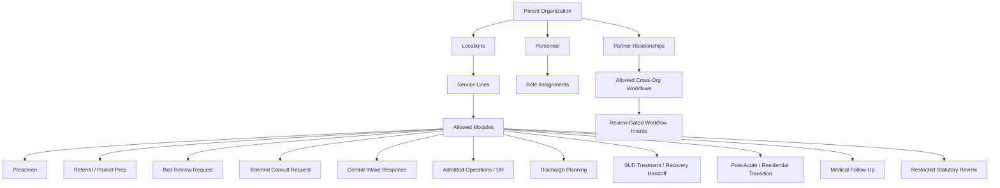
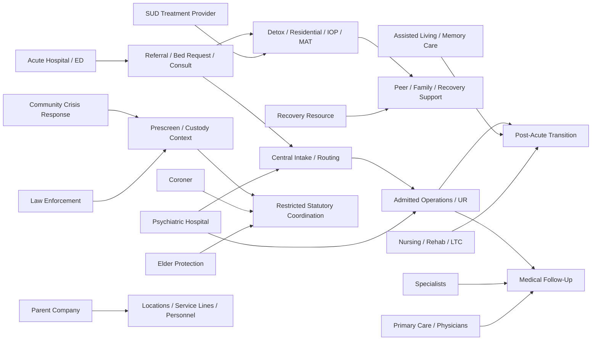
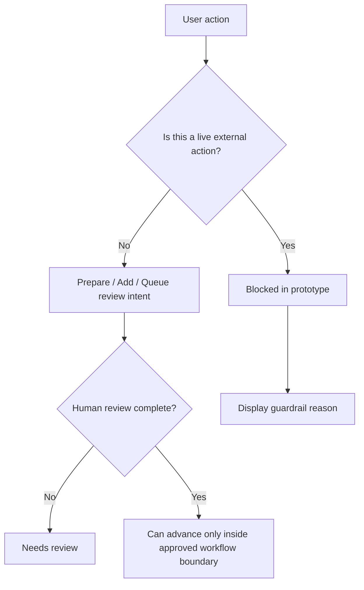
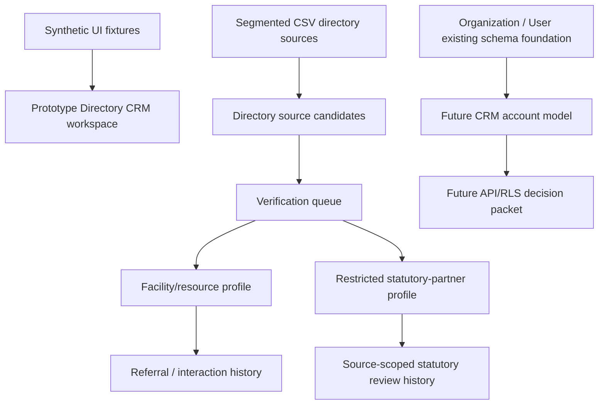

# Clarity Directory CRM System Map

Status: needs_review  
Owner: Tyler Hebert  
Related design: `docs/product/CLARITY_DIRECTORY_CRM_SYSTEM_DESIGN.md`

## Portal Hierarchy



## Organization Types And Primary Workflows



## Guardrail Flow



## Data Layers



## First Build Slice

```text
Add one React workspace:

Directory CRM
  -> synthetic org profiles
  -> setup sequence
  -> module lanes
  -> searchable organization/resource table
  -> selected profile inspector
  -> acute, psychiatric, substance-use, post-acute, ambulatory, crisis, and statutory segments
  -> review-gated intent buttons
  -> guardrail tests
```
