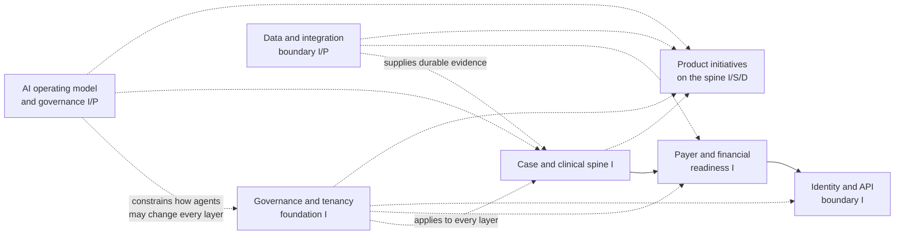
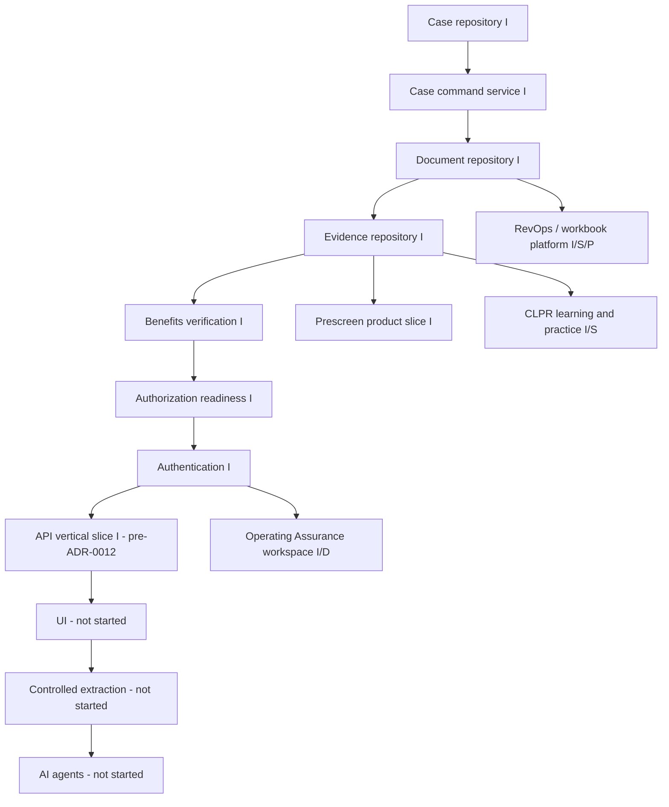

# Clarity Platform — Full Tree

**Purpose:** one navigable map of the whole platform — every initiative, package, and
layer — separate from and pointing into the documents that carry the authoritative
detail. This file does not restate test counts, verification evidence, or open-decision
text; it exists so a reader can find the right document instead of grepping the repo.
**Authority stays with the documents it links to.** If this file and a linked document
disagree, the linked document wins.

**Snapshot date:** 2026-09-12, branch `main` at `15a094ddc352030ee392f1d4f9b31c8ae49a2973`
(includes the Operating Assurance API slice, TWP-OA-004). The canonical status doc is
[IMPLEMENTATION_STATUS.md](../../IMPLEMENTATION_STATUS.md) — at the time this tree was
written, that file's own "as of" line was one merge-group behind this HEAD (it does not
yet describe TWP-OA-002/003/004, CLPR, or `legal-hold-forms`); recheck it before treating
any status claim below as current.

**Legend:** `[I]` implemented surface with tests; `[S]` synthetic-only proof (no real
data/integration); `[D]` discovery/product-definition only, no runtime; `[P]` authorized
or planned but not yet built/verified; `[A]` owner-accepted artifact; `[R]` reference or
source evidence. A tag describes what exists, not that it is production-ready — none of
this is claimed as production-ready, HIPAA-compliant, or clinically/legally approved
(see **Not claimed**, bottom).

## Related trees and status documents

This file is the entry point. It deliberately does not duplicate:

| Document | Scope |
| --- | --- |
| [IMPLEMENTATION_STATUS.md](../../IMPLEMENTATION_STATUS.md) | Canonical, capability-by-capability status; test counts; verification history. Authoritative over this file for "is X actually verified." |
| [WORKBOOK_PLATFORM_FULL_TREE.md](WORKBOOK_PLATFORM_FULL_TREE.md) | Full build tree for the RevOps / workbook-to-platform slice only (branch 5 below), at finer grain than this file goes. |
| [AI_OPERATING_MODEL_PLAN.md](../governance/AI_OPERATING_MODEL_PLAN.md) | Governance layer: how AI agents are authorized to work in this repo. |
| [OPEN_DECISIONS.md](../decisions/OPEN_DECISIONS.md) | OD-1 through OD-27; every open decision referenced below is defined there. |
| [MVP_ROADMAP.md](../planning/MVP_ROADMAP.md) / [IMPLEMENTATION_ROADMAP.md](../roadmap/IMPLEMENTATION_ROADMAP.md) | Phase sequencing and parking lot. |

## Architecture: horizontal



| Horizontal layer | Role | Where it lives |
| --- | --- | --- |
| Governance and tenancy foundation | Organization/user/role/tenant scope, authentication, audit, idempotency, versioning, branch protection, CI gate. | `packages/domain-contracts`, `packages/case-repository`, `packages/auth-service`, ADRs 0001–0011 |
| Case and clinical spine | The original crisis-placement case: case lifecycle, documents, evidence, legal status (e-PEC + OBH forms). | `packages/case-service`, `packages/document-service`, `packages/evidence-service`, `packages/legal-hold-forms`, `app/` |
| Payer and financial readiness | Benefits/insurance verification and authorization readiness, human-performed only. | `packages/benefits-service`, `packages/authorization-service` |
| Identity and API boundary | Server-side sessions; the one HTTP entry point proving an authenticated path end to end. | `packages/auth-service`, `packages/api-service` |
| Product initiatives on the spine | Independently-paced product slices that extend the spine without restarting it: prescreen, RevOps/workbook, Operating Assurance, CLPR learning/practice. | see branches 4–7 below |
| Data and integration boundary | Contracts, persistence, external-source adapters, regulatory reference tooling. | `packages/domain-contracts`, `scripts/regulatory-corpus/`, `reference/source-packages/` |
| AI operating model and governance | How agents are authorized to work on the above, and the retired bridge history. | `docs/governance/AI_OPERATING_MODEL_PLAN.md`, ADR-0017 |

## Build sequence: vertical phases

The agreed build order (`CLAUDE.md`) is case repository → case command service →
documents → **evidence (done)** → insurance/benefits → authorization readiness →
authentication → API → UI → controlled extraction → AI agents. Four independently
authorized product initiatives (prescreen, RevOps/workbook, Operating Assurance, CLPR)
branch off this spine rather than replacing it — each is a **parallel workstream on the
same case spine**, the same pattern the original benefits-verification expansion used.



| Stage | State |
| --- | --- |
| Case repository → Authentication (R0–R6) | `[I]` — all implemented and owner-accepted; see IMPLEMENTATION_STATUS.md "Completed" for exact test counts. |
| API vertical slice (R7) | `[I]` but **pre-decision**: `node:http`, proves one authenticated path; does not resolve ADR-0012 (Fastify proposed, not approved). Operating Assurance's API (branch 6) already ships on Fastify — see **Gaps**, below. |
| UI / controlled extraction / AI agents (R8–R10) | `[P]` not started, per the agreed sequence — do not jump ahead without an explicit owner decision. |
| Prescreen, RevOps, Operating Assurance, CLPR | Each independently authorized and independently paced; none of them promotes R8–R10. |

## Full tree

```text
Clarity platform
│
├── 0. Governance and platform foundation                                    [I]
│   ├── Organization, facility, user, role, tenant scope                     [I]
│   ├── Authentication, sessions, audit events, custody ledger               [I]  (ADR-0011)
│   ├── Versioning, command idempotency, governed-event/outbox pattern       [I]
│   ├── Solo-maintainer branch protection + required "verify" CI check       [I]  (§3a)
│   ├── ADR ledger: 0001–0014, 0016–0018 accepted; 0015 reserved/unmerged;
│   │   0019 (network enrichment kernel) filed as Proposed, not yet accepted [I]
│   └── [S] synthetic-data boundary; no PHI or production-source claim
│
├── 1. Case and clinical spine
│   ├── Case repository — tenant-scoped, audited, optimistic concurrency     [I]  (ADR-0001/0002)
│   ├── Case command service — 9 commands, workflow transition engine        [I]  (ADR-0003)
│   │   └── 8 parallel per-case workstream statuses: clinical, legal review,
│   │       medical screening, benefits, authorization, placement,
│   │       transportation, patient education
│   ├── Document repository — versions, dedupe, classification, storage      [I]  (ADR-0004/0007)
│   ├── Evidence repository and human review — 9 commands, contradictions    [I]  (ADR-0008)
│   ├── Louisiana e-PEC lifecycle (OPC → PEC → CEC), jurisdiction-configured [I, demo]
│   └── legal-hold-forms — OBH-1/1A/2/19/20 field schemas, deadline
│       calculators, structural validators, fillable-PDF rendering;         [I]
│       statutory triggers are configuration, not enforced truth — nothing
│       auto-blocks or auto-releases                                        [P] counsel review (OD-2)
│
├── 2. Payer and financial readiness
│   ├── Manual insurance and benefits verification — 4 commands              [I]  (ADR-0009)
│   │   └── identifiers structurally unacceptable input until an
│   │       encryption capability exists (`*Encrypted` columns stay NULL)
│   └── Authorization readiness — record/transition/assess, no aggregate
│       score by design                                                      [I]  (ADR-0010)
│
├── 3. Identity and API boundary
│   ├── Authentication — server-side sessions, opaque bearer tokens          [I]  (ADR-0011)
│   └── API vertical slice — node:http, login/logout/session + one
│       decision-rationale route; proves the authenticated path, does
│       not resolve API architecture                                        [I]  (ADR-0012 Proposed)
│
├── 4. Prescreen product slice
│   ├── Package onboarding + provenance (PRs #17/#20)                        [I]
│   ├── Phase 1 contracts — willingness, orientation, pathway derivation,
│   │   fail-closed consent/transport evaluators                             [I]  (36+ tests)
│   ├── Phase 2 command service — 6 commands + readiness view                [I]  (ADR-0013)
│   ├── Role mapping + same-org HTTP slice (Option 3 narrow)                 [I]  (ADR-0014)
│   ├── Phase 3 local persistence — survives restart, RLS-covered           [I]  (ADR-0016)
│   └── [P] cross-organization submission/receipt model (successor packet,
│       blocks field-originated prescreens); prescreen UI scope undecided
│
├── 5. RevOps / workbook-to-platform
│   │   (full detail lives in WORKBOOK_PLATFORM_FULL_TREE.md — not restated here)
│   ├── Accepted workbook baseline (Dunder Mifflin Hospital, Sept 9 2026)     [A]
│   ├── Operating records, monthly close, reconciliation, exports            [I]
│   ├── Sourced Louisiana Medicaid + FY2026 Medicare rate components         [I/S]
│   ├── IOP operations and independent review                                [P]
│   └── Full financial-method/hospital-binding/close parity                  [P]
│
├── 6. Operating Assurance (OA) workspace
│   ├── Product-definition discovery — opportunity/product-definition gates
│   │   passed; requirement/execution readiness not_started;
│   │   lifecycle recorded as **paused** as of the July 30 source decisions  [D]
│   │   (docs/discovery/operating-assurance/project-state.yaml)
│   ├── Trust contracts + deterministic evaluator (TWP-OA-001/002):
│   │   applicability, authority class, source currentness/rights,
│   │   evidence status, evaluation result, review decision                  [I]  (domain-contracts/assurance.ts)
│   ├── Tenant-scoped persistence, immutable evidence/evaluation/review
│   │   history, metadata-only audit (TWP-OA-002)                            [I]  (multi-file Prisma schema, assurance.prisma)
│   ├── Commands, queries, scoped contributor/reviewer authority,
│   │   reviewed-evidence replay safety (TWP-OA-003)                         [I]
│   ├── Authenticated Fastify API — strict schemas, server-derived
│   │   tenancy/authority, content-free error mapping (TWP-OA-004)           [I]
│   └── [gap] the discovery lane's own project-state.yaml has not been
│       reconciled against this implemented code — see **Gaps**, below
│
├── 7. CLPR — Central Intake learning and practice slice
│   ├── learning-practice-service — evaluator, gateway, practice lab,
│   │   recognition, deterministic PracticeObservation                      [I, synthetic]
│   ├── Central Intake learning pathway → contradiction practice →
│   │   Notice & Acknowledge → contest/review → CompetencyEvidence          [I, synthetic]
│   ├── app/src/components/learning-practice, extends Training & SOPs       [I]
│   └── does not change Episode, clinical, placement, legal, financial,
│       or operational decision authority
│
├── 8. Data and integration boundary
│   ├── domain-contracts — shared state machines, audit helpers, enums      [I]
│   ├── network-enrichment contract kernel — contract-only, no Prisma       [I]  (ADR-0019, PR #48)
│   │   └── [P] runtime slice (service/persistence/outbox/API/UI/
│   │       agent_bridge) closed as superseded (PR #30); never reviewed,
│   │       preserved in local recovery bundle if wanted later
│   ├── Regulatory corpus tool — eCFR/Federal Register, API-first,
│   │   17/17 sources retrieved; dev tooling only, not a scheduled worker    [I]
│   └── reference/source-packages/ — immutable onboarded evidence            [R]
│
└── 9. AI operating model, quality, and release evidence
    ├── AI operating model plan + agent-bridge retirement (ADR-0017);
    │   bridge tree moved byte-identical to docs/experiments/, no live
    │   listener/dispatch/`bridge:*` entry point                            [I]
    ├── Contracts↔schema enum-sync machine check (Stage 0.4)                [I]
    ├── graphify local knowledge graph — generated, worktree-local,
    │   never staged (issue #40 resolved by local-only retention)           [I]
    └── Root + app test suites, lint, typecheck, `prisma validate`,
        `npm audit` — exact current counts in IMPLEMENTATION_STATUS.md
        only; do not restate a count here that will go stale
```

## Code tree

```text
clarity-platform/
├── app/
│   └── src/
│       ├── domain/                    [I] local prototype domain, storage, guards, API client
│       ├── workspaces/                [I] intake, bedboard, authorization, RevOps, IOP, legal status
│       └── components/
│           └── learning-practice/     [I] CLPR UI surface
├── packages/
│   ├── domain-contracts/              [I] shared contracts across every slice
│   ├── case-repository/               [I] Prisma gateways, tenant context, all persistence
│   ├── case-service/                  [I] case command service and workflow engine
│   ├── document-service/              [I] document repository
│   ├── evidence-service/              [I] evidence repository and human review
│   ├── benefits-service/              [I] insurance/benefits verification
│   ├── authorization-service/         [I] authorization readiness
│   ├── auth-service/                  [I] authentication
│   ├── api-service/                   [I] node:http vertical slice + OA Fastify routes
│   ├── prescreen-service/             [I] prescreen command service (Phase 2)
│   ├── assurance-service/             [I] Operating Assurance commands/queries (TWP-OA-003)
│   ├── rev-ops-service/               [I] RevOps aggregate controls and calculations
│   ├── learning-practice-service/     [I, synthetic] CLPR evaluator/gateway/practice lab
│   └── legal-hold-forms/              [I] Louisiana OBH form schemas/deadlines/rendering
├── data/
│   ├── synthetic-revops/              [S] accepted 2026 source tables
│   ├── synthetic-practice-scenarios/  [S] CLPR fixture
│   └── public-rates/                  [R] archived official Louisiana/Medicare releases
├── prisma/
│   ├── schema.prisma                  [I] core persistent model
│   ├── assurance.prisma               [I] Operating Assurance multi-file schema addition
│   └── migrations/                    [I] full database history
├── docs/
│   ├── product/                       [R/P] this file, workbook tree, decision packets
│   ├── architecture/                  [I] ADR-0001…0019 (0015 reserved)
│   ├── discovery/operating-assurance/ [D] OA product-definition lane, paused
│   ├── planning/clpr/                 [R] CLPR handoff reconciliation and file ownership
│   ├── testing/                       [R/P] acceptance matrices and verification manifests
│   ├── governance/                    [I/P] AI operating model plan
│   ├── roadmap/                       [P] staged implementation plans
│   └── decisions/                     [P] OPEN_DECISIONS.md, RISK_REGISTER.md
├── scripts/regulatory-corpus/         [I] eCFR/Federal Register dev tooling, not deployed
└── reference/source-packages/         [R] immutable onboarded source material
```

## Gaps between this tree and current documentation

Recorded here so they are visible, not because this file resolves them:

- **Operating Assurance discovery vs. implementation.** The product-definition lane's
  `project-state.yaml` records `lifecycle_status: paused` and
  `execution_readiness: not_started`, sourced from July 30 decisions and explicitly
  marked "not independently revalidated." The same slice now has a merged, tested
  command service, gateway, and authenticated API (TWP-OA-002/003/004, this same day).
  Neither document has been reconciled against the other; this tree does not attempt to
  rule on which is stale.
- **API architecture split.** ADR-0012 (Fastify) remains **Proposed**, and the core API
  vertical slice deliberately stayed on `node:http` pending that decision. Operating
  Assurance's API (branch 6) already ships on Fastify. This tree records the split; it
  does not resolve ADR-0012.
- **IMPLEMENTATION_STATUS.md lag.** Its own "as of" narrative predates TWP-OA-002/003/004,
  the CLPR vertical slice, and `legal-hold-forms` as of this tree's snapshot commit.
  Re-verify against `git log` before treating either document as exhaustive.
- **CLPR review acceptance.** `docs/implementation/CLPR_SYNTHETIC_VERTICAL_SLICE.md`
  states its own review acceptance is `[Unverified]` — implementation owner Codex,
  designated review owner Claude, review not yet recorded.

## Not claimed

Production readiness, HIPAA compliance, malware protection, working external
integrations, or approved clinical/legal rules — for any branch of this tree. Synthetic
data only, throughout. This file does not itself constitute product acceptance for
Operating Assurance, CLPR, or any `[D]`/`[P]`-tagged branch above.
