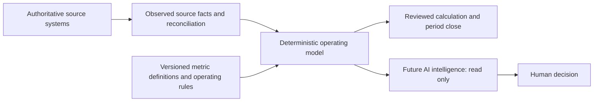
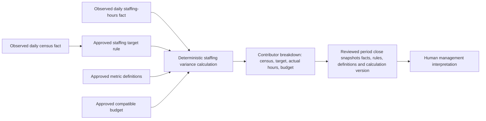

# Deterministic Operating Kernel Assessment

Review draft · 2026-09-08 · Architecture assessment only

## Decision frame

Clarity should act as a behavioral-health operating intelligence layer above authoritative EHR, workforce/payroll, billing/RCM, and accounting systems. Its job is to preserve source activity and calculate a traceable operating model; it is not to replace those systems or allow AI output to become operating truth.

This assessment is based on the working tree at `32e280066251c93ae2ea433b76ef4e05a2e66570`, the open draft export PR #53, source-derived workbook material, current code, contracts, schema, tests, and product documents. It makes no production, privacy, integration, clinical, payer, financial, or hospital-rule claim. It does not authorize implementation.

## 1. Current-state architecture map

| Layer | Current evidence | Status |
|---|---|---|
| Facility-scoped Rev Ops workspace | `RevOpsWorkspace` is tenant, facility and unit scoped. Its JSON state holds budgets, daily aggregate actual revisions, custom-field snapshots, accepted imports and closed periods. A workspace revision provides optimistic concurrency. | Implemented for the bounded aggregate census workflow. |
| Source and correction history | Each budget/actual carries `RevOpsSource` metadata for manual or upload source, including optional checksum, physical rows, sheet and mapping. Corrections append a new daily actual with actor, time and reason. `RevOpsChange` captures command/source history. | Implemented for aggregate counts and budget entries; not a unified fact model. |
| Reconciliation | CSV/XLSX upload parser validates bounded rows; a planner identifies inserts, unchanged rows and conflicts. Authorized review choices preserve either the saved fact or an accountable correction. | Implemented for daily aggregate actual counts and mapped custom fields. |
| Budget | A monthly aggregate target may have daily targets, a cost-center snapshot, source metadata and draft/approved status. Approved budget versions are selected explicitly for comparison and close. | Implemented, but its metric semantics are not independently typed or validated. |
| Daily actual / comparison | One integer count per date, plus optional custom fields, is compared with a selected approved budget. The service distinguishes missing dates from explicit zeroes and returns forecast and collections as `null`. | Implemented only for the narrow aggregate count. |
| Month close and history | Close requires an approved budget and every calendar date; it snapshots actual revisions, budget, variance, reason, actor, timezone, metric snapshot and a prior-close link. Reopen then correction then reclose preserves prior receipts. | Implemented for the aggregate census workflow. |
| Export | Draft PR #53 adds receipt review and values-only XLSX export with explicit `receiptExport` permission, stale-review protection and audit events. CI is green, but the PR is open and unmerged. | Implemented on the draft branch; not merged, deployed or production evidence. |
| Episode and authorization persistence | Episode contracts/persistence include facility, unit/program, admission, timezone, authorization review and governed event envelopes. | Implemented as a separate synthetic case/episode/UR foundation; not connected to Rev Ops aggregate counts. |
| Metric definitions | `packages/domain-contracts/src/analytics.ts` contains validated metric-definition contracts and draft UR metric definitions, including source facts, calculation reference/version, governance and quality states. | Scaffolded for analytics/UR; no registry, persistence, API, approval workflow, or Rev Ops calculation uses it. |
| Governed events | `GovernedEvent` and transactional outbox persist validated episode/UR event envelopes and corrections. Schema comments state that no dispatcher, projection or marts consume them. | Implemented persistence pattern; not an operational fact/calculation engine. |
| Staffing, forecast, collections, IOP and ancillary workflows | Workbook map identifies these operating workflows. Current Rev Ops only supports aggregate census, budgets, close and export. | Missing from the implemented Rev Ops loop. |

### Ownership classification of repository artifacts

| Artifact | Classification | Finding |
|---|---|---|
| `prisma/schema.prisma`, domain contracts and service code | Source | Primary implementation truth for behavior and persistence. |
| `RevOpsWorkspace.state` and `RevOpsChange.details` | Source | Current operational data and historical command/receipt payloads for this bounded workflow. |
| `RevOpsClosingReceipt` / export workbook | Derived | Receipt captures a reviewed snapshot; export is a safe presentation of it. Neither is the source of daily activity. |
| `app/src/workspaces/RevOps.tsx` | Presentation | UI exposes server-owned workspace behavior but is not an authority. |
| Workbook and rebuild package | Source evidence / derived analysis | Workbook is immutable reference evidence. Reverse-engineering documents are useful, but some are summary-derived and require workflow validation before rule parity. |
| Product and roadmap documents | Proposed / presentation | They define direction but do not establish implementation status. |

## 2. Workbook-to-domain map

The detailed source map is [Workbook-to-platform workflow map](WORKBOOK_TO_PLATFORM_WORKFLOW_MAP.md). This view identifies the right destination for each major concept.

| Workbook concept | Current Clarity domain | Assessment | Intended boundary |
|---|---|---|---|
| Facility, unit, timezone | Facility profile; Rev Ops workspace setup; episode facility timezone | Partially implemented | Clarity owns operating configuration. |
| Patient identity | Behavioral health case identity | Implemented for synthetic case workflow, but no EHR identity adapter | Reference EHR identity; do not create a competing clinical master. |
| Admissions, transfers, discharges | Episode contracts and persistence | Partially implemented; not aggregated into Rev Ops census | Import/reference EHR encounters; derive operating census once rules are approved. |
| Daily midnight census and patient days | Rev Ops daily aggregate actual; receipt metric snapshot | Implemented for manually/imported aggregate counts only | Import current aggregate source initially; derive from encounters only after hospital rules are approved. |
| IOP enrollment, scheduled frequency, participation and groups | No matching Rev Ops model | Missing | Import/reference EHR/clinical-program activity; Clarity derives operational measures. |
| Clinical notes and independent audits | Case evidence/audit patterns exist, but no IOP note workflow | Missing for this use | Reference clinical documentation; own audit/reconciliation status, not the clinical note authority. |
| Staffing, agency, overtime and 1:1 hours | No staffing domain in Rev Ops | Missing | Import workforce/timecard facts; payroll remains authoritative. |
| Labor cost and staffing targets | No rate/target rule model | Missing | Import source cost facts where approved; Clarity owns approved operating-rule versions used in calculations. |
| Coverage and authorization | Benefits/authorization and episode review foundations | Partially implemented, separate from revenue/Rev Ops reporting | Reference/import source decisions; Clarity derives exposure views, never payer truth. |
| Expected revenue | No Rev Ops forecast calculation | Missing | Derive from approved rules and activity; not billing, recognized revenue or cash. |
| Claims and billed amount | No matching implementation | Missing | Reference/import RCM facts; RCM remains authoritative. |
| Collections | `compareRevOps` explicitly returns `collections: null` | Missing by design | Import/reference accounting posted receipts; accounting remains authoritative. |
| Budget | Rev Ops budget versions/approval/history | Implemented for a generic aggregate target | Clarity owns approved planning baselines, after finance approval. |
| Forecast | Placeholder only | Scaffolded placeholder | Clarity owns versioned scenarios/derivations, not source activity or cash. |
| Budget-versus-actual / leadership reporting | One count comparison and receipt/export | Partially implemented | Derive from compatible metric/rule/versioned inputs. |
| Closing receipt | Close receipt and export projection | Implemented for census/budget count | Clarity owns reviewed historical accountability records. |

## 3. Implemented / scaffolded / proposed / missing / conflicting

### Implemented

- Tenant/facility/unit-scoped aggregate daily actual entry, import, explicit zero handling, correction history and reconciliation.
- Approved aggregate budget versions with daily phasing.
- Complete-calendar month close, original/reopen/correct/reclose receipt history, selected-budget preservation and explicit close/reopen permissions.
- A first-class **Daily Midnight Census Count v1** snapshot on new closing receipts. Hospital inclusion rules and effective dates are deliberately unverified/null.
- Episode and authorization persistence, governed-event correction envelopes and audit patterns in adjacent domains.

### Scaffolded

- Draft `MetricDefinition` contracts and draft UR metric catalog exist, but Rev Ops does not resolve or persist them as its operating definition registry.
- `GovernedEvent` and outbox schemas preserve source/event lineage for episode/UR foundations, but no fact projection, calculation runtime or analytics mart consumes them.
- Forecast and collections are deliberately represented as unavailable (`null`), not zero.

### Proposed

- The full workbook-derived operating model: IP, IOP, staffing, ancillary costs, forecast, financial comparison and executive reporting.
- A deterministic kernel where facts, metric definitions, operating rules, calculations and interpretation are traceable.
- Future AI read-only explanation and management intelligence.

### Missing

- A shared, typed source-fact model spanning manual entry, imports and future source-system adapters.
- Persisted/effective-dated metric-definition registry connected to Rev Ops calculations.
- Persisted/effective-dated staffing target/rate rules and calculation results that retain rule version and inputs.
- Staffing activity, labor categories, IOP activity, ancillary volume, forecast, claims and collections records.
- A deterministic variance-explanation model for census-to-staffing variance.
- A connection between episode events and aggregate Rev Ops census that prevents double counting.
- AI evidence-read contract and citations to deterministic calculations.

### Conflicting or stale framing

- `README.md` and `ARCHITECTURE.md` retain older statements that no backend/API/auth/tenancy enforcement exists, while the current Rev Ops gateway/API and tenant-scoped persistence provide a bounded implemented surface. Neither statement should be generalized to production readiness.
- The inpatient Rev Ops product definition calls IOP/PHP possible later expansion, while the workbook and owner-confirmed operating workflow show IOP as a central source-derived workflow. PHP remains unverified separately.
- The generic-looking `MetricDefinition` contract and the Rev Ops receipt metric snapshot are parallel structures. They must be reconciled before a second metric type is added; neither is sufficient proof of a full metric registry today.

## 4. Minimum deterministic kernel proposal

Do not add a generic rule engine. Extend existing names where they are adequate and introduce only the following durable concepts.

| Kernel object | Reuse / minimum responsibility | First-slice need |
|---|---|---|
| Source observation | Evolve `RevOpsSource` and existing correction/provenance fields into a typed, immutable observation reference: source type, external or import record locator, source/ingestion times, facility/unit/program scope, original payload/value hash and acceptance/correction link. | Required for imported census and staffing hours to share one provenance pattern. |
| Metric definition version | Reuse and narrow existing `MetricDefinition` contract; persist only approved definitions needed by the slice. Include definition, unit, population, time convention, aggregation, source authority, owner, status and effective dates. | Required for census count, staffing hours, staffing variance and budget target semantics. |
| Specific operating-rule version | Add a scoped, effective-dated **staffing target rule** contract before any generic rule engine: facility/unit/program, role/category, census range or other approved input, target, owner/approver and version. | Required for the first census-to-staffing calculation. |
| Actual measurement | A typed accepted measure derived from a source observation, not a free-form workspace integer. Preserve date, metric-definition version, value, dimensional scope and correction chain. | Required for daily census and daily staffing-hours values. |
| Calculation run | Persist calculation ID/version, period/as-of cutoff, metric definitions, rule versions, source-observation or measurement identifiers, inputs, derived result and deterministic contributor breakdown. | Required for reproducible staffing variance and explanation. |
| Budget version | Reuse `RevOpsBudget`, but attach a metric-definition version and compatible dimensions before comparison. Do not turn the current generic aggregate target into a universal financial model. | Required for a comparable staffing/census budget baseline. |
| Close receipt | Reuse `RevOpsClosingReceipt` and immutable receipt history. Extend it only after the calculation run can snapshot its input/result/rule versions. | Required for reviewed close that preserves leadership’s information at that time. |

`Forecast` and `Collection` stay separate objects when their first sourced workflows are authorized. They are not required for the proposed staffing variance slice.

## 5. System-of-record boundary

| Domain | Clarity posture | Authority and use |
|---|---|---|
| Patient identity | Reference | EHR/master patient index remains authoritative. Clarity uses a source-linked identifier in a future approved integration. |
| Encounters, admissions and discharges | Import + reference | EHR remains authoritative; imported events may support operating derivations after attribution rules are approved. |
| Census | Derive, with interim import | Derive from approved encounter facts/rules eventually. Current aggregate upload/manual source remains an interim observed input. |
| IOP attendance | Import + reference | Clinical/EMR program record remains authoritative; Clarity derives operational measures and reconciliation exceptions. |
| Clinical documentation | Reference | EHR/document system retains note authority; Clarity may own an audit/reconciliation workflow, not a duplicate chart. |
| Staffing/timecards | Import + reference | Workforce/timekeeping system remains authoritative. |
| Payroll | Reference | Payroll remains authoritative; approved extracts may feed operating-cost calculations. |
| Payer/authorization | Import + reference | Payer/UR source remains authoritative; Clarity can preserve source-linked review facts and derive exposure. |
| Claims | Reference | Billing/RCM remains authoritative. |
| Accounting | Reference | Accounting/GL remains authoritative. |
| Budget | Own | Clarity owns an approved planning baseline and history once finance authorizes it. |
| Forecast | Own + derive | Clarity owns scenarios and deterministic derivations, never source encounter/billing truth. |
| Collections | Import + reference | Accounting/RCM posted transactions remain authoritative. |
| Operating definitions and rules | Own | Clarity owns approved, effective-dated operational definitions/rules and their evidence/approvals. |
| Closing receipts | Own | Clarity owns the reviewed immutable operational close record, with source and rule snapshots. |

## 6. Deterministic dependency graph

The first commercial loop should have this narrower graph. It separates what happened from how Clarity calculates and how a person interprets it.

The calculation should answer “why” deterministically through its contributor breakdown. A future AI layer may summarize that breakdown, identify exceptions and draft questions; it cannot edit any input, rule, definition, calculation result or close receipt.

## 7. Gap analysis: Census → Staffing → Budget → Variance → Reviewed Close

| Step | What works now | What blocks the complete loop |
|---|---|---|
| Census | Daily aggregate counts, source metadata, corrections and close are implemented. | Event-derived census rules are intentionally unresolved; current count has no reusable typed measurement model. |
| Staffing | No staffing activity model, importer, UI, labor category or target rule exists. | Cannot record actual staff hours or calculate a staffing demand. |
| Budget | Approved generic count budget exists. | It cannot prove which metric, role, labor unit or staffing target definition it represents. |
| Variance | Actual-minus-budget arithmetic exists. | No deterministic staffing variance calculation, compatible dimensions, contributor breakdown or rule-version snapshot exists. |
| Reviewed close | Census close preserves daily revisions, selected budget and receipt history. | It cannot reproduce a staffing variance because there are no staffing facts/rules/calculation inputs to snapshot. |

The blocking architecture is therefore not “more dashboard UI” or “AI explanation.” It is the absence of typed staffing facts and a small versioned calculation contract joined to the existing close receipt.

## 8. Proposed next vertical slice

### Scope

Implement one facility/unit/month, one approved staffing measure (for example, one role-category’s daily worked hours), and one owner-approved census-to-target staffing rule. The workflow is:

**Import or enter daily census and daily staffing hours → reconcile/correct each source → run deterministic staffing variance → compare to a compatible approved budget → review contributor breakdown → close/reopen/reclose with snapshots.**

The staffing category, target rule and budget metric are product-owner decisions. The implementation must not infer them from workbook labels.

### Proposed implementation shape for later approval

| Area | Required change |
|---|---|
| Database | Additive persistence for approved metric-definition versions, scoped effective-dated staffing-target rules, accepted typed daily measurements and calculation runs. Retain `RevOpsWorkspace` and existing receipts; do not rewrite historical census state. |
| Domain contracts | Reuse `MetricDefinition` where it fits; add narrow source-observation, staffing-measurement, staffing-target-rule and calculation-run contracts. Require source, correction, dimension, version and approval fields. |
| Service behavior | Deterministically resolve applicable metric/rule versions, reject incompatible budget/actual dimensions, calculate variance and contributor breakdown, and snapshot all resolved inputs at close. |
| API | Extend the existing tenant-scoped Rev Ops route pattern with bounded staffing import/reconciliation and calculation review. No new standalone service unless the existing boundary proves inadequate. |
| UI | Add a daily staffing activity/reconciliation view, rule/budget compatibility disclosure, calculation review and close preview. Keep current census close flow usable. |
| Imports | Reuse bounded CSV/XLSX parsing and mapping/provenance patterns. Separate accepted source rows from calculated values. |
| Tests | Cover effective-date boundary, missing versus zero, incompatible metric/rule/budget, correction/recalculation, tenant denial, replay/stale review, original/reopen/reclose, and deterministic contributor results. |
| Audit | Preserve source references, reviewer/approver, correction chain, selected definitions/rules and calculation versions in the receipt. |
| Migration | Additive migration and backfill avoidance. Existing census receipts without the new calculation snapshot remain explicitly legacy/narrow, not silently upgraded. |

### Explicit non-goals

- No generic rule engine.
- No AI implementation.
- No IOP, PHP, claims, payroll, collections, rate engine, staffing schedule optimization or automated staffing decision.
- No live EHR, workforce, RCM or accounting integration.
- No production data, PHI, compliance or deployment claim.

## 9. Future AI boundary contract

A future AI request may read only a server-projected **Deterministic Evidence Bundle** containing: calculation run IDs, metric-definition versions, rule versions, bounded source references, derived values, contributor breakdown, data-quality/missingness state, close revision and citations/links.

AI output must be labeled as interpretation, preserve these references, and be unable to call mutation, approval, close, correction, definition or rule endpoints. A human can act on a recommendation only through the existing explicit command/permission/reason/audit paths. AI must never write a source observation, create a calculation result, approve a correction, approve close, or represent expected/billed/cash amounts as interchangeable.

## 10. Product-owner decisions required before implementation

| Priority | Decision | Why it changes the data model |
|---|---|---|
| 1 | Which staffing category is the first vertical-slice measure: RN worked hours, total direct-care hours, another category, or a different measure? | Determines fact grain, units, source mapping and budget compatibility. |
| 1 | What exact daily census metric drives the first staffing target, including hospital inclusion/exclusion and time convention? | Determines source facts, metric definition and attribution rules. |
| 1 | What is the first staffing target rule: census bands, ratio, fixed schedule, or another rule; who approves it; and how is it effective dated? | Determines the narrow rule contract and calculation semantics. |
| 1 | What does the first budget represent: staffing hours, dollars, census, another metric; and who approves a compatible baseline? | Prevents comparing incompatible amounts. |
| 1 | Which source is authoritative for worked hours, and what source timestamp/record ID is available? | Determines import/provenance and correction/reconciliation behavior. |
| 2 | Are manual entry and CSV/XLSX the required initial sources, or must the slice wait for an integration? | Defines ingestion scope without creating duplicate truth. |
| 2 | Which role can accept staffing-source discrepancies, approve staffing rules and close the reviewed period? | Defines explicit permissions and audit events. |
| 2 | What contributor explanation is useful to leadership for the first variance? | Keeps derived explanation deterministic and bounded. |
| 3 | For later IOP work, what source controls treatment-plan frequency, attendance, note audit and charge-slip reconciliation? | Determines whether Clarity imports, references or owns each record. |

## 11. Implemented initial kernel slice (synthetic only)

The first implementation deliberately makes only the configurable staffing-plan portion executable. It does not select a hospital policy or turn a staffing plan into a clinical rule.

| Capability | Status | Boundary |
|---|---|---|
| Approved staffing measure | Implemented | An administrator defines the code, label, definition, unit, version and effective date, then a separately authorized approver accepts the draft. This contract is kept separate from the draft analytics MetricDefinition registry. |
| Effective-dated staffing plan | Implemented | An administrator enters target hours per census; an authorized approver accepts the rule. The service resolves the newest approved rule effective on each service date. |
| Daily staffing facts | Implemented | Manual entry and append-only correction history use the existing Rev Ops workspace state and source metadata. The initial user interface supports entry; CSV/XLSX staffing import/reconciliation is deferred. |
| Deterministic calculation | Implemented | For each date, actual staffing hours minus daily census times approved target hours per census, with the resolved rule and every contributor retained. |
| Reviewed close | Implemented | If an approved staffing measure is effective for a close period, every census fact, staffing fact and rule must be complete. The closing receipt stores the calculation and staffing fact revisions; export validates and renders the staffing variance. |
| Existing census close | Preserved | Workspaces without an approved effective staffing measure keep the existing census/budget close behavior. |

The initial configuration is intentionally generic. Tests use **Synthetic RN worked hours** only as an example measure; that label, the target values and their result are not presented as a hospital staffing standard.

### Deferred decisions and work

- Staffing CSV/XLSX import, row-level reconciliation and source-system adapters.
- A compatible staffing-hours or financial budget contract. The current approved budget remains a census baseline and is not used in the staffing-hours calculation.
- Owner-approved real-world measure definitions, source identifiers and hospital-specific census inclusion rules.
- IOP enrollment, attendance, note audit, charge-slip and EMR reconciliation workflows.
- AI interpretation and any payroll, billing, RCM, accounting or scheduling effects.

## Conclusion

The smallest deterministic architecture is not a replacement EHR, payroll, billing or accounting platform. It is a source-linked measurement and calculation layer attached to the existing tenant-scoped Rev Ops workflow.

The current census close is structurally reusable. The first configurable staffing measurement and approved target-rule slice now preserves a reproducible variance without embedding a hospital rule. The priority-one decisions above remain required before any real-world source, staffing policy or budget compatibility is promoted beyond the synthetic boundary.
