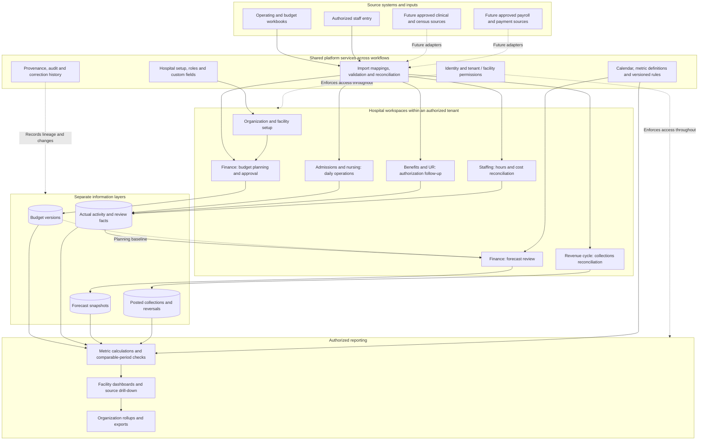

# Inpatient Rev Ops systems map

Proposed product architecture for review; not a deployed-system inventory.
Read with the [product definition](INPATIENT_REV_OPS_PRODUCT_DEFINITION.md).
Tyler's established workbook workflow supplies the functional baseline.

## Product and information flow

The shared controls apply to all persistence, reads, mutations, imports, jobs
and exports, not only the diagram endpoints. Every source is routed to its
appropriate layer. No line implies an implemented integration. Future adapters
are optional source connections requiring their own scoped implementation.

## Boundaries and ownership

| Boundary | Owns | Must not imply |
|---|---|---|
| Organization/tenant | Its facilities, configuration, users and authorized records | Access to another hospital organization's records |
| Facility/unit | Local operational scope, programs, capacity and reporting dimensions | A separate duplicate of the same episode at each transfer |
| Existing Clarity case/episode | Shared case and episode identity and established domain boundaries | A new parallel clinical chart owned by Rev Ops |
| Clinical/source systems | Their original clinical and operational records | Automatic integration merely because the product has a matching field |
| Budget | Approved targets and version history | Missing actuals filled from planned values |
| Actual activity | Observed events, reconciled census, staffing and review facts | Rate-derived revenue being recognized accounting revenue |
| Forecast | Assumptions, rules, cutoffs and reproducible estimates | Verified cash or a guarantee of payment |
| Collections | Posted receipts, allocations, refunds and reversals | Current-period revenue for every receipt posted this month |
| Reporting | Permission-aware derived views using aligned definitions | A second editable source of truth |

Custom fields belong to scoped record definitions with validation and history.
They do not replace core identifiers, change access or silently modify formulas.
Imports keep original source locators and mapping versions; source conflicts
require reconciliation rather than automatic overwrite.

## Workflow over the hospital stay

UR proceeds alongside the stay. Its completion is not a discharge prerequisite.
Expected discharge informs forecast only. Financial exposure must not determine
care or block emergency clinical review. Budget setup happens before and outside
the stay; the approved baseline persists as actual activity arrives.

## First vertical slice

Prove this entire persisted workflow across two synthetic tenants, including
unauthorized requests, repeated imports, source reconciliation, corrections,
custom-field history and calendar handling. Forecast and collections remain
outside that slice. The first slice uses explicitly sourced aggregate daily
actuals; episode-event integration is a separate expansion, not an implied
capability. Do not count aggregate imports and episode-derived totals twice.

Architect horizontally. Implement vertically. Validate replacement fidelity
end-to-end. Expand only after the completed slice meets its acceptance checks.

This map adds no stack choice, API contract, database schema, implementation
status or deployment claim. Architecture decisions remain in the existing ADR
process; [implementation status](../../IMPLEMENTATION_STATUS.md) remains the
authority for what actually exists.
