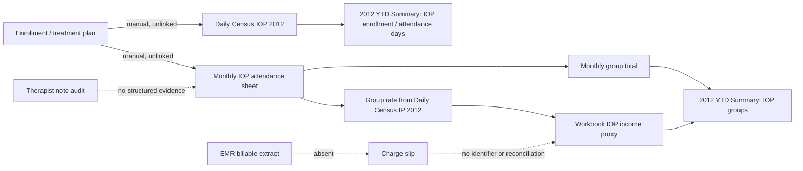

# IOP Attendance Handoff Validation

## Scope and evidence boundary

This validation traces the supplied workbook at:

`/Users/tylerhebert/Downloads/Reporting Metrics Ops and Budget .xlsx`

It inspects workbook structure, headers, and formulas only. It does not read, copy, or publish patient-level values. No EHR, therapist-note system, charge-slip system, or billing/RCM extract was supplied, so those handoffs cannot be validated as reconciled.

## Result

**The workbook supports a manual attendance-to-group-total-to-income-proxy calculation. It does not establish the requested end-to-end reconciliation.**

Most importantly, there is **no workbook formula path from the monthly IOP attendance sheets to `Daily Census IOP 2012`**. Those two paths are separate:

## Handoff validation matrix

| Handoff | Workbook evidence | Status | What is missing to validate it |
|---|---|---|---|
| Enrollment → prescribed frequency | `Daily Census IOP 2012` has daily “# Enrolled Program” values. Monthly attendance rows include unstructured frequency text such as “3x …” in the patient-detail area. | **Manual / not linked** | Admission/enrollment ID, treatment-plan order/version, prescribed sessions/days, effective dates, and a stable patient/program key. |
| Prescribed frequency → attendance/groups | Monthly IOP sheets have one row per group type and daily numeric entries; row total is calculated from the day columns. | **Attendance arithmetic confirmed; compliance not validated** | A structured expected-session schedule and a rule that compares expected versus attended sessions by patient, day, group, and treatment-plan version. |
| Attendance/groups → therapist note audit | The sheets contain “Comments” rows, but no note identifier, author, signature status, audit status, reviewer, audit time, or exception result. | **Not validated** | Note record ID, therapist ID, service-date/time, signature/finalization state, independent-audit result, reviewer, and reason for any exception. |
| Note audit → charge slip | No charge-slip identifier, status, service-line mapping, or note-to-charge relationship appears in the attendance formula path. | **Not validated** | Charge-slip ID, line ID, note ID, attendance/group event ID, amount/unit, service date, and charge creation/finalization status. |
| Charge slip → EMR billable reconciliation | The workbook calculates a “Groups Billable” amount, but it has no EMR transaction ID, billed/held/denied status, remittance data, or reconciliation rule. | **Manual proxy only** | Daily EMR billing extract and an accountable reconciliation record that classifies matched, missing, duplicate, amount-mismatched, and timing-mismatched lines. |

## Formula evidence

### Attendance and group totals

Each monthly attendance sheet uses a patient/group row and daily calendar columns. For example, in `August IOP Attend`:

- `AJ4 = SUM(E4:AI4)` totals the entered daily group values for the row.
- `AJ82 = SUM(E82:AI82)` totals daily group totals for the month.
- `AJ83 = SUM(E83:AI83)` totals weekly group totals.
- `AJ2 = SUM(AJ4:AJ81)` produces the monthly total used by the annual summary.

The same pattern appears across the other monthly IOP attendance sheets, with month-specific last columns and row ranges.

### Attendance to annual group/income reporting

The `2012 YTD Summary` sheet reads each monthly attendance-sheet total:

- Row 21, “IOP # of Groups,” reads monthly totals such as `'August IOP Attend'!AJ2`.
- Row 22, “IOP Income,” reads each monthly workbook amount such as `'August IOP Attend'!B90`.
- Row 26, “IOP Attend Days,” reads monthly meal/attendance totals such as `'August IOP Attend'!AJ84`.

On `August IOP Attend`, the income proxy is:

- `B90 = SUM(AJ2 * C90)`
- `C90 = 'Daily Census IP 2012'!A53`

This proves only that the workbook multiplies its attendance-derived group total by a rate cell linked from the inpatient census sheet. It does **not** prove a billable EMR line, charge-slip completion, payer approval, or collection.

### Daily IOP census is separate from attendance

`Daily Census IOP 2012` contains daily “# Enrolled Program” values and calculates monthly enrollment/attendance figures internally. Examples:

- `AH4 = SUM(C3:AG3) / COUNT(C3:AG3)` calculates average enrollment for January.
- `AH6 = SUM(C4:AG4)` calculates January attendance days.
- `A5 = AVERAGE(C4:AG4)` calculates average daily attendance.

The annual summary reads these values separately:

- Row 18: IOP average daily census.
- Row 19: IOP attendance days.
- Row 20: IOP average enrollment.

The direct-reference register records only one formula dependency owned by `Daily Census IOP 2012`: `A1 → 'Daily Census IP 2012'!A2`, which is a shared title/date reference. It has no direct attendance-sheet dependency.

## Required deterministic reconciliation record

To turn the present manual handoff into a validated loop, preserve each source event and derive the reconciliation state separately:

| Record | Minimum keys | Owner/source of truth |
|---|---|---|
| Enrollment | person token, program, enrollment/admission date, status | EHR/program system |
| Treatment-plan frequency | plan version, effective range, prescribed days/sessions, ordering clinician | EHR/clinical documentation |
| Attendance/group event | person token, program, service date/time, group type, attendance outcome, therapist | Program/EHR attendance source |
| Therapist note and audit | note ID, attendance event ID, author/signature state, audit result, reviewer, reviewed time | EHR/documentation and audit workflow |
| Charge slip | charge-line ID, attendance event ID, note ID, CPT/service mapping, units, status | Charge/EMR source |
| EMR billing fact | billable-line ID, charge-line ID, status, amount/units, posting time | EMR/RCM source |
| Reconciliation decision | source IDs, comparison result, reviewer, reason, revision, timestamp | Clarity operational reconciliation layer |

The resulting close gate should fail when any expected attendance event lacks a completed note audit or a compatible charge/billable result, while keeping an explicit “not yet due” state for normal documentation or billing lag.

## Pass criteria for the next validation run

For a bounded synthetic or de-identified day/program sample:

1. Every active enrollment has a current treatment-plan frequency or an explicit exception.
2. Every expected attendance occurrence is classified as attended, absent, excused, canceled, or not scheduled.
3. Every attended billable group event has a therapist note and independent-audit result.
4. Every charge slip maps one-to-one or by an explicit documented aggregation rule to attendance and note evidence.
5. Every eligible charge has a reconciled EMR billable result, or a documented hold/denial/lag exception.
6. Counts and units reconcile by service date, program, group type, and status; unmatched records remain visible rather than becoming zero.
7. A reviewed close snapshots source cutoffs, policy/version identifiers, exceptions, reviewer, and the original reconciliation result.

## Executable synthetic reconciliation sample

[`IOP_ATTENDANCE_RECONCILIATION_SYNTHETIC_SAMPLE.json`](evidence/IOP_ATTENDANCE_RECONCILIATION_SYNTHETIC_SAMPLE.json) is a fully synthetic, de-identified one-day program sample. It includes enrollment, an effective treatment-plan version and prescribed frequency, attendance/group events, note-audit evidence, charge lines, EMR billable lines, and five deliberate source-link gaps.

[`iopReconciliation.ts`](../../packages/domain-contracts/src/iopReconciliation.ts) derives those gaps as stable issue keys. Every derived gap must have a separate exception record with `state: REVIEWED`; the fixture proves this by leaving no unresolved issues. A `HOLD` disposition preserves the exception for human follow-up. It does not make the attendance eligible, clinically compliant, charged, or billable.

The companion unit test removes one reviewed exception and verifies that the sample fails the reconciliation close gate. This is a contract proof only; it does not connect to an EHR, note system, charge system, or EMR billing system.

[`IOP_ATTENDANCE_RECONCILIATION_SYNTHETIC_IMPORT.json`](evidence/IOP_ATTENDANCE_RECONCILIATION_SYNTHETIC_IMPORT.json) supplies the first adapter envelope: a source-system label, source file name, export time, and immutable source cutoff alongside the reconciliation sample. The adapter’s close receipt records that cutoff, the human reviewer token, review timestamp, issue count, and reviewed-exception count.

The synthetic authenticated path is defined in [IOP authenticated source import path](IOP_AUTHENTICATED_SOURCE_IMPORT_PATH.md). The required real-adapter approvals are tracked in [IOP source-adapter decision packet](IOP_SOURCE_ADAPTER_DECISION_PACKET.md).

## Product implication

Do not implement IOP “compliance,” billables, income, or fraud controls from the workbook totals alone. The next product slice should be a source-linked **IOP attendance-to-billable reconciliation review**, beginning with de-identified or synthetic records and explicit exception states. The workbook can serve as a legacy reporting reference, but not as the authority for enrollment, treatment plan, note audit, charge-slip, or EMR billing truth.
