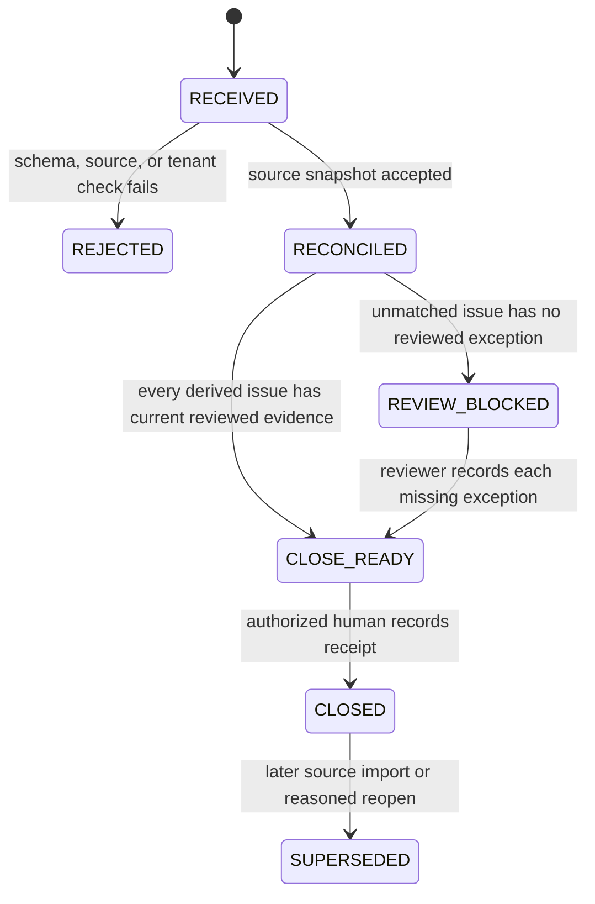

# IOP authenticated, source-owned reconciliation import path

## Goal

Define one tenant-scoped import path that accepts a source-owned IOP reconciliation snapshot, preserves stable source identifiers and cutoff evidence, requires a verified human reviewer to close it, and keeps every unmatched event visible until reviewed.

The authenticated route and persistence model exist for synthetic local use. No real source credential, source-system connector, or production integration is approved.

## Source-of-truth boundary

| Fact | Authoritative owner | Clarity role |
|---|---|---|
| Enrollment and treatment-plan version | EHR/program system | Import references and reconcile links. |
| Attendance and group participation | Attendance/EHR source | Import references and reconcile links. |
| Therapist note and independent audit | Documentation/audit source | Import note/audit identifiers and statuses only. |
| Charge line and EMR billable line | Charge/EMR/RCM source | Import source identifiers and reconciliation statuses only. |
| Import review, exception review, and close receipt | Clarity operational layer | Persist append-only review evidence. |

The adapter must not copy note text, make a clinical-compliance finding, determine eligibility, create a charge, or post an EMR billable line.

## Proposed authenticated path

`POST /api/iop/reconciliation-imports`

The synthetic route is implemented at `POST /api/iop/reconciliation-imports`, with authenticated exception review at `POST /api/iop/reconciliation-imports/:id/issues/:issueKey/reviews` and close at `POST /api/iop/reconciliation-imports/:id/close`. It reuses the existing API rule that organization and actor identity come from the verified session or a separately verified service principal. They must never be accepted from the request body, source file, or browser role selector.

### Required authentication and authorization

1. A human caller uses the existing verified session path. A future machine connector uses a distinct service principal with a tenant-bound credential; API keys embedded in files are prohibited.
2. The API derives `organizationId`, actor/service-principal ID, and permissions before parsing the body.
3. The target `facilityId` and `programId` must belong to that organization. A cross-tenant, unknown, or unauthorized target returns the same non-revealing result.
4. The approved synthetic permission matrix is recorded in [IOP source inventory and permission matrix](IOP_SOURCE_INVENTORY_AND_PERMISSION_MATRIX.md). Its implementation permissions are:
   - `iopReconciliationImport` — create a source snapshot;
   - `iopReconciliationReview` — record a reviewed exception;
   - `iopReconciliationClose` — create a close receipt;
   - `iopReconciliationView` — read source snapshots and receipts.
5. A close requires a verified human principal with `iopReconciliationClose`; a service principal cannot close a review period.

## Request contract

The body contains only a source snapshot and mapping metadata. Tenant, reviewer, and close identity are server-derived.

```ts
type IopSourceImportRequest = {
  facilityId: string;
  programId: string;
  source: {
    integrationKey: string;       // configured server-side source identity
    fileName?: string;            // sanitized display metadata only
    exportedAt: string;           // ISO instant supplied by the source
    cutoffAt: string;             // ISO instant bounding included source facts
    snapshotHash: string;         // SHA-256 of canonicalized accepted payload
  };
  reconciliation: IopReconciliationSample; // renamed to production-safe contract during implementation
};
```

The server verifies that `integrationKey` is active for the derived organization and program before accepting the snapshot. It records the authenticated principal separately from the source-system identity.

### Stable source identifiers

Each imported enrollment, plan, attendance event, note audit, charge line, and EMR billable line must carry:

- `sourceRecordId`: immutable ID assigned by its authoritative source;
- `sourceSystem`: server-resolved integration identity, never free text from the event;
- `sourceVersion` or `sourceUpdatedAt`: source-side version/change marker;
- `observedAt`: receipt time recorded by Clarity;
- `sourceCutoffAt`: inherited from the accepted import snapshot.

Uniqueness is scoped as `(organizationId, integrationId, resourceType, sourceRecordId, sourceVersion)`. A retry with the same tenant, integration, source snapshot hash, and idempotency key returns the original import receipt. A reused idempotency key with a different canonical request is rejected.

## Persisted records

| Record | Immutable fields | Mutable fields | Retention rule |
|---|---|---|---|
| `IopReconciliationImport` | tenant, facility/program, integration, snapshot hash, cutoff/export times, actor, source-record/version coverage, reconciliation snapshot | none | Never overwrite; supersede with a later import. |
| Derived reconciliation issue | issue key and affected source IDs, recomputed from the immutable import snapshot | none | Close and review validate the same deterministic rule set. |
| `IopReconciliationExceptionReview` | issue key, reviewer principal, reviewed time, disposition, reason | none | One append-only review per action; later action is rejected once closed. |
| `IopReconciliationCloseReceipt` | import ID, source cutoff, reviewer principal, close time, issue counts | none | Close is immutable; reopening requires a future review-cycle design. |

No table stores a raw therapist note body. The exact source record reference and audit state are sufficient for this reconciliation slice.

## State and close gate



The implemented close command is:

`POST /api/iop/reconciliation-imports/:importId/close`

The body supplies only a required close reason and expected import revision. The server stamps reviewer identity/time, copies the immutable source cutoff, and rejects the command if any issue lacks a current authenticated exception review. A reviewed exception does not convert an event to billable or compliant.

## Tenant isolation and audit rules

- Repositories apply `organizationId` on every import, event, issue, review, receipt, and read query.
- Database RLS/tenant-context enforcement is required before production data use; service-level checks alone are insufficient.
- Every accepted import, exception review, and close emits one append-only audit event in the same transaction. Outbox delivery is deferred.
- Audit metadata stores IDs, hashes, statuses, and sanitized filenames only. It must not store raw payloads, note text, patient names, coverage identifiers, or credentials.
- Read access returns only records within the verified principal’s tenant and authorized program scope.

## Acceptance criteria

1. A source snapshot cannot claim a tenant, actor, reviewer, or source authority through client-controlled fields.
2. The same source snapshot retry is idempotent; a changed snapshot cannot replay under the old key.
3. Cross-tenant facility/program, import, issue, and receipt reads/writes are non-revealing failures.
4. Every imported event can be traced to a source system, source record ID, version/update marker, and import cutoff.
5. Every detected mismatch is deterministically derived from the immutable import snapshot; closing fails until each has an authenticated, immutable review.
6. The close receipt captures reviewer identity, review time, source cutoff, and issue counts.
7. Every material mutation is atomic with its audit event; a failed audit write leaves no import, review, or close residue.
8. Tests prove permission denial, tenant isolation, retry/idempotency, stale revision rejection, cutoff preservation, and close-gate behavior.

## Required decisions before implementation

| Decision | Owner | Status |
|---|---|---|
| Which EHR, attendance, note-audit, charge, and EMR exports provide immutable source IDs and version markers? | IOP operations + revenue cycle | Unknown |
| Which human roles receive import, review, close, and read permissions? | Operations + compliance | Unknown |
| What review dispositions and reopen rules are operationally valid? | IOP operations + revenue cycle | Requires operational review |
| What PHI, retention, encryption, logging, and connector-credential controls apply? | Security/privacy | Requires security review |
| Does the API move to the accepted Fastify direction before this route is added? | Technical lead | Requires technical decision |
| What program/facility authorization model is enforced in the database? | Technical lead + security | Requires technical decision |

## Frontend wiring (2026-09-13)

`app/src/workspaces/IopReconciliation.tsx` now calls this path directly through a
new `apiIopReconciliation` client (`app/src/domain/api.ts`, mirroring the existing
`apiRevOps` pattern) instead of computing everything in-browser against the bundled
fixture. The workspace's own self-contained sign-in (matching `RevOps.tsx`'s
pattern — a dev assertion input, independent of the app shell's own login panel)
gates import/review/close; loading a candidate file for a client-side structural
preview remains available without a session.

The synthetic dev facility (`synthetic-iop-facility-api-dev`) and integration key
(`SYNTHETIC_IOP_PROGRAM`) that `packages/api-service/src/devMain.ts` bootstraps are
hardcoded in the workspace as the only import target — this is dev-only wiring, not
a facility/program picker, and there is deliberately no such picker in this slice.
`sourceRecords` (required by `IopPersistedImportRequestSchema`) are derived from the
loaded reconciliation sample with a fixed `sourceVersion: "1"`, since the bundled
synthetic fixture carries no real source-side version marker. Exception reviews are
recorded one at a time against the authenticated session (`disposition` + `reason`
per issue) — the fixture's bundled `exceptionReviews` are no longer submitted on
import (the server already refuses reviewer authority from the import payload) and
are not shown; a reviewer records them live against each derived issue instead.

**Known gaps, not fixed here:** no facility/program selection UI (single hardcoded
dev target); no way to reopen or browse a prior import by ID (the backend exposes no
list endpoint, so only the most recently submitted-or-fetched import is visible in a
given session); idempotency keys for review/close are derived deterministically from
`(importId, issueKey)` / `importId`, so a reviewer cannot silently resubmit a
*changed* review for the same issue under the same key (a 409, not a silent
overwrite) — correcting a review requires a fresh import in this slice. Verified
(app suite only — the app-workspace tests fully mock the network layer and make no
real database writes): 2 new/extended tests in `IopReconciliation.test.tsx`
(previously 1), app suite **141/141** (21 files), lint clean, typecheck clean. Root
suite (`npm test`, unaffected — no root-level test was added or changed by this
slice): **762/762** (74 files) against local `clarity_dev`. `prisma validate`
clean.

## Non-goals

- Connecting to a live EHR, note, charge, EMR, or RCM system.
- Importing real patient data or note content.
- Declaring a charge valid, a note clinically sufficient, or an EMR line payable.
- Replacing EHR, charge, or RCM ownership.
- A facility/program picker, or a way to browse/reopen a prior import by ID —
  both remain out of scope for this frontend-wiring slice.
