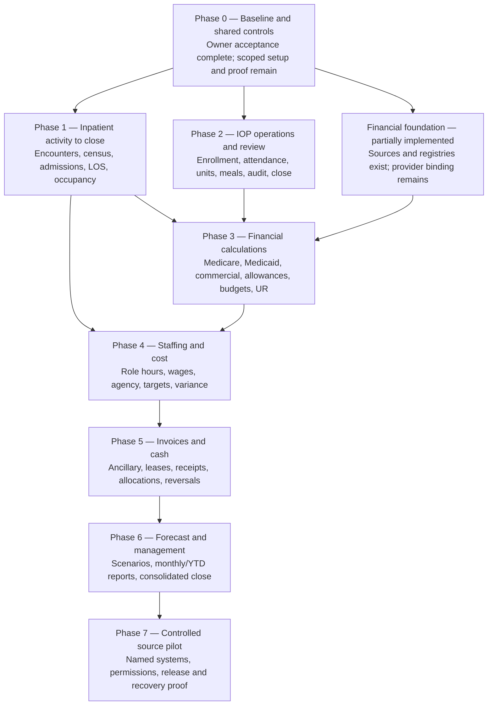

# Workbook-to-Platform Full Tree

**Purpose:** A navigable view of the platform implied by the restored workbook, separate from current implementation status.

**Legend:** `[A]` owner accepted; `[R]` reference or source evidence; `[I]` implemented surface; `[P]` authorized but still to build or verify; `[S]` synthetic-only proof. Acceptance does not change runtime status.

The exact function, record, rule, and acceptance mappings remain in the [workflow map](WORKBOOK_TO_PLATFORM_WORKFLOW_MAP.md), [function export](evidence/WORKBOOK_PLATFORM_FUNCTION_MAP.csv), and [acceptance matrix](../testing/WORKBOOK_PLATFORM_ACCEPTANCE_MATRIX.md).

The full accepted product scope and current implementation coverage are defined in the [Dunder Mifflin Hospital RevOps MVP](DUNDER_MIFFLIN_REVOPS_MVP.md). Tyler accepted the workbook and authorized parity plus real financial-rate implementation on September 9, 2026.

**Implementation projection refreshed September 12, 2026:** the operating slice at `5965f44` includes persisted synthetic workbook records, recalculated summaries, registry additions, report snapshots, and bounded payment scenarios. The [canonical implementation status](../../IMPLEMENTATION_STATUS.md) and [runtime verification](../testing/REVOPS_OPERATING_MVP_VERIFICATION.md) govern these claims. The phases below remain the full completion target; partial implementation does not establish every phase's exit evidence.

## Architecture: horizontal

```mermaid
flowchart LR
    A[Accepted workbook<br/>A and R] --> B[Operating records<br/>I and P]
    B --> C[Care and operations<br/>[I/P]]
    C --> D[Revenue operations<br/>[I/P]]
    D --> E[Reporting and decisions<br/>[I/P]]

    G[Governance and tenancy<br/>[I/P]] -. applies to every layer .-> A
    G -.-> B
    G -.-> C
    G -.-> D
    G -.-> E

    F[Contracts, persistence,<br/>API, and source adapters<br/>[I/P]] -. supplies durable evidence .-> B
    F -.-> C
    F -.-> D
    F -.-> E
```

| Horizontal layer | Role in the platform | Current state |
| --- | --- | --- |
| Workbook evidence | Preserves sheet logic, examples, formulas, and acceptance expectations as source evidence. | Accepted by Tyler on September 9, 2026; technical verification history retained. |
| Operating records | Holds organization, facility, program, case/episode, payer, target, source-receipt, review, and exception data. | Core records plus 31 accepted synthetic workbook tables persist. Payer/service/effective-contract additions and input corrections are implemented; general operating-record entry, imports and IOP program/source registries remain incomplete. |
| Care and operations | Runs intake, authorization, capacity, IOP enrollment, schedule, attendance, and activity capture. | Intake/capacity surfaces and workbook-derived inpatient/IOP summaries exist. New operating-record entry, independent IOP audit and the persisted review client remain incomplete. |
| Revenue operations | Separates actual activity, documentation, charges, rate logic, budget, forecast, and collections. | Synthetic service valuation, staffing costs, budgets, forecasts, invoices and imported cash totals recalculate. Sourced Louisiana scenarios and a Medicare base component exist; complete payment methods, hospital binding, posting and financial close remain incomplete. |
| Reporting and decisions | Produces drillable, source-aware operational and financial reports. | Monthly/annual operating summaries, 47 source comparisons, record navigation and durable report snapshots are implemented. Nine detailed reports remain source snapshots; full report/export parity and financial close remain incomplete. |
| Governance and data boundary | Enforces identity, scope, audit, idempotency, lifecycle, and source authorization. | Workbook mutations reuse authenticated tenant-scoped workspace revisions and the audit journal. Program-level IOP enforcement and consolidated financial lifecycle controls remain incomplete. |

## Build sequence: vertical phases



| Phase | What is built or decided | Exit evidence |
| --- | --- | --- |
| 0 | Accepted baseline and reused shared controls. | Owner acceptance recorded; existing evidence gaps remain explicit. |
| 1 | Inpatient activity and census reconciliation. | AT02–AT06, AT35; month closes and recloses without rewriting history. |
| 2 | IOP operating workflow and authenticated review. | AT13–AT16, AT34, AT39; program scope and independent audit proven. |
| 3 | Sourced rate engines, service valuation, compatible budgets and UR. | AT07–AT12, AT30, AT38; complete applicable methods and date boundaries tested. Registries and bounded scenarios exist; full payment methods and hospital binding remain. |
| 4 | Staffing detail and operating costs. | AT17–AT21, AT36; role/subset/cost arithmetic reconciles. |
| 5 | Invoices, leases, cash and allocations. | AT22–AT23, AT32–AT33; posting date, service period and reversals remain distinct. |
| 6 | Forecast and management package. | AT24–AT25, AT38, AT40; scenario isolation, source drill-through and parity proof. |
| 7 | Controlled source pilot. | Named owners, permissions, connection and recovery evidence before live-source operation. |

```text
Clarity operating platform
│
├── 0. Governance and product controls
│   ├── [I] Organization, facility, user, role, and tenant scope
│   ├── [I] Authentication, authorization, custody ledger, and audit events
│   ├── [I] Versioning, command idempotency, governed event patterns
│   ├── [P] Program-level authorization enforcement for IOP review
│   ├── [I] Aggregate census close/reopen controls and immutable receipts
│   ├── [P] Consolidated financial close and IOP lifecycle policy
│   └── [S] Synthetic-data boundary; no PHI or production-source claim
│
├── 1. Workbook evidence boundary
│   ├── [A/R] Dunder Mifflin Hospital – Restored Operations 2026
│   ├── [R] Sheet inventory, formula graph, examples, and mutation cases
│   ├── [A] Workbook accepted September 9; historical technical proof retained
│   ├── [R] Function-to-record, rule, and acceptance crosswalks
│   └── [P] Resolve substantive rule ambiguities in the affected implementation
│
├── 2. Operating master data
│   ├── [I] Organization and facility
│   ├── [I] User, role, authentication session, and actor identity
│   ├── [I] Case, episode, admission, document, and evidence relations
│   ├── [I] Payer, authorization, benefits, and utilization-review records
│   ├── [P] Program, group, service, target, and source registry for IOP
│   ├── [I/S] Persisted payer/service/effective-contract registry additions and corrections
│   └── [P] Verified hospital payment profile and official-rate applicability binding
│
├── 3. Care and operations workflows
│   ├── Intake and readiness
│   │   ├── [I] Guided intake and case queue
│   │   ├── [I] Benefits verification and authorization readiness
│   │   ├── [I] Medical necessity, routing response, and evidence review
│   │   └── [I] Legal status, packet preview, and training/SOP surfaces
│   │
│   ├── Census and capacity
│   │   ├── [I] Bedboard, admissions, active-admission guard, and clocks
│   │   ├── [I/S] Workbook-derived admissions, patient-days, ADC, occupancy, LOS and census exceptions
│   │   └── [P] New encounter entry and remaining geographic/detail report parity
│   │
│   └── Intensive outpatient program operations
│       ├── [I/S] Imported enrollment/visit/session records and validated input corrections
│       ├── [I/S] Attendance, enrollment averages, participant-days, units, sessions and meals
│       ├── [P] New enrollment, schedule and attendance record-entry workflows
│       ├── [P] Group target configuration and performance measure
│       ├── [I] IOP reconciliation domain, repository gateway, API route, and migration
│       └── [P] Connect authenticated persisted review/close to the IOP client; prove independent audit
│
├── 4. Revenue operations
│   ├── [I] RevOps workspace and onboarding fields
│   ├── [I] Monthly close, patient-day retention, receipt/export, and reconciliation
│   ├── [I] Append-only workspace history and retained identity migrations
│   ├── [I/S] Workbook service valuation, dated contract registry and payer/service additions
│   ├── [I] Sourced Louisiana inpatient scenarios and FY2026 Medicare wage-adjusted base component
│   ├── [I/S] Session-only contract scenarios with explicit user-entered provenance
│   ├── [P] Full IPF/FY2027/OPPS/SBH methods, hospital binding and official-rate ledger posting
│   ├── [I/S] Recalculated staffing costs, budgets, invoices and immutable imported cash totals
│   ├── [P] New staffing-day ingestion and full staff-report layouts
│   ├── [P] New signed receipts, reversals/reallocations and consolidated financial close
│   ├── [P] Charge linkage and documentation-audit exception workflow for IOP
│   └── [P] Complete function-level financial, benefit and assistance parity proof
│
├── 5. Reporting and decision support
│   ├── [R] Workbook metrics, examples, summary sheets, and navigation
│   ├── [I] Product Studio status projection
│   ├── [I/S] Operating dashboard, month/year summaries, 47 source comparisons and input navigation
│   ├── [I/S] Separate budget, actual activity, modeled allowance, forecast and imported collections
│   ├── [I/S] Durable report snapshots preserving calculated results and known issues
│   ├── [R] Nine detailed report tables retain original source snapshots
│   ├── [P] Full report layouts, contributor drill-through and consolidated financial close
│   └── [P] Export and reconciliation evidence for accepted platform reports
│
├── 6. Data and integration boundary
│   ├── [I] Domain contracts
│   ├── [I] Prisma persistence, repository gateways, and API service scaffolding
│   ├── [P] Program-bound source receipts, versions, cutoffs, and idempotency
│   ├── [P] Source adapter authorization and ownership decisions
│   ├── [I/S] Read-only accepted-workbook extraction and authenticated fixture loading
│   ├── [I] Archived official payment sources with hashes, effective dates and row lineage
│   ├── [S] Synthetic CSV/JSON fixtures for golden cases
│   └── [P] Real connectors only after source owner, permission, scope, and retention decisions
│
└── 7. Quality and release evidence
    ├── [I] Unit, workspace, contract, gateway, route, and migration test patterns
    ├── [R] Workbook acceptance matrix and evidence exports
    ├── [I/S] 611 monthly/year metric comparisons, payment scenarios and workbook persistence tests
    ├── [P] Golden-case proof for IOP persisted review
    ├── [P] Tenant, facility, program, lifecycle, and exception regression suite
    └── [P] Release decision after behavior, security, and source evidence are verified
```

## First build path through the tree

```text
1. Workbook baseline accepted [A]
   └── September 9 owner decision; no repeated acceptance gate

2. Decide IOP review rules [P]
   └── program ownership, reviewer identity, cutoff, close/reopen policy

3. Harden contracts and persistence [P]
   └── program-bound snapshot + immutable receipt + exception + review state

4. Enforce API and repository boundary [P]
   └── server-side organization/facility/program authorization

5. Connect IOP review client [P]
   └── authenticated persisted workflow replaces local-only close behavior

6. Prove six synthetic golden cases [S]
   └── activity, attendance, target, audit, charge, and late-change evidence

7. Prove and record each delivered slice [P]
   └── retain the full MVP target while building the remaining branches
```

The IOP path above is one remaining implementation increment within the full MVP. The financial lane already includes archived public sources, synthetic contract registries and bounded scenario calculators; complete method support, provider-profile binding and official-rate application remain. See the [rate implementation specification](REVOPS_FINANCIAL_RATE_IMPLEMENTATION.md) for the target and the [runtime verification](../testing/REVOPS_OPERATING_MVP_VERIFICATION.md) for the delivered subset. Tyler selected a specific Louisiana hospital and will supply its provider identifier. This missing input affects facility-specific pricing, not authorization to build the platform.

## Code tree

```text
clarity-platform/
├── app/
│   └── src/
│       ├── domain/                 [I] local prototype domain, storage, guards, API client
│       ├── workspaces/             [I] intake, bedboard, authorization, RevOps operating workbook/rates, IOP preview
│       └── components/             [I] shared presentation components
├── packages/
│   ├── domain-contracts/           [I] core business contracts and IOP/RevOps contracts
│   ├── case-repository/            [I] Prisma gateways, tenant context, workbook revisions, IOP gateway
│   ├── rev-ops-service/            [I] aggregate controls, workbook calculations and bounded payment scenarios
│   └── api-service/                [I] server, workbook routes, RevOps import/export, IOP routes
├── data/
│   ├── synthetic-revops/           [S] accepted 2026 source tables and record lineage
│   └── public-rates/               [R] archived official releases and normalized Louisiana rates
├── prisma/
│   ├── schema.prisma               [I] persistent model source
│   └── migrations/                 [I] database history including IOP persistence migration
├── docs/
│   ├── product/                    [R/P] product rules, source mappings, decision packets
│   ├── testing/                    [R/P] acceptance matrix and verification manifests
│   ├── roadmap/                    [P] staged implementation plans
│   └── decisions/                  [P] owner and governance decisions
└── reference/                      [R] immutable source material
```

The immediate executable branch of this tree is defined in the [workbook baseline and IOP review build plan](../roadmap/WORKBOOK_BASELINE_IOP_REVIEW_BUILD_PLAN.md). No node marked `[P]` should be represented as implemented until its code and verification evidence exist.
