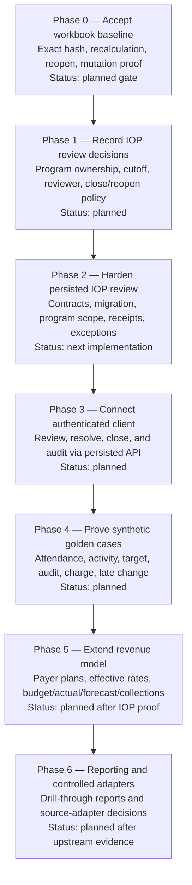

# Workbook-to-Platform Full Tree

**Purpose:** A navigable view of the platform implied by the restored workbook, separate from current implementation status.

**Legend:** `[R]` reference or source evidence; `[I]` implemented surface; `[P]` planned or requires an owner decision; `[S]` synthetic-only proof.

The exact function, record, rule, and acceptance mappings remain in the [workflow map](WORKBOOK_TO_PLATFORM_WORKFLOW_MAP.md), [function export](evidence/WORKBOOK_PLATFORM_FUNCTION_MAP.csv), and [acceptance matrix](../testing/WORKBOOK_PLATFORM_ACCEPTANCE_MATRIX.md).

The currently runnable first product slice is defined in the [Dunder Mifflin Hospital RevOps MVP](DUNDER_MIFFLIN_REVOPS_MVP.md).

## Architecture: horizontal

```mermaid
flowchart LR
    A[Workbook evidence<br/>[R]] --> B[Operating records<br/>[I/P]]
    B --> C[Care and operations<br/>[I/P]]
    C --> D[Revenue operations<br/>[I/P]]
    D --> E[Reporting and decisions<br/>[I/P]]

    G[Governance and tenancy<br/>[I/P]] -. applies to every layer .-> A
    G -.-> B
    G -.-> C
    G -.-> D
    G -.-> E

    F[Contracts, persistence,<br/>API, and source adapters<br/>[I/P]] -. supplies durable evidence .-> B
    F -.-> C
    F -.-> D
    F -.-> E
```

| Horizontal layer | Role in the platform | Current state |
| --- | --- | --- |
| Workbook evidence | Preserves sheet logic, examples, formulas, and acceptance expectations as source evidence. | Restored artifact mapped; exact workbook baseline still needs final acceptance. |
| Operating records | Holds organization, facility, program, case/episode, payer, target, source-receipt, review, and exception data. | Core organization/case/payer records exist; program/rate/source registries remain planned. |
| Care and operations | Runs intake, authorization, capacity, IOP enrollment, schedule, attendance, and activity capture. | Most intake/capacity surfaces exist; IOP persisted review is the selected next slice. |
| Revenue operations | Separates actual activity, documentation, charges, rate logic, budget, forecast, and collections. | RevOps workspace exists; payer-rate and IOP charge/audit hardening remain planned. |
| Reporting and decisions | Produces drillable, source-aware operational and financial reports. | Workbook reporting is reference evidence; platform reporting requires verified upstream records. |
| Governance and data boundary | Enforces identity, scope, audit, idempotency, lifecycle, and source authorization. | Core patterns exist; program-level enforcement and lifecycle policy remain planned. |

## Build sequence: vertical phases



| Phase | What is built or decided | Exit evidence |
| --- | --- | --- |
| 0 | The exact restored workbook baseline. | One hash with recalculation, reopen, formula, and mutation proof. |
| 1 | IOP lifecycle and ownership rules. | Decisions recorded with owner, scope, and status. |
| 2 | Server-side IOP review model and authorization. | Focused contract, migration, gateway, and route tests pass. |
| 3 | Authenticated client workflow. | UI displays server-derived reviewer and lifecycle state; no local-only close claim. |
| 4 | Synthetic IOP proof. | Six golden cases pass with immutable receipts and visible exceptions. |
| 5 | Revenue model extension. | Effective-dated payer/rate model preserves separate actual, budget, forecast, and collections facts. |
| 6 | Reporting and controlled integrations. | Reports drill to accepted source evidence; connectors have owner and permission decisions. |

```text
Clarity operating platform
│
├── 0. Governance and product controls
│   ├── [I] Organization, facility, user, role, and tenant scope
│   ├── [I] Authentication, authorization, custody ledger, and audit events
│   ├── [I] Versioning, command idempotency, governed event patterns
│   ├── [P] Program-level authorization enforcement for IOP review
│   ├── [P] Close, reopen, and supersession policy
│   └── [S] Synthetic-data boundary; no PHI or production-source claim
│
├── 1. Workbook evidence boundary
│   ├── [R] Reporting Metrics Ops and Budget workbook
│   ├── [R] Sheet inventory, formula graph, examples, and mutation cases
│   ├── [P] Accepted workbook hash, recalculation, reopen, and mutation proof
│   ├── [R] Function-to-record, rule, and acceptance crosswalks
│   └── [P] Owner decisions for ambiguous legacy rules and empty sheets
│
├── 2. Operating master data
│   ├── [I] Organization and facility
│   ├── [I] User, role, authentication session, and actor identity
│   ├── [I] Case, episode, admission, document, and evidence relations
│   ├── [I] Payer, authorization, benefits, and utilization-review records
│   ├── [P] Program, group, service, target, and source registry for IOP
│   └── [P] Rate, contract, payer-plan, and effective-date registry
│
├── 3. Care and operations workflows
│   ├── Intake and readiness
│   │   ├── [I] Guided intake and case queue
│   │   ├── [I] Benefits verification and authorization readiness
│   │   ├── [I] Medical necessity, routing response, and evidence review
│   │   └── [I] Legal status, packet preview, and training/SOP surfaces
│   │
│   ├── Census and capacity
│   │   ├── [I] Bedboard, admissions, active-admission guard, and clocks
│   │   └── [P] Workbook-derived census reconciliation where still required
│   │
│   └── Intensive outpatient program operations
│       ├── [P] Enrollment and prescribed frequency
│       ├── [P] Session schedule, attendance, cancellation, and no-show
│       ├── [P] Participant units, participant-days, and non-group services
│       ├── [P] Group target configuration and performance measure
│       ├── [I] IOP reconciliation domain, repository gateway, API route, and migration
│       └── [P] Authenticated persisted review, exception resolution, and close
│
├── 4. Revenue operations
│   ├── [I] RevOps workspace and onboarding fields
│   ├── [I] Monthly close, patient-day retention, receipt/export, and reconciliation
│   ├── [I] Append-only workspace history and retained identity migrations
│   ├── [P] Rate-card, Medicare, Medicaid, and commercial payer distinctions
│   ├── [P] Contract-effective date and future payer-plan extensibility
│   ├── [P] Charge linkage and documentation-audit exception workflow for IOP
│   └── [P] Workbook-budget parity proof before financial outputs are promoted
│
├── 5. Reporting and decision support
│   ├── [R] Workbook metrics, examples, summary sheets, and navigation
│   ├── [I] Product Studio status projection
│   ├── [P] Operational dashboard with source, cutoff, and freshness evidence
│   ├── [P] Budget, actual activity, forecast, and collections as separate layers
│   ├── [P] Drill-through from aggregate measure to immutable receipts
│   └── [P] Export and reconciliation evidence for accepted platform reports
│
├── 6. Data and integration boundary
│   ├── [I] Domain contracts
│   ├── [I] Prisma persistence, repository gateways, and API service scaffolding
│   ├── [P] Program-bound source receipts, versions, cutoffs, and idempotency
│   ├── [P] Source adapter authorization and ownership decisions
│   ├── [S] Synthetic CSV/JSON fixtures for golden cases
│   └── [P] Real connectors only after source owner, permission, scope, and retention decisions
│
└── 7. Quality and release evidence
    ├── [I] Unit, workspace, contract, gateway, route, and migration test patterns
    ├── [R] Workbook acceptance matrix and evidence exports
    ├── [P] Golden-case proof for IOP persisted review
    ├── [P] Tenant, facility, program, lifecycle, and exception regression suite
    └── [P] Release decision after behavior, security, and source evidence are verified
```

## First build path through the tree

```text
1. Accept workbook baseline [P]
   └── choose exact file hash and rerun native proof

2. Decide IOP review rules [P]
   └── program ownership, reviewer identity, cutoff, close/reopen policy

3. Harden contracts and persistence [P]
   └── program-bound snapshot + immutable receipt + exception + review state

4. Enforce API and repository boundary [P]
   └── server-side organization/facility/program authorization

5. Connect IOP review client [P]
   └── authenticated persisted workflow replaces local-only close behavior

6. Prove six synthetic golden cases [S]
   └── activity, attendance, target, audit, charge, and late-change evidence

7. Promote only the verified slice [P]
   └── update roadmap and acceptance evidence; leave other branches planned
```

## Code tree

```text
clarity-platform/
├── app/
│   └── src/
│       ├── domain/                 [I] local prototype domain, storage, guards, API client
│       ├── workspaces/             [I] intake, bedboard, authorization, RevOps, IOP preview
│       └── components/             [I] shared presentation components
├── packages/
│   ├── domain-contracts/           [I] core business contracts and IOP/RevOps contracts
│   ├── case-repository/            [I] Prisma gateways, tenant context, audit writer, IOP gateway
│   └── api-service/                [I] server, RevOps routes/import/export, IOP routes
├── prisma/
│   ├── schema.prisma               [I] persistent model source
│   └── migrations/                 [I] database history including IOP persistence migration
├── docs/
│   ├── product/                    [R/P] product rules, source mappings, decision packets
│   ├── testing/                    [R/P] acceptance matrix and verification manifests
│   ├── roadmap/                    [P] staged implementation plans
│   └── decisions/                  [P] owner and governance decisions
└── reference/                      [R] immutable source material
```

The immediate executable branch of this tree is defined in the [workbook baseline and IOP review build plan](../roadmap/WORKBOOK_BASELINE_IOP_REVIEW_BUILD_PLAN.md). No node marked `[P]` should be represented as implemented until its code and verification evidence exist.
