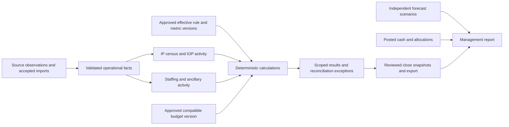

# Workbook-to-platform workflow and reuse map

Updated 2026-09-08 · Reviewable design and code-presence audit · Synthetic only

## Read this first

The restored Dunder Mifflin workbook supplies the operating functions and examples for this map. Existing Clarity code supplies implementation evidence. This document connects them without treating a spreadsheet feature, a test definition, a local preview, or a published rate as a verified production capability.

This update covers **30 workbook functions plus four platform workflows**, with a record/grain register, rule crosswalk, code references, acceptance specifications and a dependency-based build sequence. New record names below describe responsibilities; they are not new database tables, API contracts or implementation approvals.

- [Complete function matrix](evidence/WORKBOOK_PLATFORM_FUNCTION_MAP.csv): source sheets, records, rules, owner workflow, existing code, gaps, dependencies and acceptance IDs.
- [Acceptance matrix](../testing/WORKBOOK_PLATFORM_ACCEPTANCE_MATRIX.md): 40 proposed platform scenarios and exact existing test references; no new platform test execution is claimed.
- [Rule crosswalk](evidence/WORKBOOK_PLATFORM_RULE_CROSSWALK.csv): all N01–N39, distinguishing workbook examples, candidate formulas and platform requirements.
- [Sheet coverage](evidence/WORKBOOK_PLATFORM_SHEET_COVERAGE.csv): every physical sheet, including the two ungoverned blank tabs.
- [Evidence manifest](evidence/WORKBOOK_PLATFORM_EVIDENCE.json): hashes, frozen-source inventory, code baseline, validation scope and inspection findings.

Runtime/release status remains governed by [IMPLEMENTATION_STATUS](../../IMPLEMENTATION_STATUS.md) and the [Product Evidence and Decision Protocol](../governance/PRODUCT_EVIDENCE_AND_DECISION_PROTOCOL.md). This map proposes order and scope; it does not authorize live adapters, real patient data, deployment, clinical/financial decisions or a new platform implementation.

## Source versions and verification boundary

| Artifact | Identity | What the evidence supports |
|---|---|---|
| Restored workbook used for this map | /Users/tylerhebert/.codex/visualizations/2026/09/08/01a0828f-894b-74b1-adc9-903347636313/outputs/dunder-mifflin-restored-2026/Dunder Mifflin Hospital - Restored Operations 2026.xlsx; frozen SHA-256 `6e81bd61950c244e607ed03f8b0f13e1a4d0bea366ee7ad7cc54c053ef90de26` | 62 physical sheets: 60 governed, 54 tables, plus empty Sheet1/Sheet2; read-only snapshot. |
| Earlier native-tested final save | SHA-256 `67892ab3fb25c8f2af313779e46c75235c08262f4f13a47bd221bab8ccbe96de` | Prior 43 checks / 30 examples / 32 native input-change assertions; this is an earlier byte version, not a new run. |
| Current frozen-source audit | 213,027 governed formulas; 0 formula differences; 0 cached errors | Cached 43/43 checks and 30/30 examples PASS. The 30 examples cover 19 of 39 N IDs. No native recalculation/mutations were rerun. |
| Inspected application | HEAD `a44596a4704ca1039ac6c639fe5963f5c911b0d3`; isolated branch `codex/om/workbook-platform-map` | Code/schema/test definitions inspected. Original checkout branch and modified reference workbook preserved. |
| Restoration planning inputs | F01–F30; N01–N39; 25 metrics and 22 rules; 66 original-sheet dispositions | Source traceability and candidate rule intent; not runtime/production approval. |

The original source has multiple historical revisions: the earlier repository map recorded **44 sheets**, while the restoration plan classified **66 original sheets**, including newer workbook versions. These are different artifacts. The original map's 44-sheet reference graph remains available in [WORKBOOK_SHEET_LINKS_2026-09-08.csv](evidence/WORKBOOK_SHEET_LINKS_2026-09-08.csv); its exact prior narrative is in Git at `a44596a:docs/product/WORKBOOK_TO_PLATFORM_WORKFLOW_MAP.md`. The F-to-W crosswalk in the function CSV preserves its W01–W13 workflows. No legacy spreadsheet copy is required in the rebuilt product.

The saved workbook contains modeled and synthetic operating data. Tests of its arithmetic do not establish source-system accuracy, approved hospital inclusion rules, real reimbursement, authentication, database durability, staff adoption or production performance. Native Excel 5×/10× growth timing remains **No measurements found**; prior JavaScript dataset audits are a different test. Platform runtime/DB/HTTP/browser tests were **not rerun** for this documentation change.

## What changed from the older map

| Earlier mapping | Current inspected position | Required distinction |
|---|---|---|
| IOP enrollment/attendance/note/charge reconciliation described as wholly absent | Synthetic source-link contracts, local preview UI, authenticated API/gateway and persistence models now exist (C08/C09). | The local UI calls pure functions and uses React state; it is not wired to the authenticated persistence endpoints. A typed reviewer token is not a verified principal. |
| Staffing described as wholly absent | One approved daily-hours measure, effective target-hours-per-census rule, calculation contributors and close/export snapshots exist (C07). | Ten-role detail, wages, agency/one-to-one costs, staffing upload reconciliation and compatible staffing/dollar budgets remain gaps. |
| Generic budget/export reuse could look like financial parity | Current count budgets and historical census/staffing receipt export are reusable (C02/C03). | A census count, labor-hour target, dollar budget, modeled allowance, billed amount and posted cash have different meanings. |
| Formula checks could look like feature parity | Workbook and platform test evidence now have separate identifiers and states. | A passed worked example does not implement its corresponding platform workflow. |

## Parallel acceptance work and reference compatibility

During this audit, the original checkout gained uncommitted `RESTORED_WORKBOOK_ACCEPTANCE.md`, an OD-18 entry and related sequencing changes. Their inspected hashes are recorded under `concurrent_working_tree_documents` in the evidence manifest. They propose workbook acceptance and bounded golden cases before connector selection; the acceptance packet proposes an IOP handoff proof afterward. These are preserved concurrent documents, not new approvals inferred by this map. The current frozen-source formula/cache comparison adds narrower evidence; native revalidation and named operational acceptance remain separate.

Historical reuse references remain interpretable: R01→C01, R02→C02/C07, R03→C04, R04→C05, R05→C06, R06→C03, R08→C08/C09 and R09→C07. R07 remains the adjacent [bedboard prototype](../../app/src/domain/bedboard.ts), with [domain tests](../../app/src/domain/bedboard.test.ts); it is not an authoritative census ledger.

## Workspaces and record ownership

| Proposed workspace | Primary task | Functions |
|---|---|---|
| Today | Review scoped results, freshness, missing inputs and assigned exceptions | F01, F25, F27, X02–X04 |
| Operations | Reconcile admissions/census, IOP activity and staffing records | F02–F06, F13–F20 |
| Finance | Review contracts, modeled allowance, budgets, invoices, cash and scenarios | F07–F12, F21–F24, F30 |
| Close & Reports | Review completeness and immutable operational receipts/exports | F25–F28, X03 |
| Administration | Manage scope, definitions, delegated permissions, fields and source configuration | F01, F10, F26, F29, X01–X02 |

Navigation is a role/task view over shared records. A report month is a query scope, not a new table or copied worksheet. Workbook names such as `COLLECTIONS` do not redefine the meaning of a platform *closing receipt*: one is posted cash evidence, the other is operational review evidence.

Clarity owns local configuration, approved planning versions, calculated operating measures and accountable review records. EHR/program, workforce, payer, RCM and accounting systems remain authoritative for their respective source facts. Imported source changes should create accepted versions or corrections, with explicit impact on open periods and reviewed historical closes.

## Record and grain register

Each proposed record carries organization scope and a stable key. Derived values retain their contributing source revisions, metric/rule versions, calculation version and cutoff. Sensitive display fields are separate from the keys used for reconciliation.

| ID / record | Record grain | Authority and fields | Current boundary |
|---|---|---|---|
| **D01 Facility/program configuration** | Organization + facility + unit/program + effective version | Clarity configuration; source facility identity must be reconciled. Timezone, reporting calendar, program, capacity version, delegated permissions | Existing workspace/setup; program and historical capacity extensions proposed |
| **D02 Participant reference** | Organization + source system + source patient token | EHR/master identity; synthetic tokens in this exercise. Stable token; display identity separately permissioned | PatientToken/episode links adjacent; no restored patient-master adapter |
| **D03 Encounter and admission snapshots** | Organization + source encounter ID + source version | EHR encounter; Clarity preserves source reference. Patient token, admission/discharge, unit/program, admission age/state, physician, supersession | Episode foundation exists; workbook event-to-census projection missing |
| **D04 Daily census/capacity observation** | Facility/unit + service date + metric version + source revision | Approved census source; capacity configuration separately owned. Observed count, cutoff instant, missingness, source mode, capacity; derived count kept separately | Aggregate actual history exists; event reconciliation and capacity history proposed |
| **D05 IOP enrollment and plan reference** | Program + enrollment source ID; plan ID/version/effective interval | Program/EHR clinical source. Start/end/status, frequency, schedule reference, prior/step-down episode link | Synthetic reconciliation payload exists; lifecycle/scheduling UI absent |
| **D06 Attendance/session/service activity** | Attendance event ID; session ID; participant-session association | Attendance/program source. Date/time, outcome, therapist/group, delivered/group units, meal units; deduplicated patient-date; operational group-size target, definition owner/effective version and director review | Synthetic payload/link checks exist; full operating ledgers and write workflow proposed |
| **D07 Payer contract version** | Facility/program + payer/plan + service + method + effective interval + version | Finance-approved contract and applicability evidence. PER UNIT/PCT CHARGES simulation; currency, unit, approval, source, dates; public methods separate | No RevOps contract/pricing engine found |
| **D08 Service valuation and adjustment** | Source service ID + pricing-date + calculation version; signed adjustment ID | Clarity derived estimate; approved adjustment with source. Units, payer/version, gross, modeled allowance, rounding, correction linkage | Proposed; not recognized revenue or claims |
| **D09 Coverage/benefit/UR reference** | Encounter + source coverage/authorization/review ID + version | Payer/UR/benefits source and qualified reviewer. Unit type, interval, submitted/authorized/denied/pending, review time/reason, prior-history evidence | Adjacent benefits/authorization records; operating reports not connected |
| **D10 Assistance and patient-share reference** | Encounter/period + adjustment or evidence ID | Approved financial assistance and patient-liability source. Gross, contractual adjustment, charity classification, patient share, evidence status | Proposed; actual eligibility/benefit history Unknown |
| **D11 Labor observation** | Facility/program + date + role/hour category + source revision | Workforce/timekeeping source; synthetic/manual current subset. Disjoint productive/nonproductive hours, agency/one-to-one flags, effective wage references | One daily staffing-hours measure exists; role/payroll detail missing |
| **D12 Staffing target/cost rule version** | Scope + metric/role + effective interval + approved rule ID | Operations for target; finance/workforce for cost. Current target hours/census; future fixed/banded targets and wage/cost applicability | Narrow approved target rule exists; role cost engine missing |
| **D13 Approved budget version** | Scope + metric/unit + program + period + budget version | Finance-approved planning baseline. Full target, phasing profile, approval, metric snapshot, selected version | Count budget implemented; compatible staffing-hours/dollar budgets proposed |
| **D14 Invoice/lease and allocations** | Vendor + invoice/line ID + service period; payment allocation ID | Vendor/AP/accounting source. Quantity, rate, fixed fee, signed credit, payment; lease separately scoped | Proposed |
| **D15 Cash receipt/allocation** | Source receipt ID + signed transaction/reversal ID; allocation ID | Accounting/RCM posted receipt source. Posting date, amount/currency, allocated service/encounter, reversal reference | Proposed; compareRevOps collections is null |
| **D16 Forecast scenario version** | Scope + scenario/version + as-of + future period/program | Clarity finance planning. Forecast units, payer shares/rates, assumptions, version and as-of | Proposed; compareRevOps forecast is null |
| **D17 Definition/rule/calculation version** | Metric code/version + rule version + source/version inputs + run ID | Approved operating definition; deterministic Clarity calculation. Grain, unit, numerator, denominator, time basis, owner, aggregation, dependency quality | Narrow staffing metric/rule exists; general registry and run linkage proposed |
| **D18 Accepted source import** | Organization + integration/import ID + snapshot hash + source version | Source controls facts; Clarity owns acceptance/receipt. Source locator/version, exported/cutoff/observed times, mapping, rejection/replay evidence | RevOps imports and synthetic IOP imports exist; full workbook adapter absent |
| **D19 Correction/review history** | Target record ID + revision/event ID | Authorized Clarity reviewer for local correction; source correction for imported fact. Old/new, actor, reason, time, source, expected revision, supersedes | Aggregate/staffing revisions and governed-event patterns exist; extend per grain |
| **D20 Close receipt and export review** | Scope/period + receipt ID/revision; export-review ID | Clarity accountable operational close. Selected source/budget/metric/rule snapshots, reviewer, reason, prior receipt, export hash | Census/staffing receipts and separate IOP close receipts exist; consolidated close proposed |
| **D21 Custom-field definition/value snapshot** | Workspace + definition ID/version + record scope | Delegated configuration owner. Type, options, required scope, label/option history; no replacement for core units | Text/select setup/budget/actual supported; new-grain support proposed |
| **D22 IOP note/charge/billable reference** | Source note/audit/charge/billable ID + version linked to attendance | Documentation/audit and billing systems. Statuses and stable IDs only; no raw note bodies or invented charges; note author and independent auditor identity/status/reviewed time, explicit unresolved audit evidence | Synthetic link validation + persisted snapshot exists; real adapters undecided |
| **D23 Published reference release** | Publisher + document/method/version + effective dates | CMS/LDH/contract issuer. Source URL, retrieved/version date, service/facility applicability, superseded release | Workbook public references; no executable universal reimbursement authority |
| **D24 Reconciliation issue and decision** | Accepted snapshot + deterministic issue key + review ID | Clarity derives issue; qualified human reviews disposition. Affected source IDs, reason, reviewer, time, closed/superseded state | Aggregate conflict planner and synthetic IOP authenticated reviews exist |

## Function-to-platform map

`PARTIAL_REUSE` = some matching behavior exists; the full row is incomplete. `ADJACENT_ONLY` = useful nearby pattern/types, with no matching operating calculation demonstrated. `MISSING` = no matching implementation found in the inspected surfaces. C10 is a scaffold. **Every code reference is source-inspected; runtime was not rerun.** Workbook feature status and these platform statuses are independent.

| Function | Workbook source | Records | Rules | User workflow | Existing code scope | Acceptance | Phase and gap |
|---|---|---|---|---|---|---|---|
| **F01 Navigation and instructions** | INDEX; README; FEATURE_MAP | [D01](#d01), [D17](#d17) | N01 | User navigates to input, exception and report views with return/context links | [C01](#c01) — PARTIAL_REUSE | [AT01](../testing/WORKBOOK_PLATFORM_ACCEPTANCE_MATRIX.md#at01) | P0; Workbook navigation exists; application-wide role/task navigation and metric drill-down require design |
| **F02 Patient and encounter identities** | PATIENTS; ENCOUNTERS | [D02](#d02), [D03](#d03), [D19](#d19) | N02 | Admissions owner links identity, records/readmits encounter and reviews corrections | [C05](#c05) — PARTIAL_REUSE | [AT02](../testing/WORKBOOK_PLATFORM_ACCEPTANCE_MATRIX.md#at02) | P1; No restored admission-detail adapter, admission snapshot UI or event-to-RevOps join |
| **F03 Admissions geography** | ENCOUNTERS; STATE_MIX | [D03](#d03), [D17](#d17) | N03 | Operations reviews state-at-admission counts including Unknown | [C05](#c05) — ADJACENT_ONLY | [AT03](../testing/WORKBOOK_PLATFORM_ACCEPTANCE_MATRIX.md#at03) | P1; Geographic admission snapshot and report absent |
| **F04 Daily census and patient-days** | INPATIENT; ENCOUNTERS; COVERAGE | [D03](#d03), [D04](#d04), [D19](#d19) | N04; N05 | Census owner compares observed daily count with episode-derived count and resolves differences | [C01](#c01), [C02](#c02), [C05](#c05) — PARTIAL_REUSE | [AT04](../testing/WORKBOOK_PLATFORM_ACCEPTANCE_MATRIX.md#at04), [AT35](../testing/WORKBOOK_PLATFORM_ACCEPTANCE_MATRIX.md#at35) | P1; Current count source is aggregate; discharge/transfer rules and event projection unresolved |
| **F05 Monthly admissions, discharges, ADC and occupancy** | MONTHLY; DASHBOARD; SETUP; COVERAGE | [D03](#d03), [D04](#d04), [D17](#d17) | N06 | Leader reviews admissions, discharges, weighted ADC and capacity-adjusted occupancy | [C02](#c02), [C05](#c05) — PARTIAL_REUSE | [AT05](../testing/WORKBOOK_PLATFORM_ACCEPTANCE_MATRIX.md#at05) | P1; Aggregate comparisons exist; capacity history and full census statistics absent |
| **F06 Length of stay** | ENCOUNTERS; MONTHLY | [D03](#d03), [D17](#d17) | N07 | Operations reviews completed discharge cohort separately from ongoing stays | [C05](#c05) — ADJACENT_ONLY | [AT06](../testing/WORKBOOK_PLATFORM_ACCEPTANCE_MATRIX.md#at06) | P1; Completed-cohort ALOS and open-stay views absent |
| **F07 Patient-month revenue view** | SERVICE_LEDGER; ENCOUNTERS; MONTHLY | [D06](#d06), [D07](#d07), [D08](#d08) | N08; N12 | Finance reviews encounter-month service contribution and modeled allowance | [C05](#c05), [C06](#c06) — ADJACENT_ONLY | [AT07](../testing/WORKBOOK_PLATFORM_ACCEPTANCE_MATRIX.md#at07), [AT35](../testing/WORKBOOK_PLATFORM_ACCEPTANCE_MATRIX.md#at35) | P3; Service valuation and patient-month estimate not in RevOps; workbook detail does not automatically rebuild after encounter edits |
| **F08 Benefit day types and interrupted stays** | ENCOUNTERS; SERVICE_LEDGER; BENEFIT_REVIEW; BENEFITS_REFERENCE | [D03](#d03), [D09](#d09), [D23](#d23) | N09; N10 | Qualified benefits/UR reviewer confirms prior benefit history and interruption linkage | [C05](#c05), [C06](#c06) — ADJACENT_ONLY | [AT08](../testing/WORKBOOK_PLATFORM_ACCEPTANCE_MATRIX.md#at08) | P3; Workbook bands illustrative; actual benefit history and interruption applicability unresolved |
| **F09 Indigent and charity distinctions** | ENCOUNTERS; ASSISTANCE; SERVICE_LEDGER | [D08](#d08), [D10](#d10) | N11 | Finance reviews assistance classification, signed adjustments and evidence for patient share | [C06](#c06) — ADJACENT_ONLY | [AT09](../testing/WORKBOOK_PLATFORM_ACCEPTANCE_MATRIX.md#at09) | P3; Workbook fields exist; verified charity/eligibility/patient liability calculation absent |
| **F10 Extensible payer contracts and methods** | PAYERS; SERVICES; CONTRACT_RATES; PAYER_ACTIVITY; SETUP | [D01](#d01), [D07](#d07), [D23](#d23) | N12; N13; N14 | Finance adds payer/plan/service contract version, resolves overlap and approves applicability | [C01](#c01), [C04](#c04) — ADJACENT_ONLY | [AT10](../testing/WORKBOOK_PLATFORM_ACCEPTANCE_MATRIX.md#at10), [AT36](../testing/WORKBOOK_PLATFORM_ACCEPTANCE_MATRIX.md#at36) | P3; Payer identity differs from contract and payment method; no runtime rate engine |
| **F11 Payer utilization mix** | PAYER_MIX; MONTHLY | [D06](#d06), [D07](#d07), [D08](#d08), [D17](#d17) | N15 | Finance reconciles payer utilization to all source units and resolves Unknown payer | [C02](#c02), [C05](#c05) — ADJACENT_ONLY | [AT11](../testing/WORKBOOK_PLATFORM_ACCEPTANCE_MATRIX.md#at11), [AT37](../testing/WORKBOOK_PLATFORM_ACCEPTANCE_MATRIX.md#at37) | P3; Aggregate import planner does not implement payer-day allocation or mix; payer identity is required but pricing approval is not a dependency of utilization counts; priced overlay depends on F07 |
| **F12 UR and physician workflow** | UR_PAYER; ENCOUNTERS | [D03](#d03), [D09](#d09), [D24](#d24) | N16 | UR owner records source review date/reason and reconciles submitted status units | [C05](#c05), [C06](#c06) — ADJACENT_ONLY | [AT12](../testing/WORKBOOK_PLATFORM_ACCEPTANCE_MATRIX.md#at12) | P3; Episode authorization foundations exist; workbook operating UR/physician report not connected |
| **F13 IOP enrollment and pipeline** | IOP_ROSTER; IOP; IOP_VISITS | [D02](#d02), [D05](#d05), [D06](#d06) | N17; N18 | IOP director reviews enrollment/pending pipeline, frequency changes and enrollment end | [C08](#c08), [C09](#c09) — PARTIAL_REUSE | [AT13](../testing/WORKBOOK_PLATFORM_ACCEPTANCE_MATRIX.md#at13) | P2; Synthetic enrollment/plan refs exist; enrollment lifecycle/schedule/step-down editing absent |
| **F14 IOP monthly attendance grid** | IOP_ROSTER; IOP_VISITS; IOP_GRID | [D05](#d05), [D06](#d06) | N18; N19 | Program user reviews calendar states, entries/exits, scheduled visits and attendance | [C08](#c08) — PARTIAL_REUSE | [AT14](../testing/WORKBOOK_PLATFORM_ACCEPTANCE_MATRIX.md#at14) | P2; No production attendance grid or controlled writeback; local JSON preview is separate |
| **F15 IOP sessions, participant units and patient-days** | IOP_VISITS; IOP_SESSIONS; SESSION_ATTENDANCE; IOP | [D06](#d06), [D22](#d22) | N20 | Director reconciles sessions, participant services, group/non-group units and patient-days | [C08](#c08), [C09](#c09) — PARTIAL_REUSE | [AT15](../testing/WORKBOOK_PLATFORM_ACCEPTANCE_MATRIX.md#at15) | P2; IOP link reconciliation exists; complete operational counts and payment eligibility distinct; X04 documentation/charge review is a separate overlay and never blocks valid operational counts |
| **F16 IOP meals and payable attendance** | IOP_VISITS; IOP; ANCILLARY | [D06](#d06), [D14](#d14) | N21 | Program/finance reviews delivered and nonpayable meals against source visits | [C08](#c08) — ADJACENT_ONLY | [AT16](../testing/WORKBOOK_PLATFORM_ACCEPTANCE_MATRIX.md#at16) | P2; No meal/payment-quantity model; workbook arithmetic is not contract approval |
| **F17 Role-level staffing detail** | STAFF_DETAIL; STAFF_STANDARDS; STAFFING | [D11](#d11), [D17](#d17), [D19](#d19) | N22 | Staffing owner enters/imports role-level disjoint hours and resolves corrections | [C01](#c01), [C07](#c07) — PARTIAL_REUSE | [AT17](../testing/WORKBOOK_PLATFORM_ACCEPTANCE_MATRIX.md#at17) | P4; Current single daily-hours metric lacks role/category ledger and staffing upload reconciliation |
| **F18 Daily staffing budgets and rolling variance** | STAFFING; STAFF_REPORT; STAFF_STANDARDS; BUDGET | [D11](#d11), [D12](#d12), [D13](#d13), [D17](#d17) | N23; N24 | Staffing leader reviews target contributors, hours variance and seven-day trend | [C07](#c07) — PARTIAL_REUSE | [AT18](../testing/WORKBOOK_PLATFORM_ACCEPTANCE_MATRIX.md#at18), [AT36](../testing/WORKBOOK_PLATFORM_ACCEPTANCE_MATRIX.md#at36) | P4; Census-times-hours target exists; fixed/role/banded budgets and rolling window need reconciliation; use the P3 D13 budget-definition foundation, not completed F21 comparisons |
| **F19 Agency and one-to-one costs** | STAFF_DETAIL; STAFF_REPORT; MONTHLY | [D11](#d11), [D12](#d12) | N25; N26 | Finance reviews effective agency/one-to-one cost and subset disclosures | [C07](#c07) — ADJACENT_ONLY | [AT19](../testing/WORKBOOK_PLATFORM_ACCEPTANCE_MATRIX.md#at19) | P4; No wage/rate or labor-cost engine; avoid adding subset cost twice |
| **F20 Training, PTO and productive-hour definitions** | STAFFING; MONTHLY | [D04](#d04), [D11](#d11), [D17](#d17) | N22; N27 | Staffing owner classifies PTO/training and reviews productive HPPD | [C07](#c07) — PARTIAL_REUSE | [AT20](../testing/WORKBOOK_PLATFORM_ACCEPTANCE_MATRIX.md#at20) | P4; Approved hours definition exists; productive categories and HPPD not implemented |
| **F21 Revenue/labor budget comparisons** | BUDGET; MONTHLY; DASHBOARD; SETUP | [D08](#d08), [D11](#d11), [D13](#d13), [D17](#d17) | N28; N29 | Finance approves compatible program/unit budgets and reviews full/phased variances | [C02](#c02), [C07](#c07) — PARTIAL_REUSE | [AT21](../testing/WORKBOOK_PLATFORM_ACCEPTANCE_MATRIX.md#at21), [AT38](../testing/WORKBOOK_PLATFORM_ACCEPTANCE_MATRIX.md#at38) | P4; Current budget counts remain separate from staffing target calculation; no revenue/labor dollar budget; P3 defines compatible budgets, revenue comparison needs F07, and full labor comparison completes after F17-F20 in P4 |
| **F22 Ancillary invoices and lease separation** | ANCILLARY; INVOICES; MONTHLY | [D06](#d06), [D11](#d11), [D14](#d14) | N30 | Finance reconciles service invoice quantities, fixed fees, lease, credits and payments | [C01](#c01), [C03](#c03) — ADJACENT_ONLY | [AT22](../testing/WORKBOOK_PLATFORM_ACCEPTANCE_MATRIX.md#at22) | P5; No ancillary/AP workflow; receipt-export pattern is not vendor invoice generation |
| **F23 Collections and reconciliation to balances** | COLLECTIONS; RECEIPT_ALLOCATIONS; ENCOUNTERS; MONTHLY | [D08](#d08), [D15](#d15) | N31 | Finance imports posted receipts, allocates/reverses cash and reviews modeled outstanding | [C02](#c02), [C03](#c03) — MISSING | [AT23](../testing/WORKBOOK_PLATFORM_ACCEPTANCE_MATRIX.md#at23) | P5; No cash/allocation workflow; forecast/collections placeholders remain null |
| **F24 Forecast separate from actuals** | FORECAST; MONTHLY | [D07](#d07), [D13](#d13), [D16](#d16) | N32 | Finance saves scenario/as-of and changes units or payer mix independently of actuals | [C02](#c02) — MISSING | [AT24](../testing/WORKBOOK_PLATFORM_ACCEPTANCE_MATRIX.md#at24), [AT38](../testing/WORKBOOK_PLATFORM_ACCEPTANCE_MATRIX.md#at38) | P6; No forecast runtime; workbook has version/as-of drivers but no automatic actual/forecast rollforward |
| **F25 Executive reporting and charts** | DASHBOARD; MANAGEMENT_REPORT; MONTHLY | [D04](#d04), [D08](#d08), [D11](#d11), [D13](#d13), [D15](#d15), [D16](#d16), [D17](#d17), [D20](#d20) | N06; N28; N33 | Leader reviews monthly/YTD contributors and approved reports with freshness and exceptions | [C01](#c01), [C02](#c02), [C03](#c03), [C07](#c07) — PARTIAL_REUSE | [AT25](../testing/WORKBOOK_PLATFORM_ACCEPTANCE_MATRIX.md#at25), [AT35](../testing/WORKBOOK_PLATFORM_ACCEPTANCE_MATRIX.md#at35), [AT37](../testing/WORKBOOK_PLATFORM_ACCEPTANCE_MATRIX.md#at37), [AT38](../testing/WORKBOOK_PLATFORM_ACCEPTANCE_MATRIX.md#at38), [AT40](../testing/WORKBOOK_PLATFORM_ACCEPTANCE_MATRIX.md#at40) | P6; Count/staffing close exports exist; full cross-domain dashboard and consolidation absent |
| **F26 Metric dictionary and rule registry** | DEFINITIONS; FORMULA_CATALOG; FEATURE_MAP | [D17](#d17), [D23](#d23) | N34 | Definition owner reviews metric grain, rule semantics, effective versions and examples | [C07](#c07), [C10](#c10) — PARTIAL_REUSE | [AT26](../testing/WORKBOOK_PLATFORM_ACCEPTANCE_MATRIX.md#at26), [AT36](../testing/WORKBOOK_PLATFORM_ACCEPTANCE_MATRIX.md#at36) | P0; Narrow staffing definition is separate from analytics scaffold; general approved registry absent |
| **F27 Decisions, source reconciliation and change history** | CORRECTIONS; SOURCE_FORMULAS; SOURCE_MAP; README | [D18](#d18), [D19](#d19), [D20](#d20), [D24](#d24) | N35 | Reviewer traces source, decision and correction without rewriting history | [C01](#c01), [C02](#c02), [C05](#c05), [C09](#c09) — PARTIAL_REUSE | [AT27](../testing/WORKBOOK_PLATFORM_ACCEPTANCE_MATRIX.md#at27) | P0; Existing scoped history reusable; Excel journal editable and no cross-domain correction-impact model |
| **F28 Feature completeness and regression tests** | CHECKS; PRESSURE_TEST; INDEX; EXAMPLES; FEATURE_MAP; COVERAGE | [D17](#d17), [D18](#d18) | N36 | Product/reviewer checks every feature, rule and workflow against evidenced acceptance | [C02](#c02), [C03](#c03), [C07](#c07), [C08](#c08), [C09](#c09) — PARTIAL_REUSE | [AT28](../testing/WORKBOOK_PLATFORM_ACCEPTANCE_MATRIX.md#at28), [AT40](../testing/WORKBOOK_PLATFORM_ACCEPTANCE_MATRIX.md#at40) | P0; 30 examples/32 mutations do not cover all39 rule acceptances; platform-wide parity unproven |
| **F29 Lookup and expansion design** | INDEX; PAYERS; SERVICES; PATIENTS; ENCOUNTERS; CONTRACT_RATES; IOP_ROSTER; IOP_VISITS; SERVICE_LEDGER; STAFF_STANDARDS; STAFF_DETAIL; COLLECTIONS; RECEIPT_ALLOCATIONS; FORECAST; PRESSURE_TEST | [D01](#d01), [D17](#d17), [D18](#d18) | N37; N38 | Administrator expands, sorts/imports and checks stable identity, correctness and workload latency | [C01](#c01), [C03](#c03), [C09](#c09) — PARTIAL_REUSE | [AT29](../testing/WORKBOOK_PLATFORM_ACCEPTANCE_MATRIX.md#at29), [AT40](../testing/WORKBOOK_PLATFORM_ACCEPTANCE_MATRIX.md#at40) | P0; Structured keys do not prove growth; native Excel and production application growth unmeasured |
| **F30 2026 payment references and calculation scope** | MEDICARE_REFERENCE; IPF_FACTORS; BENEFITS_REFERENCE; LA_IP_JAN_JUN; LA_IP_JUL_DEC; LA_SBH_CPT; LA_SBH_HCPCS; LA_SBH_ADULT_SMI; LA_SBH_CRISIS; LA_SBH_MHR; LA_SBH_PROVIDER; LA_SBH_CSOC; LA_SBH_MODIFIERS; LA_SBH_JAN_REFERENCE; DECISIONS; CONTRACT_RATES; SETUP | [D07](#d07), [D09](#d09), [D23](#d23) | N39 | Finance validates release, dates, facility/service applicability and payer distinctions | [C06](#c06) — ADJACENT_ONLY | [AT30](../testing/WORKBOOK_PLATFORM_ACCEPTANCE_MATRIX.md#at30) | P3; Published reference is not facility pricing; genuine Medicare/Medicaid/commercial application remains unresolved |
| **X01 Facility setup, permissions and custom fields** | Platform/source workflow | [D01](#d01), [D21](#d21) | P01 | Administrator configures scope, delegated actions and typed field definitions | [C01](#c01), [C04](#c04), [C09](#c09) — PARTIAL_REUSE | [AT31](../testing/WORKBOOK_PLATFORM_ACCEPTANCE_MATRIX.md#at31), [AT39](../testing/WORKBOOK_PLATFORM_ACCEPTANCE_MATRIX.md#at39) | P0; Core setup/fields exist; IOP program delegation and new-grain types require review |
| **X02 Safe source import and reconciliation** | Platform/source workflow | [D18](#d18), [D19](#d19), [D24](#d24) | P02 | Data owner validates format and authority, previews source changes, then resolves conflicts or reviews linked-source exceptions | [C01](#c01), [C03](#c03), [C09](#c09) — PARTIAL_REUSE | [AT32](../testing/WORKBOOK_PLATFORM_ACCEPTANCE_MATRIX.md#at32), [AT37](../testing/WORKBOOK_PLATFORM_ACCEPTANCE_MATRIX.md#at37), [AT39](../testing/WORKBOOK_PLATFORM_ACCEPTANCE_MATRIX.md#at39) | P0; Count imports and synthetic IOP path exist; full workbook/staffing/EHR/RCM adapters absent; valid IOP snapshots with orphan links are accepted as evidence with issues, not rejected wholesale |
| **X03 Reviewed close, reopening and export** | Platform/source workflow | [D13](#d13), [D17](#d17), [D19](#d19), [D20](#d20) | N35; P03 | Authorized reviewer closes, reopens, corrects, recloses and exports a preserved report | [C01](#c01), [C02](#c02), [C03](#c03), [C07](#c07), [C09](#c09) — PARTIAL_REUSE | [AT33](../testing/WORKBOOK_PLATFORM_ACCEPTANCE_MATRIX.md#at33), [AT35](../testing/WORKBOOK_PLATFORM_ACCEPTANCE_MATRIX.md#at35), [AT39](../testing/WORKBOOK_PLATFORM_ACCEPTANCE_MATRIX.md#at39) | P0; Census/staffing and IOP closes have different contracts; no consolidated or IOP reopen cycle |
| **X04 IOP documentation, charge and EMR reconciliation** | Platform/source workflow | [D05](#d05), [D06](#d06), [D18](#d18), [D22](#d22), [D24](#d24), [D20](#d20) | P04 | IOP reviewer matches plan/attendance/note-audit/charge/billable refs and reviews exceptions before close | [C08](#c08), [C09](#c09) — PARTIAL_REUSE | [AT34](../testing/WORKBOOK_PLATFORM_ACCEPTANCE_MATRIX.md#at34), [AT39](../testing/WORKBOOK_PLATFORM_ACCEPTANCE_MATRIX.md#at39) | P2; Backend synthetic import/review/close exists; current UI local preview is not wired to it; real sources unapproved |

## Code and test evidence register

All paths/symbols were inspected at `a44596a4704ca1039ac6c639fe5963f5c911b0d3`. Existing tests are evidence targets with source-matched names; their presence is not a new passing result. The acceptance matrix identifies proposed coverage beyond them.

### C01 — Aggregate RevOps workspace, setup and persistence

- [packages/domain-contracts/src/revOps.ts](../../packages/domain-contracts/src/revOps.ts): `RevOpsSetupSchema`, `RevOpsCommandSchema`, `RevOpsClosingReceipt`, `REV_OPS_CENSUS_METRIC`, `RevOpsReconciliationSchema`.
- [packages/case-repository/src/revOpsGateway.ts](../../packages/case-repository/src/revOpsGateway.ts): `PrismaRevOpsGateway`, `comparison`, `execute`, `history`, `exportContext`, `exportEvent`.
- [app/src/workspaces/RevOps.tsx](../../app/src/workspaces/RevOps.tsx): `RevOps`.

Boundary: RevOps actuals are aggregate midnight census counts, not encounter records, billed days, collected cash or earned revenue. REV_OPS_CENSUS_METRIC retains validation_status=unverified and null hospital inclusion rules; workbook convention does not approve those operational rules. No automatic bridge from episode admissions/discharges to this aggregate RevOps state was found in the inspected implementation.

Test references: [tests/unit/rev-ops-calendar.test.ts](../../tests/unit/rev-ops-calendar.test.ts), [tests/unit/rev-ops-month-close.test.ts](../../tests/unit/rev-ops-month-close.test.ts), [tests/integration/rev-ops.test.ts](../../tests/integration/rev-ops.test.ts) Names and invocation scope are listed in the acceptance matrix.

### C02 — Census/calendar/budget/reconciliation/close calculations

- [packages/rev-ops-service/src/index.ts](../../packages/rev-ops-service/src/index.ts): `createRevOpsState`, `daysInPeriod`, `midnightEnding`, `applyRevOpsCommand`, `monthCloseReadiness`, `compareRevOps`.
- [packages/rev-ops-service/src/reconciliation.ts](../../packages/rev-ops-service/src/reconciliation.ts): `planReconciliation`.

Boundary: RevOps actuals are aggregate midnight census counts, not encounter records, billed days, collected cash or earned revenue. REV_OPS_CENSUS_METRIC retains validation_status=unverified and null hospital inclusion rules; workbook convention does not approve those operational rules. No automatic bridge from episode admissions/discharges to this aggregate RevOps state was found in the inspected implementation.

Test references: [tests/unit/rev-ops-calendar.test.ts](../../tests/unit/rev-ops-calendar.test.ts), [tests/unit/rev-ops-month-close.test.ts](../../tests/unit/rev-ops-month-close.test.ts), [tests/integration/rev-ops.test.ts](../../tests/integration/rev-ops.test.ts) Names and invocation scope are listed in the acceptance matrix.

### C03 — Bounded file import and historical receipt export

- [packages/api-service/src/revOpsImport.ts](../../packages/api-service/src/revOpsImport.ts): `RevOpsUploadSchema`, `parseRevOpsUpload`.
- [packages/api-service/src/revOpsXlsx.ts](../../packages/api-service/src/revOpsXlsx.ts): `readRevOpsXlsx`.
- [packages/api-service/src/revOpsExport.ts](../../packages/api-service/src/revOpsExport.ts): `EXPORT_LIMITS`, `EXPORT_TEMPLATE`, `receiptHash`, `buildExportDocument`.

Boundary: Upload kind is budget or actuals, with date/count or budget mappings; not arbitrary workbook table ingestion. Current upload limits include 1 MiB decoded file, 366 records and 40 columns. Formula cells and cached formula results are rejected. A restored 60-sheet formula workbook cannot be treated as an already-supported platform import. A bounded, source-traceable adapter or reviewed values-only extract is a separate deliverable. Custom-field scopes are setup, budget and actual; these metadata fields do not supply missing financial or clinical domain behavior.

Test references: [tests/unit/rev-ops-xlsx.test.ts](../../tests/unit/rev-ops-xlsx.test.ts), [tests/unit/rev-ops-fields.test.ts](../../tests/unit/rev-ops-fields.test.ts), [tests/integration/rev-ops.test.ts](../../tests/integration/rev-ops.test.ts) Names and invocation scope are listed in the acceptance matrix.

### C04 — Typed custom-field metadata

- [packages/domain-contracts/src/revOps.ts](../../packages/domain-contracts/src/revOps.ts): `RevOpsFieldScopeSchema`, `RevOpsFieldDefinitionSchema`, `RevOpsFieldSnapshot`.
- [packages/rev-ops-service/src/customFields.ts](../../packages/rev-ops-service/src/customFields.ts): `defineCustomField`, `fieldSnapshots`, `onboardingStatus`.
- [app/src/workspaces/RevOpsFields.tsx](../../app/src/workspaces/RevOpsFields.tsx): `CustomFieldSetup`, `EntryFields`, `SnapshotValues`, `ActualEntry`.

Boundary: Upload kind is budget or actuals, with date/count or budget mappings; not arbitrary workbook table ingestion. Current upload limits include 1 MiB decoded file, 366 records and 40 columns. Formula cells and cached formula results are rejected. A restored 60-sheet formula workbook cannot be treated as an already-supported platform import. A bounded, source-traceable adapter or reviewed values-only extract is a separate deliverable. Custom-field scopes are setup, budget and actual; these metadata fields do not supply missing financial or clinical domain behavior.

Test references: [tests/unit/rev-ops-xlsx.test.ts](../../tests/unit/rev-ops-xlsx.test.ts), [tests/unit/rev-ops-fields.test.ts](../../tests/unit/rev-ops-fields.test.ts), [tests/integration/rev-ops.test.ts](../../tests/integration/rev-ops.test.ts) Names and invocation scope are listed in the acceptance matrix.

### C05 — Episode identity, service dates and UR history

- [packages/domain-contracts/src/episode.ts](../../packages/domain-contracts/src/episode.ts): `AdmissionHandoffCommandSchema`, `EpisodeSchema`, `CaseEpisodeLinkSchema`, `FacilityTimezoneConfigSchema`, `serviceDateForInstant`, `transitionEpisodeStatus`.
- [packages/domain-contracts/src/utilizationReview.ts](../../packages/domain-contracts/src/utilizationReview.ts): `InclusiveDateRangeSchema`, `EpisodeAuthorizationSchema`, `AuthorizationReviewSchema`, `AuthorizationDayDecisionSchema`, `DocumentationGapSchema`, `UrAssignmentSchema`, `AuthorizationReviewCorrectionSchema`.
- [packages/case-repository/src/episodePersistenceGateway.ts](../../packages/case-repository/src/episodePersistenceGateway.ts): `PrismaEpisodePersistenceGateway`, `recordFacilityTimezoneConfiguration`, `recordAdmission`, `recordEpisodeAuthorization`, `recordAuthorizationReview`, `correctAuthorizationReview`, `recordDocumentationGap`, `transitionDocumentationGap`.

Boundary: Authorization review days are inclusive. Workbook occupancy is admission-inclusive/discharge-exclusive; do not copy one convention into the other. The inspected gateway has no full workbook encounter/LOS/census revenue report or workbook import. Lifecycle schema presence does not prove a discharge command, ALOS calculation or episode-to-RevOps reconciliation.

Test references: [tests/integration/s2-episode-persistence.test.ts](../../tests/integration/s2-episode-persistence.test.ts), [tests/unit/episode-utilization-contracts.test.ts](../../tests/unit/episode-utilization-contracts.test.ts) Names and invocation scope are listed in the acceptance matrix.

### C06 — Benefits and payer evidence

- [packages/domain-contracts/src/benefits.ts](../../packages/domain-contracts/src/benefits.ts): `COVERAGE_TYPES`, `SERVICE_TYPES`, `NETWORK_STATUSES`, `ClarityBenefitVerification`, `BENEFIT_DISCLAIMER`, `presentBenefitQuote`.
- [packages/benefits-service/src/benefitsCommandService.ts](../../packages/benefits-service/src/benefitsCommandService.ts): `BenefitsCommandService`, `BENEFITS_AUDIT_ACTIONS`, `recordInsuranceCoverage`, `verifyEligibility`, `recordBenefitVerification`, `recordFinancialEducation`.

Boundary: Coverage types distinguish Medicare, Medicaid, Medicare Advantage, commercial, supplemental, TRICARE, self-pay, other and unknown; network status is separate. No effective-dated provider contract allowance engine, HMO/PPO/EPO/ASO pricing matrix, facility Medicare/Medicaid PPS calculation or 2026 published rate ingestion was found in these benefit implementations. Benefits quotes, deductible/coinsurance/copay evidence and eligibility verification are not the workbook's modeled facility revenue or actual payment. No automated benefit-day/lifetime-reserve/interrupted-stay adjudication should be inferred from these types.

Test references: [tests/integration/benefits-command-service.test.ts](../../tests/integration/benefits-command-service.test.ts), [tests/workflow/benefits.test.ts](../../tests/workflow/benefits.test.ts) Names and invocation scope are listed in the acceptance matrix.

### C07 — Approved staffing-hours metric/target and close

- [packages/domain-contracts/src/revOps.ts](../../packages/domain-contracts/src/revOps.ts): `RevOpsStaffingMetric`, `RevOpsStaffingRule`, `RevOpsStaffingActual`, `RevOpsStaffingComparison`.
- [packages/rev-ops-service/src/index.ts](../../packages/rev-ops-service/src/index.ts): `staffingComparison`, `applyRevOpsCommand`, `monthCloseReadiness`.
- [packages/case-repository/src/revOpsGateway.ts](../../packages/case-repository/src/revOpsGateway.ts): `PrismaRevOpsGateway.execute`, `PrismaRevOpsGateway.comparison`.
- [packages/api-service/src/revOpsExport.ts](../../packages/api-service/src/revOpsExport.ts): `buildExportDocument`.

Boundary: Expected hours equal census multiplied by the applicable approved targetHoursPerCensus rule. This is an operational target, not a mandated clinical staffing ratio. The workbook's ten role categories, role wages, agency and one-to-one subsets, PTO/training costs, seven-day rollups and IP/IOP cost allocations are not supplied by this aggregate staffing implementation. Workbook HPPD and a configured platform staffing metric require an explicit definition/unit mapping; similar labels alone are insufficient.

Test references: [tests/unit/rev-ops-month-close.test.ts](../../tests/unit/rev-ops-month-close.test.ts), [tests/unit/rev-ops-export.test.ts](../../tests/unit/rev-ops-export.test.ts) Names and invocation scope are listed in the acceptance matrix.

### C08 — Synthetic IOP link validation and local preview

- [packages/domain-contracts/src/iopReconciliation.ts](../../packages/domain-contracts/src/iopReconciliation.ts): `IopReconciliationSampleSchema`, `IopReconciliationIssue`, `validateIopReconciliationSample`.
- [packages/domain-contracts/src/iopReconciliationImport.ts](../../packages/domain-contracts/src/iopReconciliationImport.ts): `IopReconciliationImportSchema`, `IopReconciliationPreview`, `IopReconciliationCloseReceipt`, `previewIopReconciliationImport`, `closeIopReconciliationImport`.
- [app/src/workspaces/IopReconciliation.tsx](../../app/src/workspaces/IopReconciliation.tsx): `IopReconciliation`.
- [app/src/App.tsx](../../app/src/App.tsx).

Boundary: This is not the workbook's year-long enrollment/scheduling/attendance/meals/session-count/revenue engine. Contract bounds are 100 enrollments/plans and 500 attendance/audit/charge/billable/review records per sample; one top-level serviceDate requires a bounded program-day mapping. Date strings use a format regex in this schema. Real calendar validity and date-range rules need further validation before adopting workbook edge-case guarantees. Maps are keyed by attendance/plan IDs and no general entity-ID uniqueness validation was found in the sample schema; duplicate source-entity handling needs an explicit adapter rule. Charge and EMR statuses are stored but linkage success does not assert that status is billable or payable. Loads fixture or local JSON, calls previewIopReconciliationImport/closeIopReconciliationImport, stores state only in React and accepts a typed reviewer token. Does not call /api/iop routes, load persisted imports or use server-derived reviewer identity. Do not present the visible close as a persisted authenticated close.

Test references: [tests/unit/iop-reconciliation-sample.test.ts](../../tests/unit/iop-reconciliation-sample.test.ts), [tests/unit/iop-reconciliation-import.test.ts](../../tests/unit/iop-reconciliation-import.test.ts), [app/src/workspaces/IopReconciliation.test.tsx](../../app/src/workspaces/IopReconciliation.test.tsx) Names and invocation scope are listed in the acceptance matrix.

### C09 — Authenticated synthetic IOP API and persistence

- [packages/domain-contracts/src/iopPersistence.ts](../../packages/domain-contracts/src/iopPersistence.ts): `IOP_SOURCE_RECORD_TYPES`, `IopPersistedImportRequestSchema`, `IopCloseRequestSchema`, `IopExceptionReviewRequestSchema`, `iopPermissionsFor`.
- [packages/api-service/src/iopReconciliationRoutes.ts](../../packages/api-service/src/iopReconciliationRoutes.ts): `registerIopReconciliationRoutes`.
- [packages/case-repository/src/iopReconciliationGateway.ts](../../packages/case-repository/src/iopReconciliationGateway.ts): `PrismaIopReconciliationGateway`, `IopReconciliationError`, `import`, `get`, `review`, `close`.
- [packages/api-service/src/server.ts](../../packages/api-service/src/server.ts): `createApiServer`.
- [packages/api-service/src/devMain.ts](../../packages/api-service/src/devMain.ts).
- [prisma/schema.prisma](../../prisma/schema.prisma): `IopSourceIntegration`, `IopReconciliationImport`, `IopReconciliationExceptionReview`, `IopReconciliationCloseReceipt`.
- [prisma/migrations/20260908000100_iop_reconciliation_persistence/migration.sql](../../prisma/migrations/20260908000100_iop_reconciliation_persistence/migration.sql).

Boundary: No IOP-specific RLS policy or append-only database trigger was found in the only migration referencing these IOP tables. Service transaction/tenant checks and schema comments do not prove database immutability or RLS. Gateway validates facility ownership and tenant integration, but does not resolve program ownership or bind an integration to a program. request.programId is not compared with reconciliation.programId. Source record identities/versions are persisted in JSON, not as individually indexed source-entity records with global source-version uniqueness. No implemented reopen/supersession lifecycle was found for an IOP close. The gateway accepts any active configured integration for the tenant with a synthetic-only payload. The documented/seeded approved key is SYNTHETIC_IOP_PROGRAM; it is not a hardcoded sole allowed key in the gateway.

Test references: [tests/unit/iop-persistence-contracts.test.ts](../../tests/unit/iop-persistence-contracts.test.ts), [tests/integration/iop-reconciliation-persistence.test.ts](../../tests/integration/iop-reconciliation-persistence.test.ts) Names and invocation scope are listed in the acceptance matrix.

### C10 — Analytics metric-definition scaffold

- [packages/domain-contracts/src/analytics.ts](../../packages/domain-contracts/src/analytics.ts): `MetricDefinitionSchema`, `DRAFT_METRIC_DEFINITIONS`, `classifyMetricMeasurement`.

Boundary: Draft analytics contracts do not establish a durable RevOps-wide approved registry. Staffing definition is a separate narrow contract.

Test references: No matching runtime registry test claimed. Names and invocation scope are listed in the acceptance matrix.

## Rule decisions that must stay visible

| Decision | Source distinction | Proposed platform handling / acceptance |
|---|---|---|
| Occupancy versus UR dates | Workbook occupancy uses admission-inclusive/discharge-exclusive dates; existing UR authorization ranges are inclusive. Aggregate midnight labels do not resolve event-at-midnight or transfer attribution. | Keep separate rules and source timezones; obtain hospital attribution decision before event aggregation. AT04, AT12, AT35. |
| Service-day correction | Workbook encounter corrections can invalidate service detail; they do not constitute an automatic regenerated service ledger. | Derive or reconcile affected service records explicitly and identify every affected period; preserve closed receipts. AT07, AT35. |
| Seven-day staffing average | N24 planning text requests a complete seven-day window; a workbook worked example permits an available-day mean (600/5 = 120). | Choose a named, versioned measure with visible denominator. Never label a five-day result as complete seven-day coverage. AT18. |
| Allowance adjustments | N11 describes signed adjustments; the current assistance sheet includes classification/memo fields and Unknown patient-share evidence. | Avoid applying the same adjustment in both valuation and a memo rollup. Patient share is not automatically an additional expense. AT09. |
| Enrollment-state filter | N17's preserved candidate COUNTIFS filters dates only and omits enrolled/valid-state predicates. | Require valid ENROLLED status; count active pending referrals only in pipeline. AT13. |
| IOP units and review | Enrollment, scheduled days, attended patient-days, sessions and participant services are distinct. Source note/charge/billable linkage is an additional workflow absent from the workbook's income proxy. | Explicit grains and source references; a reviewed exception or attended day never creates a billable charge. AT13–AT16, AT34. |
| Payer identity and pricing | Payer category, product/plan, network, contract, benefit liability and facility payment method are separate dimensions. Calendar 2026 is not a single effective payment release. | R-20 workbook prose about Unknown is stale relative to the implemented Unknown-unit bucket. Preserve units independently. Versioned applicability; public references remain evidence; actual facility pricing is Unknown until qualified approval and calculation proof. AT08–AT12, AT30. |
| Staffing definitions/rules | Current service selects an approved metric through cutoff and latest applicable rule per date. Tie dates and mid-period metric changes need additional proof. | No implicit tie-break or relabeling of historical inputs; approve selection policy and reproduce old results. AT26, AT36. |
| Quality gates | Workbook-wide validation can suppress broader outputs than the defective source warrants. | Track quality per dependency/scope; show unaffected results, explicit zero and missing states separately. AT25, AT37. |
| Budget/forecast/cash | Budget=count in the current application; staffing target is a calculation; forecast/collections remain null. | Typed unit/program/currency/time compatibility. Forecast changes cannot mutate actuals, approved budget or posted receipts. AT21, AT24, AT38. |

## Build sequence and dependencies

This is a **recommended dependency order**, not a newly authorized roadmap or a mandate to repeat completed code. P0 pins the reviewed workbook version, obtains named dispositions for the selected feature subset, establishes its source contract and verifies/reuses existing controls; it does not require a universal rule engine before a bounded workflow. Shared functions are expanded only when their owning slice needs them.

| Phase | Bounded deliverable | Depends on | Exit evidence / decision |
|---|---|---|---|
| P0 — Reconcile baseline | Freeze feature/rule/source versions; confirm reusable aggregate close and staffing loop; define source modes, roles and minimal compatible metric definitions. | This map and current code baseline | No unassigned F/N/sheet IDs; AT01, AT26–AT29, AT31–AT33 and AT36–AT39 scoped to the selected next proof. Record source/permission decisions and unresolved gaps. |
| P1 — IP activity to close | Link source encounters to patient-day projections, compare with aggregate census, handle correction impact and show admissions/ALOS/occupancy. Keep aggregate imports as a separately named source mode. | P0; F02 then F04, with hospital event/cutoff/transfer rules approved | AT02–AT06, AT35. One synthetic month closes and recloses without double counting or rewriting prior receipts. |
| P2 — IOP operating/reconciliation loop | Connect authenticated review UI to existing synthetic API; map bounded program-day source IDs; extend enrollment/schedule/session/meal measures. | P0; approved synthetic program/role/source semantics; F13→F14→F15/F16 and X04 | AT13–AT16, AT34, AT39. Program identity, duplicates, calendar validity and closed-review behavior proven. Real adapter remains blocked by its decision packet. |
| P3 — Financial semantics and allowance | Define payer/contract applicability and compatible program budgets; implement scoped modeled service allowance and source-linked UR/assistance views. | P0 definitions; P1 activity or P2 IOP activity; F30→F10→F07, with F21 typed budgets | AT07–AT12, AT30, AT38; AT21 financial comparisons complete after compatible labor facts in P4. Fictional fixtures first; true reimbursement methods require separate qualified approval. |
| P4 — Role staffing and cost | Extend the current one-measure target loop to source-reconciled role hours, subsets, rolling measures, HPPD and approved cost inputs. | P1 census; P0 definitions; P3 typed budget contract where comparisons need it | AT17–AT21, AT36; role/subset arithmetic reconciles and missing cost rates stay visible. |
| P5 — Invoice and cash reconciliation | Source-backed ancillary/AP quantities and signed posted receipts/allocations with reversal history. | P1/P2 quantities, P3 valuations, P4 where labor contributes | AT22–AT23, AT32–AT33. Invoice, cash and modeled outstanding stay distinct; no posting effects implied. |
| P6 — Forecast and management package | Independent scenarios and cross-domain monthly/YTD views with drill-down and complete close coverage. | P1–P5 outputs required by selected report; F24 then F25 | AT24–AT25, AT38, AT40. Correctness, data-quality scope, operator usefulness and agreed workload performance evidenced. |
| P7 — Controlled source pilot | Named systems/owners, approved minimal data, actual-role access and recovery/operating procedures; compare selected workflow with the existing operating process. | Relevant preceding slice; approved source/security/operational decisions | Direct HTTP/DB tenant controls, persistence/recovery, source reconciliation and user acceptance; no real-data or production claim from this document. |

P1 and P2 can be scheduled independently after their P0 prerequisites. The existing source-adapter decision work is not discarded. Next implementation selection remains behind workbook acceptance and a scoped gap review. The concurrent acceptance packet proposes a bounded IOP handoff proof; P1's IP activity-to-close path remains a dependency option, not a competing priority decision. This map authorizes neither implementation path.

## Omissions, blockers and decision owners

| Gap | Evidence and impact | Proposed owner | Required next decision/proof |
|---|---|---|---|
| Whole-workbook import | Current upload supports bounded budget/actual rows; rejects formulas/cached formula values and limits file/row/column counts. The 62-sheet source is not a supported direct upload. | Technical + data owner | A reviewed values-only/source adapter with explicit grain, provenance and duplicate rules; no automatic whole-year import. |
| IOP UI-to-API connection | Local preview/typed reviewer differs from persisted server-authenticated import/review/close. | Product + technical | Connect and test the approved synthetic workflow; preserve demonstration/receipt distinction. |
| IOP program authorization | Gateway checks facility ownership and tenant integration but does not resolve program ownership, bind integration to program, or compare request and sample program IDs. | Security + IOP operations + technical | Define and implement program binding/denials; AT31, AT34, AT39. |
| IOP database controls | The inspected IOP migration defines tables/indexes/FKs; no IOP RLS policy or database append-only trigger was found. | Security + technical | Migration/control review and direct database denial/immutability proof; gateway test presence is insufficient. |
| IOP source validation | Bounded payloads need explicit duplicate-entity, real-calendar, plan applicability and source-version rules. Current approved source is synthetic; real source owners/exports are Unknown. | IOP operations + informatics + RCM | Follow [source-adapter decision packet](IOP_SOURCE_ADAPTER_DECISION_PACKET.md), retaining its approval record and cutoff/lag requirements. |
| IOP close supersession | Closed-import review cannot be reopened through an implemented lifecycle. A newer snapshot does not itself define reopening policy. | IOP operations + compliance + technical | Separate late correction/supersession/review-cycle design; AT33–AT35. |
| Source-to-event day rules | Aggregate census and episode foundation do not prove event-derived midnight inclusion, transfers or discharge operations. | Hospital operations + clinical informatics | Approve inclusion/time rules and reconciled source mode before P1. |
| Revenue/benefit authority | Workbook rates are fictional applied contracts; benefit bands and patient share do not supply actual history/eligibility. | Finance + UR/benefits | Approve applicable sources/method versions and independent expected results before real pricing. |
| Financial/staffing budget compatibility | Count budget and census-based staffing target are currently separate. | Finance + staffing owner | Approve typed hours/dollar budget semantics and phasing; no cross-unit comparison. |
| Adoption and scale | No staff-use, pilot outcome, production workload or native Excel growth proof is established here. | Product + operations + technical | Agree measurable workload and acceptance thresholds before AT40; record observed results separately. |

Source-specific users and approver names remain **[Unassigned]**. The remaining code and source gaps are explicit design/verification work, not permission questions blocking completion of this map.

## Validation of this documentation package

See the documentation-validation result in the [evidence manifest](evidence/WORKBOOK_PLATFORM_EVIDENCE.json). Structural validation checks all 34 function IDs, 24 record IDs, 39 rule IDs, 40 acceptance IDs, 62 sheet dispositions, code/test paths and exact test-name references, local links and an acyclic function dependency graph.

Application tests, database migrations, native Excel recalculation, browser journeys, live-source access and production benchmarks were not run for this documentation change. Existing test names remain `NOT_RERUN`; proposed AT scenarios remain `PROPOSED_NOT_EXECUTED`.

No application code, contracts, migrations or reference workbooks were changed. The original working-tree workbook modification remains untouched. The design records each function's owner workflow, record grain, rule mapping, code-presence boundary, acceptance requirement and build dependencies so a later implementation can be reviewed against the same scope.
