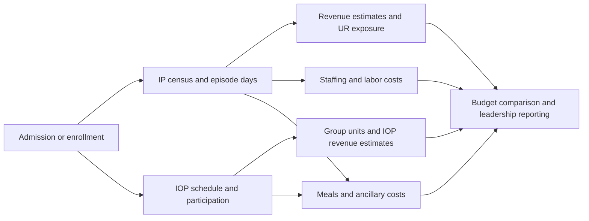
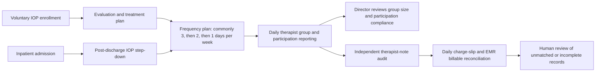

# Workbook-to-platform workflow and reuse map

Review draft · 2026-09-08 · Documentation only

**Restoration addendum:** the [restored workbook acceptance and reconciliation packet](RESTORED_WORKBOOK_ACCEPTANCE.md)
maps F01–F30 to current code and supersedes this document's next-slice recommendation.
The 44-sheet inventory below remains evidence about the legacy workbook, not the
restored candidate. W03/W04's absence claims predate synthetic IOP contracts and
review/close persistence; use R08 in the addendum for the current bounded surface.
W08/W09's staffing gaps must be read alongside the existing aggregate
`staffingComparison` implementation (R09); role-level costing parity remains open.

## Purpose and evidence boundary

Translate the full operating workbook into connected, reusable tools before selecting another implementation slice. This is the product baseline for subsequent market research. It does not claim functional parity or authorize additional APIs, production use, or integrations.

Primary source: [Reporting Metrics Ops and Budget .xlsx](../../reference/source-documents/clarity-mh-sources/Reporting%20Metrics%20Ops%20and%20Budget%20.xlsx). Inspected the current saved working-tree file, which was already modified when this audit began. Preserved that modification. SHA-256: `611e1a299d991716d5520d805ff8e9f693e050a397a30f76894a3866203613cb`.

Code baseline: `32e280066251c93ae2ea433b76ef4e05a2e66570`, branch `codex/om/rev-ops-export-brief`. Reuse means source code was inspected; runtime tests were not rerun for this documentation audit. Export code is present on this branch; this is not a merge or deployment claim. Existing test paths below are verification targets, not newly passing results.

Reused the earlier [reverse engineering](../../reporting-metrics-rebuild-package/REPORTING_METRICS_REVERSE_ENGINEERING.md) and [metric definitions](../../reporting-metrics-rebuild-package/METRIC_DEFINITIONS.md), then checked current worksheet structure, labels, and direct formula references. Earlier formula/error counts are not adopted as current findings. Proposed durable metric definitions in those documents are not automatically approved hospital rules.

The current saved workbook has 44 sheets: 12 staffing, 12 revenue, 12 IOP attendance, six other operating/reporting sheets, and two empty sheets. Every sheet is assigned below. Workflow descriptions group recurring monthly structures; they do not assert that every month has identical columns or formulas.

## Connected operating model

This is the proposed software relationship, not a literal reproduction of every spreadsheet reference:

Keep patient activity, service units, money, and cash distinct. A reporting period is a filter, not a new data model or copied worksheet. Shared configuration should own facility labels, calendar definitions and effective-dated rates that currently live in unrelated sheets.

## Workflow translation and code reuse

Exact code locations and test targets are in the reuse register. The IOP director workflow below is owner-confirmed in this product discussion; it remains a product requirement to translate and verify, rather than evidence that the current code implements it.

| ID / workflow | Workbook evidence and task | Proposed reusable tool / record grain | Existing reuse | Missing behavior and acceptance focus |
|---|---|---|---|---|
| W01 Admission and origin reporting | `Admissions` monthly blocks beginning A2:G4 and H2:N4; later blocks start rows 41, 76, 112, 148, 184. Record admissions and state-of-origin totals; YTD rows 50–55 consolidate. | Admissions owner records one admission linked to existing identity, date, facility and source geography. Monthly totals are projections. | R04 episode identity/admission persistence; R01 facility/workspace access patterns. | No demonstrated origin-report-to-RevOps connection. Confirm event versus person count, readmissions, state definitions and correction effects. |
| W02 Inpatient daily operations | `Daily Census IP 2012!A3:AK41`: monthly census, admits and discharges; `2012 YTD Summary!A3:O10`: ADC, LOS, patient/discharge days. | Census owner reconciles episode movements with one facility/unit/service-date count; report cohort-specific LOS and capacity. | R01 daily aggregate entry; R02 calendar, comparisons and corrections; R04 episode facts. | Aggregate counts are not event-derived census. Need transfer/discharge integration, double-count prevention, capacity denominator and accepted LOS/day rules. Bedboard is adjacent prototype logic, not a census source. |
| W03 IOP enrollment, schedule and daily census | Monthly attendance sheets have admission/DC, participant, group type, LOS and schedule/comment rows. `Daily Census IOP 2012` has recurring four-row monthly blocks; August rows 31–34. Owner-confirmed workflow: voluntary enrollment follows evaluation and treatment plan; a psychiatrist commonly prescribes three days a week, tapered to two then one based on progress. An inpatient readmission can lead to a later step-down back into IOP. | Program director maintains one enrollment episode, treatment-plan frequency history and status. Daily census derives active enrollment; it must preserve a later re-enrollment/step-down link rather than overwrite prior history. | R04 identity, admission and timezone persistence concepts; R01 access and R03 metadata controls as adaptation patterns. | No IOP enrollment, treatment-plan frequency, transfer/step-down or attendance implementation found in RevOps. Confirm the owning source for treatment-plan facts and the distinction among scheduled, attended, absent, not scheduled, missing and explicit zero. Enrollment is not midnight inpatient census. |
| W04 IOP group delivery, notes, charge reconciliation and revenue totals | `August IOP Attend!E4:AI81` activity, AJ participant totals, rows 82–84 daily/weekly/meal totals, B86:C90 monthly totals/rate. AJ2 sums participant totals; B90 multiplies AJ2 by C90. Owner-confirmed workflow: therapists report daily participant totals and participation notes; director/team aim for about ten participants per group, audit therapist notes independently, and reconcile daily charge slips with notes and EMR billables. | One dated group-session record with therapist, program, participant attendance, note/audit status and charge-slip reconciliation status. Separate meal/service units. Show group-size and participation compliance ratios; aggregate daily, weekly and monthly. Finance applies sourced effective-dated rates only to the appropriate estimated-revenue measure. | R02 date/correction/close patterns; R04 governed event/audit approach; R06 provenance and reviewed-export patterns after a typed IOP report exists. | New group session, participant attendance, therapist-note audit, charge-slip and EMR-reconciliation models are required. The product must flag unmatched, incomplete or late records for human review; it must not infer or submit a billable charge. Clarify which notes and EMR fields Clarity can read, and retain billing-system authority. Formula and handoff evidence: [IOP attendance handoff validation](IOP_ATTENDANCE_HANDOFF_VALIDATION.md). |
| W05 Stay days and projected IP revenue | `Aug Revenue!A4:V4` labels admission/DC, LOS, month days, adjustments, monthly revenue, interrupted/full/co/lifetime days and indigent components; detail below. | Finance reviews episode-period day classifications and rate/adjustment calculations, with source and as-of date. | R04 admission and timezone facts; R02 versioning approach. | No revenue calculator in aggregate RevOps. Confirm month overlap, discharge-day inclusion, rate eligibility, rounding and adjustment overlap. Do not import legacy errors as intended rules. |
| W06 Payer mix and UR indicators | `Aug Revenue!Z4:AB4` payer/UR/doctor labels; earlier revenue months use X:Z. Revenue summary formulas and staffing payer breakdown feed YTD utilization rows 43–49. | Qualified UR/benefits owner maintains coverage, authorizations and review facts; payer/category summaries remain separate from payment. | R05 preparation service and R04 episode authorization/review persistence. | Preparation readiness is not a payer decision or revenue forecast. Map legacy abbreviations and approved/denied-day meanings with owner before parity. No connected RevOps exposure report found. |
| W07 Shared facility, period and rate settings | `Daily Census IP 2012!A43:G53` corporate settings, IP per-diem and IOP rates; revenue/attendance sheets reference these settings and staffing reporting dates. | Administrator/finance maintains facility metadata and versioned rates with effective dates, distinct from operational facts. | R01 timezone/unit/setup; R03 custom-field metadata. | Text/select custom fields do not constitute a typed rate engine, bed-capacity registry or billing policy. Source-specific constants are not universal defaults. |
| W08 Staffing hours and budget ratios | `Staffing August!A1:U20` summary/census; A20:AH36 daily role hours, budgets and exception categories. | Staffing owner records date/role/hour category; compares actual with role/census-based plan. | R01 access patterns; R02 corrections and period comparison patterns. | No shift/hour/payroll implementation in RevOps. Need role/hour grain, overlapping-category controls, ratio definitions and operating review. |
| W09 Agency and variable labor costs | `Staffing August!W2:AD14` agency use/rates; A56:AH80 role wage, hours and agency sections; YTD rows 28–42 agency, observation, training and PTO. | Staffing/finance reconciles hours and effective wage/rate components into cost. | R02 immutable version/correction approach, R03 configurable labels. | New labor-cost facts/calculators needed. Separate regular, agency, observation, training and PTO to avoid summing overlapping totals. |
| W10 Payer/census reconciliation | `Staffing August!A37:AH54` payer/day categories, total versus actual census and explicit correction instruction. | Census and finance owners resolve classified activity versus observed total, preserving discrepancy and resolution. | R02 `planReconciliation` conflict/decision pattern. | Current reconciliation compares imported aggregate rows with saved counts; it does not reconcile payer categories to episode census. Need domain-specific reconciliation rules. |
| W11 Ancillary invoice calculations | `Ancil Invoices!A1:N94` recurring monthly invoice blocks; G6:G9 read YTD patient/payable attendance days; same pattern across months. | Finance records service/period quantity, contract rate, fixed fee and invoice comparison. | R01/R02 provenance, authorization and correction patterns only. | No ancillary invoice tool found. Validate service categories, fixed versus variable charges, payable meals/days and invoiced versus estimated amounts. |
| W12 IP/IOP financial budget comparison | `Budget vs Actual!C3:F16` inpatient; C17:F30 outpatient; C32:H48 combined views. E4 reads YTD B12; F4 is actual minus budget. | Finance selects approved financial budget/version and compares compatible service-period revenue measures. | R02 budget create/approve/version selection and missing-data handling. | Existing count targets are not the workbook's dollar budgets. Need typed metric/unit/program dimensions, financial actual source meaning and consolidated comparisons. |
| W13 Executive monthly/YTD reporting | `2012 YTD Summary!A1:O55`: inpatient, outpatient, meals, agency, labor, payer utilization and admissions origin. | Leadership views facility/program/month metrics with drill-down to contributing facts and rule versions. | R02 narrow census comparison, R06 preserved report/export patterns. | No full workbook scorecard or organization consolidation found. Recompute ratios from valid denominators rather than average monthly averages. Preserve missingness and freshness. |

## Code reuse register

Paths are exact at the audited commit. “Adapt” requires a scoped design; it is not permission to extend a census contract into unrelated data.

| Ref | Code and current behavior | Reuse decision | Existing verification targets |
|---|---|---|---|
| R01 | [RevOps UI](../../app/src/workspaces/RevOps.tsx), [gateway](../../packages/case-repository/src/revOpsGateway.ts) `PrismaRevOpsGateway.create/get/execute/history`, [contracts](../../packages/domain-contracts/src/revOps.ts) setup/grants/actual count commands. | Keep working aggregate census and setup. Reuse tenant-scoped command/persistence pattern; do not put participant or payroll records into the aggregate state. | [integration](../../tests/integration/rev-ops.test.ts), [UI](../../app/src/workspaces/RevOps.test.tsx). |
| R02 | [service](../../packages/rev-ops-service/src/index.ts) `applyRevOpsCommand`, `daysInPeriod`, `midnightEnding`, `compareRevOps`, `monthCloseReadiness`; [reconciliation](../../packages/rev-ops-service/src/reconciliation.ts) `planReconciliation`. `compareRevOps` explicitly returns null forecast/collections. | Direct reuse for existing count workflow. Adapt revision, approval, missing-date and reconciliation patterns to each new grain. IOP operating-day completeness needs its own rules. | [calendar](../../tests/unit/rev-ops-calendar.test.ts), [month close](../../tests/unit/rev-ops-month-close.test.ts), [reconciliation](../../tests/unit/rev-ops-reconciliation.test.ts). |
| R03 | [customFields](../../packages/rev-ops-service/src/customFields.ts) `defineCustomField`, `fieldSnapshots`, `onboardingStatus`; [fields UI](../../app/src/workspaces/RevOpsFields.tsx). | Reuse historical label/option preservation and required setup pattern. Current scope setup/budget/actual and text/select types cannot replace typed operational models. | [field tests](../../tests/unit/rev-ops-fields.test.ts). |
| R04 | [episode contracts](../../packages/domain-contracts/src/episode.ts) `EpisodeSchema`, `serviceDateForInstant`; [persistence](../../packages/case-repository/src/episodePersistenceGateway.ts) `recordAdmission`, `recordFacilityTimezoneConfiguration`, `recordEpisodeAuthorization`, `recordAuthorizationReview`, `correctAuthorizationReview`. | Reuse identity links, timezone versions and governed event persistence where semantics match. No demonstrated episode-to-RevOps aggregation or IOP enrollment adapter. | [episode integration](../../tests/integration/s2-episode-persistence.test.ts), [contracts](../../tests/unit/episode-utilization-contracts.test.ts). |
| R05 | [authorization preparation](../../packages/authorization-service/src/authorizationCommandService.ts) `recordAuthorization`, `transitionAuthorizationPreparation`, `assessAuthorizationReadiness`; [benefits commands](../../packages/benefits-service/src/benefitsCommandService.ts). | Adjacent qualified-user workflows; retain boundaries between preparation, source-reported decisions and forecast calculations. These are not a generic denial/rate engine. | [authorization readiness](../../tests/integration/authorization-readiness.test.ts), [benefits](../../tests/integration/benefits-command-service.test.ts). |
| R06 | [upload parser](../../packages/api-service/src/revOpsImport.ts) `parseRevOpsUpload`, [bounded XLSX reader](../../packages/api-service/src/revOpsXlsx.ts), [export](../../packages/api-service/src/revOpsExport.ts) `buildExportDocument`, `renderExport`; [receipt UI](../../app/src/workspaces/RevOpsReceiptExport.tsx). | Reuse file safety/provenance and reviewed-download patterns. Import kinds are budget/actuals with bounded flat rows; no automatic full-workbook migration. Export template is census-specific. | [import](../../tests/unit/rev-ops-import.test.ts), [XLSX](../../tests/unit/rev-ops-xlsx.test.ts), [export](../../tests/unit/rev-ops-export.test.ts). |
| R07 | [bedboard domain](../../app/src/domain/bedboard.ts) `evaluatePlacement`, `unitAcuitySummary`; [Bedboard UI](../../app/src/workspaces/Bedboard.tsx). | Adjacent prototype capacity/placement concepts only. Do not treat them as a verified historical bed ledger or staffing engine. | [bedboard tests](../../app/src/domain/bedboard.test.ts). |

## Owner-confirmed IOP operating flow

The director uses this daily operational loop. It resolves the earlier unknown about the purpose of the attendance grid, while leaving the exact manual entry point for daily IOP summary counts to validate during a workflow walkthrough.

The approximate target of ten participants per group is an operational planning input, not a clinical eligibility rule or an automatic staffing/billing decision. The platform should display the actual group size, the configured target, and the rule/version/owner behind the target. It should not decide treatment frequency, group assignment, clinical progress, or billing validity.

### Required record relationships

| Record | Why it exists | Must remain distinct from |
|---|---|---|
| IOP enrollment episode | Tracks voluntary admission date, active status, discharge/transfer and potential post-inpatient return. | Inpatient episode and a mutable current patient status. |
| Treatment-plan frequency period | Preserves the prescribed days per week and effective dates as it changes from three to two to one. | Attendance and a clinical decision engine. |
| Group session and therapist report | Captures date, program, therapist and actual participant attendance. | A monthly aggregate cell. |
| Participation note and independent audit | Links source note/report to reviewer, status and correction history. | A claim that the note itself establishes a billable service. |
| Charge-slip/EMR reconciliation item | Compares completed documented activity with the authoritative billing-system record and exposes exceptions. | Revenue, recognized revenue or cash collections. |

### Parity cases to walk through

1. A new voluntary Medicare enrollment receives a three-days-per-week plan.
2. The plan changes to two days, then one; prior schedule history remains visible.
3. A participant misses one scheduled day and attends another; group-size and attendance-day totals remain separately correct.
4. A participant moves to inpatient and later returns to IOP; both episodes and the step-down relationship are preserved.
5. A therapist submits a daily report; an independent reviewer finds a note discrepancy.
6. A documented session has no matching charge slip, or a charge slip has no matching note; the exception remains open for human reconciliation.

These cases define functional parity targets. Their roles, final billing rules, note retention, EMR integration method and production privacy controls remain [Unknown] until separately approved and validated.

## Observed sheet links and their meanings

The [cell-reference register](evidence/WORKBOOK_SHEET_LINKS_2026-09-08.csv) records direct references as **consumer reads source**, including source range and consumer cell. No patient values or formula bodies are included. The sheet inventory below groups these references without changing exact sheet names (including trailing spaces).

- YTD reads IP census, daily IOP census, monthly attendance, monthly revenue, monthly staffing and Admissions. Example: YTD B4 reads IP census AI5 for admissions.
- Budget versus Actual reads YTD financial results and the IP census facility label. Its “Actual” is not proof of posted cash; inpatient E4 reads the row labeled projected monthly revenue.
- Ancillary invoices consume YTD patient days and payable attendance days. This is a quantity-driven cost flow. A reverse link from ancillary invoices into YTD was not found in this extraction.
- Staffing reads daily IP census and YTD values. Example: August C19 reads IP census B25. August O18 reads facility label A2, not patient activity.
- Revenue reads IP census and staffing dates/labels. August AC3 reads **Staffing July O18**, while AC4 reads **Staffing August K1**. The July dependency needs review before calling it a wrong-month financial calculation; its referenced value is a facility label.
- IOP attendance reads January's title, its month staffing date, and the IP census facility/rate settings. August C90 reads IP census A53 for the group rate. These are configuration dependencies, not proof that inpatient census drives IOP attendance.
- Daily IOP census has one direct cross-sheet reference, to the IP facility label. **No direct attendance-sheet formula feed was found.** Manual transfer or another operating step is [Unknown]; the intended platform connection must be explicitly designed.
- Admissions reads YTD admission totals, while YTD reads Admissions origin totals. IP census and YTD also refer back to one another. Reciprocal sheet edges do not prove a circular cell calculation; avoid flattening these relationships into a false pipeline.

## Roadmap correction recommendations

These are proposed corrections for owner review, not status promotions or new implementation commitments.

1. Restore the whole operating workbook as the Rev Ops product envelope: IP operations, IOP enrollment/attendance, projected revenue/UR, staffing, ancillary costs, financial budget comparison and executive reporting. In [product definition section 4](INPATIENT_REV_OPS_PRODUCT_DEFINITION.md), replace the framing of IOP as merely possible later budget-derived expansion. PHP remains a separate candidate until its own workflow evidence is mapped.
2. Keep the current census work as one partial tool plus shared infrastructure. Do not measure workbook replacement by import, close or export completion alone.
3. Add W01–W13 coverage and dependency acceptance to the [implementation plan](../roadmap/INPATIENT_REV_OPS_IMPLEMENTATION_PLAN.md). Its later slices omit an explicit IOP participation tool and ancillary invoice workflow. Keep the horizontal map visible while implementing bounded vertical slices.
4. Before choosing the next build, resolve the manual IOP summary handoff, group-unit meaning, blank/zero attendance semantics, shared rates, revenue adjustments and event-to-census ownership. Use synthetic examples derived from approved rules.
5. Candidate next connected proof: one program/month enrollment and schedule → participation/groups/meals → rate-based estimated revenue → matching budget/report view. Alternative: finish episode-to-IP-census reconciliation first if identity/day rules are the prerequisite. Select using owner workflow priority and the subsequent market comparison, not code convenience.
6. Treat cash collections, integrations and new PHP workflows as separately sourced extensions. Preserve budget/activity/forecast/collections separation without letting unsourced extensions displace workbook functions.
7. Reconcile broader repository framing separately: README focuses on crisis access, while this deliverable concerns the workbook-derived operating tools. The older ARCHITECTURE entry says no backend/auth/tenancy yet; current RevOps service/gateway code contradicts that blanket statement. Do not infer the whole platform's state from either old prose or this narrow audit.

## Acceptance and remaining unknowns

Structural coverage: every current sheet is classified and every extracted direct cross-sheet reference is listed. Direct formula text was inspected using ZIP/XML without opening or saving Excel. Shared-formula followers inherit their anchor but are not expanded into separate reference rows. This is a direct-reference inventory, not a full Excel calculation graph: named ranges, external links, formatting-driven rules, manual handoffs, comments and operator practices need separate interpretation. Six explicit formula bodies contain #REF!; locations are listed below. No INDIRECT/OFFSET calls were found in explicit formula text. Recalculation and full metric parity were not performed.

Before a workflow is called replaced, agree its grain, input owner, source of truth, rule versions and outputs; run synthetic normal/month-boundary/correction/missing-data cases; trace output back to inputs; compare with an owner-approved workbook example. Resolve legacy defects intentionally. Record walkthrough time, repeated entry and discrepancies before claiming improvement. No measurements found in this audit.

Validation for this deliverable: 44-sheet classification, CSV edge count/endpoints, local link existence, source fingerprint unchanged during audit, and whitespace check. No app code changes, test reruns, source edits, commits, merge or deployment.

## Complete sheet inventory

“Reads” lists direct source-sheet dependencies; see the CSV for every observed consumer/source cell pair. Empty sheets have no populated value/formula cells.

| Exact sheet name | Visibility | Workflow | Reads |
|---|---|---|---|
| `2012 YTD Summary` | visible | W13 executive reporting | `Admissions`, `Apr IOP Attend`, `Apr Revenue `, `Aug Revenue`, `August IOP Attend`, `Daily Census IOP 2012`, `Daily Census IP 2012`, `Dec IOP Attend`, `Dec Revenue `, `Feb IOP 2012 Attend `, `Feb Revenue `, `Jan IOP 2012 Attend`, `Jan Revenue  `, `July IOP Attend`, `July Revenue  `, `June IOP Attend`, `June Revenue`, `Mar IOP Attend`, `Mar Revenue  `, `May IOP Attend`, `May Revenue  `, `Nov IOP Attend `, `Nov Revenue   `, `Oct IOP Attend`, `Oct Revenue  `, `Sep Revenue `, `Sept IOP Attend`, `Staffing April`, `Staffing August`, `Staffing December`, `Staffing February`, `Staffing January`, `Staffing July`, `Staffing June`, `Staffing March`, `Staffing May`, `Staffing November`, `Staffing October`, `Staffing September` |
| `Aug Revenue` | visible | W05–W07 revenue and UR | `Daily Census IP 2012`, `Staffing August`, `Staffing July` |
| `Budget vs Actual` | visible | W12 financial budget comparison | `2012 YTD Summary`, `Daily Census IP 2012` |
| `Admissions` | visible | W01 admissions origin | `2012 YTD Summary` |
| `Staffing August` | visible | W08–W10 staffing and payer reconciliation | `2012 YTD Summary`, `Daily Census IP 2012` |
| `Daily Census IP 2012` | visible | W02 inpatient census and rate configuration | `2012 YTD Summary`, `Apr Revenue `, `Aug Revenue`, `Dec Revenue `, `July Revenue  `, `June Revenue`, `May Revenue  `, `Nov Revenue   `, `Oct Revenue  `, `Sep Revenue ` |
| `Daily Census IOP 2012` | visible | W03 IOP daily summary | `Daily Census IP 2012` |
| `August IOP Attend` | visible | W03–W04 IOP participation | `Daily Census IP 2012`, `Jan IOP 2012 Attend`, `Staffing August` |
| `Ancil Invoices` | visible | W11 ancillary costs | `2012 YTD Summary`, `Daily Census IP 2012` |
| `Staffing January` | hidden | W08–W10 staffing and payer reconciliation | `2012 YTD Summary`, `Daily Census IP 2012` |
| `Staffing February` | hidden | W08–W10 staffing and payer reconciliation | `2012 YTD Summary`, `Daily Census IP 2012` |
| `Staffing March` | hidden | W08–W10 staffing and payer reconciliation | `2012 YTD Summary`, `Daily Census IP 2012` |
| `Staffing April` | hidden | W08–W10 staffing and payer reconciliation | `2012 YTD Summary`, `Daily Census IP 2012` |
| `Staffing May` | hidden | W08–W10 staffing and payer reconciliation | `2012 YTD Summary`, `Daily Census IP 2012` |
| `Staffing June` | hidden | W08–W10 staffing and payer reconciliation | `2012 YTD Summary`, `Daily Census IP 2012` |
| `Staffing July` | hidden | W08–W10 staffing and payer reconciliation | `2012 YTD Summary`, `Daily Census IP 2012` |
| `Staffing September` | hidden | W08–W10 staffing and payer reconciliation | `2012 YTD Summary`, `Daily Census IP 2012` |
| `Staffing October` | hidden | W08–W10 staffing and payer reconciliation | `2012 YTD Summary`, `Daily Census IP 2012` |
| `Staffing November` | hidden | W08–W10 staffing and payer reconciliation | `2012 YTD Summary`, `Daily Census IP 2012` |
| `Staffing December` | hidden | W08–W10 staffing and payer reconciliation | `2012 YTD Summary`, `Daily Census IP 2012` |
| `Jan Revenue  ` | hidden | W05–W07 revenue and UR | `Daily Census IP 2012`, `Staffing January`, `Staffing July` |
| `Feb Revenue ` | hidden | W05–W07 revenue and UR | `Daily Census IP 2012`, `Staffing February`, `Staffing July` |
| `Mar Revenue  ` | hidden | W05–W07 revenue and UR | `Daily Census IP 2012`, `Staffing July`, `Staffing March` |
| `Apr Revenue ` | hidden | W05–W07 revenue and UR | `Daily Census IP 2012`, `Staffing April`, `Staffing July` |
| `May Revenue  ` | hidden | W05–W07 revenue and UR | `Daily Census IP 2012`, `Staffing July`, `Staffing May` |
| `June Revenue` | hidden | W05–W07 revenue and UR | `Daily Census IP 2012`, `Staffing July`, `Staffing June` |
| `July Revenue  ` | hidden | W05–W07 revenue and UR | `Daily Census IP 2012`, `Staffing July` |
| `Sep Revenue ` | hidden | W05–W07 revenue and UR | `Daily Census IP 2012`, `Staffing July`, `Staffing September` |
| `Oct Revenue  ` | hidden | W05–W07 revenue and UR | `Daily Census IP 2012`, `Staffing July`, `Staffing October` |
| `Nov Revenue   ` | hidden | W05–W07 revenue and UR | `Daily Census IP 2012`, `Staffing July`, `Staffing November` |
| `Dec Revenue ` | hidden | W05–W07 revenue and UR | `Daily Census IP 2012`, `Staffing December`, `Staffing July` |
| `Jan IOP 2012 Attend` | hidden | W03–W04 IOP participation | `Daily Census IP 2012`, `Staffing January` |
| `Feb IOP 2012 Attend ` | hidden | W03–W04 IOP participation | `Daily Census IP 2012`, `Jan IOP 2012 Attend`, `Staffing February` |
| `Mar IOP Attend` | hidden | W03–W04 IOP participation | `Daily Census IP 2012`, `Jan IOP 2012 Attend`, `Staffing March` |
| `Apr IOP Attend` | hidden | W03–W04 IOP participation | `Daily Census IP 2012`, `Jan IOP 2012 Attend`, `Staffing April` |
| `May IOP Attend` | hidden | W03–W04 IOP participation | `Daily Census IP 2012`, `Jan IOP 2012 Attend`, `Staffing May` |
| `June IOP Attend` | hidden | W03–W04 IOP participation | `Daily Census IP 2012`, `Jan IOP 2012 Attend`, `Staffing June` |
| `July IOP Attend` | hidden | W03–W04 IOP participation | `Daily Census IP 2012`, `Jan IOP 2012 Attend`, `Staffing July` |
| `Sept IOP Attend` | hidden | W03–W04 IOP participation | `Daily Census IP 2012`, `Jan IOP 2012 Attend`, `Staffing September` |
| `Oct IOP Attend` | hidden | W03–W04 IOP participation | `Daily Census IP 2012`, `Jan IOP 2012 Attend`, `Staffing October` |
| `Nov IOP Attend ` | hidden | W03–W04 IOP participation | `Daily Census IP 2012`, `Jan IOP 2012 Attend`, `Staffing November` |
| `Dec IOP Attend` | hidden | W03–W04 IOP participation | `Daily Census IP 2012`, `Jan IOP 2012 Attend`, `Staffing December` |
| `Sheet1` | visible | Unused; no workflow | None observed |
| `Sheet2` | visible | Unused; no workflow | None observed |

## Broken-reference locations

Source defects are preserved. These locations need owner-approved interpretation before migration:

- `Staffing August`: Z8 (explicit formula anchors).
- `Staffing April`: B80 (explicit formula anchors).
- `Staffing June`: B76, B79 (explicit formula anchors).
- `Staffing July`: B76, B79 (explicit formula anchors).
